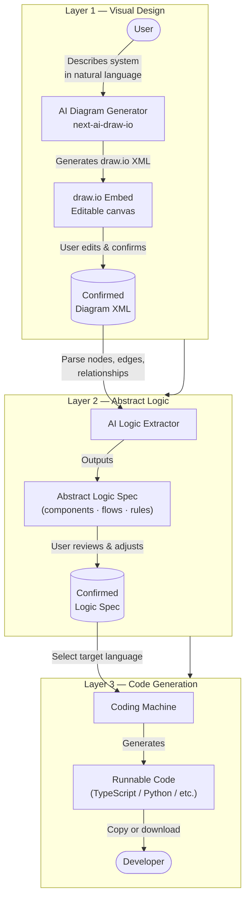

# System Design Feature — Requirements

## Overview

Add a three-layer AI-assisted system design tool to the Mujarrad Frontend. Users move from natural-language description → visual diagram → abstract logic → runnable code, with each layer feeding the next.

---

## The Three Layers



---

## Layer 1 — Visual System Design

**Goal:** Let the user describe their system and get an editable draw.io diagram.

**Input:** Free-text description of the system.

**Integration:** Port the diagram generation logic from [next-ai-draw-io](https://github.com/DayuanJiang/next-ai-draw-io) directly into the Mujarrad Frontend — no separate service needed. The logic is a single LLM call (prompt → draw.io XML) that routes through the existing Mujarrad Agents backend (OpenRouter already configured).

The draw.io **canvas** is always rendered as an iframe to `embed.diagrams.net` — this is a draw.io platform constraint, not ours. All draw.io embeds work this way.

**Output:** Draw.io XML confirmed by the user.

**User actions:**
- Type description → click Generate.
- Edit nodes/edges directly on the canvas.
- Click Continue to pass the diagram to Layer 2.

**Constraints:**
- The draw.io iframe communicates with the host page via `postMessage` — the frontend must listen for the XML export event to capture the confirmed diagram.
- No separate deployment needed for diagram generation.

---

## Layer 2 — Abstract Logic

**Goal:** Parse the confirmed diagram into a structured, language-agnostic logic spec.

**Input:** Draw.io XML from Layer 1.

**Process:**
1. Parse XML to extract: components (nodes), relationships (edges), data flows, decision points.
2. Send parsed structure + original user description to an LLM.
3. LLM outputs an Abstract Logic Spec (ALS) — a structured JSON or markdown document.

**ALS structure (minimum):**
```
components:
  - name, type (service/db/queue/ui/external), responsibilities[]
flows:
  - from, to, trigger, data_shape
rules:
  - condition, action, owner_component
```

**Output:** Abstract Logic Spec rendered as a readable document.

**User actions:**
- Review the spec.
- Edit fields inline.
- Click Continue to pass to Layer 3.

**Constraints:**
- ALS must be serializable (JSON) so it can be versioned or shared later.
- Layer 2 does not generate code — it only abstracts logic.

**Abstract Logic Repo:**
- https://github.com/Wider-Community/Abstract-Logic
---

## Layer 3 — Code Generation

**Goal:** Convert the Abstract Logic Spec into runnable code in the user's chosen language.

**Input:** Confirmed ALS from Layer 2 + target language selection.

**Supported languages (v1):** TypeScript, Python.

**Implementation:** This layer is handled by the **Coding Machine** — a dedicated AI coding agent that receives the ALS and produces implementation-ready code. The Coding Machine is responsible for file structure decisions, boilerplate, and making the output directly usable by a developer.

**Process:**
1. User selects target language.
2. ALS is passed to the Coding Machine.
3. Coding Machine returns code files: one per component where appropriate.

**Output:** Code displayed in a syntax-highlighted viewer with:
- Copy-to-clipboard per file.
- Download all as `.zip`.

**Constraints:**
- Generated code is a scaffold, not production-ready. Make this explicit in the UI.
- No code is executed server-side.

**Code Machine Repo:** 
- https://github.com/moazbuilds/CodeMachine-CLI
---

## End-to-End Flow

```
User types description
    → Layer 1: AI generates draw.io diagram → user edits → confirms XML
        → Layer 2: AI parses diagram → outputs Abstract Logic Spec → user confirms
            → Layer 3: AI generates code → user copies/downloads
```

Each layer is a distinct step with a "Back" and "Continue" button. Users can return to any prior layer to revise.

---

## Tech Stack

| Concern | Choice |
|---|---|
| Diagram generation | next-ai-draw-io (deployed as separate Next.js service) |
| Diagram rendering | draw.io embed (iframe, `embed.diagrams.net`) |
| LLM calls (L2 + L3) | OpenRouter API (reuse existing Mujarrad Agents config) |
| Frontend | Mujarrad Frontend (React + Vite + Tailwind + shadcn/ui) |
| Code display | `react-syntax-highlighter` or shadcn `<CodeBlock>` |
| File download | Browser `Blob` + `URL.createObjectURL` |

---

## Acceptance Criteria

- [ ] User can type a description and receive a draw.io diagram in under 15 seconds.
- [ ] User can edit the diagram on the canvas before proceeding.
- [ ] Layer 2 produces a valid ALS JSON from any confirmed diagram XML.
- [ ] Layer 3 produces syntactically valid scaffold code .
- [ ] All three layers are reachable via a single page with step navigation.
- [ ] User can go back to any previous layer without losing work.
- [ ] next-ai-draw-io service URL is configurable via env variable.

---


