# Mujarrad System Design Detailed Plan

## Document Purpose


The goal is to build a clean, well-structured System Design workflow on the `feat/system-builder` branch without breaking the existing Mujarrad frontend. Current routes, shell components, chat, docs, spaces, nodes, graph, whiteboard, backend API services, and shared UI behavior must remain stable.

This document is the main reference for contributors before implementing any task related to the System Design project.

---

## 1. Executive Summary

Mujarrad System Design is the first implemented layer of a larger three-layer Mujarrad orchestration system.

The long-term product architecture is:

```text
Layer 1: System Design
Layer 2: Abstract Logic
Layer 3: Code Machine
```

For the current implementation phase:

```text
Layer 1 will be implemented.
Layer 2 will be visible but locked.
Layer 3 will be visible but locked.
```

Layer 1 must take user input, process it safely, ask constructive AI clarification questions, build structured understanding, generate a Markdown system specification, generate a Draw.io diagram, allow review/refinement, and export the final Layer 1 deliverables.

Final Layer 1 outputs are:

```text
final-system-spec.md
system-diagram.drawio.xml
system-diagram.png or system-diagram.svg
optional system-diagram-summary.md
```

These Layer 1 outputs are also the future input bundle for Layer 2.

The future Layer 2 must start only after Layer 1 has produced the approved Markdown, XML, and diagram outputs.

---

## 2. Branch Strategy

This work happens inside:

```text
feat/system-builder
```

The branch should be used to prepare and implement the System Design project cleanly.

Contributors must not merge unrelated work from `main` unless explicitly requested.
---

## 3. Non-Breaking Rule

The existing Mujarrad frontend contains working areas that must remain stable:

```text
Authentication
Chat
Docs
Spaces
Nodes
Graph
Whiteboard
Markdown rendering
Shell components
Navigation stores
Backend API services
Shared UI behavior
```

The new System Design work must be built professionally without breaking existing behavior.

Required approach:

```text
Keep existing frontend stable.
Create new feature folders for System Design.
Use compatibility wrappers where needed.
Avoid destructive refactors.
Avoid modifying unrelated components.
Avoid changing existing backend API variables.
Keep the /system-builder route as the planned entry point for now.
```

Existing files should only be touched when required for routing, compatibility, or integration.

---

## 4. LangGraph Requirement

The System Design workflow must be orchestrated with **LangGraph.js** from the beginning.

LangGraph is not an optional future backend. It is the required orchestration layer for this project.


LangGraph should run on the server side of the Next.js application, through server-only modules and API route handlers.

Correct architecture:

```text
Frontend UI
→ Next.js API route
→ LangGraph Layer 1 graph
→ LangGraph nodes/tools
→ AI provider / deterministic utilities
→ validated result returned to UI
```

LangGraph must control the workflow order, branching, retries, and human-in-the-loop pauses.

---

## 5. Target Product Architecture

This is the target architecture for the System Design project.

Layer 2 must not start from the middle of Layer 1. Layer 2 starts only after Layer 1 produces the approved artifact bundle.

The approved Layer 1 artifact bundle is:

```text
Markdown specification
Draw.io XML
Diagram image
Optional diagram summary
```

Layer 3 starts only after future Layer 2 output exists.

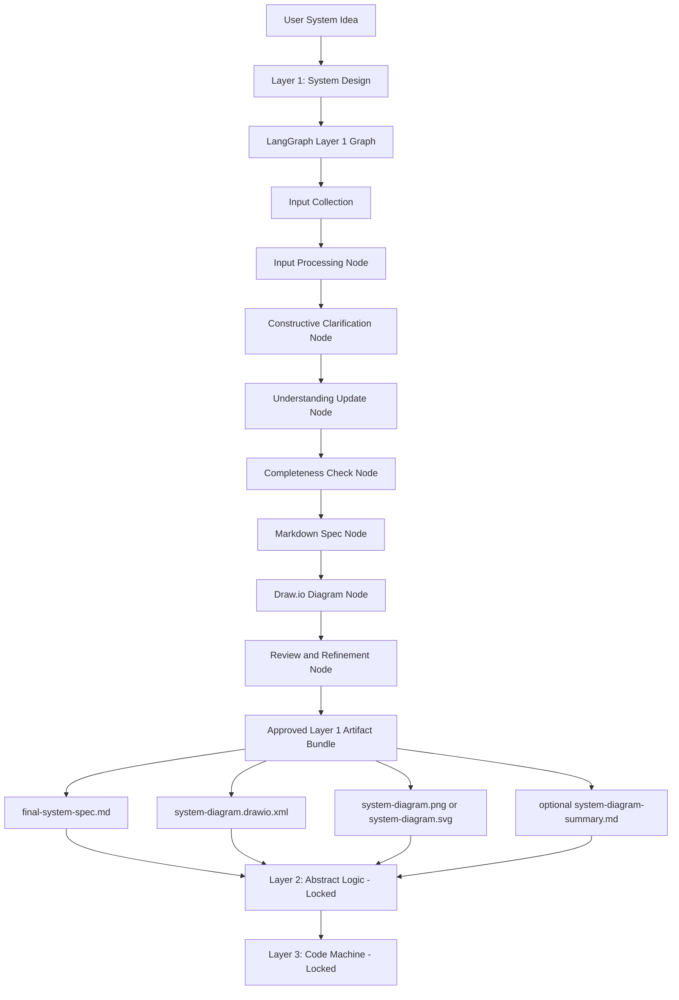

Important rules:

```text
Layer 1 is orchestrated by LangGraph.
Layer 1 exports Markdown, XML, and diagram files.
Layer 2 takes the approved Layer 1 artifact bundle as input.
Layer 2 must only appear after final Layer 1 outputs are ready.
Layer 3 must only appear after Layer 2.
```

---

## 6. Planned Entry Point

The planned route for this workflow is:

```text
/system-builder
```

The product name shown in the UI should be:

```text
System Design
```

The implementation should be treated as a clean Layer 1 System Design workflow.

The target workflow is:

```text
input
→ LangGraph orchestration
→ processing
→ clarification
→ understanding
→ Markdown specification
→ Draw.io diagram
→ review/refinement
→ approved Layer 1 artifact bundle
→ Layer 2 locked placeholder
→ Layer 3 locked placeholder
```

The future Layer 2 placeholder must clearly say that it requires the approved Layer 1 artifact bundle:

```text
final-system-spec.md
system-diagram.drawio.xml
system-diagram.png or svg
optional system-diagram-summary.md
```

---

## 7. Final Layer 1 User Flow

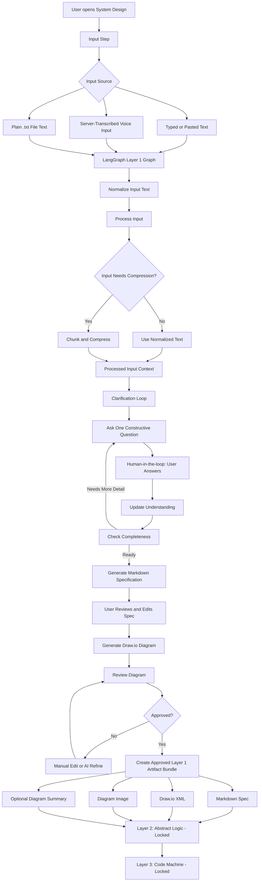

Detailed flow:

```text
1. User provides the system idea.

2. Input can come from typed text, pasted text, server-transcribed voice input, or extracted .txt file text.

3. A Next.js API route sends the request to the LangGraph Layer 1 graph.

4. LangGraph controls the workflow.

5. Input is normalized and processed.

6. Large input is chunked/compressed only when needed.

7. LangGraph starts a constructive clarification loop.

8. LangGraph asks one question at a time.

9. The graph pauses for human-in-the-loop user input.

10. Each answer updates the structured system understanding.

11. Completeness is recalculated.

12. When enough detail exists, LangGraph generates a Markdown system specification.

13. User reviews and edits the specification.

14. LangGraph generates a Draw.io diagram from the full Layer 1 context.

15. User reviews the diagram.

16. User can manually edit the diagram in Draw.io.

17. User can ask LangGraph to refine the current XML.

18. User approves the final diagram.

19. System creates the approved Layer 1 artifact bundle:
    - Markdown specification
    - Draw.io XML
    - diagram image
    - optional diagram summary

20. User can download the Layer 1 files.

21. Layer 2 remains locked and will later take the approved Layer 1 artifact bundle as input.

22. Layer 3 remains locked and will later take Layer 2 output as input.
```

---

## 8. Input Collection and Processing

The System Design input box is the first active stage of the Layer 1 workflow.

It is not a basic prompt box. It is a compact professional input composer that accepts multiple input sources and prepares them for the Layer 1 pipeline.

Implemented Task 2 input sources:

```text
Typed text
Pasted text
Voice recording transcription through server route
Plain .txt file upload
```

The input UI supports:

```text
Compact multiline textarea
Input source label
Input size label
Character count
Estimated token count
Processed chunk count
Smart inline status pill
File upload button inside composer
Voice recording button inside composer
Process button inside composer
Clear button inside composer
Short-input warning only when useful
Error messages only when needed
```

Implemented component:

```text
src/features/system-design/components/Layer1InputPanel.tsx
```

Important UI rules implemented in Task 2:

```text
Avoid long explanations inside the UI.
Avoid duplicate warnings.
Avoid large metric cards.
Avoid unnecessary side panels.
Keep file, voice, and process actions inside the input composer.
Show only useful status information.
```

The input stage currently processes input locally through the deterministic Task 2 tool. Task 3 will move the source of truth into the server-side LangGraph runtime and store.

---

## 9. Input Processing Pipeline

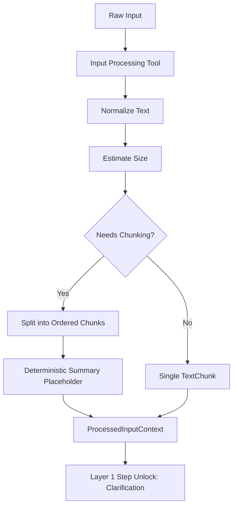

Implemented files:

```text
src/features/system-design/types/input.types.ts
src/features/system-design/schemas/input.schema.ts
src/features/system-design/utils/inputNormalization.ts
src/features/system-design/utils/textChunking.ts
src/features/system-design/utils/contextCompression.ts
src/features/system-design/utils/id.ts
src/features/system-design/tools/inputProcessingTool.ts
src/features/system-design/nodes/processInputNode.ts
```

Implemented responsibilities:

```text
RawInputPayload typing
ProcessedInputContext typing
InputProcessingResult typing
InputProcessingWarning typing
Input source typing
Text normalization
Whitespace cleanup
Paragraph preservation
Estimated token count
Input size label
Chunking decision
Ordered TextChunk creation
Character start/end offsets
Deterministic compressed summary placeholder
Traceability ID creation
Controlled warnings
Controlled errors
```

Input limits are configured in:

```text
src/features/system-design/config/systemDesignConfig.ts
```

Current config:

```ts
inputLimits: {
  maxDirectCharacters: 12000,
  maxChunkCharacters: 6000,
  chunkOverlapCharacters: 500,
}
```

Implemented input source types:

```ts
export type SystemDesignInputSourceType =
  | 'typed_text'
  | 'pasted_text'
  | 'voice_transcript'
  | 'file_text';
```

Implemented core input objects:

```ts
export interface RawInputPayload {
  id: string;
  sourceType: SystemDesignInputSourceType;
  rawText: string;
  createdAt: string;
  metadata?: {
    fileName?: string;
    audioDurationSeconds?: number;
    language?: string;
  };
}

export interface ProcessedInputContext {
  id: string;
  sourceInputIds: string[];
  normalizedText: string;
  chunks: TextChunk[];
  compressedSummary: string;
  inputSize: InputSize;
  processingWarnings: InputProcessingWarning[];
  createdAt: string;
}

export interface InputSize {
  characters: number;
  estimatedTokens: number;
  chunkCount: number;
}

export interface TextChunk {
  id: string;
  index: number;
  text: string;
  summary?: string;
  characterStart: number;
  characterEnd: number;
}
```

Task 2 rule:

```text
No diagram generation happens from raw input.
No AI clarification starts from raw input.
Raw input must become ProcessedInputContext first.
```

---

## 10. Voice and Transcription

Voice input is now implemented as a server-backed transcription path, not as unreliable browser speech recognition.

Implemented voice flow:

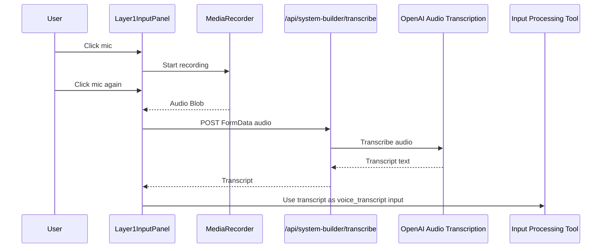

Implemented files:

```text
app/api/system-builder/transcribe/route.ts
src/features/system-design/components/Layer1InputPanel.tsx
src/features/system-design/tools/transcriptionTool.ts
src/features/system-design/types/input.types.ts
```

Implemented behavior:

```text
Voice button is inside the composer.
Browser records audio using MediaRecorder.
Audio is sent to a server-side Next.js API route.
The server route calls the transcription provider.
Transcript text is inserted into the textarea.
Transcript source type becomes voice_transcript.
Transcript then uses the same input processing pipeline as typed text and file text.
```

Required environment variables:

```env
OPENAI_API_KEY=
SYSTEM_BUILDER_TRANSCRIPTION_MODEL=whisper-1
```

Security rule:

```text
OPENAI_API_KEY must stay server-side.
Never expose transcription keys as NEXT_PUBLIC variables.
Never commit .env.local.
```

Current transcription API route:

```text
app/api/system-builder/transcribe/route.ts
```

Route responsibilities:

```text
Accept audio FormData
Validate audio file exists
Read OPENAI_API_KEY server-side
Send audio to transcription provider
Return transcript text
Return controlled setup error if key is missing
Return controlled provider error if transcription fails
```

File input is also implemented in Task 2.

Implemented file behavior:

```text
File button is inside the composer.
Only .txt and text/plain files are accepted.
Text content is inserted into the textarea.
Input source type becomes file_text.
File text uses the same processing pipeline as all other input sources.
Non-.txt files are rejected with a controlled UI error.
```

Task 3 will connect this input result to the server-side LangGraph state and persistent Layer 1 store.
---

## 11. Constructive Clarification Principle

The clarification loop is not a fixed questionnaire.

A bad implementation asks a static list of generic questions.

A correct implementation asks one cumulative question at a time based on:

```text
processed input
current understanding
previous questions
previous answers
missing information
completeness gaps
```

Example:

```text
Original input:
"I want a system where companies can find matching partners for projects."

AI question:
"When a company creates a project request, what information should it provide so the system can compare it with other companies?"

User answer:
"They provide industry, required services, budget, location, and deadline."

Next AI question:
"Should the matching score treat all fields equally, or should fields such as required services and location have higher weight than budget?"
```

Rules:

```text
Ask one question at a time.
Every question must be based on accumulated context.
Every question must have a reason.
Every answer must be traceable.
LangGraph controls the question loop and decides whether to ask again or continue.
```

---


## 12. Clarification Loop Diagram

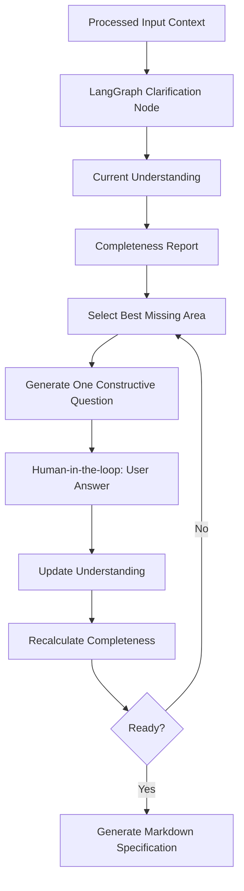

---

## 13. LangGraph Architecture Requirement

The project must use LangGraph.js as the orchestration layer.

The frontend must be prepared like this:

```text
Typed state:
Use TypeScript types for every important object, such as input, questions, answers, understanding, Markdown spec, Draw.io XML, and exported artifacts.

Central store:
Keep the Layer 1 workflow data in one controlled store instead of spreading it randomly across components.

LangGraph graph:
Create a real Layer 1 graph that controls the workflow order, branching, retries, and human-in-the-loop pauses.

LangGraph nodes:
Each major function must be represented as a graph node, such as input processing, question generation, understanding update, completeness check, spec generation, diagram generation, diagram refinement, and artifact bundle creation.

LangGraph tools:
Reusable operations should be implemented as tools or tool-like server utilities, such as text normalization, chunking, AI calls, XML validation, diagram export, and artifact preparation.

Zod schemas:
Validate AI responses and important data structures before saving them in the store.

Clear workflow stages:
Represent the flow as explicit stages: input, processing, clarification, understanding, specification, diagram, review, export.

AI output validation:
Never trust raw AI output directly. Validate questions, understanding updates, Markdown/spec responses, and Draw.io XML before using them.

Approved Layer 1 artifact bundle:
After Layer 1 is approved, create the final bundle of Markdown, Draw.io XML, diagram image, and optional summary. This bundle is what future Layer 2 will take as input.
```

Recommended graph sequence:

```text
receive_input
→ process_input
→ generate_question
→ wait_for_user_answer
→ update_understanding
→ check_completeness
→ if incomplete: generate_question
→ if complete: generate_markdown_spec
→ review_markdown_spec
→ generate_drawio_xml
→ review_diagram
→ refine_diagram if needed
→ create_layer1_artifact_bundle
→ expose_layer2_locked_placeholder
```

---

## 14. Future Layer 2 and Layer 3 Readiness

Layer 2 and Layer 3 are locked in the UI now.

Layer 2 must appear only after Layer 1 creates the approved artifact bundle.

Correct future order:

```text
Layer 1 approved artifact bundle
→ Layer 2 Abstract Logic
→ Layer 3 Code Machine
```

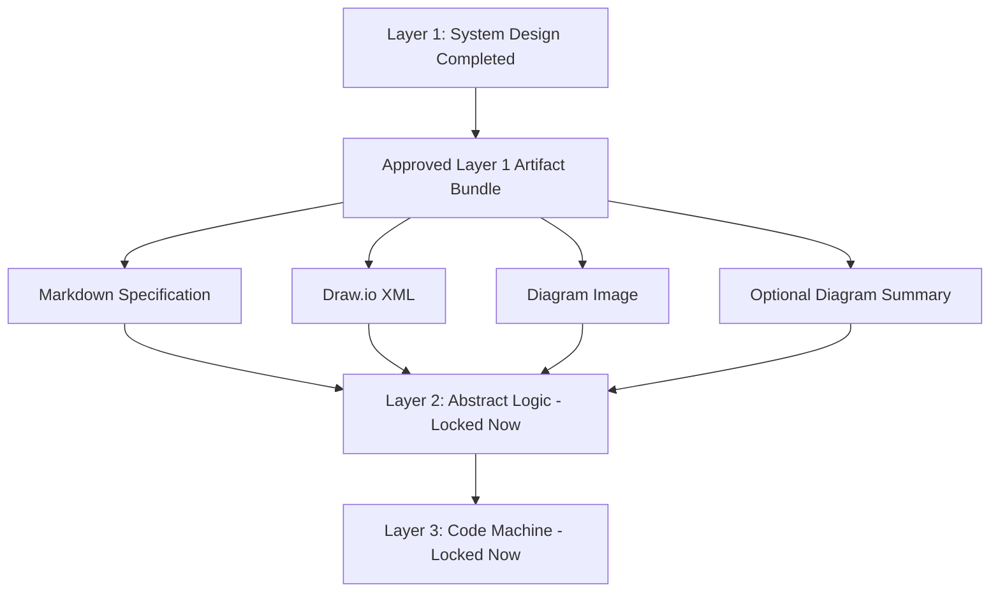

For this phase:

```text
Layer 1 produces the real output.
Layer 2 is locked and later takes the approved Layer 1 artifact bundle as input.
Layer 3 is locked and later takes Layer 2 output as input.
```

---


## 15. Environment Rules

Local environment variables must stay in:

```text
.env.local
```

The example file committed to the repository should be:

```text
.env.example
```

No real secrets should be committed.

The following Mujarrad variables belong to the original frontend/backend setup:

```text
NEXT_PUBLIC_API_URL
NEXT_PUBLIC_AGENT_SERVICE_URL
```

They should remain as already configured in local and deployment environments.

System Design should not force contributors to expose or rewrite those values.

Current `.env.example` structure:

```env
# Existing Mujarrad frontend variables
# Keep these as configured in the original frontend/deployment environment.
# Do not commit real secrets or personal local values here.
NEXT_PUBLIC_API_URL=
NEXT_PUBLIC_AGENT_SERVICE_URL=

# Server-side AI provider key for System Design
# Do not expose this as NEXT_PUBLIC_ because it must stay server-side only.
OPENROUTER_API_KEY=

# Optional model override for System Design
SYSTEM_BUILDER_MODEL=google/gemini-2.0-flash-001

# Server-side transcription provider key
# Used by /api/system-builder/transcribe. Never expose as NEXT_PUBLIC.
OPENAI_API_KEY=

# Optional transcription model override
SYSTEM_BUILDER_TRANSCRIPTION_MODEL=whisper-1

# LangGraph execution mode
# In this phase, LangGraph runs inside the Next.js server/runtime.
SYSTEM_DESIGN_ORCHESTRATOR=langgraph

# System Design feature flags
NEXT_PUBLIC_SYSTEM_BUILDER_MODE=api
NEXT_PUBLIC_ENABLE_LAYER_2=false
NEXT_PUBLIC_ENABLE_LAYER_3=false
```

AI and transcription provider keys must stay server-side.

Correct:

```text
OPENROUTER_API_KEY
OPENAI_API_KEY
```

Wrong:

```text
NEXT_PUBLIC_OPENROUTER_API_KEY
NEXT_PUBLIC_OPENAI_API_KEY
```

---

## 16. Frontend Architecture Goal

The System Design implementation should be built as a professional feature module orchestrated by LangGraph.

Recommended feature path:

```text
src/features/system-design/
```

This keeps the new work isolated from existing frontend modules.

Existing components under:

```text
src/components/system-builder/
```

can remain as wrappers or reusable low-level components when needed.

The goal is to add a clean System Design architecture beside the existing frontend, not to rewrite unrelated parts of the application.

The frontend UI should not contain final orchestration logic. The UI should collect input, display workflow state, show questions, show outputs, and call API routes.

The API routes should invoke the LangGraph graph on the server side.

Task 2 currently uses local deterministic input processing for the first UI workflow. Task 3 must move the workflow source of truth into the LangGraph runtime and store.

---

## 17. Frontend and LangGraph Architecture Overview

This diagram shows the frontend module architecture and the LangGraph execution path.

Layer 2 and Layer 3 are visible as locked placeholders, but they must not become active until Layer 1 creates the approved artifact bundle.

```mermaid
flowchart TD
    Route[app/system-builder/page.tsx]
    Wrapper[src/components/system-builder/SystemBuilder.tsx]
    Shell[SystemDesignShell]
    Header[SystemDesignHeader]
    LayerNav[LayerNavigation]
    StepNav[Layer1StepNavigation]

    Route --> Wrapper
    Wrapper --> Shell
    Shell --> Header
    Shell --> LayerNav
    Shell --> StepNav

    Shell --> L1[Layer 1: System Design UI]
    Shell --> L2[Layer 2: Locked Card]
    Shell --> L3[Layer 3: Locked Card]

    L1 --> Input[Layer1InputPanel]
    Input --> LocalTool[inputProcessingTool in Task 2]
    Input --> TranscribeAPI[/api/system-builder/transcribe]
    TranscribeAPI --> Transcript[Transcript Text]
    Transcript --> Input

    LocalTool --> Processed[ProcessedInputContext]

    Processed --> T3[Task 3 LangGraph Runtime]

    T3 --> Graph[LangGraph Layer 1 Graph]
    Graph --> N1[Input Processing Node]
    N1 --> N2[Question Generation Node]
    N2 --> N3[Human Answer Wait State]
    N3 --> N4[Understanding Update Node]
    N4 --> N5[Completeness Check Node]
    N5 --> N2
    N5 --> N6[Markdown Spec Node]
    N6 --> N7[Draw.io XML Node]
    N7 --> N8[Diagram Review and Refinement Node]
    N8 --> N9[Artifact Bundle Node]

    N9 --> Bundle[Approved Layer 1 Artifact Bundle]
    Bundle --> Bundle1[Markdown Spec]
    Bundle --> Bundle2[Draw.io XML]
    Bundle --> Bundle3[Diagram Image]
    Bundle --> Bundle4[Optional Diagram Summary]

    Bundle1 --> L2
    Bundle2 --> L2
    Bundle3 --> L2
    Bundle4 --> L2

    L2 --> L3
```

---

## 18. Recommended Folder Structure

```text
src/features/system-design/
├── components/
│   ├── SystemDesignShell.tsx
│   ├── SystemDesignHeader.tsx
│   ├── LayerNavigation.tsx
│   ├── Layer1Shell.tsx
│   ├── Layer1StepNavigation.tsx
│   ├── Layer1InputPanel.tsx
│   ├── InputProcessingStatus.tsx
│   ├── Layer1QuestionLoop.tsx
│   ├── QuestionCard.tsx
│   ├── QuestionHistory.tsx
│   ├── Layer1UnderstandingPanel.tsx
│   ├── Layer1CompletenessPanel.tsx
│   ├── Layer1SpecStep.tsx
│   ├── Layer1DiagramStep.tsx
│   ├── Layer1DiagramReview.tsx
│   ├── Layer1DiagramRefinement.tsx
│   ├── DiagramRevisionHistory.tsx
│   ├── Layer1ExportStep.tsx
│   ├── Layer2Locked.tsx
│   └── Layer3Locked.tsx
│
├── config/
│   └── systemDesignConfig.ts
│
├── graphs/
│   ├── layer1Graph.ts
│   ├── layer1GraphState.ts
│   ├── layer1GraphEdges.ts
│   └── layer1GraphRunner.ts
│
├── nodes/
│   ├── processInputNode.ts
│   ├── generateQuestionNode.ts
│   ├── updateUnderstandingNode.ts
│   ├── checkCompletenessNode.ts
│   ├── generateSpecNode.ts
│   ├── generateDiagramNode.ts
│   ├── refineDiagramNode.ts
│   └── createArtifactBundleNode.ts
│
├── tools/
│   ├── aiProviderTool.ts
│   ├── inputProcessingTool.ts
│   ├── transcriptionTool.ts
│   ├── xmlValidationTool.ts
│   ├── markdownSpecTool.ts
│   ├── drawioExportTool.ts
│   └── artifactBundleTool.ts
│
├── prompts/
│   ├── constructiveQuestionPrompt.ts
│   ├── understandingUpdatePrompt.ts
│   ├── completenessPrompt.ts
│   ├── specGenerationPrompt.ts
│   ├── diagramGenerationPrompt.ts
│   └── diagramRefinementPrompt.ts
│
├── schemas/
│   ├── input.schema.ts
│   ├── layer1.schema.ts
│   └── graph.schema.ts
│
├── stores/
│   └── useLayer1Store.ts
│
├── types/
│   ├── input.types.ts
│   ├── layer1.types.ts
│   ├── layer2.types.ts
│   ├── layer3.types.ts
│   └── graph.types.ts
│
└── utils/
    ├── completeness.ts
    ├── contextCompression.ts
    ├── downloadFile.ts
    ├── drawioXml.ts
    ├── exportLayer1.ts
    ├── id.ts
    ├── inputNormalization.ts
    ├── markdownSpec.ts
    ├── questionCategories.ts
    ├── questionSelection.ts
    ├── textChunking.ts
    └── updateUnderstanding.ts
```

API route folder additions:

```text
app/api/system-builder/transcribe/route.ts
app/api/system-builder/layer1/route.ts
app/api/system-builder/layer1/answer/route.ts
app/api/system-builder/layer1/spec-review/route.ts
app/api/system-builder/layer1/generate-diagram/route.ts
app/api/system-builder/layer1/refine-diagram/route.ts
app/api/system-builder/layer1/export/route.ts
```

---

## 19. Route Strategy

The planned route is:

```text
/system-builder
```

Keep this route for now to avoid breaking navigation.

The page title and UI should use:

```text
System Design
```

The route file should stay:

```text
app/system-builder/page.tsx
```

Current implementation:

```tsx
import { SystemBuilder } from '@/components/system-builder/SystemBuilder';

export const metadata = {
  title: 'System Design — Mujarrad',
};

export default function SystemBuilderPage() {
  return <SystemBuilder />;
}
```

`SystemBuilder.tsx` is a compatibility wrapper:

```tsx
'use client';

import { SystemDesignShell } from '@/features/system-design/components/SystemDesignShell';

export function SystemBuilder() {
  return <SystemDesignShell />;
}
```

The UI should call API routes for server operations. API routes should invoke the LangGraph graph. Components should not run LangGraph directly in the browser.

---

## 20. Layer Shell Architecture

The System Design page visually contains three layers:

```text
Layer 1: System Design
Layer 2: Abstract Logic
Layer 3: Code Machine
```

Only Layer 1 is active in this phase.

Layer 2 and Layer 3 are shown only as compact locked layer cards.

Layer 2 and Layer 3 duplicated right-side cards were removed in Task 2 to reduce visual clutter.

Layer 2 and Layer 3 should show:

```text
Locked
```

Layer 2 and Layer 3 buttons/cards should be disabled for now.

Layer 2 must not appear as if it starts from understanding, Markdown generation, or diagram generation. It starts only after the approved Layer 1 artifact bundle exists.

---

## 21. Layer Shell UI Concept

This diagram describes the UI layout and locked progression.

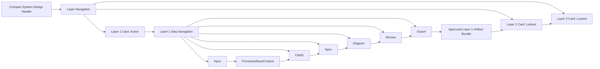

Current layout:

```text
Top: Compact System Design header
Below: Compact three-layer navigation/cards
Below: Layer 1 internal step navigation
Main area: Selected Layer 1 step content
```

Task 2 UI decisions:

```text
Keep UI compact.
Avoid long explanatory text in the interface.
Show only useful status information.
Keep input tools inside the composer.
Keep future Layer 2 and Layer 3 visible but locked.
Do not duplicate locked Layer 2 / Layer 3 cards in the main content area.
```

---

## 22. Layer 1 Workflow Stages

Layer 1 should be controlled by explicit workflow stages.

Current Task 2 UI stepper:

```text
1. Input
2. Clarify
3. Spec
4. Diagram
5. Review
6. Export
```

Current Task 2 step behavior:

```text
Only Input is open on initial load.
Later steps are locked until previous steps are completed.
After Input is processed successfully, Clarify unlocks.
After pressing Proceed in a placeholder step, the next step unlocks.
Completed steps remain clickable.
The next available step is clickable.
Locked later steps are disabled.
Users can go back to completed steps.
Users can jump between unlocked/completed steps.
```

Current implementation files:

```text
src/features/system-design/components/Layer1Shell.tsx
src/features/system-design/components/Layer1StepNavigation.tsx
src/features/system-design/components/Layer1InputPanel.tsx
```

Important limitation:

```text
Task 2 step progress is stored in React state only.
Progress resets on page refresh.
Task 3 must move this into the Layer 1 store and server-side LangGraph state.
```

Recommended final type for Task 3:

```ts
export type Layer1Stage =
  | 'input'
  | 'input_processing'
  | 'clarification'
  | 'understanding'
  | 'specification'
  | 'diagram'
  | 'diagram_review'
  | 'export';
```

The stage shown in the final UI must come from the LangGraph state or from a store synchronized with the LangGraph result.

The UI should not allow users to jump to later stages before required data exists.

Examples:

```text
Cannot open Clarification before input is processed.
Cannot open Diagram before Markdown specification exists.
Cannot export before the diagram is approved.
Cannot show Layer 2 as available before approved Layer 1 artifacts exist.
```
---

## 23. Layer 1 LangGraph State Machine

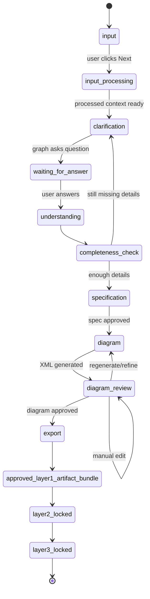

---

## 24. Core State Model

Layer 1 should use typed state shared between the LangGraph graph and the frontend store.

Recommended store file:

```text
src/features/system-design/stores/useLayer1Store.ts
```

Recommended graph state file:

```text
src/features/system-design/graphs/layer1GraphState.ts
```

Recommended state:

```ts
export interface Layer1Run {
  id: string;
  createdAt: string;
  updatedAt: string;
  stage: Layer1Stage;

  rawInputs: RawInputPayload[];
  processedInput: ProcessedInputContext | null;

  questions: ConstructiveQuestion[];
  qaHistory: QuestionAnswer[];

  understanding: SystemUnderstanding;
  completeness: CompletenessReport | null;

  markdownSpec: string;

  drawioXml: string;
  diagramImage?: {
    format: 'png' | 'svg';
    dataUrl?: string;
    fileName?: string;
  };

  diagramSummary: string;
  diagramApproved: boolean;
  diagramRevisions: DiagramRevision[];

  approvedLayer1Artifacts?: Layer1ArtifactBundle;

  errors: Layer1Error[];
}
```

Recommended artifact bundle type:

```ts
export interface Layer1ArtifactBundle {
  markdownSpec: string;
  drawioXml: string;
  diagramImage?: {
    format: 'png' | 'svg';
    dataUrl?: string;
    fileName?: string;
  };
  diagramSummary?: string;
  approvedAt: string;
}
```

The artifact bundle is the future input for Layer 2.

---

## 25. System Understanding Model

The system understanding should become a structured object.

Recommended shape:

```ts
export interface SystemUnderstanding {
  summary: string;
  goal: string;
  primaryUsers: string[];
  secondaryUsers: string[];
  roles: string[];
  permissions: string[];
  workflows: WorkflowDescription[];
  alternativeWorkflows: WorkflowDescription[];
  inputs: SystemInput[];
  outputs: SystemOutput[];
  entities: SystemEntity[];
  businessRules: BusinessRule[];
  decisionLogic: DecisionRule[];
  validationRules: ValidationRule[];
  edgeCases: EdgeCase[];
  errorCases: ErrorCase[];
  integrations: IntegrationPoint[];
  notifications: NotificationRule[];
  reporting: ReportingRequirement[];
  security: SecurityRequirement[];
  openQuestions: string[];
  assumptions: string[];
  confidence: number;
}
```

This model helps create a complete Layer 1 specification and diagram. Future Layer 2 uses the approved artifact bundle generated from this workflow.

---

## 26. System Understanding Concept

This diagram shows what goes into the understanding object. It does not connect Layer 2 directly from understanding.

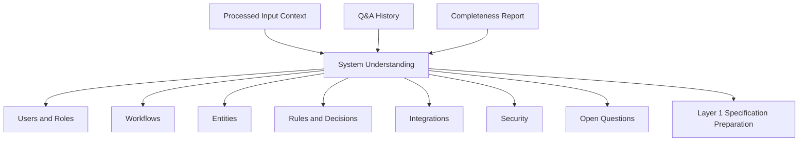

---

## 27. Constructive Question Model

Every AI question should be traceable.

Recommended shape:

```ts
export interface ConstructiveQuestion {
  id: string;
  question: string;
  category: QuestionCategory;
  reasonForAsking: string;
  basedOn: {
    processedInputId?: string;
    chunkIds?: string[];
    previousQuestionIds?: string[];
    previousAnswerIds?: string[];
    understandingFields?: string[];
    missingCategories?: string[];
  };
  expectedAnswerType:
    | 'short_text'
    | 'long_text'
    | 'list'
    | 'yes_no'
    | 'choice'
    | 'number'
    | 'structured';
  options?: string[];
  createdAt: string;
  answeredAt?: string;
  answer?: string;
  skipped?: boolean;
}
```

---

## 28. Question Categories

Recommended categories:

```ts
export type QuestionCategory =
  | 'goal'
  | 'users'
  | 'roles_permissions'
  | 'workflow'
  | 'alternative_workflows'
  | 'inputs'
  | 'outputs'
  | 'entities'
  | 'business_rules'
  | 'decision_logic'
  | 'validations'
  | 'edge_cases'
  | 'error_handling'
  | 'integrations'
  | 'security'
  | 'notifications'
  | 'reporting'
  | 'layer1_artifact_preparation';
```

---

## 29. Completeness Model

The system should calculate whether the current understanding is ready for the next stage.

Recommended shape:

```ts
export interface CompletenessReport {
  overallScore: number;
  readyForSpec: boolean;
  readyForDiagram: boolean;
  categories: CompletenessCategoryStatus[];
  missingCriticalItems: string[];
  weakItems: string[];
  suggestedNextQuestionCategory?: QuestionCategory;
}
```

Each category can have this status:

```ts
export type CompletenessStatus =
  | 'complete'
  | 'weak'
  | 'missing'
  | 'not_applicable';
```

---

## 30. Completeness Decision Diagram

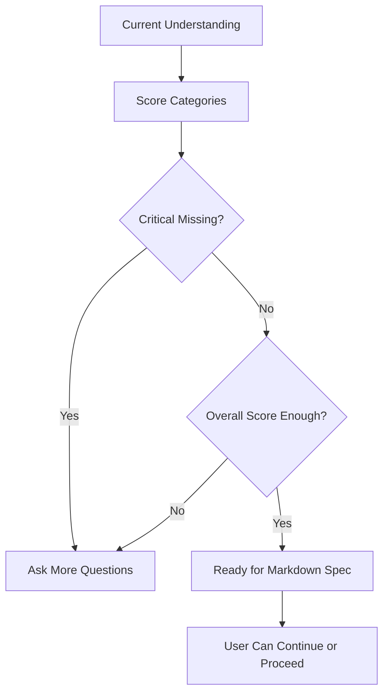

---

## 31. Future Layer 2 and Layer 3 Type Placeholders

Layer 2 and Layer 3 are locked in this phase, but future input placeholder types should exist.

Layer 2 expected input must be the approved Layer 1 artifact bundle.

Recommended files:

```text
src/features/system-design/types/layer2.types.ts
src/features/system-design/types/layer3.types.ts
```

Layer 2 placeholder:

```ts
export interface Layer2ExpectedInput {
  sourceLayer: 1;
  layer1Artifacts: {
    markdownSpec: string;
    drawioXml: string;
    diagramImage?: {
      format: 'png' | 'svg';
      dataUrl?: string;
    };
    diagramSummary?: string;
  };
}
```

Layer 3 placeholder:

```ts
export interface Layer3ExpectedInput {
  sourceLayer: 2;
  abstractLogicGraph: unknown;
  validatedRules: unknown;
  codeGenerationPlan: unknown;
}
```

These placeholders help contributors understand the future pipeline without implementing Layer 2 or Layer 3 now.

---

## 32. Internal Layer 1 State for Traceability

There may be internal structured state for traceability and future integration, but the future Layer 2 trigger must still depend on the approved Layer 1 artifact bundle.

Recommended internal shape:

```ts
export interface Layer1InternalStateForFutureUse {
  runId: string;

  rawInputs: RawInputPayload[];
  processedInput: ProcessedInputContext;

  qaHistory: QuestionAnswer[];
  systemUnderstanding: SystemUnderstanding;
  completenessReport: CompletenessReport;

  approvedArtifacts: Layer1ArtifactBundle;

  traceability: {
    questions: ConstructiveQuestion[];
    textChunks: TextChunk[];
    diagramRevisions: DiagramRevision[];
  };

  readyForLayer2: boolean;
  createdAt: string;
}
```

Important:

```text
This is internal application state.
It is not a downloadable JSON export in the current phase.
Layer 2 receives the approved Layer 1 artifact bundle.
Layer 2 must not start before Markdown, XML, and diagram files exist.
```

---

## 33. Handoff Traceability Concept

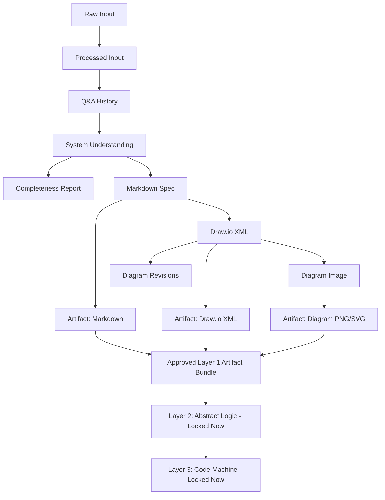

---

## 34. Zod Schema Rules

Zod schemas should validate critical structures.

Note: Zod is a TypeScript validation library. A Zod schema is a rule that checks whether data has the correct shape before your app uses it.
In our project, it is important because AI output can be messy or wrong. So before saving AI output into the app state, we validate it.

Recommended files:

```text
src/features/system-design/schemas/input.schema.ts
src/features/system-design/schemas/layer1.schema.ts
src/features/system-design/schemas/graph.schema.ts
```

Schemas should cover:

```text
RawInputPayload
ProcessedInputContext
ConstructiveQuestion
SystemUnderstanding
CompletenessReport
Layer1ArtifactBundle
Layer1InternalStateForFutureUse
Layer1GraphState
DiagramGenerationRequest
DiagramGenerationResponse
```

The purpose is to prevent invalid AI output or broken graph state from moving through the workflow.

---

## 35. LangGraph Orchestration Design

Layer 1 should be implemented through a real LangGraph graph.

Recommended file:

```text
src/features/system-design/graphs/layer1Graph.ts
```

Recommended graph state file:

```text
src/features/system-design/graphs/layer1GraphState.ts
```

Recommended graph runner file:

```text
src/features/system-design/graphs/layer1GraphRunner.ts
```

The graph should control:

```text
workflow order
conditional branching
human-in-the-loop pauses
retry paths
AI output validation
diagram refinement loops
artifact bundle creation
```

Recommended graph nodes:

```text
receive_input
process_input
generate_question
wait_for_user_answer
update_understanding
check_completeness
generate_markdown_spec
review_markdown_spec
generate_drawio_xml
review_diagram
refine_diagram
create_layer1_artifact_bundle
```

The UI should not decide the orchestration path alone. The UI should send user actions to API routes, and API routes should invoke the graph.

---

## 36. LangGraph Graph Pattern

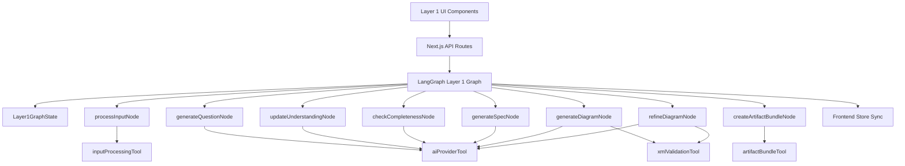

Rules:

```text
UI components must not own the full workflow logic.
The LangGraph graph controls the workflow.
The store reflects graph state for the UI.
Nodes represent major workflow steps.
Tools represent reusable operations.
API routes keep AI provider keys server-side.
Layer 2 remains blocked until the approved Layer 1 artifact bundle exists.
```

---

## 37. LangGraph Server Runtime

LangGraph must run inside the Next.js server/runtime for this phase.

Recommended API route style:

```text
app/api/system-builder/layer1/route.ts
app/api/system-builder/layer1/answer/route.ts
app/api/system-builder/layer1/spec-review/route.ts
app/api/system-builder/layer1/generate-diagram/route.ts
app/api/system-builder/layer1/refine-diagram/route.ts
app/api/system-builder/layer1/export/route.ts
```

Implemented Task 2 transcription route:

```text
app/api/system-builder/transcribe/route.ts
```

Recommended responsibilities:

```text
API route receives UI request.
API route validates request body.
API route invokes LangGraph graph runner.
Graph runner executes graph nodes/tools.
Graph returns validated state or next UI instruction.
API route returns safe response to browser.
```

The browser must not call the AI provider directly.

The browser must not access:

```text
OPENROUTER_API_KEY
OPENAI_API_KEY
```

Both keys must stay server-side only.

Task 2 currently uses `/api/system-builder/transcribe` for server-side voice transcription. Task 3 must add the main Layer 1 graph route and move workflow state into the LangGraph/store runtime.

---
## 38. LangGraph Dependency Status

LangGraph.js is a required dependency for this project and must be used as the orchestration layer for the System Design workflow.

Installed packages:

```text
@langchain/langgraph
@langchain/core
```

These dependencies are stored in:

```text
package.json
package-lock.json
```

Contributors only need to run:

```bash
npm install
```

to install the same LangGraph dependencies.

---

## 39. LangGraph State Definition

Create:

```text
src/features/system-design/graphs/layer1GraphState.ts
```

The graph state should include:

```ts
export interface Layer1GraphState {
  runId: string;
  stage: Layer1Stage;

  rawInputs: RawInputPayload[];
  processedInput: ProcessedInputContext | null;

  currentQuestion: ConstructiveQuestion | null;
  questions: ConstructiveQuestion[];
  qaHistory: QuestionAnswer[];

  understanding: SystemUnderstanding;
  completeness: CompletenessReport | null;

  markdownSpec: string;
  markdownApproved: boolean;

  drawioXml: string;
  diagramSummary: string;
  diagramApproved: boolean;
  diagramRevisions: DiagramRevision[];

  approvedLayer1Artifacts?: Layer1ArtifactBundle;

  nextAction:
    | 'process_input'
    | 'ask_question'
    | 'wait_for_answer'
    | 'update_understanding'
    | 'check_completeness'
    | 'generate_spec'
    | 'wait_for_spec_review'
    | 'generate_diagram'
    | 'wait_for_diagram_review'
    | 'refine_diagram'
    | 'create_artifact_bundle'
    | 'complete'
    | 'error';

  errors: Layer1Error[];
}
```

The graph state is the source of truth for Layer 1 execution.

The frontend store should mirror this state only for UI display and interaction.

---

## 40. LangGraph Nodes

Create:

```text
src/features/system-design/nodes/processInputNode.ts
src/features/system-design/nodes/generateQuestionNode.ts
src/features/system-design/nodes/updateUnderstandingNode.ts
src/features/system-design/nodes/checkCompletenessNode.ts
src/features/system-design/nodes/generateSpecNode.ts
src/features/system-design/nodes/generateDiagramNode.ts
src/features/system-design/nodes/refineDiagramNode.ts
src/features/system-design/nodes/createArtifactBundleNode.ts
```

Node responsibilities:

```text
processInputNode:
Normalize text, estimate size, chunk/compress when needed, return ProcessedInputContext.

generateQuestionNode:
Use current graph state to generate exactly one constructive question.

updateUnderstandingNode:
Merge the latest answer into the structured system understanding.

checkCompletenessNode:
Decide whether more questions are needed or the graph can continue to Markdown specification.

generateSpecNode:
Generate the Markdown system specification from the full Layer 1 context.

generateDiagramNode:
Generate Draw.io XML from the approved Markdown spec and full Layer 1 context.

refineDiagramNode:
Refine current XML using the user instruction and current diagram state.

createArtifactBundleNode:
Create the approved Layer 1 artifact bundle containing Markdown, XML, diagram image, and optional summary.
```

Every node should return a partial graph state update, not random UI data.

---

## 41. LangGraph Tools

Create:

```text
src/features/system-design/tools/aiProviderTool.ts
src/features/system-design/tools/inputProcessingTool.ts
src/features/system-design/tools/transcriptionTool.ts
src/features/system-design/tools/xmlValidationTool.ts
src/features/system-design/tools/markdownSpecTool.ts
src/features/system-design/tools/drawioExportTool.ts
src/features/system-design/tools/artifactBundleTool.ts
```

Tool responsibilities:

```text
aiProviderTool:
Server-side wrapper for AI calls through OpenRouter or another provider.

inputProcessingTool:
Normalize, estimate, chunk, compress, and prepare processed context.

transcriptionTool:
Future tool for converting voice/audio into transcript text.

xmlValidationTool:
Extract, sanitize, validate, repair, or reject Draw.io XML.

markdownSpecTool:
Build and validate the Markdown specification.

drawioExportTool:
Prepare XML/image export behavior and connect with Draw.io output.

artifactBundleTool:
Create the final approved Layer 1 artifact bundle.
```

Tools must be deterministic where possible.

AI-dependent tools must validate output before returning it to the graph.

---

## 42. AI Prompt Files

Prompts should be stored separately so contributors do not hide prompt logic inside components or graph nodes.

Recommended prompt files:

```text
src/features/system-design/prompts/constructiveQuestionPrompt.ts
src/features/system-design/prompts/understandingUpdatePrompt.ts
src/features/system-design/prompts/completenessPrompt.ts
src/features/system-design/prompts/specGenerationPrompt.ts
src/features/system-design/prompts/diagramGenerationPrompt.ts
src/features/system-design/prompts/diagramRefinementPrompt.ts
```

Prompt files should export functions because prompts need context.

Example:

```ts
export function buildConstructiveQuestionPrompt(input: BuildQuestionPromptInput): string {
  return `
You are helping design a software system.

Processed input summary:
${input.processedInput.compressedSummary}

Current understanding:
${JSON.stringify(input.understanding, null, 2)}

Previous Q&A:
${JSON.stringify(input.qaHistory, null, 2)}

Completeness gaps:
${JSON.stringify(input.completeness, null, 2)}

Ask exactly one constructive next question.
Return structured JSON only.
`;
}
```

---

## 43. AI Output Validation Flow

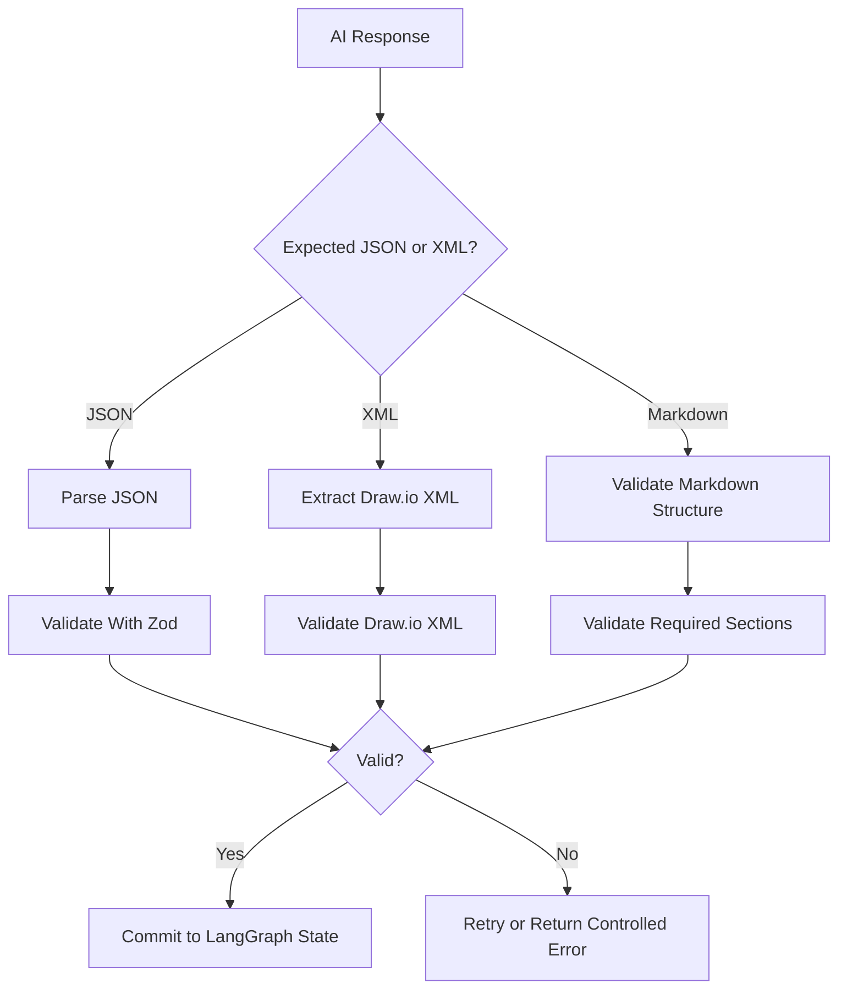

AI output should never be blindly trusted.

Validation is required before saving generated questions, system understanding, completeness reports, Markdown specs, Draw.io XML, or artifact bundles.

---

## 44. API Route Strategy

Recommended API routes:

```text
app/api/system-builder/layer1/route.ts
app/api/system-builder/layer1/answer/route.ts
app/api/system-builder/layer1/spec-review/route.ts
app/api/system-builder/layer1/generate-diagram/route.ts
app/api/system-builder/layer1/refine-diagram/route.ts
app/api/system-builder/layer1/export/route.ts
```

These routes should invoke LangGraph graph actions.

Recommended mapping:

```text
POST /api/system-builder/layer1
→ start or continue Layer 1 graph

POST /api/system-builder/layer1/answer
→ submit human answer and continue graph

POST /api/system-builder/layer1/spec-review
→ submit edited/approved Markdown spec

POST /api/system-builder/layer1/generate-diagram
→ generate diagram through graph node

POST /api/system-builder/layer1/refine-diagram
→ refine current diagram XML through graph node

POST /api/system-builder/layer1/export
→ create approved Layer 1 artifact bundle
```

The existing route namespace can stay stable, but the orchestration should move to the LangGraph graph.

---

## 45. Diagram API Payload

Recommended diagram generation request:

```ts
export interface DiagramGenerationRequest {
  mode: 'generate' | 'refine';

  processedInput: ProcessedInputContext;

  qaHistory: QuestionAnswer[];
  systemUnderstanding: SystemUnderstanding;
  completenessReport: CompletenessReport;

  markdownSpec: string;

  currentXml?: string;
  refinementInstruction?: string;
  revisionHistory?: DiagramRevision[];
}
```

Recommended response:

```ts
export interface DiagramGenerationResponse {
  xml: string;
  summary: string;
  warnings: string[];
}
```

This request should be handled by the LangGraph diagram node, not directly by UI components.

---

## 46. Draw.io Integration Rules

Recommended approach:

```text
Use DrawioEmbed as the low-level iframe component.
Move Layer 1 workflow UI into src/features/system-design/components.
Pass XML into DrawioEmbed.
Listen to onXmlChange.
Store latest XML in Layer 1 store.
Send refinement requests back through LangGraph.
Export final XML and diagram image.
```

Draw.io should support:

```text
Load generated XML
Manual editing
Export/save current XML
AI refinement using current XML
Revision history
Approval before export
```

---

## 47. Draw.io Workflow Diagram

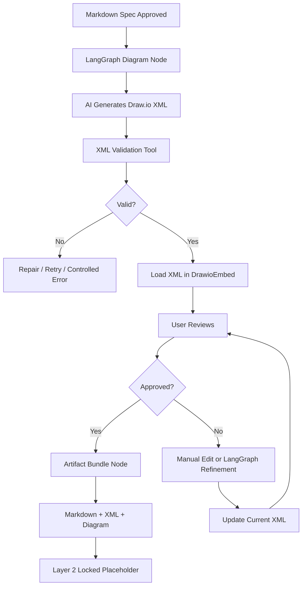

---

## 48. Draw.io XML Utilities

Create:

```text
src/features/system-design/utils/drawioXml.ts
```

Recommended functions:

```ts
export function extractMxGraphModel(raw: string): string;
export function sanitizeDrawioXml(xml: string): string;
export function validateDrawioXml(xml: string): DrawioValidationResult;
export function ensureMxGraphRoot(xml: string): string;
export function createEmptyDrawioXml(): string;
```

These utilities should protect the app from broken AI XML output.

The LangGraph diagram node should call these utilities before storing XML.

---

## 49. Markdown Specification Generation

Create:

```text
src/features/system-design/utils/markdownSpec.ts
```

The final Markdown specification should follow this structure:

```markdown
# System Design Specification

## 1. System Overview

## 2. Source Input Summary

## 3. Main Goal

## 4. Users and Roles

## 5. Core Workflow

## 6. Alternative Workflows

## 7. Inputs

## 8. Outputs

## 9. Data Objects / Entities

## 10. Business Rules

## 11. Decision Logic

## 12. Validations

## 13. Edge Cases

## 14. Error Handling

## 15. Integrations

## 16. Security and Permissions

## 17. Notifications

## 18. Reporting / Logging

## 19. Diagram Generation Notes

## 20. Open Questions

## 21. Future Layer 2 Preparation
```

The Markdown spec should be editable before generating the diagram.

Existing markdown components may be reused where suitable:

```text
src/components/markdown/MarkdownEditor.tsx
src/components/markdown/MarkdownRenderer.tsx
```

---

## 50. Specification to Diagram Flow

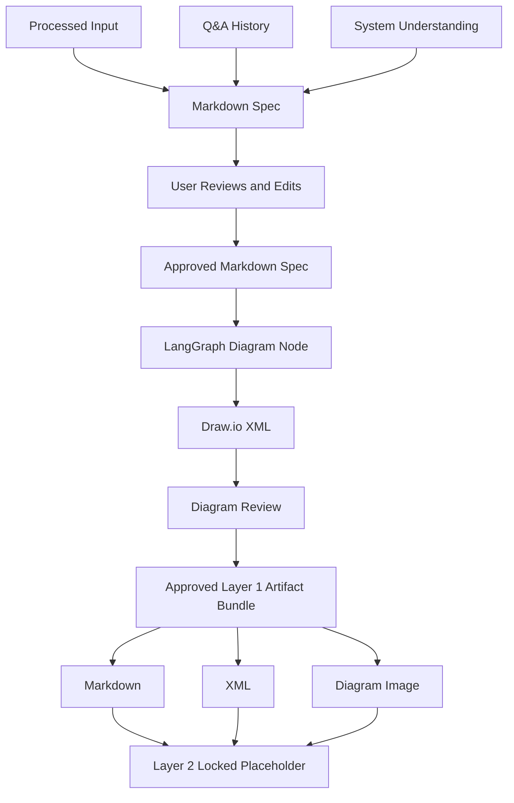

---

## 51. Export Requirements

Layer 1 must export user-facing files:

```text
final-system-spec.md
system-diagram.drawio.xml
system-diagram.png or system-diagram.svg
optional system-diagram-summary.md
```

There should be no user-facing JSON export in this phase.

Create:

```text
src/features/system-design/components/Layer1ExportStep.tsx
src/features/system-design/utils/exportLayer1.ts
src/features/system-design/utils/downloadFile.ts
```

The export step should include:

```text
Download Markdown Spec
Download Draw.io XML
Download Diagram Image
Download Diagram Summary if available
```

It should also show:

```text
Send to Layer 2 — Coming soon
```

That button must be disabled for now and may only appear after the approved Layer 1 artifact bundle exists.

---

## 52. Export Package Diagram

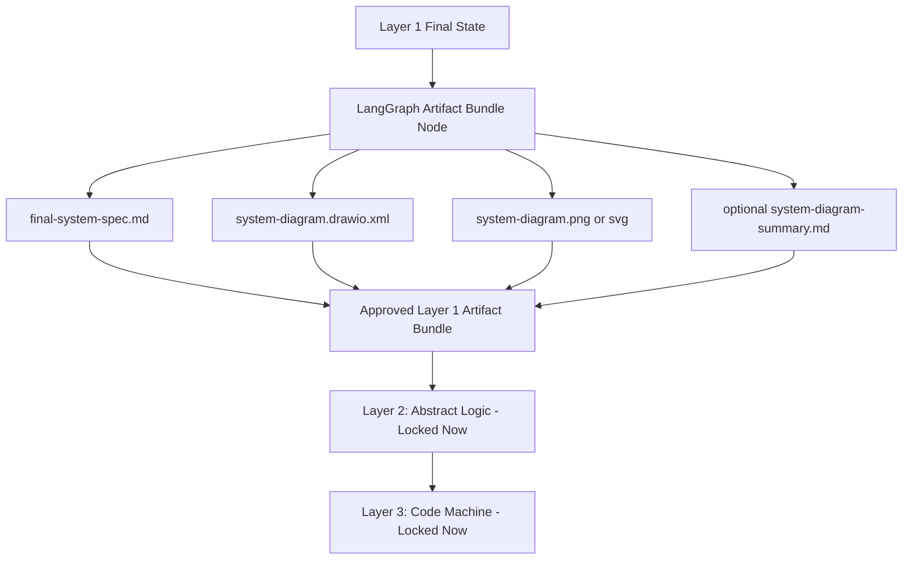

---

## 53. Traceability Requirements

The internal state should preserve traceability even if JSON is not exported to the user.

It should track:

```text
Which input started the process
Whether the input was typed, pasted, transcribed, or file-based
How the input was processed
Which questions were asked
Why each question was asked
Which answers were given
Which completeness gaps existed
Which diagram revisions happened
Which final artifacts were produced
Which LangGraph nodes produced each major result
```

This is important because future Layer 2 logic will depend on understanding how the approved Layer 1 artifact bundle was created.


---

## 54. Layer 1 Implementation Tasks

Layer 1 is now divided into **eight implementation tasks**.

Task 1 and Task 2 have been completed and tested.

Task 1 created the foundation, feature shell, route compatibility, LangGraph dependency setup, and locked Layer 2 / Layer 3 placeholders.

Task 2 created the professional input pipeline, compact input UI, text/file/voice ingestion paths, deterministic processing tool, input processing node, traceability types, schemas, and step-gated Layer 1 UI behavior.

The updated task structure is:

```text
Task 1: Completed — Foundation, environment, feature shell, and LangGraph layout

Task 2: Completed — Input Pipeline, Text/Voice/File Ingestion, Processing UI, Step Gating, and Traceability

Task 3: LangGraph Core Runtime, State Model, API Routes, Schemas, Nodes, Tools, and Store Sync

Task 4: AI Clarification and Q&A Loop

Task 5: Understanding Model, Completeness Logic, and Workflow Progression

Task 6: Markdown Specification, Review, Validation, and Approval Gate

Task 7: Draw.io Diagram, XML Validation, Manual Editing, AI Refinement, and Diagram Approval

Task 8: Final Export, Approved Artifact Bundle, Tests, Documentation, Deployment Readiness, and Cleanup
```

Important rule:

```text
Layer 2 must still remain locked until the approved Layer 1 artifact bundle exists.
Layer 3 must still remain locked until future Layer 2 output exists.
```

---

## 55. Eight-Task Implementation Roadmap

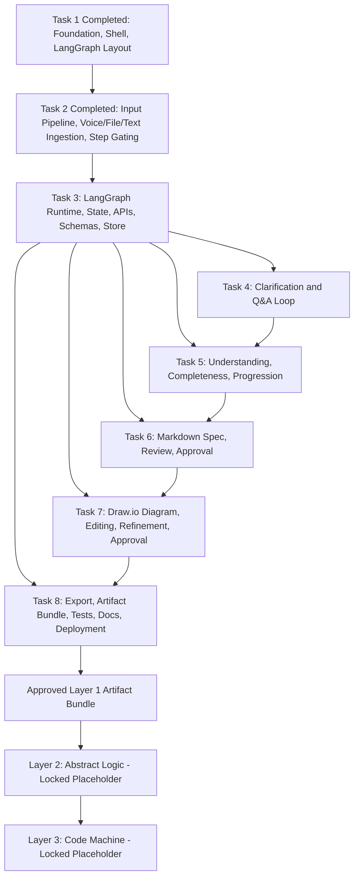

Parallel notes:

```text
Task 1 is completed and should not be expanded unless a foundation bug is found.
Task 2 is completed and should not be expanded unless an input pipeline bug is found.
Task 3 depends on Task 2 input types, schemas, processing tool, transcription route, and step UI.
Task 3 must be completed before Tasks 4–8 are split across people.
After Task 3 defines shared graph state, API patterns, and store sync, Tasks 4–8 can be developed more independently.
Task 4 owns the clarification question loop.
Task 5 owns understanding, completeness, and workflow progression.
Task 6 owns Markdown specification generation/review/approval.
Task 7 owns Draw.io diagram generation/review/refinement/approval.
Task 8 owns final export, tests, docs, deployment readiness, and cleanup.
Layer 2 appears only after the approved Layer 1 artifact bundle exists.
Layer 3 appears only after Layer 2 in the future.
```

---

# Task 1 — Completed: Foundation, Environment, Feature Shell, and LangGraph Layout

## Status

```text
Completed
Tested
Merged into feat/system-builder
Pushed to origin/feat/system-builder
```

## Completed Work

```text
LangGraph dependencies installed
Feature folder created
System Design shell created
/system-builder route kept stable
SystemBuilder converted into compatibility wrapper
Layer 1 active card created
Layer 2 locked placeholder created
Layer 3 locked placeholder created
System Design config created
.env.example updated safely
Existing frontend routes kept stable
```

## Completed Files

```text
package.json
package-lock.json
app/system-builder/page.tsx
src/components/system-builder/SystemBuilder.tsx
src/features/system-design/components/SystemDesignShell.tsx
src/features/system-design/components/SystemDesignHeader.tsx
src/features/system-design/components/LayerNavigation.tsx
src/features/system-design/components/Layer1Shell.tsx
src/features/system-design/components/Layer2Locked.tsx
src/features/system-design/components/Layer3Locked.tsx
src/features/system-design/config/systemDesignConfig.ts
src/features/system-design/graphs/.gitkeep
src/features/system-design/nodes/.gitkeep
src/features/system-design/prompts/.gitkeep
src/features/system-design/schemas/.gitkeep
src/features/system-design/stores/.gitkeep
src/features/system-design/tools/.gitkeep
src/features/system-design/types/.gitkeep
src/features/system-design/utils/.gitkeep
.env.example
```

## Completed File Responsibilities

```text
package.json:
Stores LangGraph and LangChain dependencies.

package-lock.json:
Locks dependency versions.

app/system-builder/page.tsx:
Keeps the /system-builder route stable and sets System Design metadata.

src/components/system-builder/SystemBuilder.tsx:
Compatibility wrapper that points the old System Builder entry to the new System Design feature shell.

src/features/system-design/components/SystemDesignShell.tsx:
Main System Design page shell.

src/features/system-design/components/SystemDesignHeader.tsx:
System Design page header.

src/features/system-design/components/LayerNavigation.tsx:
Displays Layer 1 active, Layer 2 locked, and Layer 3 locked cards.

src/features/system-design/components/Layer1Shell.tsx:
Initial Layer 1 content shell.

src/features/system-design/components/Layer2Locked.tsx:
Locked Layer 2 placeholder.

src/features/system-design/components/Layer3Locked.tsx:
Locked Layer 3 placeholder.

src/features/system-design/config/systemDesignConfig.ts:
Shared product/layer/input/export configuration.

src/features/system-design/*/.gitkeep:
Keeps planned feature folders committed before implementation files exist.

.env.example:
Documents safe environment variable names without real secrets.
```

## Verification Completed

```text
/system-builder loads successfully
UI says System Design
Layer 1 is active
Layer 2 is locked
Layer 3 is locked
Layer 2 requires the approved Layer 1 artifact bundle
Existing routes still build
npm run lint passes with existing warnings only
npm run build passes
git status is clean
```

## Acceptance Criteria Status

```text
LangGraph dependencies are installed: Done
package.json and package-lock.json include LangGraph dependencies: Done
/system-builder loads: Done
UI says System Design: Done
Layer 1 is active: Done
Layer 2 and Layer 3 are locked: Done
Layer 2 requires the approved Layer 1 artifact bundle: Done
Existing frontend remains stable: Done
No secrets committed: Done
Existing frontend env variables are not removed or renamed: Done
npm run lint passes: Done
npm run build passes: Done
```

---

# Task 2 — Completed: Input Pipeline, Text/Voice/File Ingestion, Processing UI, Step Gating, and Traceability

## Status

```text
Completed
Tested locally
Ready for final commit and push on task-2-system-design-input-pipeline
```

## Goal

Build the professional input foundation before AI questioning starts.

## Completed Work

```text
Input types created
Input schemas created
Text normalization utility created
Text chunking utility created
Context compression placeholder created
ID utility created
Input processing tool created
Input processing node created
Server transcription route created
Transcription tool placeholder/interface created
Compact Layer 1 input composer created
Voice recording added through MediaRecorder
Voice transcription connected to server API route
.txt file upload implemented
Non-.txt file rejection implemented
Smart input status pill implemented
Input source labels implemented
Character count implemented
Estimated token count implemented
Input size label implemented
Chunk count display implemented after processing
Empty input blocking implemented
Short input warning implemented without duplicate large panels
Clear/reset implemented
Layer 1 internal step navigation implemented
Step locking/gating implemented
Input processing auto-opens Clarify step
Completed steps remain clickable
Locked future steps are disabled
Right-side duplicate Layer 2/3 cards removed
UI made compact and reduced explanatory text
```

## Completed Files

```text
app/api/system-builder/transcribe/route.ts
src/features/system-design/components/SystemDesignShell.tsx
src/features/system-design/components/SystemDesignHeader.tsx
src/features/system-design/components/LayerNavigation.tsx
src/features/system-design/components/Layer1Shell.tsx
src/features/system-design/components/Layer1StepNavigation.tsx
src/features/system-design/components/Layer1InputPanel.tsx
src/features/system-design/components/InputProcessingStatus.tsx
src/features/system-design/types/input.types.ts
src/features/system-design/schemas/input.schema.ts
src/features/system-design/tools/inputProcessingTool.ts
src/features/system-design/tools/transcriptionTool.ts
src/features/system-design/nodes/processInputNode.ts
src/features/system-design/utils/id.ts
src/features/system-design/utils/inputNormalization.ts
src/features/system-design/utils/textChunking.ts
src/features/system-design/utils/contextCompression.ts
src/features/system-design/config/systemDesignConfig.ts
.env.example
```

## Completed File Responsibilities

```text
app/api/system-builder/transcribe/route.ts:
Server-side API route for voice transcription. Accepts audio FormData, reads OPENAI_API_KEY on the server, sends audio to the transcription provider, and returns transcript text or controlled errors.

src/features/system-design/components/SystemDesignShell.tsx:
Main compact page shell. Shows header, layer navigation, and full-width Layer 1 workflow. Removed duplicated right-side locked Layer 2/3 cards.

src/features/system-design/components/SystemDesignHeader.tsx:
Compact System Design header. Reduced text and vertical spacing.

src/features/system-design/components/LayerNavigation.tsx:
Compact Layer 1/2/3 navigation cards. Layer 1 active, Layer 2 and Layer 3 locked.

src/features/system-design/components/Layer1Shell.tsx:
Client-side Layer 1 step controller for Task 2. Tracks active step, completed steps, available steps, and step progression in React state. This is temporary until Task 3 moves workflow state into store/LangGraph.

src/features/system-design/components/Layer1StepNavigation.tsx:
Clickable compact internal Layer 1 workflow stepper. Supports active, done, open, and locked states.

src/features/system-design/components/Layer1InputPanel.tsx:
Compact input composer. Handles typed text, pasted text, .txt file upload, voice recording, server transcription request, local deterministic input processing, smart status pill, source/size/token/chunk chips, process action, and clear/reset.

src/features/system-design/components/InputProcessingStatus.tsx:
Reusable status display for input processing. It is currently minimized in the UI after compact redesign but kept available for future Task 3/4 state panels.

src/features/system-design/types/input.types.ts:
Defines RawInputPayload, ProcessedInputContext, TextChunk, InputSize, TranscriptionResult, InputProcessingStatus, InputProcessingWarning, and InputProcessingResult.

src/features/system-design/schemas/input.schema.ts:
Zod validation schemas for input source type, processing status, warnings, raw input payload, text chunks, input size, processed input context, processing result, and transcription result.

src/features/system-design/tools/inputProcessingTool.ts:
Deterministic tool that accepts RawInputPayload, normalizes text, estimates size, chunks when needed, creates deterministic summary placeholder, preserves traceability, and returns InputProcessingResult.

src/features/system-design/tools/transcriptionTool.ts:
Transcription tool interface placeholder. The current working transcription path is the Next.js API route. Task 3 can connect this tool into LangGraph.

src/features/system-design/nodes/processInputNode.ts:
LangGraph-compatible input node wrapper around inputProcessingTool. Returns processingResult for future graph state integration.

src/features/system-design/utils/id.ts:
Creates local stable IDs and ISO timestamps.

src/features/system-design/utils/inputNormalization.ts:
Normalizes input text, preserves paragraph structure, trims unsafe whitespace, estimates token count, and returns input size label.

src/features/system-design/utils/textChunking.ts:
Splits large text into ordered TextChunk objects with index, text, characterStart, and characterEnd.

src/features/system-design/utils/contextCompression.ts:
Creates deterministic summary placeholder for processed context. AI compression can be added later through LangGraph.

src/features/system-design/config/systemDesignConfig.ts:
Holds input limits used by the processing tool.

.env.example:
Documents OPENAI_API_KEY and SYSTEM_BUILDER_TRANSCRIPTION_MODEL for server-side transcription without committing real secrets.
```

## Implemented Input Sources

```text
typed_text:
Manual textarea input.

pasted_text:
Supported through textarea paste behavior. Task 3 can add explicit paste detection if needed.

voice_transcript:
Audio is recorded in the browser using MediaRecorder, sent to /api/system-builder/transcribe, transcribed server-side, inserted into the textarea, and then processed through the same input pipeline.

file_text:
Plain .txt file content is read in the browser, inserted into the textarea, and processed through the same input pipeline.
```

## Implemented Step Gating

```text
Initial state:
Only Input is available.

After successful input processing:
Input becomes completed.
Clarify becomes available.
UI automatically moves to Clarify.

After pressing Proceed in a placeholder step:
Current step becomes completed.
Next step becomes available.
UI automatically moves to the next step.

Completed steps:
Remain clickable.

Available next step:
Clickable.

Locked future steps:
Disabled.

Refresh behavior:
Progress resets because Task 2 stores step state only in React state.
Task 3 must persist this state in the Layer 1 store and LangGraph state.
```

## Implemented Transcription Behavior

```text
Mic button starts recording.
Mic button stops recording.
Recording is converted into an audio Blob.
Audio Blob is posted to /api/system-builder/transcribe.
Server route sends the audio to the transcription provider.
Returned transcript is inserted into textarea.
Transcript source type becomes voice_transcript.
Transcript uses the same processSystemDesignInput path.
```

Required local variables:

```env
OPENAI_API_KEY=
SYSTEM_BUILDER_TRANSCRIPTION_MODEL=whisper-1
```

Security:

```text
OPENAI_API_KEY is read only on the server.
OPENAI_API_KEY is not exposed to the browser.
.env.local must not be committed.
```

## Acceptance Criteria Status

```text
User can enter text: Done
UI shows character count: Done
UI shows estimated token count: Done
UI shows input size label: Done
UI blocks empty input: Done
UI gives helpful input quality hints: Done
User can clear input: Done
Small text can pass directly: Done
Large text is chunked safely: Done
ProcessedInputContext is created: Done
TextChunk objects preserve order and character offsets: Done
Voice recording is implemented: Done
Voice transcription server route is implemented: Done
Voice transcript enters same input pipeline: Done
.txt file upload is implemented: Done
Non-.txt file rejection is implemented: Done
File text enters same input pipeline: Done
Input processing is represented as a node/tool: Done
Layer1Shell shows the real input panel: Done
Layer1 step navigation exists: Done
Step locking/gating exists: Done
Completed steps remain clickable: Done
Next step opens after proceed/process: Done
UI is compact and avoids unnecessary explanations: Done
No diagram generation happens from raw input: Done
No secrets committed: Done
npm run lint passes with existing warnings only: Done
npm run build passes: Done
```

## Known Task 2 Limitation

```text
Layer 1 step progress is currently stored only in React state.
It resets after page refresh.
Task 3 must move progress, processed input, and workflow state into the shared store and server-side LangGraph graph state.
```

---

# Task 3 — LangGraph Core Runtime, State Model, API Routes, Schemas, Nodes, Tools, and Store Sync

## Goal

Implement the typed LangGraph Layer 1 runtime foundation.

## Why This Task Is Critical

Task 3 is where the project becomes a real orchestrated system instead of a UI prototype.

The graph state must become the source of truth for workflow stage, processed input, questions, understanding, completeness, Markdown spec, Draw.io XML, diagram approval, and export readiness.

Task 3 must absorb the temporary Task 2 React-only step gating into durable Layer 1 state.

## Scope

```text
Layer 1 type model
Layer 2/3 placeholder types
Graph state definition
Graph event/result types
Zod schemas
LangGraph graph skeleton
Conditional edges
Graph runner
Initial API routes
Frontend store sync
Error handling pattern
Task 2 input state integration
Step gating persistence
```

## Subtasks

### 3.1 Create Layer 1 types

Create:

```text
src/features/system-design/types/layer1.types.ts
```

Include:

```text
Layer1Stage
Layer1StepId
Layer1Run
ConstructiveQuestion
QuestionAnswer
QuestionCategory
SystemUnderstanding
WorkflowDescription
SystemInput
SystemOutput
SystemEntity
BusinessRule
DecisionRule
ValidationRule
EdgeCase
ErrorCase
IntegrationPoint
NotificationRule
ReportingRequirement
SecurityRequirement
CompletenessReport
CompletenessCategoryStatus
CompletenessStatus
DiagramRevision
Layer1ArtifactBundle
Layer1Error
Layer1InternalStateForFutureUse
```

### 3.2 Create graph types and graph state

Create:

```text
src/features/system-design/types/graph.types.ts
src/features/system-design/graphs/layer1GraphState.ts
```

Include:

```text
Layer1GraphState
Layer1GraphNextAction
Layer1GraphEvent
Layer1GraphResult
Layer1GraphResumeInput
Layer1GraphError
completedSteps
availableSteps
activeStep
```

### 3.3 Create future Layer 2 and Layer 3 placeholders

Create:

```text
src/features/system-design/types/layer2.types.ts
src/features/system-design/types/layer3.types.ts
```

Layer 2 expected input must be the approved Layer 1 artifact bundle.

Layer 3 expected input must come from future Layer 2 output.

### 3.4 Create schemas

Create:

```text
src/features/system-design/schemas/layer1.schema.ts
src/features/system-design/schemas/graph.schema.ts
```

Validate:

```text
ConstructiveQuestion
QuestionAnswer
SystemUnderstanding
CompletenessReport
Layer1ArtifactBundle
Layer1GraphState
Layer1GraphEvent
Layer1GraphResult
DiagramGenerationRequest
DiagramGenerationResponse
Layer 1 step gating state
```

### 3.5 Create LangGraph graph skeleton

Create:

```text
src/features/system-design/graphs/layer1Graph.ts
src/features/system-design/graphs/layer1GraphEdges.ts
src/features/system-design/graphs/layer1GraphRunner.ts
```

The graph must include planned nodes:

```text
receive_input
process_input
generate_question
wait_for_user_answer
update_understanding
check_completeness
generate_markdown_spec
review_markdown_spec
generate_drawio_xml
review_diagram
refine_diagram
create_layer1_artifact_bundle
```

The graph must include:

```text
conditional edges
human-in-the-loop pause points
retry/error paths
final artifact bundle path
step gating state updates
```

### 3.6 Create server API route foundation

Create:

```text
app/api/system-builder/layer1/route.ts
```

This route should:

```text
validate request body
invoke the graph runner
return safe graph result
never expose AI provider keys
never run browser-side orchestration
process Task 2 input through the graph path
return activeStep, completedSteps, and availableSteps
```

Existing old API routes should not be destructively removed unless replaced safely.

### 3.7 Create frontend store sync

Create:

```text
src/features/system-design/stores/useLayer1Store.ts
```

The store should support:

```text
startRun
syncFromGraphState
submitRawInput
setProcessedInput
setStage
setActiveStep
setCompletedSteps
setAvailableSteps
setCurrentQuestion
submitAnswer
updateUnderstanding
setCompleteness
setMarkdownSpec
approveMarkdownSpec
setDrawioXml
setDiagramImage
addDiagramRevision
approveDiagram
createLayer1ArtifactBundle
resetRun
```

### 3.8 Connect UI to the route/store carefully

Update:

```text
src/features/system-design/components/Layer1InputPanel.tsx
src/features/system-design/components/Layer1Shell.tsx
src/features/system-design/components/Layer1StepNavigation.tsx
```

For Task 3, the UI should call the server route to process input and sync returned state.

The temporary React-only step state from Task 2 should be replaced by store/graph synchronized state.

## Files

```text
app/api/system-builder/layer1/route.ts
src/features/system-design/types/layer1.types.ts
src/features/system-design/types/layer2.types.ts
src/features/system-design/types/layer3.types.ts
src/features/system-design/types/graph.types.ts
src/features/system-design/schemas/layer1.schema.ts
src/features/system-design/schemas/graph.schema.ts
src/features/system-design/graphs/layer1Graph.ts
src/features/system-design/graphs/layer1GraphState.ts
src/features/system-design/graphs/layer1GraphEdges.ts
src/features/system-design/graphs/layer1GraphRunner.ts
src/features/system-design/stores/useLayer1Store.ts
src/features/system-design/utils/id.ts
src/features/system-design/components/Layer1InputPanel.tsx
src/features/system-design/components/Layer1Shell.tsx
src/features/system-design/components/Layer1StepNavigation.tsx
```

## Acceptance Criteria

```text
Layer 1 state is strongly typed
Layer 1 graph state exists
Layer 1 graph runner exists server-side
Layer 1 API route exists
Request and response schemas exist
Graph result is validated before returning to UI
Store can sync from graph state
Input panel can start a Layer 1 run through the API route
ProcessedInputContext is stored in graph/store state
activeStep is stored in graph/store state
completedSteps are stored in graph/store state
availableSteps are stored in graph/store state
Step locking is controlled by graph/store state
Layer 2 expected input is the approved Layer 1 artifact bundle
Layer 3 depends on future Layer 2 output
Components do not own main workflow orchestration logic
Browser does not access OPENROUTER_API_KEY
Browser does not access OPENAI_API_KEY
npm run lint passes
npm run build passes
```

---

# Task 4 — AI Clarification and Q&A Loop

## Goal

Implement the intelligent clarification question workflow inside LangGraph.

## Scope

```text
AI provider server tool
Constructive question prompt
Question generation node
Question display UI
Question history UI
Human-in-the-loop answer submission
Answer API route
Question traceability
```

## Main Files

```text
app/api/system-builder/layer1/answer/route.ts
src/features/system-design/components/Layer1QuestionLoop.tsx
src/features/system-design/components/QuestionCard.tsx
src/features/system-design/components/QuestionHistory.tsx
src/features/system-design/nodes/generateQuestionNode.ts
src/features/system-design/tools/aiProviderTool.ts
src/features/system-design/prompts/constructiveQuestionPrompt.ts
src/features/system-design/utils/questionCategories.ts
src/features/system-design/utils/questionSelection.ts
src/features/system-design/graphs/layer1Graph.ts
src/features/system-design/graphs/layer1GraphEdges.ts
src/features/system-design/graphs/layer1GraphRunner.ts
src/features/system-design/stores/useLayer1Store.ts
src/features/system-design/components/Layer1Shell.tsx
```

## Acceptance Criteria

```text
User starts clarification after input processing
LangGraph asks exactly one constructive question
Question includes reason for asking
Question includes traceability fields
Graph waits for user answer
User answer resumes/continues graph
Next question uses previous context
Question history is saved
No static questionnaire behavior
npm run lint passes
npm run build passes
```

---

# Task 5 — Understanding Model, Completeness Logic, and Workflow Progression

## Goal

Implement structured understanding, completeness calculation, and progression decisions.

## Scope

```text
Understanding update node
Understanding prompt/tooling
Understanding panel
Completeness scoring node
Completeness prompt/tooling
Completeness panel
Missing critical item detection
Graph loop decision
Ready-for-spec decision
Workflow stage gating
```

## Main Files

```text
src/features/system-design/nodes/updateUnderstandingNode.ts
src/features/system-design/nodes/checkCompletenessNode.ts
src/features/system-design/prompts/understandingUpdatePrompt.ts
src/features/system-design/prompts/completenessPrompt.ts
src/features/system-design/components/Layer1UnderstandingPanel.tsx
src/features/system-design/components/Layer1CompletenessPanel.tsx
src/features/system-design/utils/updateUnderstanding.ts
src/features/system-design/utils/completeness.ts
src/features/system-design/graphs/layer1Graph.ts
src/features/system-design/graphs/layer1GraphEdges.ts
src/features/system-design/graphs/layer1GraphRunner.ts
src/features/system-design/stores/useLayer1Store.ts
src/features/system-design/components/Layer1Shell.tsx
```

## Acceptance Criteria

```text
Understanding updates after answers
Completeness report is generated
Missing critical items are shown
Weak areas are shown
Graph loops when more questions are needed
Graph continues when ready for Markdown specification
Step gating uses completeness result
npm run lint passes
npm run build passes
```

---

# Task 6 — Markdown Specification, Review, Validation, and Approval Gate

## Goal

Generate the human-readable Layer 1 system specification and make it editable before diagram generation.

## Scope

```text
Markdown generation node
Markdown spec tool
Spec generation prompt
Markdown validation
Editable spec UI
Spec preview
Spec approval
Spec review API route
Graph state update after approval
Diagram generation gate
```

## Main Files

```text
app/api/system-builder/layer1/spec-review/route.ts
src/features/system-design/components/Layer1SpecStep.tsx
src/features/system-design/nodes/generateSpecNode.ts
src/features/system-design/tools/markdownSpecTool.ts
src/features/system-design/prompts/specGenerationPrompt.ts
src/features/system-design/utils/markdownSpec.ts
src/features/system-design/schemas/layer1.schema.ts
src/features/system-design/graphs/layer1Graph.ts
src/features/system-design/graphs/layer1GraphEdges.ts
src/features/system-design/graphs/layer1GraphRunner.ts
src/features/system-design/stores/useLayer1Store.ts
src/features/system-design/components/Layer1Shell.tsx
```

## Acceptance Criteria

```text
Markdown spec is generated from full Layer 1 graph state
Markdown spec follows required structure
Markdown spec is editable
Markdown spec can be previewed
Edited Markdown spec is validated
User can approve Markdown spec
Graph records markdownApproved
Diagram generation is blocked until spec approval
No Draw.io generation happens directly from raw input
npm run lint passes
npm run build passes
```

---

# Task 7 — Draw.io Diagram, XML Validation, Manual Editing, AI Refinement, and Diagram Approval

## Goal

Generate and refine the visual Layer 1 architecture diagram.

## Scope

```text
Draw.io XML generation node
Diagram generation prompt
XML validation and repair utility
Diagram API route
Draw.io embed integration
Manual XML sync
AI refinement route
AI refinement node
Revision history
Diagram approval
Diagram image export preparation
```

## Main Files

```text
app/api/system-builder/layer1/generate-diagram/route.ts
app/api/system-builder/layer1/refine-diagram/route.ts
src/features/system-design/components/Layer1DiagramStep.tsx
src/features/system-design/components/Layer1DiagramReview.tsx
src/features/system-design/components/Layer1DiagramRefinement.tsx
src/features/system-design/components/DiagramRevisionHistory.tsx
src/features/system-design/nodes/generateDiagramNode.ts
src/features/system-design/nodes/refineDiagramNode.ts
src/features/system-design/tools/xmlValidationTool.ts
src/features/system-design/tools/drawioExportTool.ts
src/features/system-design/prompts/diagramGenerationPrompt.ts
src/features/system-design/prompts/diagramRefinementPrompt.ts
src/features/system-design/utils/drawioXml.ts
src/components/system-builder/DrawioEmbed.tsx
src/features/system-design/graphs/layer1Graph.ts
src/features/system-design/graphs/layer1GraphEdges.ts
src/features/system-design/graphs/layer1GraphRunner.ts
src/features/system-design/stores/useLayer1Store.ts
src/features/system-design/components/Layer1Shell.tsx
```

## Acceptance Criteria

```text
Diagram is generated only after Markdown spec approval
Diagram generation uses full Layer 1 context
Draw.io XML is extracted, sanitized, and validated
Invalid XML is rejected or repaired safely
Draw.io loads generated XML
Manual edits update current XML
AI refinement goes through LangGraph refineDiagramNode
Revision history is stored
User can approve diagram
Approved Layer 1 artifact bundle is still blocked until diagram approval
npm run lint passes
npm run build passes
```

---

# Task 8 — Final Export, Approved Artifact Bundle, Tests, Documentation, Deployment Readiness, and Cleanup

## Goal

Finish Layer 1 as a professional deliverable.

## Scope

```text
Markdown export
Draw.io XML export
Diagram image export
Optional diagram summary export
Approved Layer 1 artifact bundle
LangGraph artifact bundle node
Download utilities
Export UI
Tests
Documentation
Deployment notes
Git cleanup
Final verification
```

## Main Files

```text
app/api/system-builder/layer1/export/route.ts
src/features/system-design/components/Layer1ExportStep.tsx
src/features/system-design/tools/artifactBundleTool.ts
src/features/system-design/nodes/createArtifactBundleNode.ts
src/features/system-design/utils/exportLayer1.ts
src/features/system-design/utils/downloadFile.ts
src/features/system-design/utils/__tests__/inputNormalization.test.ts
src/features/system-design/utils/__tests__/textChunking.test.ts
src/features/system-design/utils/__tests__/contextCompression.test.ts
src/features/system-design/utils/__tests__/questionSelection.test.ts
src/features/system-design/utils/__tests__/completeness.test.ts
src/features/system-design/utils/__tests__/markdownSpec.test.ts
src/features/system-design/utils/__tests__/drawioXml.test.ts
src/features/system-design/utils/__tests__/exportLayer1.test.ts
src/features/system-design/graphs/__tests__/layer1GraphState.test.ts
src/features/system-design/nodes/__tests__/processInputNode.test.ts
src/features/system-design/nodes/__tests__/createArtifactBundleNode.test.ts
Docs/system-design-detailed-plan.md
Docs/system-design-env.md
Docs/system-design-layer1.md
Docs/system-design-team-tasks.md
```

## Acceptance Criteria

```text
Markdown spec can be downloaded
Draw.io XML can be downloaded
Diagram image can be downloaded
Optional diagram summary can be downloaded
No user-facing JSON export exists
Approved Layer 1 artifact bundle exists after export
Layer 2 input is the approved Layer 1 artifact bundle
Layer 2 button remains disabled
Layer 3 button remains disabled
Tests cover critical utilities and graph behavior
Docs are clear
No secrets committed
No local inspection files committed
npm run lint passes
npm run build passes
npm run test passes or known unrelated failures are documented
```

---

## 56. Updated Task Dependency Order

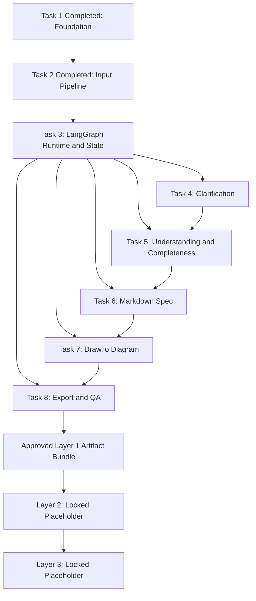

Dependency notes:

```text
Task 1 is completed and should remain as the tested foundation.
Task 2 is completed and should remain as the tested input pipeline.
Task 3 must be done next.
Task 3 creates the shared graph/store/API contracts.
After Task 3, Tasks 4–8 can be split across people more safely.
Task 4 and Task 5 are related but separable after shared graph state exists.
Task 6 depends on understanding/completeness output.
Task 7 depends on approved Markdown specification.
Task 8 depends on approved diagram and export-ready state.
Layer 2 appears only after the approved Layer 1 artifact bundle exists.
Layer 3 appears only after Layer 2 in the future.
```

## 57. Contribution Rules

All contributors must follow these rules:

```text
1. Do not break existing frontend behavior.

2. Do not merge unrelated main branch changes unless requested.

3. Do not commit .env.local.

4. Do not expose AI provider keys to the browser.

5. Keep LangGraph execution on the server side.

6. Do not install new packages unless necessary and approved.

7. Do not run npm audit fix --force unless it is a separate dependency task.

8. Keep new code inside src/features/system-design where possible.

9. System Builder compatibility files should be treated as wrappers or low-level reusable components.

10. Components should not contain large orchestration logic.

11. LangGraph graph, nodes, tools, schemas, and utilities should hold workflow logic.

12. Every task must pass lint and build before review.

13. Layer 2 and Layer 3 must stay locked placeholders for now.

14. Layer 2 must take the approved Layer 1 artifact bundle as input.

15. Layer 3 must only come after Layer 2.

16. Draw.io XML must be validated before being loaded or exported.

17. Raw input should go through LangGraph input processing before AI clarification.

18. Voice input must enter the same LangGraph text pipeline after transcription.

19. Existing Mujarrad frontend env variables must not be removed or renamed.

20. Final user-facing exports are Markdown, XML, and diagram files, not JSON.
```

---

## 58. Testing Checklist

Each contributor should run:

```bash
npm run lint
npm run build
```

Task 8 should also run:

```bash
npm run test
```

The expected branch baseline is:

```text
Lint passes with warnings only.
Build passes successfully.
```

Existing lint warnings are not part of this System Design task unless they are caused by new work.

---

## 59. Git Hygiene

Before committing, check:

```bash
git status --short
```

Do not commit local inspection artifacts:

```text
branch-inspection/
branch-inspection-content/
branch-inspection.zip
branch-inspection-content.zip
```

Do not commit:

```text
.env.local
.env
```

---

## 60. Final Definition of Done

This phase is complete when:

```text
/system-builder opens the new System Design shell
LangGraph dependencies are installed and committed
Layer 1 workflow is orchestrated by LangGraph
Layer 1 workflow is usable from input to export
Layer 2 and Layer 3 are visible but locked
Layer 2 expects the approved Layer 1 artifact bundle as input
Layer 3 appears only after Layer 2
Input is processed safely
Voice transcription works through server-side API route
AI clarification loop works constructively through LangGraph
System understanding is generated
Completeness is calculated
Markdown specification is generated and editable
Draw.io diagram is generated from full context
Diagram can be manually edited
Diagram can be AI-refined through LangGraph
Final Markdown/XML/diagram exports work
No user-facing JSON export exists
Docs exist
Tests exist for critical utilities and graph behavior
No secrets are committed
Existing frontend behavior remains stable
npm run lint passes
npm run build passes
npm run test passes or known unrelated failures are documented
```

---

## 61. Summary

This project is not only a Draw.io page.

It is the first implemented layer of a larger Mujarrad orchestration system.

The correct implementation must be:

```text
Professional
Typed
Traceable
Modular
Orchestrated with LangGraph
Safe for the existing frontend
Able to process input safely
Able to transcribe voice through a server-side route
Prepared for future Layer 2 and Layer 3
Exporting Markdown, XML, and diagrams
Giving Layer 2 the approved Layer 1 artifact bundle as input
```

All contributors should follow this document before implementing their assigned tasks.
