# Mujarrad System Design Detailed Plan

## Document Purpose

This document defines the professional implementation plan and architecture for the **Mujarrad System Design** frontend work.

The goal of this branch is to build a new, well-structured System Design workflow without breaking or changing the existing frontend behavior. Current frontend features, routes, shell components, spaces, nodes, chat, docs, whiteboard, graph, and backend integrations must remain stable.

This document should be used by all contributors as the main technical and product reference before implementing any task related to the System Design project.

---

# Table of Contents

```text
Part 1 — Product Vision, Scope, Core Rules, and Data Input Pipeline
Part 2 — Frontend Architecture, Folder Structure, Types, and State Design
Part 3 — AI Orchestration, API Design, Draw.io, Markdown Spec, and Export Flow
Part 4 — Six Implementation Tasks, Testing, Contribution Rules, and Definition of Done
```

---

# Part 1 of 4 — Product Vision, Scope, Core Rules, and Data Input Pipeline

## 1. High-Level Vision

Mujarrad System Design is intended to become a professional AI-assisted system design workflow that helps users move from a natural-language idea into a structured system architecture.

The long-term architecture has three layers:

```text
Layer 1: System Design
Layer 2: Abstract Logic
Layer 3: Code Machine
```

For the current implementation phase, only **Layer 1: System Design** will be functionally implemented.

Layer 2 and Layer 3 must appear in the UI as locked future stages, but their full functionality must not be implemented yet.

However, the architecture must already prepare for Layer 2 and Layer 3 by producing a clean handoff package and by using a LangGraph-ready orchestration design.

---

## 2. Three-Layer Product Architecture

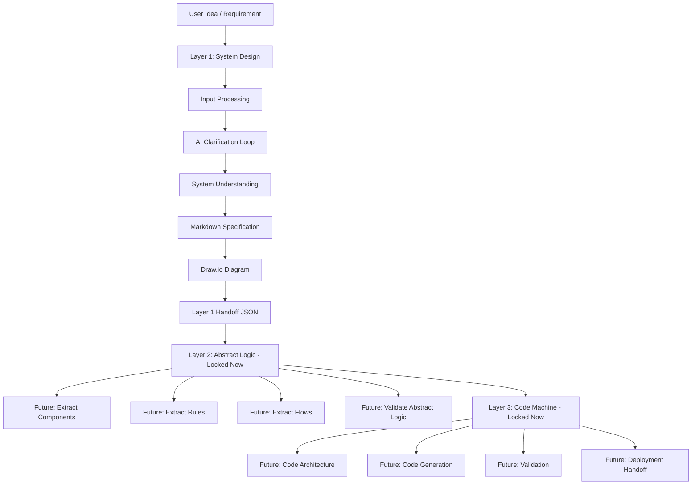

Current phase:

```text
Layer 1 = implemented
Layer 2 = visible but locked
Layer 3 = visible but locked
```

Future phase:

```text
Layer 1 output → Layer 2 input
Layer 2 output → Layer 3 input
```

---

## 3. Current Branch Strategy

This work happens only inside the current branch:

```text
feat/system-builder
```

The branch already contains an initial `/system-builder` route and a working simple Draw.io integration.

The current branch must continue independently. Contributors must not merge unrelated work from `main` unless explicitly requested by the project owner.

---

## 4. Very Important Rule: Do Not Break Existing Frontend Work

The current frontend already contains many working parts, including:

```text
Authentication
Chat
Docs
Spaces
Nodes
Graph
Whiteboard
Markdown rendering
Shell components
Navigation stores
Backend API services
System Builder route
Draw.io iframe integration
```

The new System Design work must be built professionally in new feature folders where possible.

Existing files should only be touched when required for clean routing or integration.

The preferred approach is:

```text
Keep existing frontend stable
Create new feature folder for System Design
Use wrappers/adapters around existing System Builder components
Avoid large destructive refactors
Avoid changing unrelated components
```

---

## 5. Existing System Builder Baseline

The branch currently includes:

```text
app/system-builder/page.tsx
src/components/system-builder/SystemBuilder.tsx
src/components/system-builder/DiagramLayer.tsx
src/components/system-builder/DrawioEmbed.tsx
app/api/system-builder/generate-diagram/route.ts
```

The current behavior is roughly:

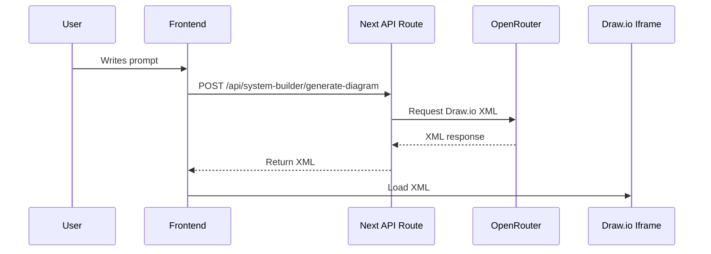

This is a good prototype, but the professional System Design workflow must become more structured.

The future Layer 1 flow should not generate the diagram immediately from the first user message. It must first process the input, normalize it, clarify the requirements, build structured understanding, generate a specification, and only then generate the Draw.io diagram.

---

## 6. Final Layer 1 User Flow

Layer 1 must follow this flow:

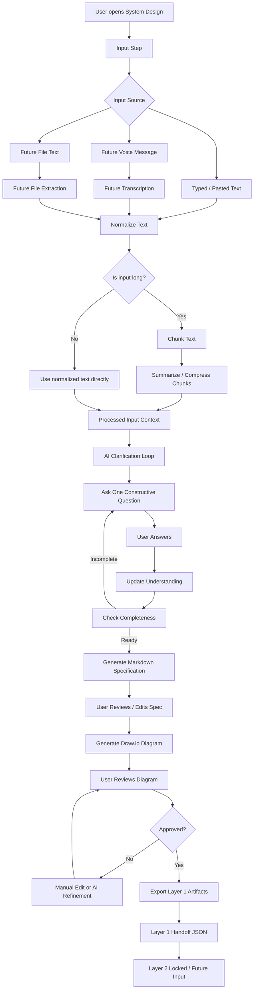

Detailed textual flow:

```text
1. User provides the system idea.

2. The input can come from:
   - typed text
   - pasted long text
   - uploaded text-like content in the future
   - voice message in the future

3. Input is normalized into clean text.

4. If the input is long, the system prepares it through a data management pipeline:
   - clean text
   - split/chunk if needed
   - summarize chunks if needed
   - preserve traceability
   - produce a compact initial context for AI

5. User clicks Next.

6. AI analyzes the normalized initial context.

7. AI asks one constructive question.

8. User answers.

9. AI updates the current understanding.

10. AI asks the next constructive question based on:
    - the original user description
    - normalized/chunked input
    - previous questions
    - previous answers
    - current understanding
    - missing information
    - completeness gaps

11. This loop continues until the system is sufficiently understood.

12. AI generates a structured Markdown system specification.

13. User reviews and edits the Markdown specification.

14. AI generates a Draw.io diagram from the full Layer 1 context.

15. User reviews the diagram.

16. User can manually edit the diagram inside Draw.io.

17. User can give text instructions to AI to refine the diagram.

18. AI refines the existing XML instead of starting from zero.

19. User approves the final diagram.

20. Layer 1 exports:
    - final Markdown specification
    - Draw.io XML
    - diagram summary
    - Layer 1 handoff JSON

21. Layer 2 remains locked for now, but the Layer 1 output must already be structured for future Layer 2 usage.
```

---

## 7. Input and Text Box Structure

The System Design input area is not just a simple prompt box.

It should be treated as the first part of the Layer 1 data pipeline.

The initial input UI should support:

```text
Large multiline textbox
Character counter
Estimated token/size indicator
Input quality hints
Clear button
Save draft behavior if possible
Next button
Future voice input button placeholder
Future file input button placeholder
```

Recommended component:

```text
src/features/system-design/components/Layer1InputPanel.tsx
```

The input panel should not directly send raw text to diagram generation.

It should send the text into the input processing pipeline first.

---

## 8. Input Panel UI Concept

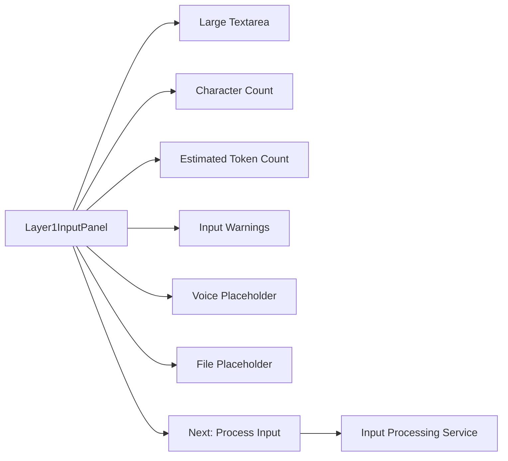

Expected visible UI sections:

```text
System idea textbox
Input source information
Input size information
Processing warnings
Future input methods
Action buttons
```

---

## 9. Data Management Pipeline for Long Text

Users may paste a very long description.

The system must not assume that every input can be passed to the AI in one go.

The frontend should prepare for a pipeline like this:

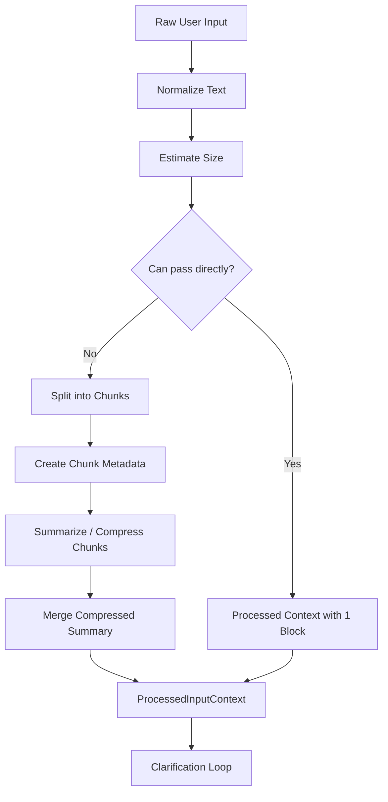

Recommended utility files:

```text
src/features/system-design/utils/inputNormalization.ts
src/features/system-design/utils/textChunking.ts
src/features/system-design/utils/contextCompression.ts
```

Recommended types:

```ts
export interface RawInputPayload {
  id: string;
  sourceType: 'typed_text' | 'pasted_text' | 'voice_transcript' | 'file_text';
  rawText: string;
  createdAt: string;
}

export interface ProcessedInputContext {
  id: string;
  sourceInputId: string;
  normalizedText: string;
  chunks: TextChunk[];
  compressedSummary: string;
  inputSize: {
    characters: number;
    estimatedTokens: number;
    chunkCount: number;
  };
  processingWarnings: string[];
  createdAt: string;
}

export interface TextChunk {
  id: string;
  index: number;
  text: string;
  summary?: string;
  characterStart: number;
  characterEnd: number;
}
```

This is important because Layer 1 should be able to handle both short ideas and long requirement documents.

---

## 10. Should Long Text Be Passed to AI in One Go?

Short text can be passed directly.

Long text should not always be passed as one huge prompt.

The implementation should use this rule:

```text
If text is small:
  pass normalized text directly to the AI.

If text is medium:
  pass normalized text with a warning/size estimate.

If text is large:
  chunk first, summarize chunks, then send compressed context plus traceability.
```

Exact token limits depend on the selected AI model and backend, so the frontend should not hardcode model-specific limits too deeply.

Instead, use configurable thresholds.

Example config:

```ts
export const SYSTEM_DESIGN_INPUT_LIMITS = {
  maxDirectCharacters: 12000,
  maxChunkCharacters: 6000,
  chunkOverlapCharacters: 500,
};
```

Recommended file:

```text
src/features/system-design/config/systemDesignConfig.ts
```

---

## 11. Voice Message and Transcription Preparation

Voice input is not required to be fully implemented in the first version unless separately assigned.

However, the architecture must prepare for it.

Future voice flow:

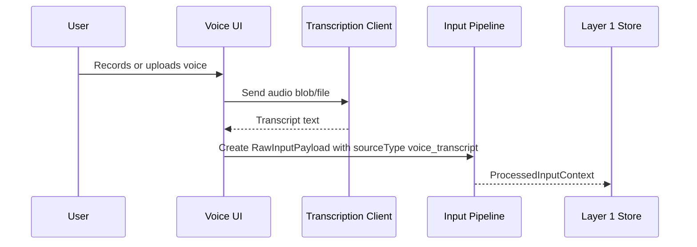

Recommended future components/files:

```text
src/features/system-design/components/VoiceInputPlaceholder.tsx
src/features/system-design/services/transcriptionClient.ts
src/features/system-design/types/input.types.ts
```

Recommended transcription type:

```ts
export interface TranscriptionResult {
  id: string;
  audioSourceName?: string;
  transcript: string;
  language?: string;
  confidence?: number;
  durationSeconds?: number;
  createdAt: string;
}
```

For now, if voice is not implemented, the UI can show:

```text
Voice input — Coming soon
```

But the data model should already treat voice transcript as another text source.

---

## 12. Constructive Question Principle

The clarification loop is not a fixed questionnaire.

A bad implementation would ask a static list like:

```text
Who are the users?
What are the inputs?
What are the outputs?
What are the rules?
```

The correct implementation must ask constructive, cumulative questions.

Each question should be based on the current context.

Example:

```text
Original user input:
"I want a system where companies can find matching partners for projects."

AI question:
"When a company creates a project request, what information should it provide so the system can compare it with other companies?"
```

If the user answers:

```text
"They provide industry, required services, budget, location, and deadline."
```

The next AI question should build on that:

```text
"Should the matching score treat all of these fields equally, or should some fields such as required services and location have higher weight than budget?"
```

This is the expected behavior.

---

## 13. Constructive Clarification Loop

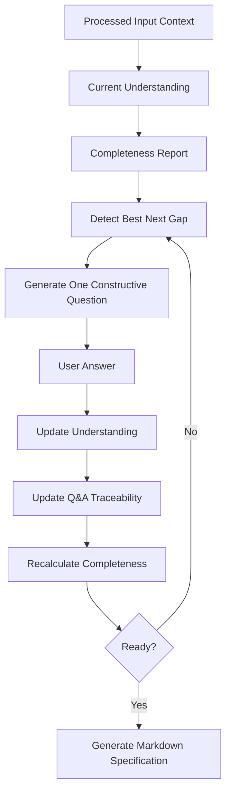

Key rule:

```text
Only one question at a time.
Every next question must depend on previous context.
Every question must explain why it is being asked.
Every answer must be traceable.
```

---

## 14. Layer 1 Must Be LangGraph-Ready

Even if the first frontend implementation uses local frontend orchestration or Next.js API routes, the architecture must be ready for a real LangGraph backend.

The frontend should behave like a state machine and should not hide important logic inside random component state.

Future orchestration may look like this:

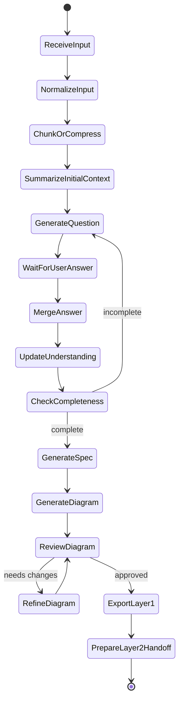

The frontend must prepare for this by using typed state, services, adapters, and clear workflow stages.

---

## 15. LangGraph Must Be Ready for Layer 2 and Layer 3

Although Layer 2 and Layer 3 are locked in the UI for now, the orchestration design must be prepared for all three layers.

The future graph should not be designed as a Layer 1-only dead end.

Recommended future orchestration shape:

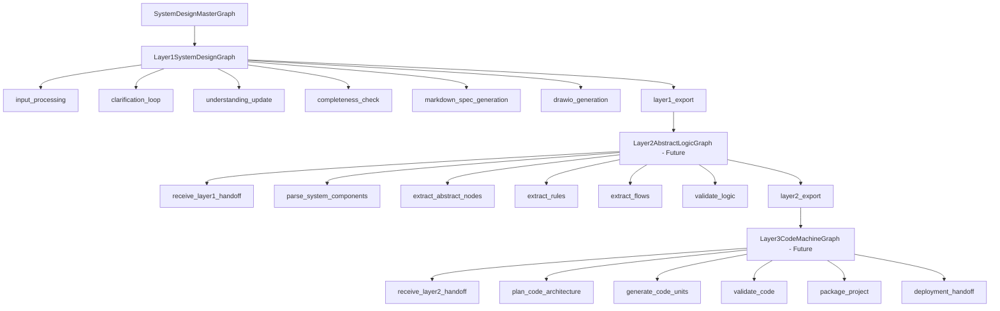

For this phase:

```text
Layer 1 graph output must be real.
Layer 2 graph is locked but expected input must be clear.
Layer 3 graph is locked but future connection must be considered.
```

---

## 16. What Is In Scope Now

The current phase includes:

```text
Layer 1 System Design workflow
Three-layer shell UI
Locked placeholders for Layer 2 and Layer 3
Input textbox and data pipeline structure
Long text normalization/chunking preparation
Voice transcription preparation as future placeholder
Initial chat
Constructive AI question loop
System understanding model
Completeness engine
Markdown specification generation
Draw.io generation
Draw.io review
Manual diagram editing
AI diagram refinement
Layer 1 export package
Layer 1 handoff JSON
LangGraph-ready orchestration structure
Documentation
Tests for important utilities
Deployment/env readiness
```

---

## 17. What Is Out of Scope Now

The current phase does not include:

```text
Real Layer 2 Abstract Logic implementation
Real Layer 3 Code Machine implementation
Real code generation
Real deployment of generated code
Full voice recording/transcription implementation unless separately assigned
Full file upload ingestion unless separately assigned
Backend graph writing from Layer 1 unless separately requested
Full LangGraph backend service implementation
Full user/team permission redesign
Replacing the existing frontend shell
Replacing the existing chat system
Changing unrelated spaces/nodes/whiteboard behavior
```

Layer 2 and Layer 3 should only exist as locked visual placeholders.

---

## 18. Environment Rules

Local environment variables must stay in:

```text
.env.local
```

The example file committed to the repository should be:

```text
.env.example
```

No real secrets should be committed.

Important clarification:

```text
NEXT_PUBLIC_API_URL
NEXT_PUBLIC_AGENT_SERVICE_URL
```

belong to the original existing Mujarrad frontend/backend setup. They should remain as they already are in the user’s local/deployment environment.

This System Design work should not force contributors to expose or rewrite these values inside the documentation as if they are new secrets.

The documentation should say:

```text
Keep existing Mujarrad frontend environment variables as they already are.
Do not remove or rename the original frontend variables.
Only add System Design-specific variables when needed.
```

Recommended `.env.example` structure:

```env
# Existing Mujarrad frontend variables
# Keep these as configured in the original frontend/deployment environment.
# Do not commit real secrets or personal local values here.
NEXT_PUBLIC_API_URL=
NEXT_PUBLIC_AGENT_SERVICE_URL=

# Server-side AI provider key for System Design
# Do not expose this as NEXT_PUBLIC_ because it must stay server-side only.
OPENROUTER_API_KEY=

# Optional model override for System Design
SYSTEM_BUILDER_MODEL=google/gemini-2.0-flash-001

# System Design feature flags
NEXT_PUBLIC_SYSTEM_BUILDER_MODE=api
NEXT_PUBLIC_ENABLE_LAYER_2=false
NEXT_PUBLIC_ENABLE_LAYER_3=false

# Future orchestration endpoint
# Used later when LangGraph backend becomes available.
NEXT_PUBLIC_SYSTEM_DESIGN_ORCHESTRATOR_URL=
```

Deployment environments such as Vercel, Render, or another server must define real values in the platform settings.

---

## 19. Server-Side AI Rule

AI provider keys must stay server-side.

Correct:

```text
OPENROUTER_API_KEY
```

Wrong:

```text
NEXT_PUBLIC_OPENROUTER_API_KEY
```

Any variable starting with `NEXT_PUBLIC_` is exposed to the browser.

Therefore, OpenRouter or other AI provider secrets must never use `NEXT_PUBLIC_`.

---

# Part 2 of 4 — Frontend Architecture, Folder Structure, Types, and State Design

## 20. Architecture Goal

The System Design implementation should be built as a professional feature module.

The recommended feature path is:

```text
src/features/system-design/
```

This keeps the new work isolated from existing frontend modules.

Existing components under:

```text
src/components/system-builder/
```

can remain as wrappers or compatibility components.

The goal is not to destroy the current structure. The goal is to add a clean new architecture beside it.

---

## 21. Frontend Architecture Overview

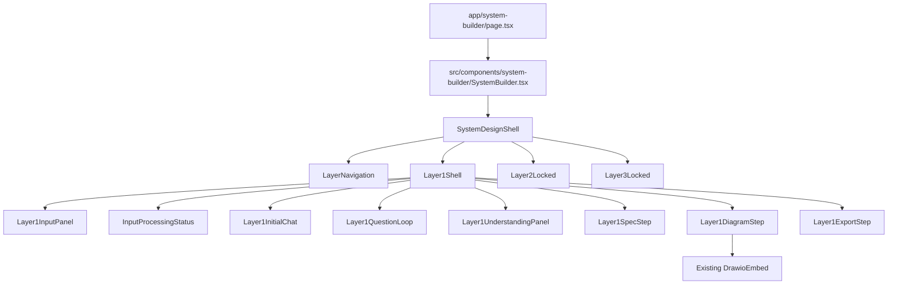

---

## 22. Recommended Folder Structure

Create this structure:

```text
src/features/system-design/
├── components/
├── config/
├── prompts/
├── schemas/
├── services/
├── stores/
├── types/
└── utils/
```

Recommended full structure:

```text
src/features/system-design/
├── components/
│   ├── SystemDesignShell.tsx
│   ├── SystemDesignHeader.tsx
│   ├── LayerNavigation.tsx
│   ├── Layer1Shell.tsx
│   ├── Layer1InputPanel.tsx
│   ├── VoiceInputPlaceholder.tsx
│   ├── InputProcessingStatus.tsx
│   ├── Layer1InitialChat.tsx
│   ├── Layer1QuestionLoop.tsx
│   ├── QuestionCard.tsx
│   ├── QuestionHistory.tsx
│   ├── Layer1UnderstandingPanel.tsx
│   ├── Layer1CompletenessPanel.tsx
│   ├── Layer1SpecStep.tsx
│   ├── Layer1DiagramStep.tsx
│   ├── Layer1DiagramReview.tsx
│   ├── Layer1DiagramRefinement.tsx
│   ├── DiagramRevisionHistory.tsx
│   ├── Layer1ExportStep.tsx
│   ├── Layer2Locked.tsx
│   └── Layer3Locked.tsx
│
├── config/
│   └── systemDesignConfig.ts
│
├── prompts/
│   ├── inputProcessingPrompt.ts
│   ├── constructiveQuestionPrompt.ts
│   ├── understandingUpdatePrompt.ts
│   ├── completenessPrompt.ts
│   ├── specGenerationPrompt.ts
│   ├── diagramGenerationPrompt.ts
│   └── diagramRefinementPrompt.ts
│
├── schemas/
│   ├── input.schema.ts
│   └── layer1.schema.ts
│
├── services/
│   ├── inputProcessingService.ts
│   ├── transcriptionClient.ts
│   ├── layer1Orchestrator.ts
│   ├── localLayer1Orchestrator.ts
│   └── langgraphLayer1Client.ts
│
├── stores/
│   └── useLayer1Store.ts
│
├── types/
│   ├── input.types.ts
│   ├── layer1.types.ts
│   ├── layer2.types.ts
│   └── layer3.types.ts
│
└── utils/
    ├── completeness.ts
    ├── contextCompression.ts
    ├── downloadFile.ts
    ├── drawioXml.ts
    ├── exportLayer1.ts
    ├── id.ts
    ├── inputNormalization.ts
    ├── markdownSpec.ts
    ├── questionCategories.ts
    ├── questionSelection.ts
    ├── textChunking.ts
    └── updateUnderstanding.ts
```

---

## 23. Route Strategy

The current route is:

```text
/system-builder
```

For now, keep this route to avoid breaking the branch.

The page title and UI should use the name:

```text
System Design
```

The route file should stay:

```text
app/system-builder/page.tsx
```

It should render:

```tsx
import { SystemBuilder } from '@/components/system-builder/SystemBuilder';

export const metadata = {
  title: 'System Design — Mujarrad',
};

export default function SystemBuilderPage() {
  return <SystemBuilder />;
}
```

Then `SystemBuilder.tsx` should become a small wrapper:

```tsx
'use client';

import { SystemDesignShell } from '@/features/system-design/components/SystemDesignShell';

export function SystemBuilder() {
  return <SystemDesignShell />;
}
```

This keeps backward compatibility while moving new implementation into the feature folder.

---

## 24. Layer Shell Architecture

The System Design page should visually contain three layers:

```text
Layer 1: System Design
Layer 2: Abstract Logic
Layer 3: Code Machine
```

Only Layer 1 is active.

Layer 2 and Layer 3 should show:

```text
Locked
Coming soon
Requires Layer 1 handoff
```

The shell should make it clear that Layer 1 produces the handoff package used later by Layer 2.

---

## 25. Layer Shell UI Concept

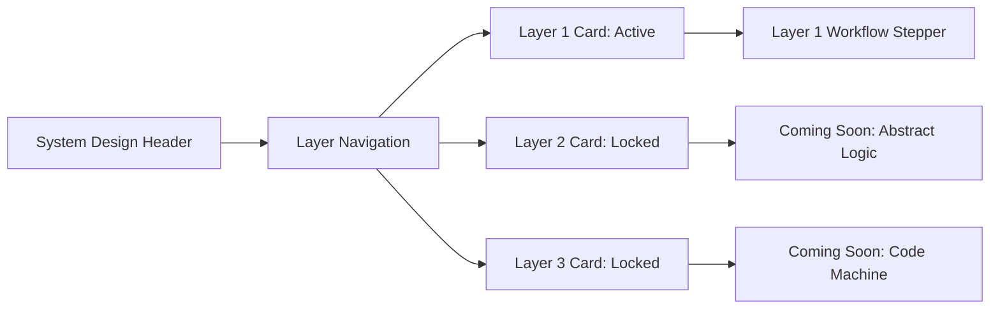

Recommended layout:

```text
Top: System Design header
Below: Three-layer navigation/cards
Main area: active Layer 1 workflow
Side area: optional progress, current state, completeness, or export readiness
```

---

## 26. Layer 1 Workflow Stages

Layer 1 should be controlled by explicit workflow stages.

Recommended type:

```ts
export type Layer1Stage =
  | 'input'
  | 'input_processing'
  | 'initial_chat'
  | 'clarification'
  | 'understanding'
  | 'specification'
  | 'diagram'
  | 'diagram_review'
  | 'export';
```

Recommended UI stepper:

```text
1. Input
2. Processing
3. Clarification
4. Understanding
5. Specification
6. Diagram
7. Review
8. Export
```

The UI should not allow users to jump to later stages before required data exists.

Example:

```text
Cannot open Clarification before input is processed.
Cannot open Diagram stage before Markdown specification exists.
Cannot export before diagram is approved.
```

---

## 27. Layer 1 Workflow State Machine

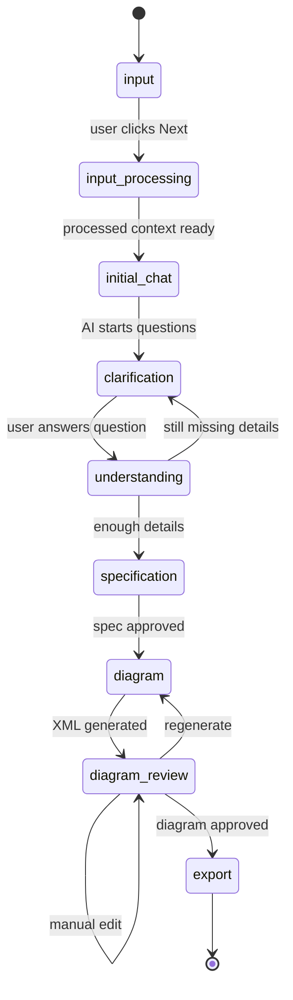

---

## 28. Core State Model

Layer 1 should use a central store instead of scattered local state.

Recommended store file:

```text
src/features/system-design/stores/useLayer1Store.ts
```

The store should hold:

```ts
export interface Layer1Run {
  id: string;
  createdAt: string;
  updatedAt: string;
  stage: Layer1Stage;

  rawInputs: RawInputPayload[];
  processedInput: ProcessedInputContext | null;

  originalDescription: string;
  messages: Layer1ChatMessage[];

  questions: ConstructiveQuestion[];
  qaHistory: QuestionAnswer[];

  understanding: SystemUnderstanding;
  completeness: CompletenessReport | null;

  markdownSpec: string;

  drawioXml: string;
  diagramSummary: string;
  diagramApproved: boolean;
  diagramRevisions: DiagramRevision[];

  artifacts: Layer1Artifacts;
  errors: Layer1Error[];
}
```

The exact type can evolve during implementation, but the idea must remain stable.

---

## 29. Input Types

Recommended file:

```text
src/features/system-design/types/input.types.ts
```

Recommended input models:

```ts
export type SystemDesignInputSourceType =
  | 'typed_text'
  | 'pasted_text'
  | 'voice_transcript'
  | 'file_text';

export interface RawInputPayload {
  id: string;
  sourceType: SystemDesignInputSourceType;
  rawText: string;
  createdAt: string;
  metadata?: {
    fileName?: string;
    audioDurationSeconds?: number;
    language?: string;
  };
}

export interface ProcessedInputContext {
  id: string;
  sourceInputIds: string[];
  normalizedText: string;
  chunks: TextChunk[];
  compressedSummary: string;
  inputSize: InputSize;
  processingWarnings: string[];
  createdAt: string;
}

export interface InputSize {
  characters: number;
  estimatedTokens: number;
  chunkCount: number;
}

export interface TextChunk {
  id: string;
  index: number;
  text: string;
  summary?: string;
  characterStart: number;
  characterEnd: number;
}
```

---

## 30. Input Processing State

The input processing pipeline should be visible to the user when needed.

Recommended states:

```ts
export type InputProcessingStatus =
  | 'idle'
  | 'normalizing'
  | 'chunking'
  | 'compressing'
  | 'ready'
  | 'failed';
```

Recommended component:

```text
src/features/system-design/components/InputProcessingStatus.tsx
```

The user should understand what is happening if a long input is being prepared.

---

## 31. System Understanding Model

The system understanding should become a structured object.

Recommended shape:

```ts
export interface SystemUnderstanding {
  summary: string;
  goal: string;
  primaryUsers: string[];
  secondaryUsers: string[];
  roles: string[];
  permissions: string[];
  workflows: WorkflowDescription[];
  alternativeWorkflows: WorkflowDescription[];
  inputs: SystemInput[];
  outputs: SystemOutput[];
  entities: SystemEntity[];
  businessRules: BusinessRule[];
  decisionLogic: DecisionRule[];
  validationRules: ValidationRule[];
  edgeCases: EdgeCase[];
  errorCases: ErrorCase[];
  integrations: IntegrationPoint[];
  notifications: NotificationRule[];
  reporting: ReportingRequirement[];
  security: SecurityRequirement[];
  openQuestions: string[];
  assumptions: string[];
  confidence: number;
}
```

This model is important because Layer 2 will eventually need structured input, not only a paragraph.

---

## 32. System Understanding Concept

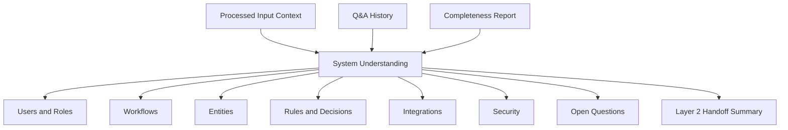

---

## 33. Constructive Question Model

Every AI question should be traceable.

Recommended shape:

```ts
export interface ConstructiveQuestion {
  id: string;
  question: string;
  category: QuestionCategory;
  reasonForAsking: string;
  basedOn: {
    originalDescription?: boolean;
    processedInputId?: string;
    chunkIds?: string[];
    previousQuestionIds?: string[];
    previousAnswerIds?: string[];
    understandingFields?: string[];
    missingCategories?: string[];
  };
  expectedAnswerType:
    | 'short_text'
    | 'long_text'
    | 'list'
    | 'yes_no'
    | 'choice'
    | 'number'
    | 'structured';
  options?: string[];
  createdAt: string;
  answeredAt?: string;
  answer?: string;
  skipped?: boolean;
}
```

This prevents the AI loop from becoming random.

---

## 34. Question Categories

Recommended categories:

```ts
export type QuestionCategory =
  | 'goal'
  | 'users'
  | 'roles_permissions'
  | 'workflow'
  | 'alternative_workflows'
  | 'inputs'
  | 'outputs'
  | 'entities'
  | 'business_rules'
  | 'decision_logic'
  | 'validations'
  | 'edge_cases'
  | 'error_handling'
  | 'integrations'
  | 'security'
  | 'notifications'
  | 'reporting'
  | 'layer2_handoff';
```

---

## 35. Completeness Model

The system should calculate whether the current understanding is ready for the next stage.

Recommended shape:

```ts
export interface CompletenessReport {
  overallScore: number;
  readyForSpec: boolean;
  readyForDiagram: boolean;
  categories: CompletenessCategoryStatus[];
  missingCriticalItems: string[];
  weakItems: string[];
  suggestedNextQuestionCategory?: QuestionCategory;
}
```

Each category can have this status:

```ts
export type CompletenessStatus =
  | 'complete'
  | 'weak'
  | 'missing'
  | 'not_applicable';
```

---

## 36. Completeness Decision Diagram

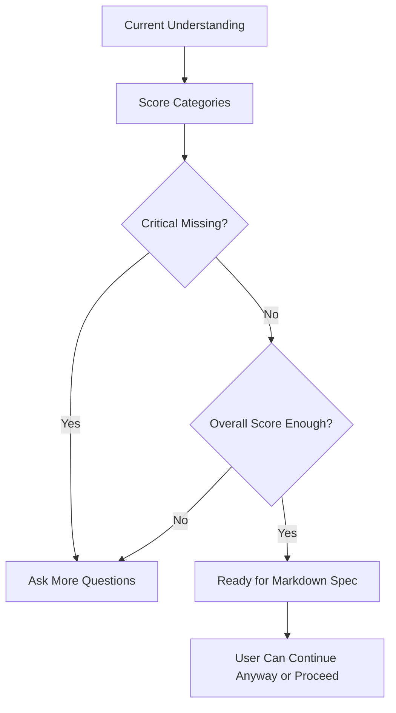

---

## 37. Layer 2 and Layer 3 Type Placeholders

Layer 2 and Layer 3 are locked in this phase, but their future handoff types should exist.

Recommended files:

```text
src/features/system-design/types/layer2.types.ts
src/features/system-design/types/layer3.types.ts
```

Layer 2 placeholder:

```ts
export interface Layer2ExpectedInput {
  sourceLayer: 1;
  layer1HandoffPackageId: string;
  markdownSpec: string;
  drawioXml: string;
  systemUnderstanding: unknown;
  traceability: unknown;
}
```

Layer 3 placeholder:

```ts
export interface Layer3ExpectedInput {
  sourceLayer: 2;
  layer2HandoffPackageId: string;
  abstractLogicGraph: unknown;
  validatedRules: unknown;
  codeGenerationPlan: unknown;
}
```

These placeholders help contributors understand the future pipeline without implementing it now.

---

## 38. Handoff Package Model

Layer 1 should produce a handoff JSON package.

This package is not Layer 2 implementation. It is only the future input to Layer 2.

Recommended shape:

```ts
export interface Layer1HandoffPackage {
  layer: 1;
  status: 'completed';
  runId: string;

  rawInputs: RawInputPayload[];
  processedInput: ProcessedInputContext;

  originalDescription: string;
  qaHistory: QuestionAnswer[];
  systemUnderstanding: SystemUnderstanding;
  completenessReport: CompletenessReport;

  artifacts: {
    markdownSpec: string;
    drawioXml: string;
    diagramSummary: string;
  };

  traceability: {
    questions: ConstructiveQuestion[];
    textChunks: TextChunk[];
    diagramRevisions: DiagramRevision[];
  };

  readyForLayer2: boolean;
  expectedLayer2Input: Layer2ExpectedInput;
  createdAt: string;
}
```

---

## 39. Handoff Traceability Diagram

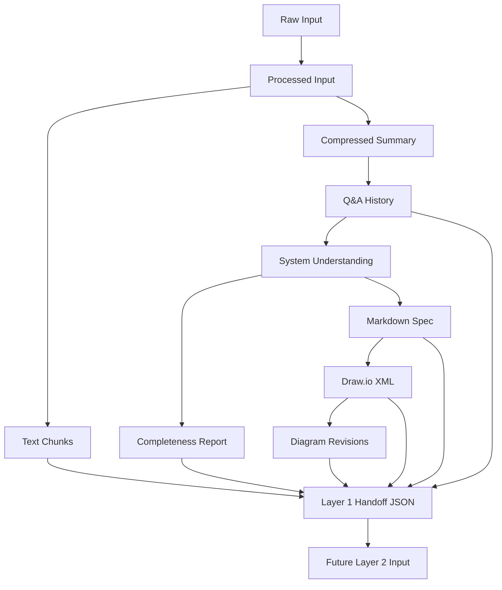

---

## 40. Zod Schema Rules

Zod schemas should validate critical structures.

Recommended files:

```text
src/features/system-design/schemas/input.schema.ts
src/features/system-design/schemas/layer1.schema.ts
```

Schemas should cover:

```text
RawInputPayload
ProcessedInputContext
ConstructiveQuestion
SystemUnderstanding
CompletenessReport
Layer1HandoffPackage
DiagramGenerationRequest
DiagramGenerationResponse
```

The purpose is to prevent invalid AI output or broken handoff packages from moving through the workflow.

---

# Part 3 of 4 — AI Orchestration, API Design, Draw.io, Markdown Spec, and Export Flow

## 41. Orchestration Design

Layer 1 should be implemented through a service interface.

Recommended file:

```text
src/features/system-design/services/layer1Orchestrator.ts
```

Recommended interface:

```ts
export interface Layer1Orchestrator {
  submitRawInput(input: SubmitRawInputInput): Promise<SubmitRawInputResult>;
  processInput(input: ProcessInputInput): Promise<ProcessInputResult>;

  submitInitialDescription(input: SubmitInitialDescriptionInput): Promise<SubmitInitialDescriptionResult>;
  generateNextQuestion(input: GenerateNextQuestionInput): Promise<GenerateNextQuestionResult>;
  submitAnswer(input: SubmitAnswerInput): Promise<SubmitAnswerResult>;

  updateUnderstanding(input: UpdateUnderstandingInput): Promise<UpdateUnderstandingResult>;
  checkCompleteness(input: CheckCompletenessInput): Promise<CheckCompletenessResult>;

  generateSpec(input: GenerateSpecInput): Promise<GenerateSpecResult>;

  generateDiagram(input: GenerateDiagramInput): Promise<GenerateDiagramResult>;
  refineDiagram(input: RefineDiagramInput): Promise<RefineDiagramResult>;

  exportLayer1(input: ExportLayer1Input): Promise<Layer1HandoffPackage>;
}
```

This interface allows the frontend to switch later between:

```text
local Next.js API routes
LangGraph backend API
mock/local adapter for development
```

---

## 42. Orchestration Adapter Pattern

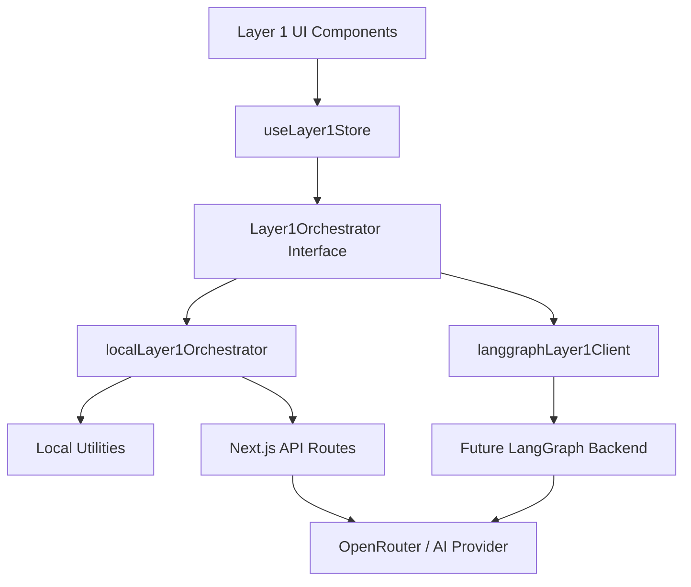

Rule:

```text
UI components must not directly own the full workflow logic.
The store controls state.
The orchestrator controls workflow actions.
Utilities handle deterministic logic.
API routes handle server-side AI calls.
```

---

## 43. Local and LangGraph Adapters

Create:

```text
src/features/system-design/services/localLayer1Orchestrator.ts
src/features/system-design/services/langgraphLayer1Client.ts
```

The local adapter can call existing Next.js API routes or local utilities.

The LangGraph adapter should be a production-ready client prepared for future backend endpoints.

It should not be a random placeholder with no structure. It should define the expected requests and responses clearly.

Example future endpoints:

```text
POST /api/system-design/layer1/input
POST /api/system-design/layer1/process-input
POST /api/system-design/layer1/question
POST /api/system-design/layer1/answer
POST /api/system-design/layer1/understanding
POST /api/system-design/layer1/completeness
POST /api/system-design/layer1/spec
POST /api/system-design/layer1/diagram
POST /api/system-design/layer1/refine-diagram
POST /api/system-design/layer1/export

POST /api/system-design/layer2/start
POST /api/system-design/layer3/start
```

For now, Layer 2 and Layer 3 endpoints are future integration points only.

---

## 44. Master Orchestration Concept

The architecture should be ready for a master orchestrator.

Recommended conceptual shape:

```ts
export interface SystemDesignMasterOrchestrator {
  layer1: Layer1Orchestrator;
  layer2: Layer2OrchestratorPlaceholder;
  layer3: Layer3OrchestratorPlaceholder;
}
```

Layer 2 and Layer 3 placeholders should exist only as types/interfaces now.

Example:

```ts
export interface Layer2OrchestratorPlaceholder {
  status: 'locked';
  expectedInput: 'Layer1HandoffPackage';
}

export interface Layer3OrchestratorPlaceholder {
  status: 'locked';
  expectedInput: 'Layer2HandoffPackage';
}
```

The frontend UI should show that they are locked, but the architecture should not need a major rewrite later to connect them.

---

## 45. Input Processing Service

Recommended file:

```text
src/features/system-design/services/inputProcessingService.ts
```

Responsibilities:

```text
Receive raw typed/pasted/transcribed text
Normalize whitespace
Detect input size
Estimate tokens
Chunk if needed
Summarize/compress if needed
Return ProcessedInputContext
Preserve traceability from chunks to original input
```

Recommended functions:

```ts
export function normalizeInputText(rawText: string): string;

export function estimateTokenCount(text: string): number;

export function shouldChunkInput(text: string): boolean;

export function chunkInputText(text: string): TextChunk[];

export async function compressInputContext(
  chunks: TextChunk[]
): Promise<ProcessedInputContext>;
```

The first implementation may use simple deterministic summarization or send summarization to an API later. The important point is that the pipeline exists and is not mixed into UI components.

---

## 46. Input Processing Sequence

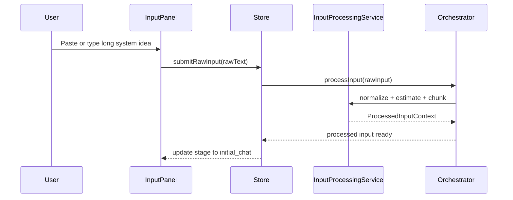

---

## 47. Transcription Client

Recommended file:

```text
src/features/system-design/services/transcriptionClient.ts
```

Voice transcription is a future capability.

For now, it can expose a clear interface and return a controlled “not implemented” result.

Recommended interface:

```ts
export interface TranscriptionClient {
  transcribeAudio(input: TranscribeAudioInput): Promise<TranscriptionResult>;
}
```

Recommended future flow:

```text
audio file/blob
→ transcription client
→ transcript text
→ RawInputPayload with sourceType = voice_transcript
→ same input processing pipeline
```

The UI can show voice input as disabled or “Coming soon”.

---

## 48. AI Prompt Files

Prompts should be stored separately so contributors do not hide prompt logic inside components.

Recommended prompt files:

```text
src/features/system-design/prompts/inputProcessingPrompt.ts
src/features/system-design/prompts/constructiveQuestionPrompt.ts
src/features/system-design/prompts/understandingUpdatePrompt.ts
src/features/system-design/prompts/completenessPrompt.ts
src/features/system-design/prompts/specGenerationPrompt.ts
src/features/system-design/prompts/diagramGenerationPrompt.ts
src/features/system-design/prompts/diagramRefinementPrompt.ts
```

Prompt files should export functions, not only static strings, because prompts need context.

Example:

```ts
export function buildConstructiveQuestionPrompt(input: BuildQuestionPromptInput): string {
  return `
You are helping design a software system.

Original input summary:
${input.processedInput.compressedSummary}

Current understanding:
${JSON.stringify(input.understanding, null, 2)}

Previous Q&A:
${JSON.stringify(input.qaHistory, null, 2)}

Completeness gaps:
${JSON.stringify(input.completeness, null, 2)}

Ask exactly one constructive next question.
Return structured JSON only.
`;
}
```

---

## 49. AI Output Validation Flow

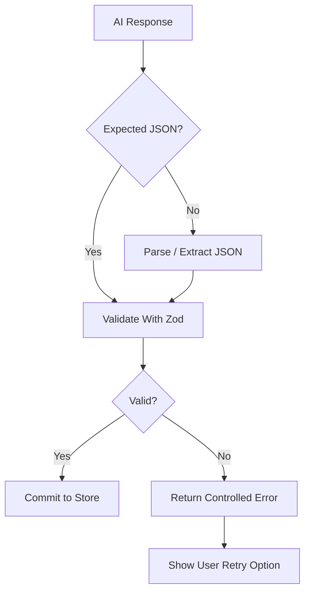

AI output should never be blindly trusted.

---

## 50. API Route Strategy

The existing route is:

```text
app/api/system-builder/generate-diagram/route.ts
```

It currently focuses on diagram XML generation.

For the first professional implementation, it can be improved and reused for diagram generation/refinement.

Later, more API routes can be added.

Recommended future API routes:

```text
app/api/system-builder/process-input/route.ts
app/api/system-builder/generate-question/route.ts
app/api/system-builder/update-understanding/route.ts
app/api/system-builder/check-completeness/route.ts
app/api/system-builder/generate-spec/route.ts
app/api/system-builder/generate-diagram/route.ts
```

This keeps the current route namespace stable while improving architecture.

---

## 51. Diagram API Payload

Current API accepts:

```ts
messages
currentXml
```

New API should accept:

```ts
export interface DiagramGenerationRequest {
  mode: 'generate' | 'refine';

  originalDescription: string;
  processedInput: ProcessedInputContext;

  qaHistory: QuestionAnswer[];
  systemUnderstanding: SystemUnderstanding;
  completenessReport: CompletenessReport;

  markdownSpec: string;

  currentXml?: string;
  refinementInstruction?: string;
  revisionHistory?: DiagramRevision[];
}
```

Recommended response:

```ts
export interface DiagramGenerationResponse {
  xml: string;
  summary: string;
  warnings: string[];
}
```

---

## 52. Server-Side AI Rule

AI provider keys must stay server-side.

Correct:

```text
OPENROUTER_API_KEY
```

Wrong:

```text
NEXT_PUBLIC_OPENROUTER_API_KEY
```

Any variable starting with `NEXT_PUBLIC_` is exposed to the browser.

Therefore, OpenRouter or other AI provider secrets must never use `NEXT_PUBLIC_`.

---

## 53. Draw.io Integration Rules

The existing Draw.io embed should be preserved unless a tested replacement is implemented.

Current component:

```text
src/components/system-builder/DrawioEmbed.tsx
```

This should remain stable and reusable.

Recommended approach:

```text
Keep DrawioEmbed as low-level iframe component
Move Layer 1 workflow UI into src/features/system-design/components
Pass XML into DrawioEmbed
Listen to onXmlChange
Store latest XML in Layer 1 store
```

Draw.io should support:

```text
Load generated XML
Manual editing
Export/save current XML
AI refinement using current XML
Revision history
Approval before export
```

---

## 54. Draw.io Workflow Diagram

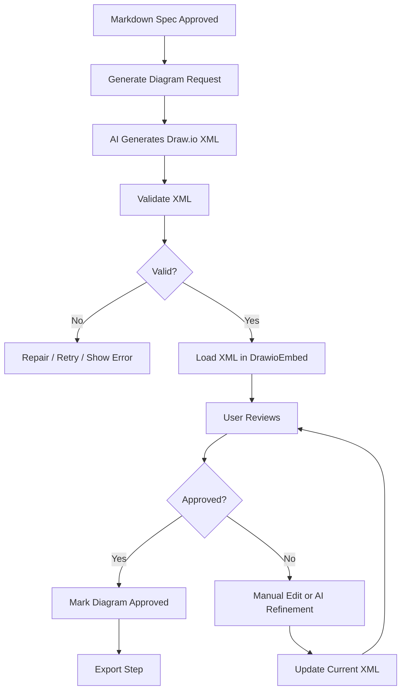

---

## 55. Draw.io XML Utilities

Create:

```text
src/features/system-design/utils/drawioXml.ts
```

Recommended functions:

```ts
export function extractMxGraphModel(raw: string): string;
export function sanitizeDrawioXml(xml: string): string;
export function validateDrawioXml(xml: string): DrawioValidationResult;
export function ensureMxGraphRoot(xml: string): string;
export function createEmptyDrawioXml(): string;
```

These utilities should protect the app from broken AI XML output.

---

## 56. Markdown Specification Generation

Create:

```text
src/features/system-design/utils/markdownSpec.ts
```

The final Markdown specification should follow this structure:

```markdown
# System Design Specification

## 1. System Overview

## 2. Source Input Summary

## 3. Main Goal

## 4. Users and Roles

## 5. Core Workflow

## 6. Alternative Workflows

## 7. Inputs

## 8. Outputs

## 9. Data Objects / Entities

## 10. Business Rules

## 11. Decision Logic

## 12. Validations

## 13. Edge Cases

## 14. Error Handling

## 15. Integrations

## 16. Security and Permissions

## 17. Notifications

## 18. Reporting / Logging

## 19. Diagram Generation Notes

## 20. Open Questions

## 21. Layer 2 Handoff Summary
```

The Markdown spec should be editable before generating the diagram.

Existing markdown components may be reused where suitable:

```text
src/components/markdown/MarkdownEditor.tsx
src/components/markdown/MarkdownRenderer.tsx
```

---

## 57. Specification to Diagram Flow

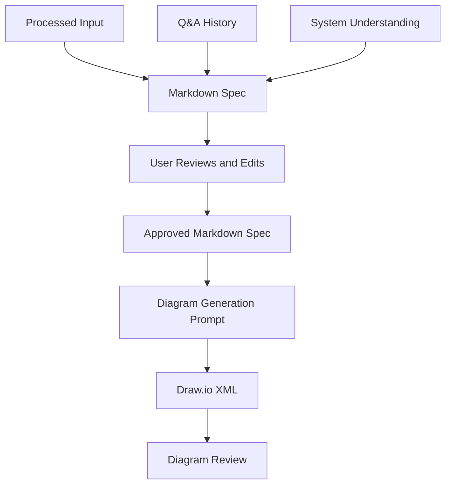

---

## 58. Export Requirements

Layer 1 must export four artifacts:

```text
final-system-spec.md
system-diagram.drawio.xml
system-diagram-summary.md
layer1-handoff.json
```

Create:

```text
src/features/system-design/components/Layer1ExportStep.tsx
src/features/system-design/utils/exportLayer1.ts
src/features/system-design/utils/downloadFile.ts
```

The export step should include:

```text
Download Markdown Spec
Download Draw.io XML
Download Diagram Summary
Download Layer 1 Handoff JSON
```

It should also show:

```text
Send to Layer 2 — Coming soon
```

That button must be disabled for now.

---

## 59. Traceability Requirements

The exported handoff JSON must preserve traceability.

It should show:

```text
Which original input started the process
Whether the input was typed, pasted, transcribed, or file-based
How long text was chunked
Which chunks were used
Which questions were asked
Why each question was asked
Which answers were given
Which completeness gaps existed
Which diagram revisions happened
Which final artifacts were produced
```

This is important because future Layer 2 logic will depend on explainable structured input.

---

## 60. Layer 1 to Layer 2 Handoff Readiness

Even though Layer 2 is locked, the Layer 1 handoff JSON must be useful for Layer 2.

Layer 2 will eventually need:

```text
Structured understanding
Entities
Workflows
Business rules
Decision logic
Inputs and outputs
Draw.io XML
Markdown specification
Traceability
Open questions
Assumptions
```

Therefore, Layer 1 export should not only be human-readable. It must also be machine-readable.

---

## 61. Export Package Diagram

```mermaid
flowchart TD
    A[Layer 1 Run State] --> B[Export Utility]
    B --> C[final-system-spec.md]
    B --> D[system-diagram.drawio.xml]
    B --> E[system-diagram-summary.md]
    B --> F[layer1-handoff.json]

    F --> G[Future Layer 2]
    C --> G
    D --> G
```

---

# Part 4 of 4 — Six Implementation Tasks, Testing, Contribution Rules, and Definition of Done

## 62. Six Main GitHub Project Tasks

The implementation should be divided into six major tasks.

Each task can be assigned to one contributor.

The six tasks are:

```text
Task 1: Foundation, environment, feature shell, and three-layer layout
Task 2: Input pipeline, long text handling, and voice/transcription preparation
Task 3: Layer 1 state model, schemas, store, and orchestration adapters
Task 4: Initial chat, constructive question loop, understanding, and completeness
Task 5: Markdown specification, Draw.io generation, review, editing, and AI refinement
Task 6: Export, handoff JSON, tests, docs, deployment readiness, and cleanup
```

This division is more practical than treating each layer as one big task.

Layer 1 itself is divided into multiple implementation tasks because it contains many internal systems.

---

## 63. Six-Task Implementation Roadmap

```mermaid
flowchart TD
    T1[Task 1: Foundation and Shell]
    T2[Task 2: Input Pipeline]
    T3[Task 3: State, Schemas, Orchestration]
    T4[Task 4: Questions, Understanding, Completeness]
    T5[Task 5: Spec, Draw.io, Refinement]
    T6[Task 6: Export, Tests, Docs]

    T1 --> T2
    T2 --> T3
    T3 --> T4
    T4 --> T5
    T5 --> T6

    T1 -. enables .-> T5
    T3 -. enables test skeleton .-> T6
```

Parallel notes:

```text
Task 1 should start first.
Task 2 can start after the folder structure exists.
Task 3 depends on Task 2 types.
Task 4 depends on Task 3 store and orchestrator.
Task 5 depends on Task 4 output but can inspect Draw.io early.
Task 6 can start docs and test skeleton early but final export depends on Task 5.
```

---

# Task 1 — Foundation, Environment, Feature Shell, and Three-Layer Layout

## Goal

Create the professional System Design foundation without breaking the current frontend.

## Scope

```text
New feature folder
System Design page shell
Three-layer visual structure
Layer 1 active
Layer 2 locked
Layer 3 locked
Compatibility wrapper
Environment documentation cleanup
```

## Subtasks

### 1.1 Create feature folder

Create:

```text
src/features/system-design/
src/features/system-design/components/
src/features/system-design/config/
src/features/system-design/prompts/
src/features/system-design/schemas/
src/features/system-design/services/
src/features/system-design/stores/
src/features/system-design/types/
src/features/system-design/utils/
```

### 1.2 Keep current route stable

Keep:

```text
app/system-builder/page.tsx
```

Update title/UI to say:

```text
System Design
```

Do not rename the route unless separately requested.

### 1.3 Convert SystemBuilder into wrapper

Update:

```text
src/components/system-builder/SystemBuilder.tsx
```

It should import and render:

```text
SystemDesignShell
```

from the new feature folder.

### 1.4 Create shell components

Create:

```text
src/features/system-design/components/SystemDesignShell.tsx
src/features/system-design/components/SystemDesignHeader.tsx
src/features/system-design/components/LayerNavigation.tsx
src/features/system-design/components/Layer1Shell.tsx
src/features/system-design/components/Layer2Locked.tsx
src/features/system-design/components/Layer3Locked.tsx
```

### 1.5 Add feature config

Create:

```text
src/features/system-design/config/systemDesignConfig.ts
```

Include:

```text
feature flags
input size thresholds
orchestrator mode
locked layer settings
```

### 1.6 Update environment example carefully

Update:

```text
.env.example
```

Important:

```text
Do not expose real backend values as if they are new System Design variables.
Mention that existing frontend variables should stay as configured.
Only add System Design-specific variables where needed.
```

Recommended:

```env
# Existing Mujarrad frontend variables
# Keep these as configured in the original frontend/deployment environment.
NEXT_PUBLIC_API_URL=
NEXT_PUBLIC_AGENT_SERVICE_URL=

# Server-side AI provider key for System Design
OPENROUTER_API_KEY=

# Optional model override for System Design
SYSTEM_BUILDER_MODEL=google/gemini-2.0-flash-001

# System Design feature flags
NEXT_PUBLIC_SYSTEM_BUILDER_MODE=api
NEXT_PUBLIC_ENABLE_LAYER_2=false
NEXT_PUBLIC_ENABLE_LAYER_3=false

# Future LangGraph/System Design orchestrator endpoint
NEXT_PUBLIC_SYSTEM_DESIGN_ORCHESTRATOR_URL=
```

## Files

```text
app/system-builder/page.tsx
src/components/system-builder/SystemBuilder.tsx
src/features/system-design/components/SystemDesignShell.tsx
src/features/system-design/components/SystemDesignHeader.tsx
src/features/system-design/components/LayerNavigation.tsx
src/features/system-design/components/Layer1Shell.tsx
src/features/system-design/components/Layer2Locked.tsx
src/features/system-design/components/Layer3Locked.tsx
src/features/system-design/config/systemDesignConfig.ts
.env.example
.gitignore
```

## Acceptance Criteria

```text
/system-builder loads
UI says System Design
Layer 1 is active
Layer 2 and Layer 3 are locked
Existing frontend remains stable
No secrets committed
Existing frontend env variables are not removed or renamed
npm run lint passes
npm run build passes
```

---

# Task 2 — Input Pipeline, Long Text Handling, and Voice/Transcription Preparation

## Goal

Build the professional input foundation before AI questioning starts.

This task answers:

```text
Where is the textbox structure?
How do we handle long text?
Can text be passed to AI in one go?
What if the user uses voice?
Where does transcription happen?
```

## Scope

```text
Large text input panel
Input normalization
Input size detection
Estimated token count
Chunking for long text
Context compression preparation
Voice input placeholder
Transcription client interface
Input processing status UI
```

## Subtasks

### 2.1 Create input types

Create:

```text
src/features/system-design/types/input.types.ts
```

Include:

```text
RawInputPayload
ProcessedInputContext
TextChunk
InputSize
TranscriptionResult
InputProcessingStatus
```

### 2.2 Create input schemas

Create:

```text
src/features/system-design/schemas/input.schema.ts
```

Validate:

```text
raw input
processed input
text chunks
transcription result
```

### 2.3 Create input panel

Create:

```text
src/features/system-design/components/Layer1InputPanel.tsx
```

It should support:

```text
large multiline textbox
character count
estimated token count
input warnings
Next button
clear/reset
future voice button placeholder
future file input placeholder
```

### 2.4 Create input processing status component

Create:

```text
src/features/system-design/components/InputProcessingStatus.tsx
```

Show statuses:

```text
idle
normalizing
chunking
compressing
ready
failed
```

### 2.5 Create input normalization utility

Create:

```text
src/features/system-design/utils/inputNormalization.ts
```

Responsibilities:

```text
trim input
normalize whitespace
remove repeated empty lines
preserve meaningful formatting
```

### 2.6 Create text chunking utility

Create:

```text
src/features/system-design/utils/textChunking.ts
```

Responsibilities:

```text
detect when text is too long
split text into chunks
preserve chunk order
preserve character ranges
support overlap
```

### 2.7 Create context compression utility

Create:

```text
src/features/system-design/utils/contextCompression.ts
```

Responsibilities:

```text
prepare summarized context from chunks
preserve traceability to original chunks
prepare AI-safe context
```

### 2.8 Create input processing service

Create:

```text
src/features/system-design/services/inputProcessingService.ts
```

It should coordinate:

```text
normalization
size detection
chunking
compression
ProcessedInputContext creation
```

### 2.9 Prepare voice transcription interface

Create:

```text
src/features/system-design/services/transcriptionClient.ts
src/features/system-design/components/VoiceInputPlaceholder.tsx
```

For now, voice can be disabled or marked coming soon.

But the interface should show future flow:

```text
audio → transcription → transcript → RawInputPayload → input processing pipeline
```

## Files

```text
src/features/system-design/types/input.types.ts
src/features/system-design/schemas/input.schema.ts
src/features/system-design/components/Layer1InputPanel.tsx
src/features/system-design/components/InputProcessingStatus.tsx
src/features/system-design/components/VoiceInputPlaceholder.tsx
src/features/system-design/services/inputProcessingService.ts
src/features/system-design/services/transcriptionClient.ts
src/features/system-design/utils/inputNormalization.ts
src/features/system-design/utils/textChunking.ts
src/features/system-design/utils/contextCompression.ts
src/features/system-design/config/systemDesignConfig.ts
```

## Acceptance Criteria

```text
User can enter long text
UI shows character count
UI shows estimated input size
Small text can pass directly
Large text is chunked
ProcessedInputContext is created
Voice input path is architecturally prepared
No real transcription implementation is required yet
No diagram generation happens from raw input
npm run lint passes
npm run build passes
```

---

# Task 3 — Layer 1 State Model, Schemas, Store, and Orchestration Adapters

## Goal

Define the typed state model and orchestration interface for Layer 1 and future Layer 2/3 connection.

## Scope

```text
Layer 1 types
Layer 2/3 placeholder types
Zod schemas
Zustand store
Local orchestrator adapter
LangGraph-ready client adapter
Master orchestration concept
```

## Subtasks

### 3.1 Create Layer 1 types

Create:

```text
src/features/system-design/types/layer1.types.ts
```

Include:

```text
Layer1Stage
Layer1Run
Layer1ChatMessage
ConstructiveQuestion
QuestionAnswer
SystemUnderstanding
CompletenessReport
DiagramRevision
Layer1Artifacts
Layer1HandoffPackage
```

### 3.2 Create Layer 2 and Layer 3 placeholders

Create:

```text
src/features/system-design/types/layer2.types.ts
src/features/system-design/types/layer3.types.ts
```

They should define expected future inputs, but not implement functionality.

### 3.3 Create Layer 1 schemas

Create:

```text
src/features/system-design/schemas/layer1.schema.ts
```

Validate:

```text
ConstructiveQuestion
SystemUnderstanding
CompletenessReport
Layer1HandoffPackage
DiagramGenerationRequest
DiagramGenerationResponse
```

### 3.4 Create Layer 1 store

Create:

```text
src/features/system-design/stores/useLayer1Store.ts
```

The store should support:

```text
startRun
submitRawInput
setProcessedInput
setStage
setCurrentQuestion
submitAnswer
updateUnderstanding
setCompleteness
setMarkdownSpec
setDrawioXml
addDiagramRevision
approveDiagram
exportHandoff
resetRun
```

### 3.5 Create orchestrator interface

Create:

```text
src/features/system-design/services/layer1Orchestrator.ts
```

Include methods for:

```text
submitRawInput
processInput
generateNextQuestion
submitAnswer
updateUnderstanding
checkCompleteness
generateSpec
generateDiagram
refineDiagram
exportLayer1
```

### 3.6 Create local adapter

Create:

```text
src/features/system-design/services/localLayer1Orchestrator.ts
```

This can call local utilities and current API routes.

### 3.7 Create LangGraph client adapter

Create:

```text
src/features/system-design/services/langgraphLayer1Client.ts
```

This should be ready for future backend endpoints.

It should include:

```text
base URL config
typed request/response methods
clear error handling
Layer 1 endpoint names
future Layer 2/3 endpoint placeholders
```

### 3.8 Create ID utility

Create:

```text
src/features/system-design/utils/id.ts
```

## Files

```text
src/features/system-design/types/layer1.types.ts
src/features/system-design/types/layer2.types.ts
src/features/system-design/types/layer3.types.ts
src/features/system-design/schemas/layer1.schema.ts
src/features/system-design/stores/useLayer1Store.ts
src/features/system-design/services/layer1Orchestrator.ts
src/features/system-design/services/localLayer1Orchestrator.ts
src/features/system-design/services/langgraphLayer1Client.ts
src/features/system-design/utils/id.ts
```

## Acceptance Criteria

```text
Layer 1 state is strongly typed
Store controls the workflow
Input pipeline state is included
Schemas validate important objects
Orchestrator interface exists
LangGraph client is ready to connect later
Layer 2 and Layer 3 future connection is represented
Components do not own main workflow logic
npm run lint passes
npm run build passes
```

---

# Task 4 — Initial Chat, Constructive Question Loop, Understanding, and Completeness

## Goal

Implement the intelligent requirement clarification workflow.

## Scope

```text
Initial chat after input processing
One constructive AI question at a time
Answer submission
Question history
Understanding update
Completeness scoring
Continue or proceed behavior
```

## Subtasks

### 4.1 Create initial chat component

Create:

```text
src/features/system-design/components/Layer1InitialChat.tsx
```

It should use processed input, not raw text only.

### 4.2 Create question loop

Create:

```text
src/features/system-design/components/Layer1QuestionLoop.tsx
src/features/system-design/components/QuestionCard.tsx
src/features/system-design/components/QuestionHistory.tsx
```

The system must ask exactly one constructive question at a time.

### 4.3 Create question category utility

Create:

```text
src/features/system-design/utils/questionCategories.ts
```

### 4.4 Create question selection utility

Create:

```text
src/features/system-design/utils/questionSelection.ts
```

It should choose the next question category from:

```text
current understanding
completeness gaps
previous Q&A
processed input summary
```

### 4.5 Create constructive question prompt

Create:

```text
src/features/system-design/prompts/constructiveQuestionPrompt.ts
```

The prompt must use:

```text
processed input summary
chunk traceability when needed
current understanding
previous Q&A
missing categories
```

### 4.6 Create understanding update utility

Create:

```text
src/features/system-design/utils/updateUnderstanding.ts
```

### 4.7 Create understanding update prompt

Create:

```text
src/features/system-design/prompts/understandingUpdatePrompt.ts
```

### 4.8 Create completeness utility

Create:

```text
src/features/system-design/utils/completeness.ts
```

### 4.9 Create completeness prompt

Create:

```text
src/features/system-design/prompts/completenessPrompt.ts
```

### 4.10 Create UI panels

Create:

```text
src/features/system-design/components/Layer1UnderstandingPanel.tsx
src/features/system-design/components/Layer1CompletenessPanel.tsx
```

## Files

```text
src/features/system-design/components/Layer1InitialChat.tsx
src/features/system-design/components/Layer1QuestionLoop.tsx
src/features/system-design/components/QuestionCard.tsx
src/features/system-design/components/QuestionHistory.tsx
src/features/system-design/components/Layer1UnderstandingPanel.tsx
src/features/system-design/components/Layer1CompletenessPanel.tsx
src/features/system-design/prompts/constructiveQuestionPrompt.ts
src/features/system-design/prompts/understandingUpdatePrompt.ts
src/features/system-design/prompts/completenessPrompt.ts
src/features/system-design/utils/questionCategories.ts
src/features/system-design/utils/questionSelection.ts
src/features/system-design/utils/updateUnderstanding.ts
src/features/system-design/utils/completeness.ts
```

## Acceptance Criteria

```text
User starts clarification after input processing
System asks one constructive question
User answers
Next question uses previous context
Question history is saved
Understanding updates after answers
Completeness report is generated
Missing critical items are shown
User can continue asking questions
User can proceed when ready
npm run lint passes
npm run build passes
```

---

# Task 5 — Markdown Specification, Draw.io Generation, Review, Manual Edit, and AI Refinement

## Goal

Generate the final human-readable and visual Layer 1 artifacts.

## Scope

```text
Markdown specification
Editable spec review
Draw.io generation from full context
Diagram review
Manual Draw.io editing
AI diagram refinement
Revision history
Diagram approval
```

## Subtasks

### 5.1 Create Markdown spec utility

Create:

```text
src/features/system-design/utils/markdownSpec.ts
```

### 5.2 Create spec generation prompt

Create:

```text
src/features/system-design/prompts/specGenerationPrompt.ts
```

### 5.3 Create specification UI

Create:

```text
src/features/system-design/components/Layer1SpecStep.tsx
```

Reuse existing markdown components where appropriate.

### 5.4 Create diagram step

Create:

```text
src/features/system-design/components/Layer1DiagramStep.tsx
```

### 5.5 Create diagram generation prompt

Create:

```text
src/features/system-design/prompts/diagramGenerationPrompt.ts
```

### 5.6 Update diagram API payload

Update:

```text
app/api/system-builder/generate-diagram/route.ts
```

The API should support:

```text
generate mode
refine mode
processed input
Q&A history
system understanding
markdown spec
current XML
revision history
```

### 5.7 Create Draw.io XML utility

Create:

```text
src/features/system-design/utils/drawioXml.ts
```

### 5.8 Preserve DrawioEmbed

Keep and reuse:

```text
src/components/system-builder/DrawioEmbed.tsx
```

Do not delete it unless a tested replacement exists.

### 5.9 Create diagram review UI

Create:

```text
src/features/system-design/components/Layer1DiagramReview.tsx
```

### 5.10 Create diagram refinement UI

Create:

```text
src/features/system-design/components/Layer1DiagramRefinement.tsx
src/features/system-design/components/DiagramRevisionHistory.tsx
```

### 5.11 Create diagram refinement prompt

Create:

```text
src/features/system-design/prompts/diagramRefinementPrompt.ts
```

## Files

```text
src/features/system-design/components/Layer1SpecStep.tsx
src/features/system-design/components/Layer1DiagramStep.tsx
src/features/system-design/components/Layer1DiagramReview.tsx
src/features/system-design/components/Layer1DiagramRefinement.tsx
src/features/system-design/components/DiagramRevisionHistory.tsx
src/features/system-design/prompts/specGenerationPrompt.ts
src/features/system-design/prompts/diagramGenerationPrompt.ts
src/features/system-design/prompts/diagramRefinementPrompt.ts
src/features/system-design/utils/markdownSpec.ts
src/features/system-design/utils/drawioXml.ts
src/components/system-builder/DrawioEmbed.tsx
app/api/system-builder/generate-diagram/route.ts
```

## Acceptance Criteria

```text
Markdown spec is generated from full Layer 1 context
Markdown spec is editable
Diagram is generated from processed input, Q&A, understanding, and spec
Draw.io loads generated XML
Manual edits update current XML
AI refinement uses current XML and instruction
Revision history is stored
User can approve diagram
Export is blocked until approval
npm run lint passes
npm run build passes
```

---

# Task 6 — Export, Handoff JSON, Tests, Docs, Deployment Readiness, and Cleanup

## Goal

Finish Layer 1 as a professional deliverable and prepare it for future Layer 2.

## Scope

```text
Export files
Layer 1 handoff JSON
Download utilities
Tests
Documentation
Deployment notes
Git cleanup
Final verification
```

## Subtasks

### 6.1 Create export step

Create:

```text
src/features/system-design/components/Layer1ExportStep.tsx
```

### 6.2 Create export utility

Create:

```text
src/features/system-design/utils/exportLayer1.ts
```

### 6.3 Create download utility

Create:

```text
src/features/system-design/utils/downloadFile.ts
```

### 6.4 Export required files

Support downloads for:

```text
final-system-spec.md
system-diagram.drawio.xml
system-diagram-summary.md
layer1-handoff.json
```

### 6.5 Ensure handoff JSON includes traceability

The JSON must include:

```text
raw inputs
processed input
text chunks
Q&A history
understanding
completeness
Markdown spec
Draw.io XML
diagram summary
diagram revisions
readyForLayer2
expectedLayer2Input
```

### 6.6 Add tests

Create tests for:

```text
input normalization
text chunking
question selection
completeness scoring
markdown generation
draw.io XML validation
export package
store transitions
```

Recommended files:

```text
src/features/system-design/utils/__tests__/inputNormalization.test.ts
src/features/system-design/utils/__tests__/textChunking.test.ts
src/features/system-design/utils/__tests__/questionSelection.test.ts
src/features/system-design/utils/__tests__/completeness.test.ts
src/features/system-design/utils/__tests__/markdownSpec.test.ts
src/features/system-design/utils/__tests__/drawioXml.test.ts
src/features/system-design/utils/__tests__/exportLayer1.test.ts
```

### 6.7 Add docs

Create or update:

```text
Docs/system-design-detailed-plan.md
Docs/system-design-env.md
Docs/system-design-layer1.md
Docs/system-design-team-tasks.md
```

### 6.8 Deployment readiness

Document:

```text
.env.local remains local only
.env.example contains no real secrets
deployment variables must be configured in hosting platform
OPENROUTER_API_KEY is server-side only
NEXT_PUBLIC_SYSTEM_DESIGN_ORCHESTRATOR_URL is future client-visible endpoint only
```

### 6.9 Cleanup

Before final commit, remove or ignore local inspection files:

```text
branch-inspection/
branch-inspection-content/
branch-inspection.zip
branch-inspection-content.zip
```

### 6.10 Final verification

Run:

```bash
npm run lint
npm run build
npm run test
```

## Files

```text
src/features/system-design/components/Layer1ExportStep.tsx
src/features/system-design/utils/exportLayer1.ts
src/features/system-design/utils/downloadFile.ts
src/features/system-design/utils/__tests__/inputNormalization.test.ts
src/features/system-design/utils/__tests__/textChunking.test.ts
src/features/system-design/utils/__tests__/questionSelection.test.ts
src/features/system-design/utils/__tests__/completeness.test.ts
src/features/system-design/utils/__tests__/markdownSpec.test.ts
src/features/system-design/utils/__tests__/drawioXml.test.ts
src/features/system-design/utils/__tests__/exportLayer1.test.ts
Docs/system-design-detailed-plan.md
Docs/system-design-env.md
Docs/system-design-layer1.md
Docs/system-design-team-tasks.md
```

## Acceptance Criteria

```text
Markdown spec can be downloaded
Draw.io XML can be downloaded
Diagram summary can be downloaded
Handoff JSON can be downloaded
Handoff JSON includes full traceability
Handoff JSON is ready for future Layer 2
Layer 2 button remains disabled
Layer 3 button remains disabled
Tests cover critical utilities
Docs are clear
No secrets committed
No local inspection files committed
npm run lint passes
npm run build passes
npm run test passes or known unrelated failures are documented
```

---

# 64. Recommended Task Dependency Order

```text
Task 1 must start first.

Task 2 depends on Task 1 shell/folder structure.

Task 3 depends on Task 1 and Task 2 types/input pipeline.

Task 4 depends on Task 3 store/orchestration.

Task 5 depends on Task 4 understanding/spec output, but can start early by preserving Draw.io.

Task 6 depends on all tasks, but docs/test skeleton can start early.
```

Visual dependency:

```mermaid
flowchart TD
    T1[Task 1: Foundation]
    T2[Task 2: Input Pipeline]
    T3[Task 3: State and Orchestration]
    T4[Task 4: Clarification and Understanding]
    T5[Task 5: Spec and Draw.io]
    T6[Task 6: Export and QA]

    T1 --> T2
    T2 --> T3
    T3 --> T4
    T4 --> T5
    T5 --> T6
```

Parallel notes:

```text
Task 5 can inspect/refactor Draw.io early, but must not connect final generation until Task 4 output exists.

Task 6 can start docs and test skeleton early, but final export depends on Task 5.
```

---

# 65. Contribution Rules

All contributors must follow these rules:

```text
1. Do not break existing frontend behavior.

2. Do not merge unrelated main branch changes unless requested.

3. Do not commit .env.local.

4. Do not expose AI provider keys to the browser.

5. Do not install new packages unless necessary and approved.

6. Do not run npm audit fix --force unless it is a separate dependency task.

7. Keep new code inside src/features/system-design where possible.

8. Existing src/components/system-builder files should be treated as wrappers or reusable low-level components.

9. Components should not contain large orchestration logic.

10. Store, services, schemas, and utilities should hold workflow logic.

11. Every task must pass lint and build before review.

12. Layer 2 and Layer 3 must stay locked placeholders for now.

13. Handoff JSON must be designed for future Layer 2.

14. Draw.io XML must be validated before being loaded or exported.

15. The implementation must remain LangGraph-ready.

16. Raw long text should go through input processing before AI clarification.

17. Voice input must enter the same text pipeline after transcription.

18. Existing Mujarrad frontend env variables must not be removed or renamed.
```

---

# 66. Testing Checklist

Each contributor should run:

```bash
npm run lint
npm run build
```

Task 6 should also run:

```bash
npm run test
```

The current branch baseline is:

```text
Lint passes with warnings only.
Build passes successfully.
```

Existing lint warnings are not part of this System Design task unless they are caused by the new work.

---

# 67. Git Hygiene

Before committing, check:

```bash
git status --short
```

Do not commit local inspection artifacts such as:

```text
branch-inspection/
branch-inspection-content/
branch-inspection.zip
branch-inspection-content.zip
```

Do not commit:

```text
.env.local
.env
```

Recommended cleanup after inspection:

```bash
rm -rf branch-inspection branch-inspection-content branch-inspection.zip branch-inspection-content.zip
```

---

# 68. Suggested GitHub Project Columns

Use:

```text
Backlog
Ready
In Progress
Needs Review
Blocked
Done
```

Suggested labels:

```text
system-design
layer-1
input-pipeline
frontend
orchestration
drawio
langgraph-ready
env
testing
docs
blocked-by-task-1
blocked-by-task-2
blocked-by-task-3
```

---

# 69. Final Definition of Done for This Phase

This phase is complete when:

```text
/system-builder opens the new System Design shell
Layer 1 workflow is usable from input to export
Layer 2 and Layer 3 are visible but locked
Long text input is processed safely
Input chunking/compression is prepared
Voice transcription path is architecturally prepared
AI clarification loop works constructively
System understanding is generated
Completeness is calculated
Markdown specification is generated and editable
Draw.io diagram is generated from full context
Diagram can be manually edited
Diagram can be AI-refined
Final artifacts can be exported
Handoff JSON is produced
Handoff JSON is ready for future Layer 2
Docs exist
Tests exist for critical utilities
No secrets are committed
Existing frontend behavior remains stable
npm run lint passes
npm run build passes
```

---

# 70. Summary

This project is not only a Draw.io page.

It is the first implemented layer of a larger Mujarrad orchestration system.

The correct implementation must be:

```text
Professional
Typed
Traceable
Modular
LangGraph-ready
Safe for the existing frontend
Able to handle long text
Prepared for voice transcription
Prepared for future Layer 2 and Layer 3
```

All contributors should follow this document before implementing their assigned tasks.