# Mujarrad System Design Detailed Plan

## Document Purpose

The goal is to build a clean, well-structured System Design workflow on the `feat/system-builder` branch without breaking the existing Mujarrad frontend. Current routes, shell components, chat, docs, spaces, nodes, graph, whiteboard, backend API services, and shared UI behavior must remain stable.

This document is the main reference for contributors before implementing any task related to the System Design project.

---

## 1. Executive Summary

Mujarrad System Design is the first implemented layer of a larger three-layer Mujarrad orchestration system.

The long-term product architecture is:

```text
Layer 1: System Design
Layer 2: Abstract Logic
Layer 3: Code Machine
```

For the current implementation phase:

```text
Layer 1 will be implemented.
Layer 2 will be visible but locked.
Layer 3 will be visible but locked.
```

Layer 1 must take user input, process it safely, ask constructive AI clarification questions, build structured understanding, generate Draw.io diagrams, allow manual and AI-assisted diagram refinement, then generate the final Layer 1 documentation and exports.

The corrected Layer 1 workflow is:

```text
input
→ processing
→ AI constructive questions
→ structured understanding
→ completeness/readiness
→ Draw.io diagram generation
→ diagram editing and AI refinement
→ final documentation generation
→ export package
```

Important correction:

```text
Markdown is not required before Draw.io.
Draw.io does not depend on Markdown.
Final Markdown documentation is generated after the diagram is approved.
```

Final Layer 1 outputs are:

```text
final-system-spec.md
system-diagram.drawio.xml
system-diagram.png or system-diagram.svg
optional system-diagram-summary.md
```

These Layer 1 outputs are also the future input bundle for Layer 2.

The future Layer 2 must start only after Layer 1 has produced the approved Markdown, XML, and diagram image outputs.

---

## 2. Branch Strategy

This work happens inside:

```text
feat/system-builder
```

The branch should be used to prepare and implement the System Design project cleanly.

Contributors must not merge unrelated work from `main` unless explicitly requested.

---

## 3. Non-Breaking Rule

The existing Mujarrad frontend contains working areas that must remain stable:

```text
Authentication
Chat
Docs
Spaces
Nodes
Graph
Whiteboard
Markdown rendering
Shell components
Navigation stores
Backend API services
Shared UI behavior
```

The new System Design work must be built professionally without breaking existing behavior.

Required approach:

```text
Keep existing frontend stable.
Create new feature folders for System Design.
Use compatibility wrappers where needed.
Avoid destructive refactors.
Avoid modifying unrelated components.
Avoid changing existing backend API variables.
Keep the /system-builder route as the planned entry point for now.
```

Existing files should only be touched when required for routing, compatibility, or integration.

---

## 4. LangGraph Requirement

The System Design workflow must be orchestrated with **LangGraph.js**.

LangGraph is not an optional future backend. It is the required orchestration layer for this project.

LangGraph should run on the server side of the Next.js application, through server-only modules and API route handlers.

Correct architecture:

```text
Frontend UI
→ Next.js API route
→ LangGraph Layer 1 graph
→ LangGraph nodes/tools
→ AI provider / deterministic utilities
→ validated result returned to UI
```

LangGraph must control:

```text
workflow order
branching
human-in-the-loop pauses
AI question loop
understanding updates
diagram generation
AI diagram refinement
final documentation generation
artifact bundle creation
```

The UI must not own the main workflow logic. The UI displays graph state and sends user actions to the runtime.

---

## 5. Open-Source Tooling Strategy

The preferred tools for this project are open-source or open-standard where possible.

Current approved tools:

```text
LangGraph.js
Zod
Zustand
Draw.io / diagrams.net embed
@xenova/transformers
Native browser APIs
Jest
React Testing Library when UI tests are needed
```

Tool responsibilities:

```text
LangGraph.js:
Controls Layer 1 workflow orchestration.

Zod:
Validates graph events, AI output, state objects, XML responses, final Markdown responses, and artifact objects.

Zustand:
Mirrors graph state in the frontend for UI display.

Draw.io / diagrams.net embed:
Provides editable visual diagram workspace.

@xenova/transformers:
Provides local open-source browser Whisper transcription for voice input.

Native browser APIs:
Used for MediaRecorder, file reading, and file download behavior.

Jest:
Used for utility, schema, graph, and export tests.

React Testing Library:
Used only when UI interaction tests are useful.
```

AI provider logic must stay server-side behind an `aiProviderTool`. The provider should be swappable so the team can later use OpenRouter, a local model service, or another approved backend without rewriting UI components.

---

## 6. Target Product Architecture

This is the target architecture for the System Design project.

Layer 2 must not start from the middle of Layer 1. Layer 2 starts only after Layer 1 produces the approved artifact bundle.

The approved Layer 1 artifact bundle is:

```text
Markdown specification
Draw.io XML
Diagram image
Optional diagram summary
```

Layer 3 starts only after future Layer 2 output exists.

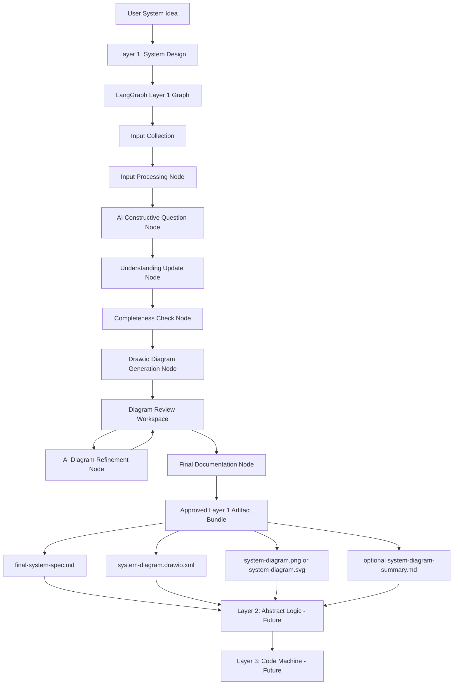

Important rules:

```text
Layer 1 is orchestrated by LangGraph.
Layer 1 has two main AI parts:
1. AI constructive questions and understanding.
2. AI diagram generation/refinement.
Draw.io generation happens after clarification/understanding is ready.
Markdown documentation is generated after diagram approval.
Layer 1 exports Markdown, XML, and diagram image files.
Layer 2 takes the approved Layer 1 artifact bundle as input in the future.
```

---

## 7. Planned Entry Point

The planned route for this workflow is:

```text
/system-builder
```

The product name shown in the UI should be:

```text
System Design
```

The implementation should be treated as a clean Layer 1 System Design workflow.

The target workflow is:

```text
input
→ LangGraph orchestration
→ processing
→ AI clarification
→ understanding
→ completeness
→ Draw.io diagram
→ diagram review
→ AI diagram refinement
→ diagram approval
→ final documentation
→ export package
```

The final export package must contain:

```text
final-system-spec.md
system-diagram.drawio.xml
system-diagram.png or svg
optional system-diagram-summary.md
```

---

## 8. Final Layer 1 User Flow

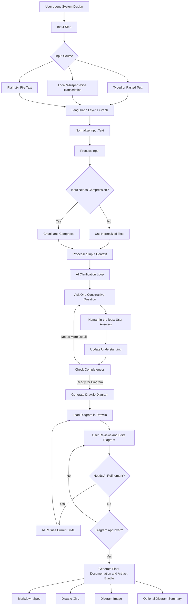

Detailed flow:

```text
1. User provides the system idea.

2. Input can come from typed text, pasted text, local Whisper voice transcription, or extracted .txt file text.

3. A Next.js API route sends the request to the LangGraph Layer 1 graph.

4. LangGraph controls the workflow.

5. Input is normalized and processed.

6. Large input is chunked/compressed only when needed.

7. LangGraph starts a constructive AI clarification loop.

8. LangGraph asks one question at a time.

9. The graph pauses for human-in-the-loop user input.

10. Each answer updates the structured system understanding.

11. Completeness/readiness is recalculated.

12. When enough detail exists, LangGraph generates a Draw.io diagram from the full Layer 1 context.

13. User reviews and edits the diagram in Draw.io.

14. User can manually edit the diagram.

15. User can ask AI to refine the current diagram XML.

16. AI refinement must use the current XML plus the user instruction.

17. Refined XML must be validated before it is applied.

18. User approves the final diagram.

19. System generates the final Layer 1 documentation and artifact bundle:
    - Markdown specification
    - Draw.io XML
    - diagram image
    - optional diagram summary

20. User can download the Layer 1 files.
```

---

## 9. Input Collection and Processing

The System Design input box is the first active stage of the Layer 1 workflow.

It is not a basic prompt box. It is a compact professional input composer that accepts multiple input sources and prepares them for the Layer 1 pipeline.

Implemented Task 2 input sources:

```text
Typed text
Pasted text
Voice recording transcription through local open-source Whisper in the browser
Plain .txt file upload
```

The input UI supports:

```text
Compact multiline textarea
Input source label
Input size label
Character count
Estimated token count
Processed chunk count
Smart inline status pill
File upload button inside composer
Voice recording button inside composer
Process button inside composer
Clear button inside composer
Short-input warning only when useful
Error messages only when needed
```

Implemented component:

```text
src/features/system-design/components/Layer1InputPanel.tsx
```

Important UI rules implemented in Task 2:

```text
Avoid long explanations inside the UI.
Avoid duplicate warnings.
Avoid large metric cards.
Avoid unnecessary side panels.
Keep file, voice, and process actions inside the input composer.
Show only useful status information.
```

The input stage now sends processed user text into the Task 3 Layer 1 runtime endpoint. The current source of truth for workflow progression is the Layer 1 graph/store state.

---

## 10. Input Processing Pipeline

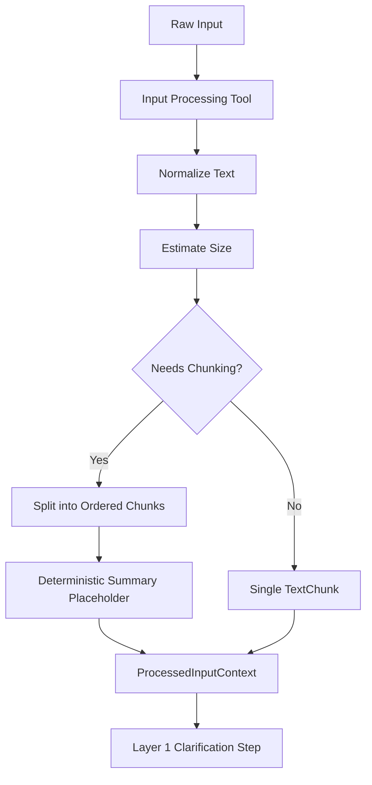

Implemented files:

```text
src/features/system-design/types/input.types.ts
src/features/system-design/schemas/input.schema.ts
src/features/system-design/utils/inputNormalization.ts
src/features/system-design/utils/textChunking.ts
src/features/system-design/utils/contextCompression.ts
src/features/system-design/utils/id.ts
src/features/system-design/tools/inputProcessingTool.ts
src/features/system-design/nodes/processInputNode.ts
```

Implemented responsibilities:

```text
RawInputPayload typing
ProcessedInputContext typing
InputProcessingResult typing
InputProcessingWarning typing
Input source typing
Text normalization
Whitespace cleanup
Paragraph preservation
Estimated token count
Input size label
Chunking decision
Ordered TextChunk creation
Character start/end offsets
Deterministic compressed summary placeholder
Traceability ID creation
Controlled warnings
Controlled errors
```

Input limits are configured in:

```text
src/features/system-design/config/systemDesignConfig.ts
```

Current config:

```ts
inputLimits: {
  maxDirectCharacters: 12000,
  maxChunkCharacters: 6000,
  chunkOverlapCharacters: 500,
}
```

Implemented input source types:

```ts
export type SystemDesignInputSourceType =
  | 'typed_text'
  | 'pasted_text'
  | 'voice_transcript'
  | 'file_text';
```

Implemented core input objects:

```ts
export interface RawInputPayload {
  id: string;
  sourceType: SystemDesignInputSourceType;
  rawText: string;
  createdAt: string;
  metadata?: {
    fileName?: string;
    audioDurationSeconds?: number;
    language?: string;
  };
}

export interface ProcessedInputContext {
  id: string;
  sourceInputIds: string[];
  normalizedText: string;
  chunks: TextChunk[];
  compressedSummary: string;
  inputSize: InputSize;
  processingWarnings: InputProcessingWarning[];
  createdAt: string;
}

export interface InputSize {
  characters: number;
  estimatedTokens: number;
  chunkCount: number;
}

export interface TextChunk {
  id: string;
  index: number;
  text: string;
  summary?: string;
  characterStart: number;
  characterEnd: number;
}
```

Input rule:

```text
No AI clarification starts from raw input.
No diagram generation happens from raw input.
Raw input must become ProcessedInputContext first.
```

---

## 11. Voice and Transcription

Voice input is implemented through local open-source Whisper transcription in the browser.

The system does not depend on paid OpenAI transcription for the active voice path.

Implemented voice flow:

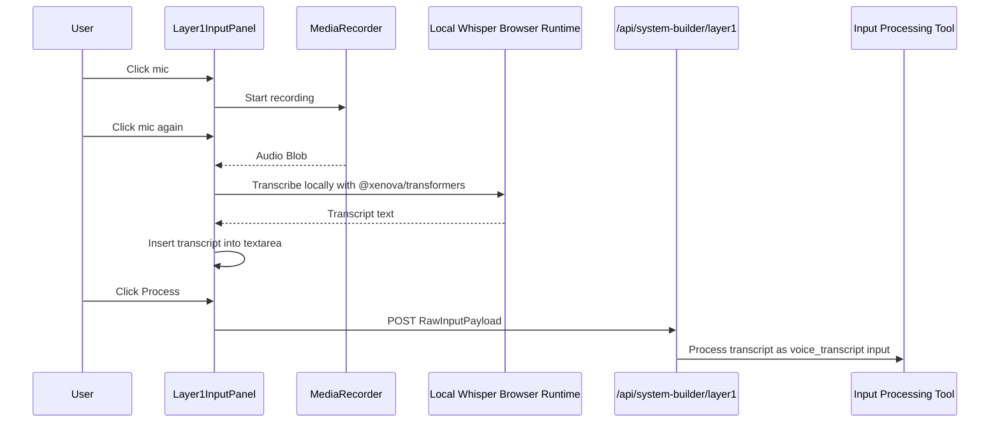

Implemented files:

```text
src/features/system-design/components/Layer1InputPanel.tsx
src/features/system-design/utils/localWhisperTranscription.ts
src/features/system-design/types/input.types.ts
```

Implemented dependency:

```text
@xenova/transformers
```

Implemented behavior:

```text
Voice button is inside the composer.
Browser records audio using MediaRecorder.
Audio is transcribed locally in the browser using open-source Whisper through @xenova/transformers.
Transcript text is inserted into the textarea.
Transcript source type becomes voice_transcript.
Transcript then uses the same Layer 1 input processing path as typed text and file text.
No OpenAI transcription key is required for the active voice path.
No /api/system-builder/transcribe request is sent by the current input panel.
```

Important browser/runtime behavior:

```text
The first local transcription can take longer because the Whisper model must be downloaded and cached.
The /system-builder page bundle is larger because local transcription code is bundled for browser use.
The model may download from the model host/CDN on first use.
After caching, later transcription should be faster.
```

Current local transcription utility:

```text
src/features/system-design/utils/localWhisperTranscription.ts
```

Utility responsibilities:

```text
Load the local Whisper ASR pipeline.
Reuse the loaded transcriber instance.
Convert recorded audio Blob into a browser object URL.
Run local transcription.
Return transcript text.
Revoke the object URL after transcription.
Return controlled empty output when no speech is detected.
```

Current active voice path:

```text
MediaRecorder
→ transcribeAudioLocally
→ textarea text
→ /api/system-builder/layer1 on Process
```

The legacy server transcription route may still exist in the repository:

```text
app/api/system-builder/transcribe/route.ts
```

However, the current input panel no longer depends on it.

File input is also implemented.

Implemented file behavior:

```text
File button is inside the composer.
Only .txt and text/plain files are accepted.
Text content is inserted into the textarea.
Input source type becomes file_text.
File text uses the same processing pipeline as all other input sources.
Non-.txt files are rejected with a controlled UI error.
```

---

## 12. Constructive Clarification Principle

The clarification loop is one of the two main AI parts of Layer 1.

The clarification loop is not a fixed questionnaire.

A bad implementation asks a static list of generic questions.

A correct implementation asks one cumulative question at a time based on:

```text
processed input
current understanding
previous questions
previous answers
missing information
completeness gaps
```

Example:

```text
Original input:
"I want a system where companies can find matching partners for projects."

AI question:
"When a company creates a project request, what information should it provide so the system can compare it with other companies?"

User answer:
"They provide industry, required services, budget, location, and deadline."

Next AI question:
"Should the matching score treat all fields equally, or should fields such as required services and location have higher weight than budget?"
```

Rules:

```text
Ask one question at a time.
Every question must be based on accumulated context.
Every question must have a reason.
Every answer must be traceable.
LangGraph controls the question loop and decides whether to ask again or continue.
```

---

## 13. Clarification Loop Diagram

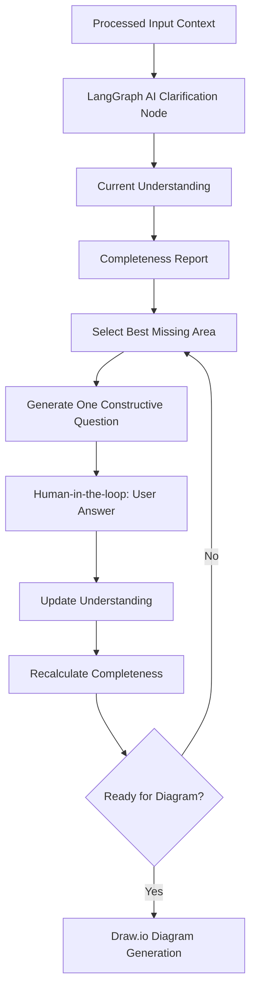
---
## 14. LangGraph Architecture Requirement

The project must use LangGraph.js as the orchestration layer.

The frontend must be prepared like this:

```text
Typed state:
Use TypeScript types for every important object, such as input, questions, answers, understanding, Draw.io XML, final Markdown, image exports, and artifact bundles.

Central store:
Keep the Layer 1 workflow data in one controlled store instead of spreading it randomly across components.

LangGraph graph:
Create a real Layer 1 graph that controls the workflow order, branching, retries, and human-in-the-loop pauses.

LangGraph nodes:
Each major function must be represented as a graph node, such as input processing, AI question generation, understanding update, completeness check, diagram generation, AI diagram refinement, final documentation generation, and artifact bundle creation.

LangGraph tools:
Reusable operations should be implemented as tools or tool-like server utilities, such as text normalization, chunking, AI calls, XML validation, diagram export, Markdown generation, and artifact preparation.

Zod schemas:
Validate AI responses and important data structures before saving them in the store.

Clear workflow stages:
Represent the flow as explicit stages: input, processing, clarification, understanding, diagram, diagram_review, final_docs, export.

AI output validation:
Never trust raw AI output directly. Validate questions, understanding updates, diagram generation responses, diagram refinement responses, Markdown responses, and Draw.io XML before using them.

Approved Layer 1 artifact bundle:
After the diagram is approved, create the final bundle of Markdown, Draw.io XML, diagram image, and optional summary. This bundle is what future Layer 2 will take as input.
```

Recommended graph sequence:

```text
receive_input
→ process_input
→ generate_question
→ wait_for_user_answer
→ update_understanding
→ check_completeness
→ if incomplete: generate_question
→ if complete: generate_drawio_xml
→ review_diagram
→ refine_diagram if needed
→ approve_diagram
→ generate_final_markdown
→ create_layer1_artifact_bundle
→ export_files
```

---

## 15. Future Layer 2 and Layer 3 Readiness

Layer 2 and Layer 3 are future layers.

Correct future order:

```text
Layer 1 approved artifact bundle
→ Layer 2 Abstract Logic
→ Layer 3 Code Machine
```

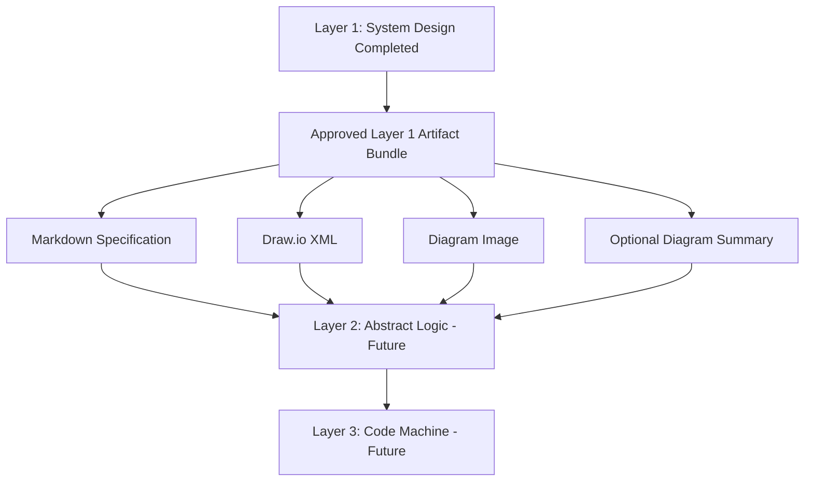

For this phase:

```text
Layer 1 produces the real output.
Layer 2 later takes the approved Layer 1 artifact bundle as input.
Layer 3 later takes Layer 2 output as input.
```

---

## 16. Environment Rules

Local environment variables must stay in:

```text
.env.local
```

The example file committed to the repository should be:

```text
.env.example
```

No real secrets should be committed.

The following Mujarrad variables belong to the original frontend/backend setup:

```text
NEXT_PUBLIC_API_URL
NEXT_PUBLIC_AGENT_SERVICE_URL
```

They should remain as already configured in local and deployment environments.

System Design should not force contributors to expose or rewrite those values.

Current `.env.example` structure:

```env
# Existing Mujarrad frontend variables
# Keep these as configured in the original frontend/deployment environment.
# Do not commit real secrets or personal local values here.
NEXT_PUBLIC_API_URL=
NEXT_PUBLIC_AGENT_SERVICE_URL=

# Server-side AI provider key for System Design
# Do not expose this as NEXT_PUBLIC_ because it must stay server-side only.
OPENROUTER_API_KEY=

# Optional model override for System Design
SYSTEM_BUILDER_MODEL=google/gemini-2.0-flash-001

# Optional legacy server-side transcription provider key
# The active voice path uses local open-source Whisper in the browser.
# Keep this only if the legacy /api/system-builder/transcribe route is used later.
OPENAI_API_KEY=

# Optional legacy transcription model override
SYSTEM_BUILDER_TRANSCRIPTION_MODEL=whisper-1

# LangGraph execution mode
# In this phase, LangGraph runs inside the Next.js server/runtime.
SYSTEM_DESIGN_ORCHESTRATOR=langgraph

# System Design feature flags
NEXT_PUBLIC_SYSTEM_BUILDER_MODE=api
NEXT_PUBLIC_ENABLE_LAYER_2=false
NEXT_PUBLIC_ENABLE_LAYER_3=false
```

AI provider keys must stay server-side. The active voice transcription path does not require a paid transcription key.

Correct:

```text
OPENROUTER_API_KEY
OPENAI_API_KEY
```

Wrong:

```text
NEXT_PUBLIC_OPENROUTER_API_KEY
NEXT_PUBLIC_OPENAI_API_KEY
```

---

## 17. Frontend Architecture Goal

The System Design implementation should be built as a professional feature module orchestrated by LangGraph.

Recommended feature path:

```text
src/features/system-design/
```

This keeps the new work isolated from existing frontend modules.

Existing components under:

```text
src/components/system-builder/
```

can remain as wrappers or reusable low-level components when needed.

The frontend UI should not contain final orchestration logic. The UI should collect input, display workflow state, show questions, show diagrams, show final docs, and call API routes.

The API routes should invoke the LangGraph graph on the server side.

---

## 18. Frontend and LangGraph Architecture Overview

This diagram shows the frontend module architecture and the LangGraph execution path.

```mermaid
flowchart TD
    Route[app/system-builder/page.tsx]
    Wrapper[src/components/system-builder/SystemBuilder.tsx]
    Shell[SystemDesignShell]
    Header[SystemDesignHeader]
    LayerNav[LayerNavigation]
    StepNav[Layer1StepNavigation]

    Route --> Wrapper
    Wrapper --> Shell
    Shell --> Header
    Shell --> LayerNav
    Shell --> StepNav

    Shell --> L1[Layer 1: System Design UI]

    L1 --> Input[Layer1InputPanel]
    Input --> Layer1API[/api/system-builder/layer1]
    Layer1API --> LocalTool[inputProcessingTool through Task 3 runtime]
    Input --> LocalWhisper[Local Whisper Browser Transcription]
    LocalWhisper --> Transcript[Transcript Text]
    Transcript --> Input

    LocalTool --> Processed[ProcessedInputContext]

    Processed --> Runtime[LangGraph Runtime]

    Runtime --> Graph[LangGraph Layer 1 Graph]
    Graph --> N1[Input Processing Node]
    N1 --> N2[AI Question Generation Node]
    N2 --> N3[Human Answer Wait State]
    N3 --> N4[Understanding Update Node]
    N4 --> N5[Completeness Check Node]
    N5 --> N2
    N5 --> N6[Draw.io XML Generation Node]
    N6 --> N7[Diagram Review Workspace]
    N7 --> N8[AI Diagram Refinement Node]
    N8 --> N7
    N7 --> N9[Final Documentation Node]
    N9 --> N10[Artifact Bundle Node]

    N10 --> Bundle[Approved Layer 1 Artifact Bundle]
    Bundle --> Bundle1[Markdown Spec]
    Bundle --> Bundle2[Draw.io XML]
    Bundle --> Bundle3[Diagram Image]
    Bundle --> Bundle4[Optional Diagram Summary]
```

---

## 19. Recommended Folder Structure

```text
src/features/system-design/
├── components/
│   ├── SystemDesignShell.tsx
│   ├── SystemDesignHeader.tsx
│   ├── LayerNavigation.tsx
│   ├── Layer1Shell.tsx
│   ├── Layer1StepNavigation.tsx
│   ├── Layer1InputPanel.tsx
│   ├── InputProcessingStatus.tsx
│   ├── Layer1QuestionLoop.tsx
│   ├── QuestionCard.tsx
│   ├── QuestionHistory.tsx
│   ├── Layer1UnderstandingPanel.tsx
│   ├── Layer1CompletenessPanel.tsx
│   ├── Layer1DiagramStep.tsx
│   ├── Layer1DiagramReview.tsx
│   ├── Layer1DiagramRefinement.tsx
│   ├── DiagramRevisionHistory.tsx
│   ├── Layer1FinalDocsStep.tsx
│   ├── Layer1ExportStep.tsx
│   ├── Layer2Locked.tsx
│   └── Layer3Locked.tsx
│
├── config/
│   └── systemDesignConfig.ts
│
├── graphs/
│   ├── layer1Graph.ts
│   ├── layer1GraphState.ts
│   ├── layer1GraphEdges.ts
│   └── layer1GraphRunner.ts
│
├── nodes/
│   ├── processInputNode.ts
│   ├── generateQuestionNode.ts
│   ├── updateUnderstandingNode.ts
│   ├── checkCompletenessNode.ts
│   ├── generateDiagramNode.ts
│   ├── refineDiagramNode.ts
│   ├── generateFinalDocsNode.ts
│   └── createArtifactBundleNode.ts
│
├── tools/
│   ├── aiProviderTool.ts
│   ├── inputProcessingTool.ts
│   ├── transcriptionTool.ts optional legacy server transcription helper
│   ├── xmlValidationTool.ts
│   ├── markdownSpecTool.ts
│   ├── drawioExportTool.ts
│   └── artifactBundleTool.ts
│
├── prompts/
│   ├── constructiveQuestionPrompt.ts
│   ├── understandingUpdatePrompt.ts
│   ├── completenessPrompt.ts
│   ├── diagramGenerationPrompt.ts
│   ├── diagramRefinementPrompt.ts
│   └── finalDocumentationPrompt.ts
│
├── schemas/
│   ├── input.schema.ts
│   ├── layer1.schema.ts
│   └── graph.schema.ts
│
├── stores/
│   └── useLayer1Store.ts
│
├── types/
│   ├── input.types.ts
│   ├── layer1.types.ts
│   ├── layer2.types.ts
│   ├── layer3.types.ts
│   └── graph.types.ts
│
└── utils/
    ├── completeness.ts
    ├── contextCompression.ts
    ├── downloadFile.ts
    ├── drawioXml.ts
    ├── exportLayer1.ts
    ├── id.ts
    ├── inputNormalization.ts
    ├── markdownSpec.ts
    ├── questionCategories.ts
    ├── questionSelection.ts
    ├── textChunking.ts
    ├── updateUnderstanding.ts
    └── localWhisperTranscription.ts
```

API route folder additions:

```text
app/api/system-builder/transcribe/route.ts
app/api/system-builder/layer1/route.ts
app/api/system-builder/layer1/answer/route.ts
app/api/system-builder/layer1/generate-diagram/route.ts
app/api/system-builder/layer1/refine-diagram/route.ts
app/api/system-builder/layer1/final-docs/route.ts
app/api/system-builder/layer1/export/route.ts
```

---

## 20. Route Strategy

The planned route is:

```text
/system-builder
```

Keep this route for now to avoid breaking navigation.

The page title and UI should use:

```text
System Design
```

The route file should stay:

```text
app/system-builder/page.tsx
```

Current implementation:

```tsx
import { SystemBuilder } from '@/components/system-builder/SystemBuilder';

export const metadata = {
  title: 'System Design — Mujarrad',
};

export default function SystemBuilderPage() {
  return <SystemBuilder />;
}
```

`SystemBuilder.tsx` is a compatibility wrapper:

```tsx
'use client';

import { SystemDesignShell } from '@/features/system-design/components/SystemDesignShell';

export function SystemBuilder() {
  return <SystemDesignShell />;
}
```

The UI should call API routes for server operations. API routes should invoke the LangGraph graph. Components should not run LangGraph directly in the browser.

---

## 21. Layer Shell Architecture

The System Design page visually contains three layers:

```text
Layer 1: System Design
Layer 2: Abstract Logic
Layer 3: Code Machine
```

Only Layer 1 is active in this phase.

Layer 2 and Layer 3 are shown as compact future layer cards.

Layer 2 and Layer 3 duplicated right-side cards were removed in Task 2 to reduce visual clutter.

Layer 2 and Layer 3 should show that they are future stages.

Layer 2 must not appear as if it starts from understanding, documentation generation, or diagram generation. It starts only after the approved Layer 1 artifact bundle exists.

---

## 22. Layer Shell UI Concept

This diagram describes the UI layout and progression.

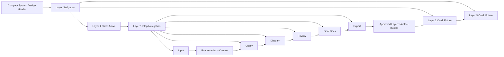

Current layout:

```text
Top: Compact System Design header
Below: Compact three-layer navigation/cards
Below: Layer 1 internal step navigation
Main area: Selected Layer 1 step content
```

Task 2 UI decisions:

```text
Keep UI compact.
Avoid long explanatory text in the interface.
Show only useful status information.
Keep input tools inside the composer.
Keep future Layer 2 and Layer 3 visible without duplicating cards in the main content.
```

---

## 23. Layer 1 Workflow Stages

Layer 1 should be controlled by explicit workflow stages.

Recommended final UI stepper:

```text
1. Input
2. Clarify
3. Diagram
4. Review
5. Final Docs
6. Export
```

Correct behavior:

```text
Only Input is open on initial load.
Clarify opens after input processing.
Diagram opens after the AI questioning/understanding loop is complete.
Review opens after generated Draw.io XML is loaded.
Final Docs opens after diagram approval.
Export opens after final docs and artifact bundle are ready.
Completed steps remain clickable.
Available next step is clickable.
Locked later steps are disabled.
```

Recommended final stage type:

```ts
export type Layer1Stage =
  | 'input'
  | 'input_processing'
  | 'clarification'
  | 'understanding'
  | 'diagram'
  | 'diagram_review'
  | 'final_docs'
  | 'export';
```

The stage shown in the UI must come from LangGraph state or from a store synchronized with the LangGraph result.

Examples:

```text
Cannot open Clarification before input is processed.
Cannot open Diagram before the clarification loop is complete.
Cannot open Final Docs before the diagram is approved.
Cannot export before final artifacts exist.
```

---

## 24. Layer 1 LangGraph State Machine

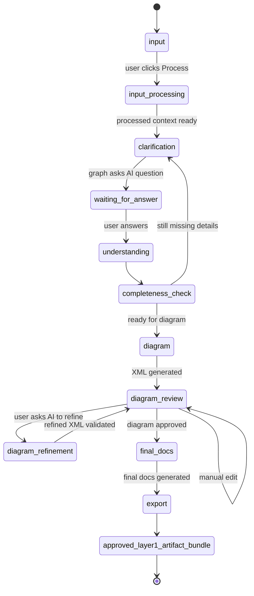

---

## 25. Core State Model

Layer 1 should use typed state shared between the LangGraph graph and the frontend store.

Recommended store file:

```text
src/features/system-design/stores/useLayer1Store.ts
```

Recommended graph state file:

```text
src/features/system-design/graphs/layer1GraphState.ts
```

Recommended state:

```ts
export interface Layer1Run {
  id: string;
  createdAt: string;
  updatedAt: string;
  stage: Layer1Stage;

  rawInputs: RawInputPayload[];
  processedInput: ProcessedInputContext | null;

  questions: ConstructiveQuestion[];
  qaHistory: QuestionAnswer[];

  understanding: SystemUnderstanding;
  completeness: CompletenessReport | null;

  drawioXml: string;
  diagramImage?: {
    format: 'png' | 'svg';
    dataUrl?: string;
    fileName?: string;
  };

  diagramSummary: string;
  diagramApproved: boolean;
  diagramRevisions: DiagramRevision[];

  markdownSpec: string;

  approvedLayer1Artifacts?: Layer1ArtifactBundle;

  errors: Layer1Error[];
}
```

Recommended artifact bundle type:

```ts
export interface Layer1ArtifactBundle {
  markdownSpec: string;
  drawioXml: string;
  diagramImage?: {
    format: 'png' | 'svg';
    dataUrl?: string;
    fileName?: string;
  };
  diagramSummary?: string;
  approvedAt: string;
}
```

---

## 26. System Understanding Model

The system understanding should become a structured object.

Recommended shape:

```ts
export interface SystemUnderstanding {
  summary: string;
  goal: string;
  primaryUsers: string[];
  secondaryUsers: string[];
  roles: string[];
  permissions: string[];
  workflows: WorkflowDescription[];
  alternativeWorkflows: WorkflowDescription[];
  inputs: SystemInput[];
  outputs: SystemOutput[];
  entities: SystemEntity[];
  businessRules: BusinessRule[];
  decisionLogic: DecisionRule[];
  validationRules: ValidationRule[];
  edgeCases: EdgeCase[];
  errorCases: ErrorCase[];
  integrations: IntegrationPoint[];
  notifications: NotificationRule[];
  reporting: ReportingRequirement[];
  security: SecurityRequirement[];
  openQuestions: string[];
  assumptions: string[];
  confidence: number;
}
```

This model helps create a complete diagram and final Layer 1 documentation.

---

## 27. System Understanding Concept

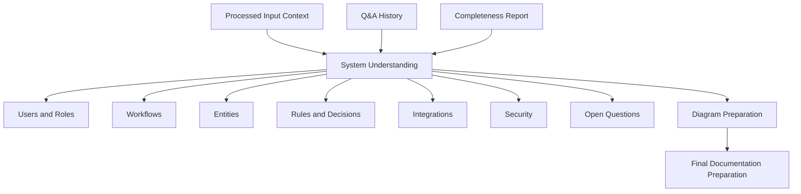

---

## 28. Constructive Question Model

Every AI question should be traceable.

Recommended shape:

```ts
export interface ConstructiveQuestion {
  id: string;
  question: string;
  category: QuestionCategory;
  reasonForAsking: string;
  basedOn: {
    processedInputId?: string;
    chunkIds?: string[];
    previousQuestionIds?: string[];
    previousAnswerIds?: string[];
    understandingFields?: string[];
    missingCategories?: string[];
  };
  expectedAnswerType:
    | 'short_text'
    | 'long_text'
    | 'list'
    | 'yes_no'
    | 'choice'
    | 'number'
    | 'structured';
  options?: string[];
  createdAt: string;
  answeredAt?: string;
  answer?: string;
  skipped?: boolean;
}
```

---

## 29. Question Categories

Recommended categories:

```ts
export type QuestionCategory =
  | 'goal'
  | 'users'
  | 'roles_permissions'
  | 'workflow'
  | 'alternative_workflows'
  | 'inputs'
  | 'outputs'
  | 'entities'
  | 'business_rules'
  | 'decision_logic'
  | 'validations'
  | 'edge_cases'
  | 'error_handling'
  | 'integrations'
  | 'security'
  | 'notifications'
  | 'reporting'
  | 'diagram_preparation'
  | 'layer1_artifact_preparation';
```

---

## 30. Completeness Model

The system should calculate whether the current understanding is ready for diagram generation.

Recommended shape:

```ts
export interface CompletenessReport {
  overallScore: number;
  readyForDiagram: boolean;
  readyForFinalDocs: boolean;
  categories: CompletenessCategoryStatus[];
  missingCriticalItems: string[];
  weakItems: string[];
  suggestedNextQuestionCategory?: QuestionCategory;
}
```

Each category can have this status:

```ts
export type CompletenessStatus =
  | 'complete'
  | 'weak'
  | 'missing'
  | 'not_applicable';
```

---

## 31. Completeness Decision Diagram

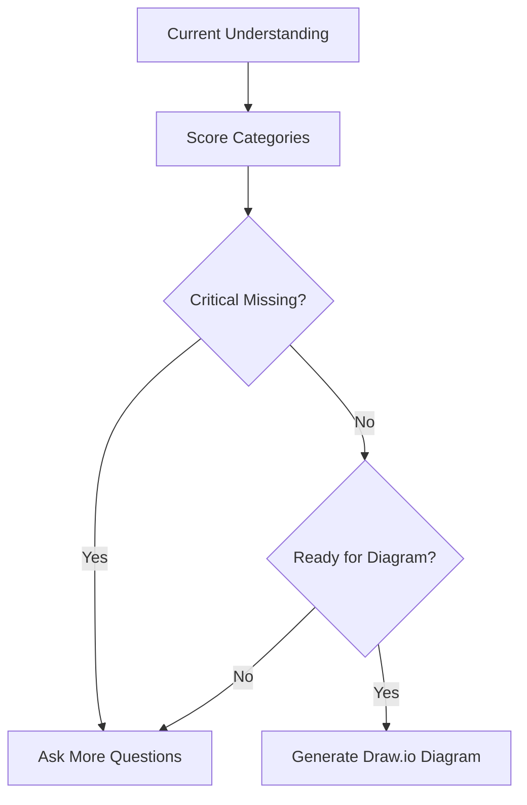

---

## 32. Future Layer 2 and Layer 3 Type Placeholders

Layer 2 and Layer 3 are future layers, but future input placeholder types should exist.

Layer 2 expected input must be the approved Layer 1 artifact bundle.

Recommended files:

```text
src/features/system-design/types/layer2.types.ts
src/features/system-design/types/layer3.types.ts
```

Layer 2 placeholder:

```ts
export interface Layer2ExpectedInput {
  sourceLayer: 1;
  layer1Artifacts: {
    markdownSpec: string;
    drawioXml: string;
    diagramImage?: {
      format: 'png' | 'svg';
      dataUrl?: string;
    };
    diagramSummary?: string;
  };
}
```

Layer 3 placeholder:

```ts
export interface Layer3ExpectedInput {
  sourceLayer: 2;
  abstractLogicGraph: unknown;
  validatedRules: unknown;
  codeGenerationPlan: unknown;
}
```

These placeholders help contributors understand the future pipeline without implementing Layer 2 or Layer 3 now.

---

## 33. Internal Layer 1 State for Traceability

There may be internal structured state for traceability and future integration, but the user-facing export remains Markdown, XML, and diagram files.

Recommended internal shape:

```ts
export interface Layer1InternalStateForFutureUse {
  runId: string;

  rawInputs: RawInputPayload[];
  processedInput: ProcessedInputContext;

  qaHistory: QuestionAnswer[];
  systemUnderstanding: SystemUnderstanding;
  completenessReport: CompletenessReport;

  approvedArtifacts: Layer1ArtifactBundle;

  traceability: {
    questions: ConstructiveQuestion[];
    textChunks: TextChunk[];
    diagramRevisions: DiagramRevision[];
  };

  createdAt: string;
}
```

Important:

```text
This is internal application state.
It is not a downloadable JSON export in the current phase.
User-facing exports are Markdown, XML, and diagram images.
```

---

## 34. Handoff Traceability Concept

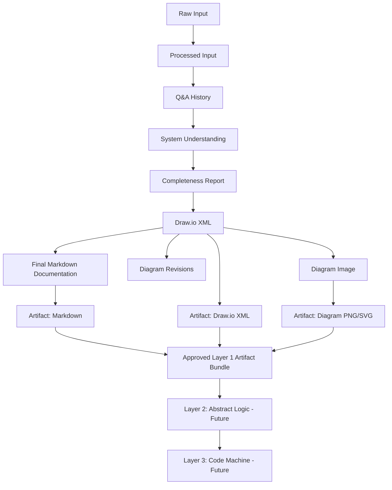

---

## 35. Zod Schema Rules

Zod schemas should validate critical structures.

A Zod schema is a rule that checks whether data has the correct shape before the app uses it.

In this project, Zod is important because AI output can be messy or wrong. Before saving AI output into the app state, it must be validated.

Recommended files:

```text
src/features/system-design/schemas/input.schema.ts
src/features/system-design/schemas/layer1.schema.ts
src/features/system-design/schemas/graph.schema.ts
```

Schemas should cover:

```text
RawInputPayload
ProcessedInputContext
ConstructiveQuestion
SystemUnderstanding
CompletenessReport
Layer1ArtifactBundle
Layer1InternalStateForFutureUse
Layer1GraphState
DiagramGenerationRequest
DiagramGenerationResponse
DiagramRefinementRequest
DiagramRefinementResponse
FinalDocumentationRequest
FinalDocumentationResponse
```

The purpose is to prevent invalid AI output or broken graph state from moving through the workflow.

---

## 36. LangGraph Orchestration Design

Layer 1 should be implemented through a real LangGraph graph.

Recommended file:

```text
src/features/system-design/graphs/layer1Graph.ts
```

Recommended graph state file:

```text
src/features/system-design/graphs/layer1GraphState.ts
```

Recommended graph runner file:

```text
src/features/system-design/graphs/layer1GraphRunner.ts
```

The graph should control:

```text
workflow order
conditional branching
human-in-the-loop pauses
retry paths
AI output validation
diagram refinement loops
final documentation generation
artifact bundle creation
```

Recommended graph nodes:

```text
receive_input
process_input
generate_question
wait_for_user_answer
update_understanding
check_completeness
generate_drawio_xml
review_diagram
refine_diagram
approve_diagram
generate_final_markdown
create_layer1_artifact_bundle
export_files
```

The UI should not decide the orchestration path alone. The UI should send user actions to API routes, and API routes should invoke the graph.

---

## 37. LangGraph Graph Pattern

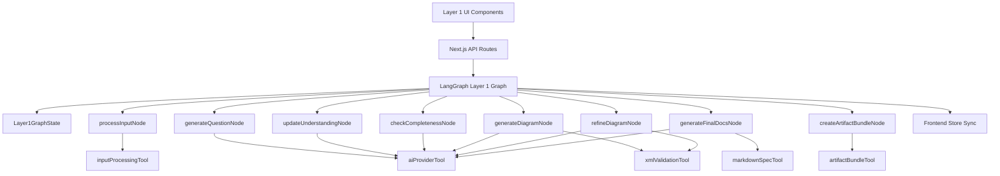

Rules:

```text
UI components must not own the full workflow logic.
The LangGraph graph controls the workflow.
The store reflects graph state for the UI.
Nodes represent major workflow steps.
Tools represent reusable operations.
API routes keep AI provider keys server-side.
Final user-facing exports are Markdown, XML, and diagram images.
```

---

## 38. LangGraph Server Runtime

LangGraph must run inside the Next.js server/runtime for this phase.

Recommended API route style:

```text
app/api/system-builder/layer1/route.ts
app/api/system-builder/layer1/answer/route.ts
app/api/system-builder/layer1/generate-diagram/route.ts
app/api/system-builder/layer1/refine-diagram/route.ts
app/api/system-builder/layer1/final-docs/route.ts
app/api/system-builder/layer1/export/route.ts
```

Legacy optional transcription route:

```text
app/api/system-builder/transcribe/route.ts
```

The active voice input path uses local open-source Whisper in the browser through `@xenova/transformers`.

Recommended responsibilities:

```text
API route receives UI request.
API route validates request body.
API route invokes LangGraph graph runner.
Graph runner executes graph nodes/tools.
Graph returns validated state or next UI instruction.
API route returns safe response to browser.
```

The browser must not call the AI provider directly.

The browser must not access:

```text
OPENROUTER_API_KEY
OPENAI_API_KEY
```

`OPENROUTER_API_KEY` must stay server-side only.

`OPENAI_API_KEY` is not required for the active voice path. It is only relevant if the optional legacy `/api/system-builder/transcribe` route is used again later.

The active voice path currently uses local Whisper browser transcription and then sends the resulting text through `/api/system-builder/layer1`. The workflow state is controlled by the Task 3 graph/store runtime.

---

## 39. LangGraph Dependency Status

LangGraph.js is a required dependency for this project and must be used as the orchestration layer for the System Design workflow.

Installed packages:

```text
@langchain/langgraph
@langchain/core
@xenova/transformers
```

`@xenova/transformers` is used for local open-source browser transcription in the System Design input composer.

These dependencies are stored in:

```text
package.json
package-lock.json
```

Contributors only need to run:

```bash
npm install
```

to install the same dependencies.

---

## 40. LangGraph State Definition

Create or extend:

```text
src/features/system-design/graphs/layer1GraphState.ts
```

The graph state should include:

```ts
export interface Layer1GraphState {
  runId: string;
  stage: Layer1Stage;

  rawInputs: RawInputPayload[];
  processedInput: ProcessedInputContext | null;

  currentQuestion: ConstructiveQuestion | null;
  questions: ConstructiveQuestion[];
  qaHistory: QuestionAnswer[];

  understanding: SystemUnderstanding;
  completeness: CompletenessReport | null;

  drawioXml: string;
  diagramSummary: string;
  diagramApproved: boolean;
  diagramRevisions: DiagramRevision[];

  markdownSpec: string;

  approvedLayer1Artifacts?: Layer1ArtifactBundle;

  nextAction:
    | 'process_input'
    | 'ask_question'
    | 'wait_for_answer'
    | 'update_understanding'
    | 'check_completeness'
    | 'generate_diagram'
    | 'wait_for_diagram_review'
    | 'refine_diagram'
    | 'approve_diagram'
    | 'generate_final_docs'
    | 'create_artifact_bundle'
    | 'complete'
    | 'error';

  errors: Layer1Error[];
}
```

The graph state is the source of truth for Layer 1 execution.

The frontend store should mirror this state only for UI display and interaction.

---

## 41. LangGraph Nodes

Create or extend:

```text
src/features/system-design/nodes/processInputNode.ts
src/features/system-design/nodes/generateQuestionNode.ts
src/features/system-design/nodes/updateUnderstandingNode.ts
src/features/system-design/nodes/checkCompletenessNode.ts
src/features/system-design/nodes/generateDiagramNode.ts
src/features/system-design/nodes/refineDiagramNode.ts
src/features/system-design/nodes/generateFinalDocsNode.ts
src/features/system-design/nodes/createArtifactBundleNode.ts
```

Node responsibilities:

```text
processInputNode:
Normalize text, estimate size, chunk/compress when needed, return ProcessedInputContext.

generateQuestionNode:
Use current graph state to generate exactly one constructive question.

updateUnderstandingNode:
Merge the latest answer into the structured system understanding.

checkCompletenessNode:
Decide whether more questions are needed or the graph can continue to diagram generation.

generateDiagramNode:
Generate Draw.io XML from the full Layer 1 context after clarification is complete.

refineDiagramNode:
Use AI to refine the current Draw.io XML using the user instruction and current diagram state.

generateFinalDocsNode:
Generate the final Markdown documentation after the diagram is approved.

createArtifactBundleNode:
Create the approved Layer 1 artifact bundle containing Markdown, XML, diagram image, and optional summary.
```

Every node should return a partial graph state update, not random UI data.

---

## 42. LangGraph Tools

Create or extend:

```text
src/features/system-design/tools/aiProviderTool.ts
src/features/system-design/tools/inputProcessingTool.ts
src/features/system-design/tools/transcriptionTool.ts
src/features/system-design/tools/xmlValidationTool.ts
src/features/system-design/tools/markdownSpecTool.ts
src/features/system-design/tools/drawioExportTool.ts
src/features/system-design/tools/artifactBundleTool.ts
```

Tool responsibilities:

```text
aiProviderTool:
Server-side wrapper for AI calls through OpenRouter or another provider.

inputProcessingTool:
Normalize, estimate, chunk, compress, and prepare processed context.

transcriptionTool:
Optional legacy helper for server-side transcription. The current active voice path uses localWhisperTranscription.ts with @xenova/transformers in the browser.

xmlValidationTool:
Extract, sanitize, validate, repair, or reject Draw.io XML.

markdownSpecTool:
Build and validate final Markdown documentation after diagram approval.

drawioExportTool:
Prepare XML/image export behavior and connect with Draw.io output.

artifactBundleTool:
Create the final approved Layer 1 artifact bundle.
```

Tools must be deterministic where possible.

AI-dependent tools must validate output before returning it to the graph.

---

## 43. AI Prompt Files

Prompts should be stored separately so contributors do not hide prompt logic inside components or graph nodes.

Recommended prompt files:

```text
src/features/system-design/prompts/constructiveQuestionPrompt.ts
src/features/system-design/prompts/understandingUpdatePrompt.ts
src/features/system-design/prompts/completenessPrompt.ts
src/features/system-design/prompts/diagramGenerationPrompt.ts
src/features/system-design/prompts/diagramRefinementPrompt.ts
src/features/system-design/prompts/finalDocumentationPrompt.ts
```

Prompt files should export functions because prompts need context.

Example:

```ts
export function buildConstructiveQuestionPrompt(input: BuildQuestionPromptInput): string {
  return `
You are helping design a software system.

Processed input summary:
${input.processedInput.compressedSummary}

Current understanding:
${JSON.stringify(input.understanding, null, 2)}

Previous Q&A:
${JSON.stringify(input.qaHistory, null, 2)}

Completeness gaps:
${JSON.stringify(input.completeness, null, 2)}

Ask exactly one constructive next question.
Return structured JSON only.
`;
}
```

Layer 1 has two main AI areas:

```text
AI Area 1:
Constructive questioning, understanding update, and completeness reasoning.

AI Area 2:
Draw.io diagram generation and diagram refinement from current XML.
```

Final documentation generation can also use the AI provider, but it must be treated as a final artifact generation step after diagram approval, not as a gate before diagram generation.

---

## 44. AI Output Validation Flow

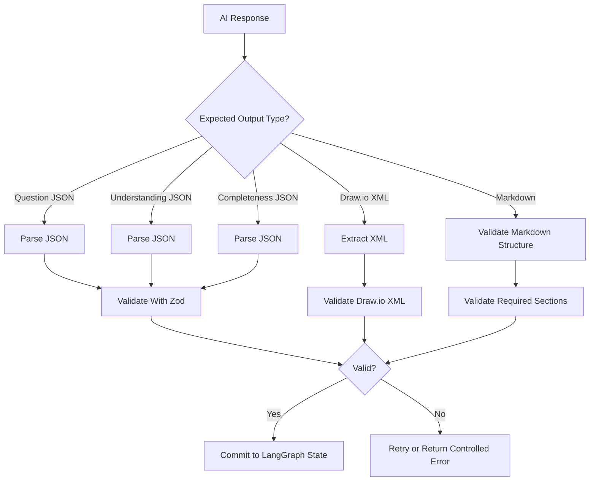

AI output should never be blindly trusted.

Validation is required before saving generated questions, system understanding, completeness reports, Draw.io XML, refined XML, Markdown docs, or artifact bundles.

---

## 45. API Route Strategy

Recommended API routes:

```text
app/api/system-builder/layer1/route.ts
app/api/system-builder/layer1/answer/route.ts
app/api/system-builder/layer1/generate-diagram/route.ts
app/api/system-builder/layer1/refine-diagram/route.ts
app/api/system-builder/layer1/final-docs/route.ts
app/api/system-builder/layer1/export/route.ts
```

These routes should invoke LangGraph graph actions.

Recommended mapping:

```text
POST /api/system-builder/layer1
→ start or continue Layer 1 graph

POST /api/system-builder/layer1/answer
→ submit human answer and continue graph

POST /api/system-builder/layer1/generate-diagram
→ generate Draw.io XML through graph node

POST /api/system-builder/layer1/refine-diagram
→ refine current diagram XML through graph node

POST /api/system-builder/layer1/final-docs
→ generate final Markdown documentation after diagram approval

POST /api/system-builder/layer1/export
→ create approved Layer 1 artifact bundle
```

The existing route namespace can stay stable, but the orchestration should move to the LangGraph graph.

---

## 46. Diagram API Payload

Recommended diagram generation request:

```ts
export interface DiagramGenerationRequest {
  mode: 'generate';

  processedInput: ProcessedInputContext;

  qaHistory: QuestionAnswer[];
  systemUnderstanding: SystemUnderstanding;
  completenessReport: CompletenessReport;
}
```

Recommended diagram generation response:

```ts
export interface DiagramGenerationResponse {
  xml: string;
  summary: string;
  warnings: string[];
}
```

Recommended diagram refinement request:

```ts
export interface DiagramRefinementRequest {
  mode: 'refine';

  currentXml: string;
  refinementInstruction: string;

  processedInput: ProcessedInputContext;
  qaHistory: QuestionAnswer[];
  systemUnderstanding: SystemUnderstanding;
  completenessReport: CompletenessReport;
  revisionHistory: DiagramRevision[];
}
```

Recommended diagram refinement response:

```ts
export interface DiagramRefinementResponse {
  xml: string;
  summary: string;
  warnings: string[];
}
```

These requests should be handled by LangGraph diagram nodes, not directly by UI components.

---

## 47. Draw.io Integration Rules

Recommended approach:

```text
Use DrawioEmbed as the low-level iframe component.
Move Layer 1 workflow UI into src/features/system-design/components.
Pass XML into DrawioEmbed.
Listen to onXmlChange.
Store latest XML in Layer 1 store.
Send refinement requests back through LangGraph.
Export final XML and diagram image.
```

Draw.io should support:

```text
Load generated XML
Manual editing
Export/save current XML
AI refinement using current XML
Revision history
Approval before final documentation/export
```

---

## 48. Draw.io Workflow Diagram

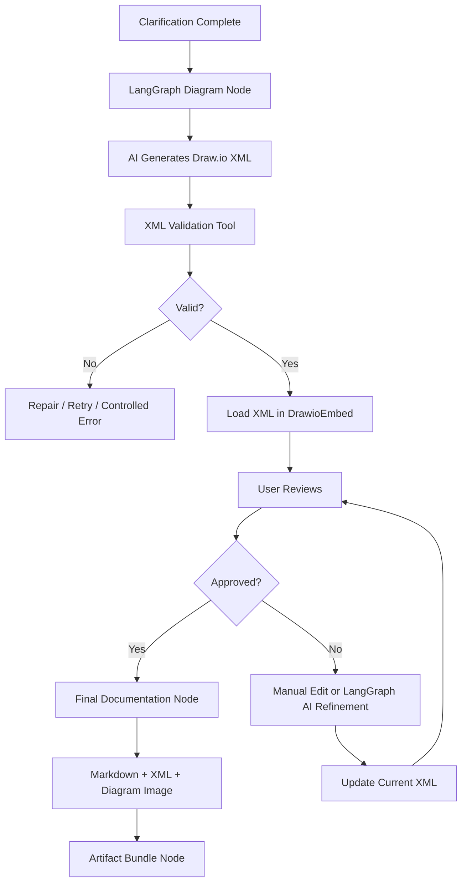

---

## 49. Draw.io XML Utilities

Create:

```text
src/features/system-design/utils/drawioXml.ts
```

Recommended functions:

```ts
export function extractMxGraphModel(raw: string): string;
export function sanitizeDrawioXml(xml: string): string;
export function validateDrawioXml(xml: string): DrawioValidationResult;
export function ensureMxGraphRoot(xml: string): string;
export function createEmptyDrawioXml(): string;
```

These utilities should protect the app from broken AI XML output.

The LangGraph diagram node and refinement node should call these utilities before storing XML.

---

## 50. Final Markdown Documentation Generation

Create:

```text
src/features/system-design/utils/markdownSpec.ts
```

The final Markdown specification is generated after diagram approval.

It should be based on:

```text
processed input
Q&A history
system understanding
completeness report
approved Draw.io XML
diagram summary
diagram revisions when useful
```

The final Markdown specification should follow this structure:

```markdown
# System Design Specification

## 1. System Overview

## 2. Source Input Summary

## 3. Main Goal

## 4. Users and Roles

## 5. Core Workflow

## 6. Alternative Workflows

## 7. Inputs

## 8. Outputs

## 9. Data Objects / Entities

## 10. Business Rules

## 11. Decision Logic

## 12. Validations

## 13. Edge Cases

## 14. Error Handling

## 15. Integrations

## 16. Security and Permissions

## 17. Notifications

## 18. Reporting / Logging

## 19. Diagram Explanation

## 20. Open Questions

## 21. Future Layer 2 Preparation
```

Existing markdown components may be reused where suitable:

```text
src/components/markdown/MarkdownEditor.tsx
src/components/markdown/MarkdownRenderer.tsx
```

---

## 51. Diagram to Final Documentation Flow

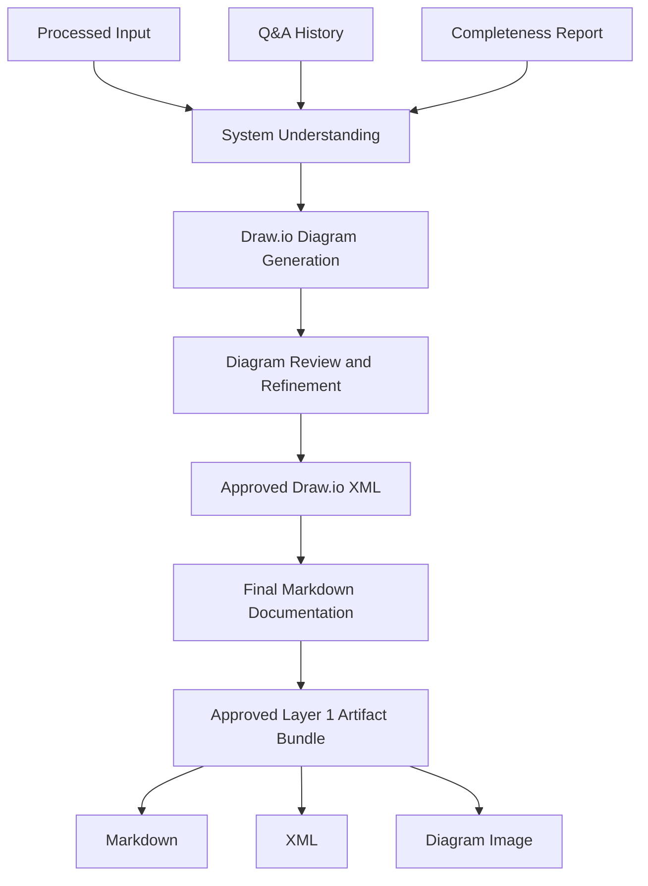

---

## 52. Export Requirements

Layer 1 must export user-facing files:

```text
final-system-spec.md
system-diagram.drawio.xml
system-diagram.png or system-diagram.svg
optional system-diagram-summary.md
```

There should be no user-facing JSON export in this phase.

Create:

```text
src/features/system-design/components/Layer1ExportStep.tsx
src/features/system-design/utils/exportLayer1.ts
src/features/system-design/utils/downloadFile.ts
```

The export step should include:

```text
Download Markdown Spec
Download Draw.io XML
Download Diagram Image
Download Diagram Summary if available
```

---

## 53. Export Package Diagram

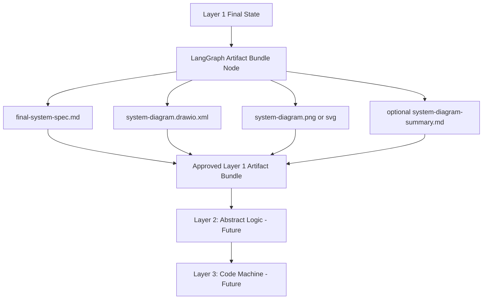

---

## 54. Traceability Requirements

The internal state should preserve traceability even if JSON is not exported to the user.

It should track:

```text
Which input started the process
Whether the input was typed, pasted, transcribed, or file-based
How the input was processed
Which questions were asked
Why each question was asked
Which answers were given
Which completeness gaps existed
Which diagram revisions happened
Which final artifacts were produced
Which LangGraph nodes produced each major result
```

This is important because future Layer 2 logic will depend on understanding how the approved Layer 1 artifact bundle was created.

---

## 55. Layer 1 Implementation Tasks

Layer 1 is now divided into **eight implementation tasks**.

Task 1, Task 2, and Task 3 have been completed and tested.

Task 1 created the foundation, feature shell, route compatibility, LangGraph dependency setup, and future Layer 2 / Layer 3 placeholders.

Task 2 created the professional input pipeline, compact input UI, text/file/voice ingestion paths, deterministic processing tool, input processing node, traceability types, schemas, and step-gated Layer 1 UI behavior. Voice input was later updated to use local open-source Whisper browser transcription instead of paid server transcription.

Task 3 created the shared Layer 1 runtime foundation, graph/store state model, API route, graph runner, schemas, and store synchronization.

The updated task structure is:

```text
Task 1: Completed — Foundation, environment, feature shell, and LangGraph layout

Task 2: Completed — Input Pipeline, Text/Voice/File Ingestion, Processing UI, Step Gating, and Traceability

Task 3: Completed — LangGraph Core Runtime, State Model, API Routes, Schemas, Nodes, Tools, and Store Sync

Task 4: AI Questions, System Understanding, and Completeness

Task 5: Draw.io Diagram Generation and Editable Diagram Workspace

Task 6: AI Diagram Refinement, Diagram Review, and Diagram Approval

Task 7: Final Documentation Generation and Artifact Bundle

Task 8: Export UI, Tests, Documentation Cleanup, and Deployment Readiness
```

Important rule:

```text
Layer 1 final user-facing outputs are Markdown, Draw.io XML, and diagram images.
Markdown is generated after diagram approval.
Draw.io generation does not depend on Markdown.
```

---

## 56. Updated Task Dependency Order

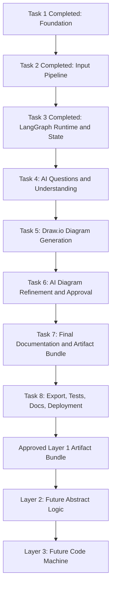

Dependency notes:

```text
Task 1 is completed and should remain as the tested foundation.
Task 2 is completed and should remain as the tested input pipeline.
Task 3 is completed and provides shared graph/store/API contracts.
Task 4 owns the main AI questioning loop, understanding, and completeness.
Task 5 owns initial Draw.io diagram generation and editable diagram workspace.
Task 6 owns the second major AI area: diagram refinement from current XML and user instruction.
Task 7 owns final Markdown documentation and artifact bundle creation.
Task 8 owns export UI, tests, docs, cleanup, and deployment readiness.
```

---

# Task 1 — Completed: Foundation, Environment, Feature Shell, and LangGraph Layout

## Status

```text
Completed
Tested
Merged into feat/system-builder
Pushed to origin/feat/system-builder
```

## Completed Work

```text
LangGraph dependencies installed
Feature folder created
System Design shell created
/system-builder route kept stable
SystemBuilder converted into compatibility wrapper
Layer 1 active card created
Layer 2 future placeholder created
Layer 3 future placeholder created
System Design config created
.env.example updated safely
Existing frontend routes kept stable
```

## Completed Files

```text
package.json
package-lock.json
app/system-builder/page.tsx
src/components/system-builder/SystemBuilder.tsx
src/features/system-design/components/SystemDesignShell.tsx
src/features/system-design/components/SystemDesignHeader.tsx
src/features/system-design/components/LayerNavigation.tsx
src/features/system-design/components/Layer1Shell.tsx
src/features/system-design/components/Layer2Locked.tsx
src/features/system-design/components/Layer3Locked.tsx
src/features/system-design/config/systemDesignConfig.ts
src/features/system-design/graphs/.gitkeep
src/features/system-design/nodes/.gitkeep
src/features/system-design/prompts/.gitkeep
src/features/system-design/schemas/.gitkeep
src/features/system-design/stores/.gitkeep
src/features/system-design/tools/.gitkeep
src/features/system-design/types/.gitkeep
src/features/system-design/utils/.gitkeep
.env.example
```

## Completed File Responsibilities

```text
package.json:
Stores LangGraph and LangChain dependencies.

package-lock.json:
Locks dependency versions.

app/system-builder/page.tsx:
Keeps the /system-builder route stable and sets System Design metadata.

src/components/system-builder/SystemBuilder.tsx:
Compatibility wrapper that points the old System Builder entry to the new System Design feature shell.

src/features/system-design/components/SystemDesignShell.tsx:
Main System Design page shell.

src/features/system-design/components/SystemDesignHeader.tsx:
System Design page header.

src/features/system-design/components/LayerNavigation.tsx:
Displays Layer 1 active, Layer 2 future, and Layer 3 future cards.

src/features/system-design/components/Layer1Shell.tsx:
Initial Layer 1 content shell.

src/features/system-design/components/Layer2Locked.tsx:
Future Layer 2 placeholder.

src/features/system-design/components/Layer3Locked.tsx:
Future Layer 3 placeholder.

src/features/system-design/config/systemDesignConfig.ts:
Shared product/layer/input/export configuration.

src/features/system-design/*/.gitkeep:
Keeps planned feature folders committed before implementation files exist.

.env.example:
Documents safe environment variable names without real secrets.
```

## Verification Completed

```text
/system-builder loads successfully
UI says System Design
Layer 1 is active
Layer 2 is shown as future
Layer 3 is shown as future
Existing routes still build
npm run lint passes with existing warnings only
npm run build passes
git status is clean
```

## Acceptance Criteria Status

```text
LangGraph dependencies are installed: Done
package.json and package-lock.json include LangGraph dependencies: Done
/system-builder loads: Done
UI says System Design: Done
Layer 1 is active: Done
Layer 2 and Layer 3 future placeholders exist: Done
Existing frontend remains stable: Done
No secrets committed: Done
Existing frontend env variables are not removed or renamed: Done
npm run lint passes: Done
npm run build passes: Done
```

---

# Task 2 — Completed: Input Pipeline, Text/Voice/File Ingestion, Processing UI, Step Gating, and Traceability

## Status

```text
Completed
Merged into feat/system-builder
Voice path updated to local open-source Whisper browser transcription.
```

## Goal

Build the professional input foundation before AI questioning starts.

## Completed Work

```text
Input types created
Input schemas created
Text normalization utility created
Text chunking utility created
Context compression placeholder created
ID utility created
Input processing tool created
Input processing node created
Server transcription route created
Transcription tool placeholder/interface created
Compact Layer 1 input composer created
Voice recording added through MediaRecorder
Voice transcription updated to local open-source Whisper browser transcription
@xenova/transformers added for local browser ASR
.txt file upload implemented
Non-.txt file rejection implemented
Smart input status pill implemented
Input source labels implemented
Character count implemented
Estimated token count implemented
Input size label implemented
Chunk count display implemented after processing
Empty input blocking implemented
Short input warning implemented without duplicate large panels
Clear/reset implemented
Layer 1 internal step navigation implemented
Step locking/gating implemented
Input processing auto-opens Clarify step
Completed steps remain clickable
Right-side duplicate Layer 2/3 cards removed
UI made compact and reduced explanatory text
```

## Completed Files

```text
app/api/system-builder/transcribe/route.ts
src/features/system-design/components/SystemDesignShell.tsx
src/features/system-design/components/SystemDesignHeader.tsx
src/features/system-design/components/LayerNavigation.tsx
src/features/system-design/components/Layer1Shell.tsx
src/features/system-design/components/Layer1StepNavigation.tsx
src/features/system-design/components/Layer1InputPanel.tsx
src/features/system-design/components/InputProcessingStatus.tsx
src/features/system-design/types/input.types.ts
src/features/system-design/schemas/input.schema.ts
src/features/system-design/tools/inputProcessingTool.ts
src/features/system-design/tools/transcriptionTool.ts
src/features/system-design/nodes/processInputNode.ts
src/features/system-design/utils/id.ts
src/features/system-design/utils/inputNormalization.ts
src/features/system-design/utils/textChunking.ts
src/features/system-design/utils/contextCompression.ts
src/features/system-design/config/systemDesignConfig.ts
src/features/system-design/utils/localWhisperTranscription.ts
next.config.js
package.json
package-lock.json
.env.example
```

## Completed File Responsibilities

```text
app/api/system-builder/transcribe/route.ts:
Legacy optional server-side transcription route. The current active voice path no longer depends on this route. Voice transcription is now handled locally in the browser through @xenova/transformers.

src/features/system-design/utils/localWhisperTranscription.ts:
Loads and reuses a local Whisper automatic speech recognition pipeline through @xenova/transformers. Converts recorded browser audio into transcript text without a paid transcription API.

next.config.js:
Adds webpack aliases/fallbacks so browser-side @xenova/transformers can build inside Next.js without bundling unsupported native Node binaries such as onnxruntime-node and sharp.

package.json:
Adds @xenova/transformers for local open-source browser transcription.

package-lock.json:
Locks the local transcription dependency tree.

src/features/system-design/components/SystemDesignShell.tsx:
Main compact page shell. Shows header, layer navigation, and full-width Layer 1 workflow.

src/features/system-design/components/SystemDesignHeader.tsx:
Compact System Design header.

src/features/system-design/components/LayerNavigation.tsx:
Compact Layer 1/2/3 navigation cards.

src/features/system-design/components/Layer1Shell.tsx:
Layer 1 step controller for Task 2, later connected to runtime/store in Task 3.

src/features/system-design/components/Layer1StepNavigation.tsx:
Clickable compact internal Layer 1 workflow stepper.

src/features/system-design/components/Layer1InputPanel.tsx:
Compact input composer. Handles typed text, pasted text, .txt file upload, voice recording, local Whisper browser transcription, Layer 1 runtime submission, smart status pill, source/size/token/chunk chips, process action, and clear/reset.

src/features/system-design/components/InputProcessingStatus.tsx:
Reusable status display for input processing.

src/features/system-design/types/input.types.ts:
Defines RawInputPayload, ProcessedInputContext, TextChunk, InputSize, TranscriptionResult, InputProcessingStatus, InputProcessingWarning, and InputProcessingResult.

src/features/system-design/schemas/input.schema.ts:
Zod validation schemas for input source type, processing status, warnings, raw input payload, text chunks, input size, processed input context, processing result, and transcription result.

src/features/system-design/tools/inputProcessingTool.ts:
Deterministic tool that accepts RawInputPayload, normalizes text, estimates size, chunks when needed, creates deterministic summary placeholder, preserves traceability, and returns InputProcessingResult.

src/features/system-design/tools/transcriptionTool.ts:
Optional legacy transcription tool interface placeholder.

src/features/system-design/nodes/processInputNode.ts:
LangGraph-compatible input node wrapper around inputProcessingTool.

src/features/system-design/utils/id.ts:
Creates local stable IDs and ISO timestamps.

src/features/system-design/utils/inputNormalization.ts:
Normalizes input text, preserves paragraph structure, trims unsafe whitespace, estimates token count, and returns input size label.

src/features/system-design/utils/textChunking.ts:
Splits large text into ordered TextChunk objects with index, text, characterStart, and characterEnd.

src/features/system-design/utils/contextCompression.ts:
Creates deterministic summary placeholder for processed context.

src/features/system-design/config/systemDesignConfig.ts:
Holds input limits used by the processing tool.

.env.example:
Documents safe environment variables without committing real secrets.
```

## Acceptance Criteria Status

```text
User can enter text: Done
UI shows character count: Done
UI shows estimated token count: Done
UI shows input size label: Done
UI blocks empty input: Done
User can clear input: Done
Small text can pass directly: Done
Large text is chunked safely: Done
ProcessedInputContext is created: Done
TextChunk objects preserve order and character offsets: Done
Voice recording is implemented: Done
Voice transcription uses local open-source Whisper in browser: Done
Voice transcript enters same Layer 1 runtime input pipeline: Done
.txt file upload is implemented: Done
Non-.txt file rejection is implemented: Done
File text enters same input pipeline: Done
Input processing is represented as a node/tool: Done
Layer1Shell shows the real input panel: Done
Layer1 step navigation exists: Done
UI is compact and avoids unnecessary explanations: Done
No diagram generation happens from raw input: Done
No secrets committed: Done
npm run lint passes with existing warnings only: Done
npm run build passes: Done
```

---

# Task 3 — Completed: LangGraph Core Runtime, State Model, API Routes, Schemas, Nodes, Tools, and Store Sync

## Status

```text
Completed
Merged into feat/system-builder
Pushed to origin/feat/system-builder
```

## Goal

Implement the typed Layer 1 runtime foundation so the System Design workflow no longer depends only on local React component state.

Task 3 creates the shared runtime contract that future Tasks 4–8 will build on.

## Important Implementation Note

Task 3 does not yet implement the full AI clarification engine, full LangGraph StateGraph branching, Draw.io generation, diagram refinement, final documentation generation, or artifact export.

Task 3 creates the professional foundation for those steps:

```text
Typed Layer 1 state
Graph event/result contracts
Graph state helpers
Graph runner
Graph invocation entry point
Server API endpoint
Zod request validation
Frontend Zustand store
UI-to-runtime connection
Step gating through graph/store state
Task 2 input pipeline integrated into the runtime path
```

Future Tasks 4–8 must extend this runtime instead of creating separate UI-only logic.

## Completed Work

```text
Layer 1 runtime types created
Layer 2 placeholder input type created
Layer 3 placeholder input type created
Graph event/result types created
Graph state definition created
Initial graph state helper created
Step order helper created
Step completion helper created
Available-step calculation created
Stage-by-step mapping created
Graph runner created
Graph invocation entry point created
Graph edge placeholder created
Layer 1 API route created
Layer 1 graph request schema created
Layer 1 state schemas created
Frontend Layer 1 Zustand store created
Layer1Shell connected to the store
Layer1Shell connected to /api/system-builder/layer1
Layer1InputPanel connected to /api/system-builder/layer1
Input processing now goes through the server runtime endpoint
ProcessedInputContext now syncs into graph/store state
Step gating now syncs through graph/store state
Task 2 local-only progression was replaced with runtime-backed progression
```

## Completed Files

```text
app/api/system-builder/layer1/route.ts
src/features/system-design/components/Layer1InputPanel.tsx
src/features/system-design/components/Layer1Shell.tsx
src/features/system-design/graphs/layer1Graph.ts
src/features/system-design/graphs/layer1GraphEdges.ts
src/features/system-design/graphs/layer1GraphRunner.ts
src/features/system-design/graphs/layer1GraphState.ts
src/features/system-design/schemas/graph.schema.ts
src/features/system-design/schemas/layer1.schema.ts
src/features/system-design/stores/useLayer1Store.ts
src/features/system-design/types/graph.types.ts
src/features/system-design/types/layer1.types.ts
src/features/system-design/types/layer2.types.ts
src/features/system-design/types/layer3.types.ts
```

## Completed File Responsibilities

```text
app/api/system-builder/layer1/route.ts:
Server-side Layer 1 runtime endpoint. Receives UI workflow events, validates the request with Zod, invokes the Layer 1 graph entry point, and returns safe graph results to the browser.

src/features/system-design/graphs/layer1Graph.ts:
Single public graph invocation entry point. UI/API code should call this instead of importing the runner directly.

src/features/system-design/graphs/layer1GraphRunner.ts:
Task 3 deterministic graph runner. Handles start_run, reset_run, submit_input, complete_step, and sync_state events. Calls the Task 2 inputProcessingTool during submit_input and returns updated graph state.

src/features/system-design/graphs/layer1GraphState.ts:
Creates the initial Layer 1 graph state. Defines Layer 1 step order, available-step logic, step completion logic, next-step logic, and step-to-stage mapping.

src/features/system-design/graphs/layer1GraphEdges.ts:
Initial graph edge utility placeholder. Provides a controlled place for future conditional continuation logic.

src/features/system-design/types/layer1.types.ts:
Defines the main Layer 1 domain model, including Layer1Run, Layer1Stage, Layer1StepId, SystemUnderstanding, ConstructiveQuestion, QuestionAnswer, CompletenessReport, DiagramRevision, Layer1ArtifactBundle, and Layer1Error.

src/features/system-design/types/graph.types.ts:
Defines graph runtime contracts, including Layer1GraphState, Layer1GraphEvent, Layer1GraphResult, Layer1GraphNextAction, Layer1GraphResumeInput, and Layer1StepState.

src/features/system-design/types/layer2.types.ts:
Defines the future Layer 2 expected input. Layer 2 must receive the approved Layer 1 artifact bundle.

src/features/system-design/types/layer3.types.ts:
Defines the future Layer 3 expected input. Layer 3 must depend on future Layer 2 output.

src/features/system-design/schemas/layer1.schema.ts:
Zod schemas for Layer 1 step IDs, stages, question categories, constructive questions, question answers, system understanding, completeness reports, and artifact bundles.

src/features/system-design/schemas/graph.schema.ts:
Zod schemas for graph events, graph next actions, and the Layer 1 API request body.

src/features/system-design/stores/useLayer1Store.ts:
Frontend Zustand store that mirrors graph state for UI display and interaction.

src/features/system-design/components/Layer1Shell.tsx:
Updated to read activeStep, completedSteps, and availableSteps from the Layer 1 store. Proceed actions now call /api/system-builder/layer1 instead of only updating local React state.

src/features/system-design/components/Layer1InputPanel.tsx:
Updated to submit RawInputPayload to /api/system-builder/layer1. The returned processingResult is displayed in the UI, and the returned graph state is synced into the Layer 1 store.
```

## Runtime Endpoint Created

Main Task 3 endpoint:

```text
POST /api/system-builder/layer1
```

Source file:

```text
app/api/system-builder/layer1/route.ts
```

Runtime:

```text
nodejs
```

Request shape:

```ts
{
  event: {
    type:
      | 'start_run'
      | 'submit_input'
      | 'complete_step'
      | 'sync_state'
      | 'reset_run';
    rawInput?: RawInputPayload;
    stepId?: Layer1StepId;
  };
  state?: Layer1GraphState;
}
```

Response shape:

```ts
{
  ok: boolean;
  state: Layer1GraphState;
  processingResult?: InputProcessingResult;
  message?: string;
}
```

Validation:

```text
Request body is validated by src/features/system-design/schemas/graph.schema.ts
Invalid requests return 400
Runtime failures return controlled 500 response
```

Security:

```text
The endpoint runs server-side.
The browser does not access OPENROUTER_API_KEY.
The browser does not access OPENAI_API_KEY.
Future AI calls must be added behind server-side tools/routes only.
```

## Runtime Event Behavior

Supported graph events:

```text
start_run:
Creates or returns an initial Layer 1 graph state.

reset_run:
Creates a fresh Layer 1 graph state.

submit_input:
Accepts RawInputPayload, runs processSystemDesignInput, stores rawInputs and processedInput in graph state, completes the Input step, unlocks Clarification, and returns InputProcessingResult.

complete_step:
Completes the current step, calculates the next available step, updates activeStep, completedSteps, availableSteps, and stage.

sync_state:
Returns the current state without changing the workflow.
```

## Current Runtime Flow

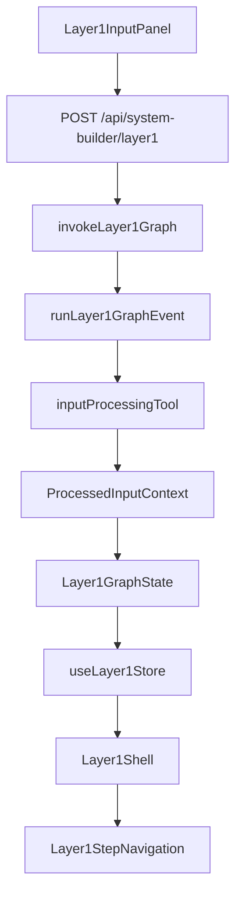

## Verified Browser Behavior

```text
/api/system-builder/layer1 is called from the browser.
Network status is 200 OK.
Input becomes Done after processing.
Clarify opens automatically after input processing.
Proceed on Clarify marks Clarify as Done.
Next step becomes active/open.
Later steps remain gated.
Unlocked/completed steps remain clickable.
```

## Acceptance Criteria Status

```text
Layer 1 state is strongly typed: Done
Layer 1 graph state exists: Done
Layer 1 graph runner exists server-side: Done
Layer 1 graph invocation entry point exists: Done
Layer 1 API route exists: Done
Request schemas exist: Done
Layer 1 schemas exist: Done
Graph request is validated before execution: Done
Graph result is returned safely to UI: Done
Frontend store can sync from graph state: Done
Input panel starts Layer 1 run through API route: Done
ProcessedInputContext is stored in graph/store state: Done
activeStep is stored in graph/store state: Done
completedSteps are stored in graph/store state: Done
availableSteps are stored in graph/store state: Done
Step gating is controlled by graph/store state: Done
Layer 2 expected input is the approved Layer 1 artifact bundle: Done
Layer 3 depends on future Layer 2 output: Done
Components no longer own main step progression alone: Done
Browser does not access OPENROUTER_API_KEY: Done
Browser does not access OPENAI_API_KEY: Done
npm run build passes: Done
npm run lint passes with existing warnings only: Done
```

## Known Task 3 Limitation

```text
The current graph runner is a deterministic runtime foundation.
The complete AI LangGraph StateGraph with clarification, understanding, completeness, Draw.io generation, refinement, final documentation generation, and export will be implemented in Tasks 4–8.

The graph entry point and API route are already in place so future tasks should extend this runtime instead of creating separate disconnected routes or UI-only state.
```

---

# Post-Task 3 Fix — Local Open-Source Voice Transcription

## Status

```text
Completed
Tested locally
Build passes
Lint passes with existing warnings only
```

## Completed Work

```text
Browser Web Speech API attempt was replaced because it can fail with network errors.
Voice input now uses local open-source Whisper browser transcription.
@xenova/transformers was installed.
localWhisperTranscription.ts was added.
Layer1InputPanel now records audio with MediaRecorder and transcribes locally.
next.config.js was updated to prevent unsupported native Node binaries from being bundled.
Docs were updated.
```

## Latest Commit

```text
6af786e Use local Whisper transcription for system builder input
```

---

# Task 4 — AI Questions, System Understanding, and Completeness

## Goal

Implement the main AI clarification workflow inside LangGraph.

This task is the first major AI part of Layer 1.

## Current State

Tasks 1–3 are completed.

Input is processed through `/api/system-builder/layer1`, and graph/store state already controls step progression.

## Scope

```text
AI provider server tool
Constructive question prompt
Question generation node
Question display UI
Question history UI
Human-in-the-loop answer submission
Answer API route
Question traceability
Understanding update node
Understanding update prompt/tooling
Understanding panel
Completeness scoring node
Completeness prompt/tooling
Completeness panel
Missing critical item detection
Graph loop decision
Ready-for-diagram decision
Workflow stage gating
```

## Main Files

```text
app/api/system-builder/layer1/answer/route.ts
src/features/system-design/components/Layer1QuestionLoop.tsx
src/features/system-design/components/QuestionCard.tsx
src/features/system-design/components/QuestionHistory.tsx
src/features/system-design/components/Layer1UnderstandingPanel.tsx
src/features/system-design/components/Layer1CompletenessPanel.tsx
src/features/system-design/nodes/generateQuestionNode.ts
src/features/system-design/nodes/updateUnderstandingNode.ts
src/features/system-design/nodes/checkCompletenessNode.ts
src/features/system-design/tools/aiProviderTool.ts
src/features/system-design/prompts/constructiveQuestionPrompt.ts
src/features/system-design/prompts/understandingUpdatePrompt.ts
src/features/system-design/prompts/completenessPrompt.ts
src/features/system-design/utils/questionCategories.ts
src/features/system-design/utils/questionSelection.ts
src/features/system-design/utils/updateUnderstanding.ts
src/features/system-design/utils/completeness.ts
src/features/system-design/graphs/layer1Graph.ts
src/features/system-design/graphs/layer1GraphEdges.ts
src/features/system-design/graphs/layer1GraphRunner.ts
src/features/system-design/stores/useLayer1Store.ts
src/features/system-design/components/Layer1Shell.tsx
```

## Expected Output

```text
AI asks one constructive question at a time.
User can answer the current question.
Answers are saved in qaHistory.
Questions and answers update structured understanding.
Completeness report is generated.
Graph decides whether to ask another question or move to diagram generation.
```

## Acceptance Criteria

```text
User starts clarification after input processing.
LangGraph asks exactly one constructive question.
Question includes reason for asking.
Question includes traceability fields.
Graph waits for user answer.
User answer resumes/continues graph.
Next question uses previous context.
Question history is saved.
Understanding updates after answers.
Completeness report is generated.
Missing critical items are shown.
Weak areas are shown.
Graph loops when more questions are needed.
Graph continues when ready for Draw.io diagram generation.
No static questionnaire behavior.
npm run lint passes.
npm run build passes.
```

---

# Task 5 — Draw.io Diagram Generation and Editable Diagram Workspace

## Goal

Generate the first editable Draw.io diagram directly from the completed understanding and Q&A context.

## Current State

Task 4 provides processed input, Q&A history, structured understanding, and completeness/readiness state.

## Scope

```text
Draw.io XML generation node
Diagram generation prompt
XML validation and repair utility
Diagram API route
Draw.io embed integration
Diagram workspace UI
Manual XML sync
Current XML stored in graph/store state
Initial diagram summary
Diagram image export preparation
```

## Main Files

```text
app/api/system-builder/layer1/generate-diagram/route.ts
src/features/system-design/components/Layer1DiagramStep.tsx
src/features/system-design/components/Layer1DiagramReview.tsx
src/features/system-design/nodes/generateDiagramNode.ts
src/features/system-design/tools/xmlValidationTool.ts
src/features/system-design/tools/drawioExportTool.ts
src/features/system-design/prompts/diagramGenerationPrompt.ts
src/features/system-design/utils/drawioXml.ts
src/components/system-builder/DrawioEmbed.tsx
src/features/system-design/graphs/layer1Graph.ts
src/features/system-design/graphs/layer1GraphEdges.ts
src/features/system-design/graphs/layer1GraphRunner.ts
src/features/system-design/stores/useLayer1Store.ts
src/features/system-design/components/Layer1Shell.tsx
```

## Expected Output

```text
Draw.io diagram is generated after clarification is complete.
Generated XML is validated before loading.
The diagram opens in Draw.io.
The user can manually edit the diagram.
Manual edits update the current XML in graph/store state.
```

## Acceptance Criteria

```text
Diagram generation starts after questioning is complete.
Diagram uses full context, not raw input only.
AI returns valid Draw.io XML.
XML is extracted, sanitized, and validated before loading.
Invalid XML is rejected or repaired safely.
Draw.io opens with the generated diagram.
User can manually edit the diagram.
Edited XML is stored in Layer 1 state.
npm run lint passes.
npm run build passes.
```

---

# Task 6 — AI Diagram Refinement, Diagram Review, and Diagram Approval

## Goal

Allow the user to improve the diagram manually or through AI refinement, then approve it.

This task is the second major AI part of Layer 1.

## Current State

Task 5 provides generated editable Draw.io XML and current diagram state.

## Scope

```text
AI diagram refinement route
AI diagram refinement node
Diagram refinement prompt
Refinement instruction UI
Current XML + instruction context building
XML validation after refinement
Diagram review UI
Manual edit tracking
AI refinement tracking
Revision history
Diagram approval state
```

## Main Files

```text
app/api/system-builder/layer1/refine-diagram/route.ts
src/features/system-design/components/Layer1DiagramReview.tsx
src/features/system-design/components/Layer1DiagramRefinement.tsx
src/features/system-design/components/DiagramRevisionHistory.tsx
src/features/system-design/nodes/refineDiagramNode.ts
src/features/system-design/tools/xmlValidationTool.ts
src/features/system-design/tools/drawioExportTool.ts
src/features/system-design/prompts/diagramRefinementPrompt.ts
src/features/system-design/utils/drawioXml.ts
src/components/system-builder/DrawioEmbed.tsx
src/features/system-design/graphs/layer1Graph.ts
src/features/system-design/graphs/layer1GraphEdges.ts
src/features/system-design/graphs/layer1GraphRunner.ts
src/features/system-design/stores/useLayer1Store.ts
src/features/system-design/components/Layer1Shell.tsx
```

## Expected Output

```text
User can review the current diagram.
User can manually edit diagram in Draw.io.
User can ask AI to refine the current diagram.
AI receives current XML, user instruction, understanding, Q&A, and revision history.
Refined XML is validated before applying.
All revisions are tracked.
User can approve the final diagram.
```

## Acceptance Criteria

```text
User can request AI diagram changes.
AI refinement uses current XML and user instruction.
AI refinement also considers system understanding and Q&A context.
Refined XML is validated before applying.
Invalid refined XML is rejected or repaired safely.
Manual edits are tracked.
AI refinements are tracked.
Revision history is stored.
User can approve final diagram.
Final Docs step remains blocked until diagram approval.
npm run lint passes.
npm run build passes.
```

---

# Task 7 — Final Documentation Generation and Artifact Bundle

## Goal

Generate the final Layer 1 Markdown documentation only after the diagram is approved, then prepare the approved artifact bundle.

## Current State

Task 6 provides approved diagram XML, diagram summary, diagram revisions, and complete Layer 1 context.

## Scope

```text
Final Markdown generation node
Final documentation prompt
Markdown spec tool
Markdown validation
Final documentation UI
Artifact bundle node
Artifact bundle tool
Final artifact state
Layer 2 handoff-ready bundle
```

## Main Files

```text
app/api/system-builder/layer1/final-docs/route.ts
src/features/system-design/components/Layer1FinalDocsStep.tsx
src/features/system-design/nodes/generateFinalDocsNode.ts
src/features/system-design/nodes/createArtifactBundleNode.ts
src/features/system-design/tools/markdownSpecTool.ts
src/features/system-design/tools/artifactBundleTool.ts
src/features/system-design/prompts/finalDocumentationPrompt.ts
src/features/system-design/utils/markdownSpec.ts
src/features/system-design/schemas/layer1.schema.ts
src/features/system-design/graphs/layer1Graph.ts
src/features/system-design/graphs/layer1GraphEdges.ts
src/features/system-design/graphs/layer1GraphRunner.ts
src/features/system-design/stores/useLayer1Store.ts
src/features/system-design/components/Layer1Shell.tsx
```

## Final Outputs

```text
final-system-spec.md
system-diagram.drawio.xml
system-diagram.png or system-diagram.svg
optional system-diagram-summary.md
```

## Acceptance Criteria

```text
Markdown is generated only after diagram approval.
Markdown includes system understanding and diagram explanation.
Markdown follows required final documentation structure.
Markdown can be previewed.
Markdown is stored in Layer 1 state.
Draw.io XML is included in final artifacts.
Diagram image is included when available.
Optional diagram summary is included when available.
No user-facing JSON export exists.
Approved Layer 1 artifact bundle exists.
npm run lint passes.
npm run build passes.
```

---

# Task 8 — Export UI, Tests, Documentation Cleanup, and Deployment Readiness

## Goal

Finish the feature professionally and make it safe for review and deployment.

## Current State

Task 7 creates the final Layer 1 artifact bundle.

## Scope

```text
Export step UI
Download buttons
File download utilities
Diagram image export handling
Tests for critical utilities and graph behavior
Documentation cleanup
Deployment readiness cleanup
Git hygiene verification
Final verification
```

## Main Files

```text
app/api/system-builder/layer1/export/route.ts
src/features/system-design/components/Layer1ExportStep.tsx
src/features/system-design/utils/exportLayer1.ts
src/features/system-design/utils/downloadFile.ts
src/features/system-design/utils/__tests__/inputNormalization.test.ts
src/features/system-design/utils/__tests__/textChunking.test.ts
src/features/system-design/utils/__tests__/contextCompression.test.ts
src/features/system-design/utils/__tests__/questionSelection.test.ts
src/features/system-design/utils/__tests__/completeness.test.ts
src/features/system-design/utils/__tests__/markdownSpec.test.ts
src/features/system-design/utils/__tests__/drawioXml.test.ts
src/features/system-design/utils/__tests__/exportLayer1.test.ts
src/features/system-design/graphs/__tests__/layer1GraphState.test.ts
src/features/system-design/nodes/__tests__/processInputNode.test.ts
src/features/system-design/nodes/__tests__/createArtifactBundleNode.test.ts
Docs/system-design-detailed-plan.md
Docs/system-design-env.md
Docs/system-design-layer1.md
Docs/system-design-team-tasks.md
```

## Acceptance Criteria

```text
User can download Markdown.
User can download Draw.io XML.
User can download diagram image.
Optional summary download works if available.
No user-facing JSON export exists.
Tests cover important logic.
Docs match the real workflow.
No secrets committed.
No local inspection files committed.
npm run lint passes.
npm run build passes.
npm run test passes or unrelated failures are documented.
```

---

## 57. Contribution Rules

All contributors must follow these rules:

```text
1. Do not break existing frontend behavior.

2. Do not merge unrelated main branch changes unless requested.

3. Do not commit .env.local.

4. Do not expose AI provider keys to the browser.

5. Keep LangGraph execution on the server side.

6. Do not install new packages unless necessary and approved. @xenova/transformers is already approved and installed for local browser transcription.

7. Do not run npm audit fix --force unless it is a separate dependency task.

8. Keep new code inside src/features/system-design where possible.

9. System Builder compatibility files should be treated as wrappers or low-level reusable components.

10. Components should not contain large orchestration logic.

11. LangGraph graph, nodes, tools, schemas, and utilities should hold workflow logic.

12. Every task must pass lint and build before review.

13. Draw.io XML must be validated before being loaded or exported.

14. Raw input should go through LangGraph input processing before AI clarification.

15. Voice input must enter the same LangGraph text pipeline after local Whisper transcription.

16. Existing Mujarrad frontend env variables must not be removed or renamed.

17. Final user-facing exports are Markdown, XML, and diagram files, not JSON.

18. Markdown documentation must be generated after diagram approval, not before diagram generation.

19. AI diagram refinement must use current XML plus user instruction.

20. AI provider tools must remain server-side and swappable.
```

---

## 58. Testing Checklist

Each contributor should run:

```bash
npm run lint
npm run build
```

Task 8 should also run:

```bash
npm run test
```

The expected branch baseline is:

```text
Lint passes with warnings only.
Build passes successfully.
```

Existing lint warnings are not part of this System Design task unless they are caused by new work.

---

## 59. Git Hygiene

Before committing, check:

```bash
git status --short
```

Do not commit local inspection artifacts:

```text
branch-inspection/
branch-inspection-content/
branch-inspection.zip
branch-inspection-content.zip
```

Do not commit:

```text
.env.local
.env
```

---

## 60. Final Definition of Done

This phase is complete when:

```text
/system-builder opens the new System Design shell
LangGraph dependencies are installed and committed
Layer 1 workflow is orchestrated by LangGraph
Layer 1 workflow is usable from input to export
Input is processed safely
Voice transcription works through local open-source Whisper browser transcription
AI clarification loop works constructively through LangGraph
System understanding is generated
Completeness is calculated
Draw.io diagram is generated from full context
Diagram can be manually edited
Diagram can be AI-refined through LangGraph using current XML and user instruction
Diagram can be approved
Final Markdown documentation is generated after diagram approval
Final Markdown/XML/diagram exports work
No user-facing JSON export exists
Docs exist
Tests exist for critical utilities and graph behavior
No secrets are committed
Existing frontend behavior remains stable
npm run lint passes
npm run build passes
npm run test passes or known unrelated failures are documented
```

---

## 61. Summary

This project is not only a Draw.io page.

It is the first implemented layer of a larger Mujarrad orchestration system.

The correct implementation must be:

```text
Professional
Typed
Traceable
Modular
Orchestrated with LangGraph
Safe for the existing frontend
Able to process input safely
Able to transcribe voice through local open-source Whisper browser transcription
Able to ask constructive AI questions
Able to build structured understanding
Able to generate Draw.io diagrams from full context
Able to refine diagrams with AI using current XML
Able to generate final Markdown documentation after diagram approval
Able to export Markdown, XML, and diagram images
Prepared for future Layer 2 and Layer 3
```

All contributors should follow this document before implementing their assigned tasks.
---