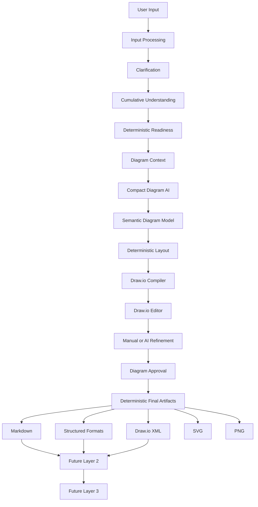

# Mujarrad System Design — Implementation Reference

## Document Purpose

This document is the current implementation reference for Mujarrad System Design Layer 1.

It replaces older repetitive plans and reflects the implemented work through Tasks 1–8, including the latest updates to:

- LangGraph.js orchestration
- text, file, and voice input
- human-in-the-loop clarification
- incremental cumulative understanding
- deterministic readiness
- compact AI JSON contracts
- semantic diagram intelligence
- deterministic Draw.io generation
- compact diagram refinement
- deterministic final artifacts
- artifact inspection and downloads

---

# 1. Product Architecture

Mujarrad is designed as three dependent layers:

```text
Layer 1: System Design
Layer 2: Abstract Logic
Layer 3: Code Machine
```

Current status:

```text
Layer 1: Implemented
Layer 2: Future
Layer 3: Future
```

Required order:

```text
Approved Layer 1 artifacts
→ Layer 2 Abstract Logic
→ Layer 3 Code Machine
```

Layer 2 must not start before approved Layer 1 artifacts exist.

---

# 2. Layer 1 Workflow

User-facing workflow:

```text
Input
→ Clarify
→ Diagram
→ Final Artifacts
```

Internal tasks:

```text
Task 1: Foundation
Task 2: Input Pipeline
Task 3: Shared Runtime
Task 4: Clarification
Task 5: Initial Diagram Generation
Task 6: Diagram Refinement and Approval
Task 7: Final Artifact Generation
Task 8: Artifact Inspection and Download
```

Mapping:

```text
Input
→ Tasks 1–3 and Task 2 interaction

Clarify
→ Task 4

Diagram
→ Task 5 before a diagram exists
→ Task 6 after a diagram exists

Final Artifacts
→ Tasks 7 and 8
```

---

# 3. Core Architecture Rule

LangGraph.js controls Layer 1.

Correct architecture:

```text
Frontend UI
→ Next.js API
→ invokeLayer1Graph()
→ LangGraph StateGraph
→ graph node
→ AI or deterministic utility
→ validated graph state
→ Zustand mirror
→ UI
```

Incorrect:

```text
UI
→ direct AI call
```

Rules:

```text
AI keys remain server-side.

The UI sends events.

LangGraph owns workflow decisions.

Graph state is authoritative.

Zustand mirrors graph state.

No task may bypass LangGraph.
```

---

# 4. High-Level Flow


```mermaid
flowchart TD
    A[User Input] --> B[Input Processing]
    B --> C[Clarification]
    C --> D[Cumulative Understanding]
    D --> E[Deterministic Readiness]
    E --> F[Diagram Context]

    F --> G[Compact Diagram AI]
    G --> H[Semantic Diagram Model]
    H --> I[Deterministic Layout]
    I --> J[Draw.io Compiler]
    J --> K[Draw.io Editor]

    K --> L[Manual or AI Refinement]
    L --> M[Diagram Approval]
    M --> N[Deterministic Final Artifacts]

    N --> O[Markdown]
    N --> P[Structured Formats]
    N --> Q[Draw.io XML]
    N --> R[SVG]
    N --> S[PNG]

    O --> T[Future Layer 2]
    P --> T
    Q --> T
    T --> U[Future Layer 3]
```

---

# 5. Non-Breaking Rule

System Design must not break:

```text
Authentication
Chat
Docs
Spaces
Nodes
Graph
Whiteboard
Navigation
Shared shell behavior
Existing backend services
```

Rules:

```text
Keep code inside src/features/system-design where possible.

Do not expose provider keys.

Do not create disconnected workflow state.

Do not replace existing routes unnecessarily.

Do not bypass LangGraph.
```

---

# 6. Route and Authentication

Main route:

```text
/system-builder
```

Main files:

```text
app/system-builder/page.tsx

src/features/system-design/components/
SystemBuilderAuthGate.tsx
```

Behavior:

```text
No valid session
→ redirect to /login

Valid session
→ open System Design
```

---

# 7. Technology Stack

```text
Next.js 14
React 18
TypeScript
LangGraph.js
Zod
Zustand
Draw.io
@xenova/transformers
JSZip
@toon-format/toon
yaml
Jest
```

Responsibilities:

```text
LangGraph
→ orchestration

Zod
→ validation

Zustand
→ frontend state mirror

Draw.io
→ editable diagrams

@xenova/transformers
→ local Whisper

JSZip
→ artifact ZIP

TOON and YAML packages
→ structured outputs

Jest
→ tests
```

---

# 8. AI Provider Architecture

All AI calls remain server-side behind:

```text
src/features/system-design/tools/aiProviderTool.ts
```

Supported providers:

```text
openrouter
groq
```

Model roles:

```ts
'clarification'
'diagram'
'markdown'
'default'
```

Current configuration shape:

```env
SYSTEM_BUILDER_AI_PROVIDER=openrouter
SYSTEM_BUILDER_API_KEY=

SYSTEM_BUILDER_DEFAULT_MODEL=google/gemini-2.5-flash
SYSTEM_BUILDER_CLARIFICATION_MODEL=google/gemini-2.5-flash
SYSTEM_BUILDER_DIAGRAM_MODEL=google/gemini-2.5-flash
SYSTEM_BUILDER_MARKDOWN_MODEL=google/gemini-2.5-flash
```

Rules:

```text
No provider is hardcoded in task logic.

No model is hardcoded in task logic.

Provider keys are never exposed to the browser.
```

---

# 9. Token-Limit Rule

No explicit application-level `maxTokens` remain under:

```text
src/features/system-design
```

Verification:

```bash
grep -R \
"maxTokens:" \
-n \
src/features/system-design
```

Expected:

```text
no output
```

Important distinction:

```text
Application token ceilings
→ removed

Provider TPM or quota limits
→ external provider limits
→ cannot be removed by source code
```

---

# 10. UI Structure

Visible Layer 1 steps:

```text
Input
Clarify
Diagram
Final Artifacts
```

Main shell:

```text
System Design Header
→ Layer Navigation
→ Step Navigation
→ Main Workspace
→ Assistant when applicable
```

Assistant visibility:

```text
Input
→ visible

Clarify
→ visible

Diagram before generation
→ hidden

Diagram after generation
→ visible

Final Artifacts
→ hidden
```

Main controller:

```text
src/features/system-design/components/Layer1AssistantPanel.tsx
```

---

# 11. Input Step

Supported input:

```text
Typed text
Pasted text
.txt file
Voice
```

All input enters the same pipeline:

```text
Raw input
→ normalize
→ estimate size
→ chunk if required
→ ProcessedInputContext
→ clarification
```

Raw input must not directly enter:

```text
clarification
diagram generation
```

Main files:

```text
src/features/system-design/components/
Task1InputAssistant.tsx
Layer1InputPanel.tsx

src/features/system-design/nodes/
processInputNode.ts

src/features/system-design/utils/
inputNormalization.ts
textChunking.ts
contextCompression.ts
```

---

# 12. Voice Input

Voice flow:

```text
Microphone
→ MediaRecorder
→ Audio Blob
→ local Whisper
→ transcript
→ composer
→ submit_input
```

Main utility:

```text
src/features/system-design/utils/localWhisperTranscription.ts
```

Behavior:

```text
Whisper runs locally in the browser.

The model is downloaded and cached.

No paid transcription API is required.
```

---

# 13. LangGraph Events

Important events:

```text
submit_input
generate_question
submit_answer
skip_to_diagram
generate_diagram
refine_diagram
sync_diagram_xml
undo_diagram_revision
reset_diagram_revision
approve_diagram
generate_final_docs
reset_run
```

General flow:

```text
UI action
→ event
→ dispatch_event
→ graph route
→ graph node
→ updated state
```

---

# 14. Main API Routes

```text
POST /api/system-builder/layer1

POST /api/system-builder/layer1/answer

POST /api/system-builder/layer1/generate-diagram

POST /api/system-builder/layer1/refine-diagram
```

The frontend never calls the provider directly.

---

# 15. Graph State

Graph state stores:

```text
run metadata
active step
completed steps
raw input
processed input
questions
Q&A history
system understanding
completeness
AI usage
diagram context
Draw.io XML
diagram summary
diagram revisions
diagram images
approval state
final artifacts
errors
next action
```

Main files:

```text
src/features/system-design/graphs/
layer1Graph.ts
layer1GraphState.ts

src/features/system-design/stores/
useLayer1Store.ts
```

---

# 16. Session Behavior

Current rule:

```text
Manual navigation during active run
→ state preserved

Page reload or new login
→ fresh run
```

Cross-session restoration is intentionally disabled.

---

# 17. Task 4 — Clarification

Task 4 is a constructive AI conversation.

It is not a static questionnaire.

Rules:

```text
Ask one question at a time.

Do not automatically ask the next question.

Process the current answer first.

Let the user choose when to ask another question.

Allow moving to Diagram at any time.

Allow returning later to continue clarification.
```

Human-in-the-loop flow:

```text
Submit description
→ process input
→ Clarify

[Ask me a question]
[Go to Diagram]

Ask question
→ exactly one AI question

Answer
→ update understanding
→ calculate readiness
→ stop

[Ask another question]
[Go to Diagram]
```

---

# 18. Incremental Understanding

Initial pass:

```text
Processed input
→ AI
→ Understanding v1
```

After answer 1:

```text
Understanding v1
+ latest question
+ latest answer
→ AI
→ Understanding v2
```

After answer 2:

```text
Understanding v2
+ latest question
+ latest answer
→ AI
→ Understanding v3
```

The prompt does not resend:

```text
the original description
the complete Q&A history
```

on every update.

The full history remains stored in graph state.

Main prompt:

```text
src/features/system-design/prompts/understandingUpdatePrompt.ts
```

---

# 19. Understanding Failure Handling

Current behavior:

```text
AI request
→ parse
→ schema validation

Any failure
→ retry once

Retry succeeds
→ update understanding

Retry fails
→ return real error
→ stop pipeline
```

The graph no longer continues clarification with silently stale understanding.

---

# 20. Compact Question Generation

Question AI returns only:

```json
{
  "q": "What determines a successful company match?",
  "c": "matching_logic",
  "r": "Defines the main decision process.",
  "t": "long_text",
  "f": ["decisionLogic", "businessRules"]
}
```

Meaning:

```text
q
→ question

c
→ category

r
→ reason

t
→ answer type

f
→ understanding fields expected to improve
```

TypeScript adds:

```text
IDs
timestamps
input references
question references
answer references
missing categories
options
```

Main file:

```text
src/features/system-design/nodes/generateQuestionNode.ts
```

---

# 21. Question Retry

Flow:

```text
First request
→ parse
→ Zod validation

Provider failure
OR malformed JSON
OR schema failure
→ one compact retry

Retry success
→ build ConstructiveQuestion

Retry failure
→ controlled graph error
```

Question generation receives only:

```text
Current Understanding
Current Readiness
```

It does not replay the full conversation.

---

# 22. Deterministic Readiness

Main utility:

```text
src/features/system-design/utils/completeness.ts
```

Scoring:

```text
Purpose                     10
Actors / roles              10
Main workflows              15
Workflow depth              10
Entities / data             10
Rules / decisions           10
Integrations                10
Security / permissions       5
Failures / edge cases        5
Inputs / outputs             5
Answered-question evidence   5
Confidence contribution      5
```

Ready condition:

```text
score >= 61

AND goal exists

AND at least one actor exists

AND at least one workflow exists
```

AI completeness is advisory.

Deterministic readiness remains available even if advisory AI completeness fails.

---

# 23. Task 4 to Task 5 Handoff

Task 4 prepares:

```text
diagramGenerationContext
```

It contains the cumulative design state required by Task 5.

Conceptually:

```text
Processed input
Structured understanding
Answered questions
Unanswered questions
Completeness
Diagram-generation instructions
```

Correct:

```text
Processed context
+ clarification
+ understanding
+ completeness
→ Task 5
```

Incorrect:

```text
Raw prompt
→ Task 5
```

---

# 24. Task 4 Status

Implemented:

```text
Human-in-the-loop clarification
One question at a time
Explicit next-question action
Compact question JSON
Question retry
Incremental understanding
Understanding retry
Deterministic readiness
Completeness fallback
Resumable clarification
Task 4 AI usage
Task 5 handoff
```

Status:

```text
Implemented
Core runtime behavior confirmed
Build passing
```

---

# 25. Diagram Intelligence Architecture

Task 5 and advanced Task 6 share a semantic diagram pipeline.

Main files:

```text
src/features/system-design/diagram-intelligence/
buildCompactSemanticDiagram.ts
layoutSemanticDiagram.ts
drawioStyleRegistry.ts
compileSemanticDiagramToDrawio.ts
refinementRouter.ts
analyzeRefinementIntent.ts
```

Core principle:

```text
AI
→ semantic meaning

TypeScript
→ normalization

Deterministic utility
→ layout

Compiler
→ Draw.io XML
```

The AI should not be responsible for:

```text
coordinates
Draw.io XML
stable IDs
styling
layout geometry
```

---

# 26. Why Direct AI XML Was Replaced

Old architecture:

```text
Understanding
→ AI Draw.io XML
```

Problems:

```text
Verbose output
High token usage
Malformed XML
Weak layouts
AI reasoning about meaning and geometry together
```

New architecture:

```text
Understanding
→ compact AI JSON
→ SemanticDiagramModel
→ deterministic layout
→ deterministic compiler
→ Draw.io XML
```

---

# 27. Why Full Semantic JSON Was Replaced

Intermediate architecture:

```text
Understanding
→ full SemanticDiagramModel JSON
→ compiler
```

Runtime failures included:

```text
Unterminated string in JSON

Expected ',' or '}'
```

The full semantic model was still too verbose.

The current AI contract uses compact tuples.

---

# 28. Compact Diagram Contract

Example:

```json
{
  "h": "Company Matching Platform",
  "g": [
    ["platform", "Matching Platform"]
  ],
  "n": [
    ["company", "actor", "Company User"],
    ["submit", "process", "Submit Requirement", "platform"],
    ["score", "service", "Match Scoring", "platform"],
    ["profiles", "database", "Company Profiles"]
  ],
  "e": [
    ["company", "submit", "submits"],
    ["submit", "score", "starts"],
    ["score", "profiles", "reads"]
  ]
}
```

Meaning:

```text
h
→ title

g
→ groups

n
→ nodes

e
→ edges
```

TypeScript adds the full semantic metadata.

---

# 29. Task 5 Flow

```text
diagramGenerationContext
→ select diagram type
→ compact AI JSON
→ Zod validation
→ TypeScript normalization
→ SemanticDiagramModel
→ deterministic layout
→ deterministic Draw.io compiler
→ XML repair
→ XML validation
→ graph state
```

The AI is not asked for:

```text
XML
coordinates
styles
IDs
verbose metadata
```

---

# 30. Task 5 Diagram Type Selection

Examples:

```text
RAG concepts
→ rag_architecture

Agent concepts
→ agent_architecture

Machine learning concepts
→ ai_ml_pipeline

Event-driven concepts
→ event_driven_topology

Many integrations
→ integration_architecture

Several roles and workflows
→ swimlane

Default
→ software_architecture
```

A term such as:

```text
matching score
```

does not automatically force an AI/ML diagram.

---

# 31. Deterministic Layout and Compiler

Layout:

```text
src/features/system-design/diagram-intelligence/
layoutSemanticDiagram.ts
```

Supports:

```text
hierarchical
left-to-right
top-to-bottom
swimlanes
groups
density handling
cyclic fallback
```

Compiler:

```text
compileSemanticDiagramToDrawio.ts
```

Flow:

```text
SemanticDiagramModel
→ layout
→ IDs
→ styles
→ groups
→ lanes
→ nodes
→ edges
→ mxGraphModel XML
```

---

# 32. Draw.io Validation

Main utility:

```text
src/features/system-design/utils/drawioXml.ts
```

Responsibilities:

```text
Extract XML
Remove wrappers
Repair safe issues
Validate structure
Validate parents
Validate edge references
Reject invalid cycles
Reject invalid root references
```

Supported:

```text
flat diagrams
groups
swimlanes
nested groups
```

Compiler tests:

```text
5 passed
0 failed
```

---

# 33. Task 5 Status

Implemented:

```text
diagramGenerationContext
deterministic type selection
compact AI JSON
retry and validation
semantic normalization
deterministic layout
deterministic Draw.io compilation
XML validation
Draw.io loading
manual editing
XML synchronization
initial revision
```

Status:

```text
Runtime generation confirmed
Compiler tests passing
Build passing
```

# 34. Draw.io Workspace

Main layout:

```text
Main area:
Draw.io editor

Right column:
Task 6 assistant
→ Diagram Controls
→ Revision History
```

The old duplicate Task 6 panel was removed.

Main review component:

```text
src/features/system-design/components/Layer1DiagramReview.tsx
```

Responsibilities:

```text
Render Draw.io
Sync XML
Reload revisions
Register final capture
```

---

# 35. Manual XML Synchronization

Manual edits flow through LangGraph:

```text
Draw.io onXmlChange
→ sync_diagram_xml
→ API
→ LangGraph
→ drawioXml updated
→ Zustand mirror
```

Manual edits therefore become part of the same state used by:

```text
AI refinement
approval
final artifacts
```

---

# 36. Task 6 — Refinement Architecture

Task 6 begins with:

```text
refine_diagram
→ LangGraph
→ analyzeRefinementIntent()
```

The request is routed to:

```text
fast_edit

advanced_modification

expert_reconstruction
```

---

# 37. Refinement Router

Main file:

```text
src/features/system-design/diagram-intelligence/refinementRouter.ts
```

Fast examples:

```text
rename
change label
move
delete
remove
connect
disconnect
change style
```

Advanced examples:

```text
improve
simplify
expand
add security
add resilience
add observability
restructure
```

Expert examples:

```text
rebuild whole diagram
convert diagram
activity diagram
sequence diagram
deployment diagram
component diagram
state machine
C4
microservices
event-driven architecture
```

---

# 38. Task 6 Fast Path

For local edits:

```text
instruction
→ intent analysis
→ fast_edit
→ current Draw.io XML
→ AI XML edit
→ XML repair
→ XML validation
→ updated diagram
```

The fast path is kept lightweight.

---

# 39. Old Advanced Task 6 Pipeline

The previous path was:

```text
intent analysis
→ current diagram analysis
→ context selection
→ transformation plan
→ full semantic synthesis
→ compiler
```

Problems:

```text
Too many AI calls
Large input context
Large JSON output
High latency
Malformed JSON
```

Observed runtime failure:

```text
Transformation planning failed:
Unterminated string in JSON
```

The old chain is no longer used by `refineDiagramNode.ts`.

---

# 40. Current Advanced and Expert Task 6 Path

New architecture:

```text
refine_diagram
→ LangGraph
→ intent analysis
→ resolve target diagram type
→ one compact reconstruction call
→ compact diagram JSON
→ SemanticDiagramModel
→ deterministic layout
→ deterministic Draw.io compiler
→ XML validation
→ new revision
```

Removed from the active advanced path:

```text
analyzeCurrentDiagram()
selectDiagramContext()
planDiagramTransformation()
buildSemanticDiagram()
```

This reduces:

```text
AI calls
input tokens
output tokens
latency
JSON truncation risk
```

---

# 41. Target Diagram Resolution

Examples:

```text
activity diagram
→ uml_activity

sequence diagram
→ uml_sequence

deployment diagram
→ uml_deployment

component diagram
→ uml_component

state machine
→ uml_state_machine

C4 context
→ c4_context

C4 container
→ c4_container

C4 component
→ c4_component

data flow
→ data_flow

event-driven
→ event_driven_topology

RAG
→ rag_architecture

agentic or multi-agent
→ agent_architecture
```

Fallback:

```text
intent target type when available

otherwise
→ software_architecture
```

---

# 42. Task 6 Compact Reconstruction

Advanced and expert refinement reuse:

```text
buildCompactSemanticDiagram()
```

Input:

```text
Current understanding
Target diagram type
Audience
Refinement instruction
Current diagram summary
```

Example:

```text
turn it into activity diagram and remove dummy visuals
```

Flow:

```text
intent analysis
→ expert reconstruction
→ target = uml_activity
→ compact semantic reconstruction
→ deterministic Draw.io compilation
```

---

# 43. Task 6 Assistant UI

Main component:

```text
src/features/system-design/components/Task6DiagramAssistant.tsx
```

The assistant owns:

```text
refinement instruction
apply AI change
revision conversation
provider errors
Task 6 usage
```

Current layout improvements:

```text
Revision area
→ minimum height
→ independent scrolling

Composer
→ compact

Provider error
→ bounded and scrollable

Usage panel
→ bounded height
```

The Diagram assistant uses a taller container than other assistant steps.

---

# 44. Diagram Controls and Revisions

Controls:

```text
Undo
Reset
Accept Diagram
```

Main component:

```text
src/features/system-design/components/Layer1DiagramRefinement.tsx
```

Revision history:

```text
src/features/system-design/components/DiagramRevisionHistory.tsx
```

Revision state:

```text
graphState.diagramRevisions
```

Known limitation:

```text
Undo is not yet a full cursor-based revision system.
Repeated undo can potentially oscillate.
```

Future improvement:

```text
revision list
+ active cursor
+ deterministic backward/forward movement
```

---

# 45. Diagram Revisit Rule

Returning to Diagram with an existing diagram must show:

```text
Draw.io editor

Task 6 assistant

Diagram controls

Revision history
```

No legacy Task 6 UI should reappear.

---

# 46. Final Diagram Capture

Capture bridge:

```text
src/features/system-design/utils/finalDiagramCaptureBridge.ts
```

Flow:

```text
Layer1DiagramReview
→ registers capture function

Layer1DiagramRefinement
→ calls capture function
```

Captured:

```text
Current XML
Current SVG
Current PNG
```

---

# 47. Diagram Approval

Flow:

```text
Accept Diagram
→ capture live XML
→ export SVG
→ export PNG
→ approve_diagram
→ graph stores approved diagram
→ Task 7
→ Final Artifacts
```

Approval payload:

```ts
{
  type: 'approve_diagram',
  xml: captured.xml,
  diagramImages: captured.diagramImages,
}
```

---

# 48. Draw.io Export Fix

Previous problem:

```text
SVG export timed out
```

Cause:

```text
SVG and PNG responses also contained XML.

The XML handler ran first.

The image export promise never resolved.
```

Fix:

```text
Process SVG and PNG export responses before generic XML responses.
```

Confirmed:

```text
XML capture works
SVG capture works
PNG capture works
```

---

# 49. Task 6 LangGraph Path

```text
refine_diagram event
→ routeAfterDispatch()
→ refine_diagram graph node
→ refineDiagramGraphNode()
→ refineDiagramNode()
→ updated XML
→ usage stored
→ revision stored
→ graph state returned
```

The graph contains:

```ts
.addNode('refine_diagram', refineDiagramGraphNode)
```

No direct frontend AI call exists.

---

# 50. Task 6 Status

Implemented:

```text
Intent analysis
Fast-edit path
Compact advanced reconstruction
Compact expert reconstruction
Diagram-type conversion
Usage tracking
Revision history
Manual editing
Undo
Reset
XML capture
SVG capture
PNG capture
Approval
```

Current status:

```text
Old verbose advanced path removed

New compact architecture build verified

Final runtime retest of the migrated advanced/expert path still required
```

---

# 51. Task 7 — Final Artifact Generation

Task 7 runs after diagram approval.

Task 7 is deterministic.

It does not call AI.

Flow:

```text
Approved XML/SVG/PNG
→ canonical artifact
→ derived formats
→ artifact bundle
→ Final Artifacts
```

Inputs:

```text
Processed input
Q&A history
System understanding
Completeness
Approved diagram
Diagram summary
Revision information
```

---

# 52. Canonical Artifact

Main type:

```text
Layer1CanonicalArtifact
```

Contains:

```text
Version
Run ID
Timestamp
System summary
System goal
Structured understanding
Completeness
Answered questions
Unanswered questions
Diagram summary
Traceability
```

Derived outputs are generated from this canonical artifact.

---

# 53. Generated Formats

Task 7 creates:

```text
Markdown
Pretty JSON
Compact JSON
TOON
YAML
Plain text
Draw.io XML
SVG
PNG
```

Primary design outputs:

```text
Markdown
Draw.io XML
SVG
PNG
```

Structured formats support:

```text
future Layer 2 handoff
machine consumption
token-efficiency comparison
```

---

# 54. Token Efficiency Comparison

Compared:

```text
TOON
Compact JSON
Pretty JSON
YAML
```

Excluded:

```text
Markdown
Plain text
Draw.io XML
SVG
PNG
```

Current estimate:

```text
estimatedTokens = ceil(characterCount / 4)
```

The report stores:

```text
Format
Characters
UTF-8 bytes
Estimated tokens
Relative savings
Rank
Recommended format
```

Do not assume TOON always wins.

Actual generated data determines the result.

---

# 55. Task 7 Main Files

```text
src/features/system-design/nodes/
generateFinalDocsNode.ts

src/features/system-design/utils/
finalArtifactBuilder.ts
finalArtifactFormatters.ts
tokenEfficiency.ts
layer1ArtifactBundle.ts
```

---

# 56. Final Artifact Bundle

Includes:

```text
Canonical artifact
Markdown
Pretty JSON
Compact JSON
TOON
YAML
Plain text
Draw.io XML
SVG
PNG
Diagram summary
Token report
Manifest
Approval timestamp
```

---

# 57. Task 8 — Artifact Explorer

Main component:

```text
src/features/system-design/components/FinalArtifactsStep.tsx
```

Capabilities:

```text
Browse artifacts
Preview text
Preview SVG
Preview PNG
Copy text
Download individual artifact
Download ZIP
Review token report
```

Main utilities:

```text
src/features/system-design/utils/
finalArtifactExplorer.ts
artifactDownload.ts
```

---

# 58. ZIP Structure

```text
mujarrad-layer1/
├── README.json
├── specifications/
│   ├── final-system-spec.md
│   ├── final-system-spec.json
│   ├── final-system-spec.compact.json
│   ├── final-system-spec.toon
│   ├── final-system-spec.yaml
│   └── final-system-spec.txt
├── diagram/
│   ├── final-system-diagram.drawio
│   ├── final-system-diagram.svg
│   └── final-system-diagram.png
└── reports/
    ├── artifact-manifest.json
    └── layer2-token-efficiency-report.json
```

---

# 59. Future Layer 2

Current state:

```text
Prepare Layer 2 Handoff
→ disabled
```

Future Layer 2 should consume approved Layer 1 artifacts such as:

```text
Canonical artifact
Markdown
Efficient structured format
Draw.io XML
Diagram images
Token-efficiency information
```

Layer 2 must not start from raw user input.

---

# 60. Future Layer 3

Layer 3 must depend on Layer 2 output.

Expected input:

```text
Abstract logic graph
Validated rules
Implementation constraints
Code-generation plan
```

---

# 61. Main Component Map

```text
SystemDesignShell
├── Header
├── Layer Navigation
└── Layer1Shell
    ├── Step Navigation
    ├── Main Workspace
    └── Assistant when applicable
```

Assistant controllers:

```text
Task1InputAssistant
Task4ClarificationAssistant
Task6DiagramAssistant
```

---

# 62. Main Files

Components:

```text
src/features/system-design/components/
SystemBuilderAuthGate.tsx
SystemDesignShell.tsx
Layer1Shell.tsx
Layer1AssistantPanel.tsx
Task1InputAssistant.tsx
Task4ClarificationAssistant.tsx
Task6DiagramAssistant.tsx
Layer1DiagramReview.tsx
Layer1DiagramRefinement.tsx
DiagramRevisionHistory.tsx
FinalArtifactsStep.tsx
```

Graph:

```text
src/features/system-design/graphs/
layer1Graph.ts
layer1GraphState.ts
layer1GraphRunner.ts
```

Nodes:

```text
src/features/system-design/nodes/
processInputNode.ts
generateQuestionNode.ts
updateUnderstandingNode.ts
checkCompletenessNode.ts
generateDiagramNode.ts
refineDiagramNode.ts
generateFinalDocsNode.ts
```

---

# 63. Validation Rule

AI output must never be committed directly to graph state.

General flow:

```text
AI output
→ parse
→ Zod validation
→ normalize
→ commit
```

Diagram flow:

```text
Compact AI JSON
→ Zod
→ semantic normalization
→ deterministic layout
→ deterministic compiler
→ XML repair
→ XML validation
→ commit
```

---

# 64. Traceability

State preserves:

```text
Input source
Processed context
Chunks
Questions
Answers
Understanding evolution
Completeness
Diagram revisions
AI usage
Final artifacts
```

This supports future Layer 2 reasoning.

---

# 65. Task Status

```text
Task 1: Completed
Task 2: Completed
Task 3: Completed
Task 4: Completed
Task 5: Completed
Task 6: Compact architecture implemented; final migrated runtime retest pending
Task 7: Completed
Task 8: Completed
```

---

# 66. Acceptance Summary

## Input

```text
Text: Done
Paste: Done
.txt: Done
Voice: Done
Local Whisper: Done
Normalization: Done
Chunking: Done
```

## Clarification

```text
One question at a time: Done
No automatic next question: Done
Human-in-the-loop: Done
Compact question JSON: Done
Incremental understanding: Done
Understanding retry: Done
Deterministic readiness: Done
Resumable clarification: Done
```

## Diagram

```text
Task 5 context handoff: Done
Compact diagram JSON: Done
Semantic normalization: Done
Deterministic layout: Done
Draw.io compiler: Done
XML validation: Done
Manual editing: Done
XML sync: Done
```

## Refinement

```text
Intent routing: Done
Fast path: Done
Compact advanced path: Done
Compact expert path: Done
Diagram type conversion: Done
Revision history: Done
Approval: Done
Final migrated runtime retest: Pending
```

## Final Artifacts

```text
Deterministic generation: Done
Markdown: Done
Structured formats: Done
XML/SVG/PNG: Done
Token report: Done
Artifact explorer: Done
Individual downloads: Done
ZIP download: Done
```

---

# 67. Contribution Rules

```text
1. Keep System Design isolated where possible.

2. Do not expose AI keys.

3. Keep provider calls server-side.

4. LangGraph controls workflow decisions.

5. Zustand only mirrors graph state.

6. Do not create direct UI-to-AI calls.

7. Ask one clarification question at a time.

8. Do not automatically ask the next question.

9. Use cumulative understanding as the main clarification source.

10. Avoid replaying full history unnecessarily.

11. Task 5 must use diagramGenerationContext.

12. Task 5 must not use raw input alone.

13. Prefer compact AI response contracts.

14. Validate AI outputs.

15. Keep layout and Draw.io compilation deterministic.

16. Advanced Task 6 refinement should use compact reconstruction.

17. Final approval must capture live editor state.

18. Task 7 remains deterministic.

19. Do not hardcode provider or model selection.

20. Do not reintroduce maxTokens without explicit approval.

21. Do not commit .env.local.

22. Do not run npm audit fix --force as normal feature work.

23. Run the build before review.

24. Do not reintroduce legacy System Builder UI.
```

---

# 68. Testing Checklist

Before review:

```bash
npm run build
```

Where relevant:

```bash
npm run lint
npm run test
```

Known unrelated warnings may remain:

```text
img optimization
React hook dependencies
outdated browserslist data
anonymous SVG exports
```

---

# 69. Runtime Checklist

Input:

```text
Type text
Upload .txt
Record voice
Process input
Confirm Clarify opens
```

Clarification:

```text
Ask one question
Answer
Confirm understanding updates
Confirm readiness updates
Ask another question
Go to Diagram
Return to Clarify
Continue clarification
```

Task 5:

```text
Generate diagram
Confirm Draw.io renders
Confirm Task 6 assistant appears
```

Task 6:

```text
Fast edit:
rename a node

Advanced:
simplify the diagram

Expert:
turn it into activity diagram and remove dummy visuals
```

Confirm:

```text
No transformation-planning JSON error
New revision appears
Target diagram type is respected
Diagram remains valid
```

Approval:

```text
Capture XML
Capture SVG
Capture PNG
Open Final Artifacts
```

Final Artifacts:

```text
Preview artifacts
Review token report
Download one artifact
Download ZIP
```

---

# 70. Git Hygiene

Before committing:

```bash
git status --short
```

Do not commit:

```text
.env
.env.local
API keys
temporary inspection files
temporary ZIPs
```

Avoid:

```bash
npm audit fix --force
```

unless handled as a separate dependency task.

---

# 71. Definition of Done

Layer 1 is complete when:

```text
/system-builder is authenticated.

Text, file, and voice input work.

Input is processed before AI reasoning.

LangGraph controls the workflow.

Clarification is human-controlled.

Understanding updates incrementally.

AI failures retry and stop correctly when unresolved.

Readiness is deterministic.

Task 4 prepares diagramGenerationContext.

Task 5 generates compact semantic diagrams.

Layout and Draw.io XML are deterministic.

Generated XML is validated.

Manual editing and synchronization work.

Task 6 supports fast edits and compact reconstruction.

Diagram revisions are tracked.

The live diagram can be captured as XML, SVG, and PNG.

Task 7 deterministically generates final artifacts.

Task 8 allows inspection and download.

Layer 2 remains future work.

Existing Mujarrad behavior remains stable.

Build passes.
```

---

# 72. Final Architecture Summary

```text
INPUT

Text
File
Voice
→ process input

TASK 4

Initial understanding
→ compact question
→ human answer
→ incremental understanding
→ deterministic readiness
→ next question or Diagram

TASK 5

diagramGenerationContext
→ compact AI diagram JSON
→ semantic model
→ deterministic layout
→ Draw.io compiler
→ XML validation
→ editor

TASK 6

Refinement instruction
→ intent analysis

Fast edit
→ current XML edit

Advanced or expert
→ compact reconstruction
→ semantic model
→ deterministic compiler

Then:
→ revision
→ approval

TASK 7

Approved XML/SVG/PNG
→ canonical artifact
→ Markdown
→ structured formats
→ token report

TASK 8

Preview
→ copy
→ individual download
→ ZIP download

FUTURE

Approved Layer 1
→ Layer 2
→ Layer 3
```

---

# 73. Final Summary

Mujarrad System Design Layer 1 can now:

```text
Collect system ideas from text, file, or voice.

Process input before AI reasoning.

Ask one constructive question at a time.

Keep the user in control.

Build cumulative understanding incrementally.

Retry malformed AI responses.

Calculate diagram readiness deterministically.

Generate compact semantic diagram specifications.

Normalize them in TypeScript.

Lay out diagrams deterministically.

Compile Draw.io XML deterministically.

Support manual editing.

Support fast, advanced, and expert refinement.

Convert diagrams into target representations.

Track revisions.

Capture XML, SVG, and PNG.

Generate deterministic final artifacts.

Compare structured formats for token efficiency.

Provide artifact inspection and downloads.

Prepare approved output for future Layer 2.
```

The central architecture remains:

```text
UI
→ API
→ LangGraph
→ Nodes and Tools
→ Validated State
→ Zustand Mirror
→ UI
```

All future work should extend this architecture rather than creating parallel workflow logic.