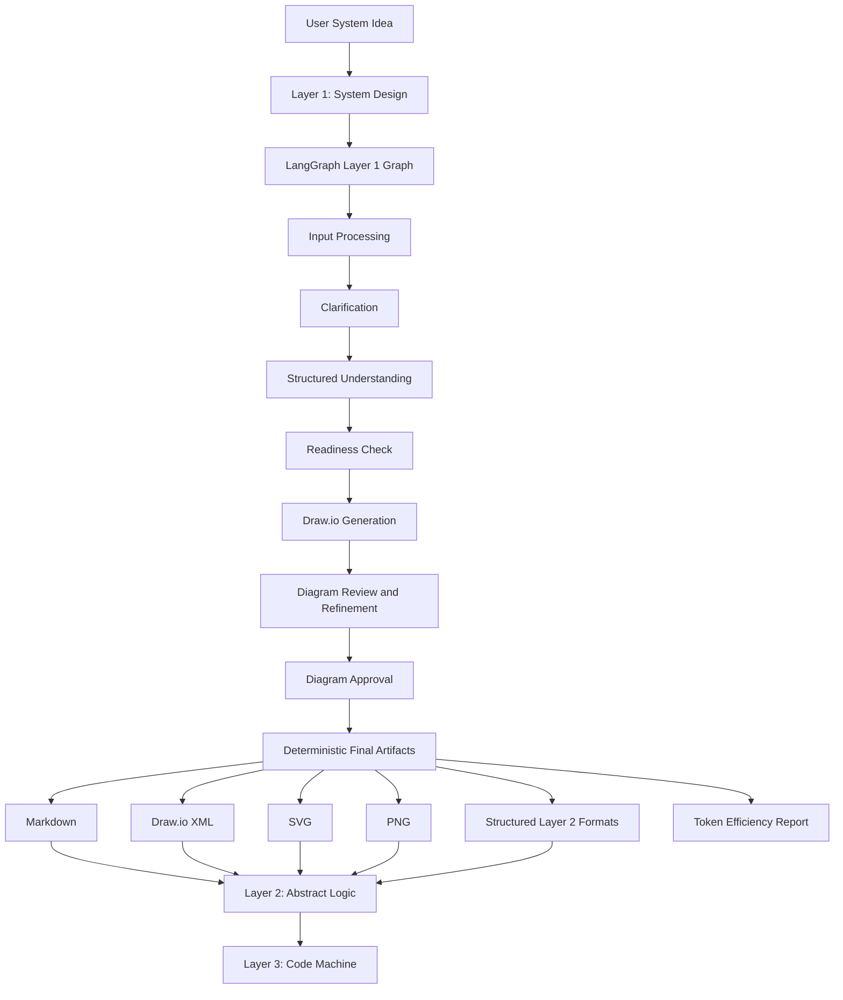
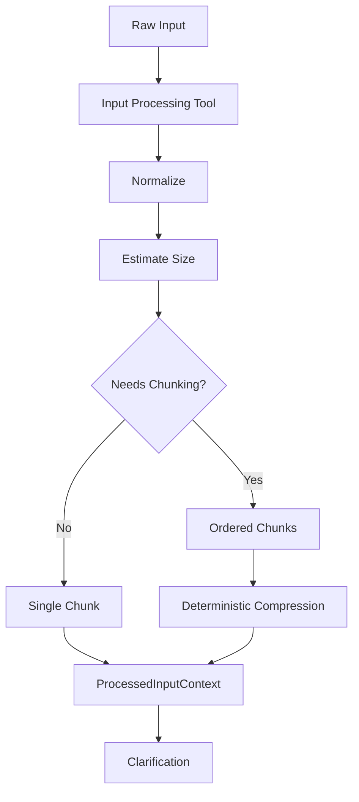
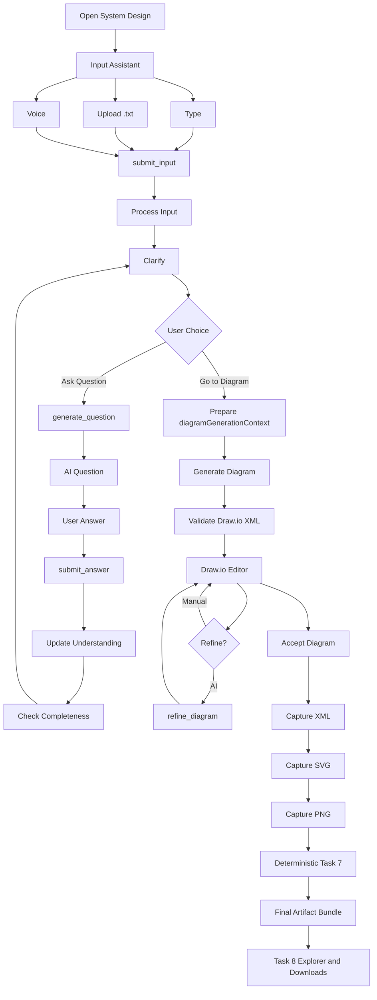
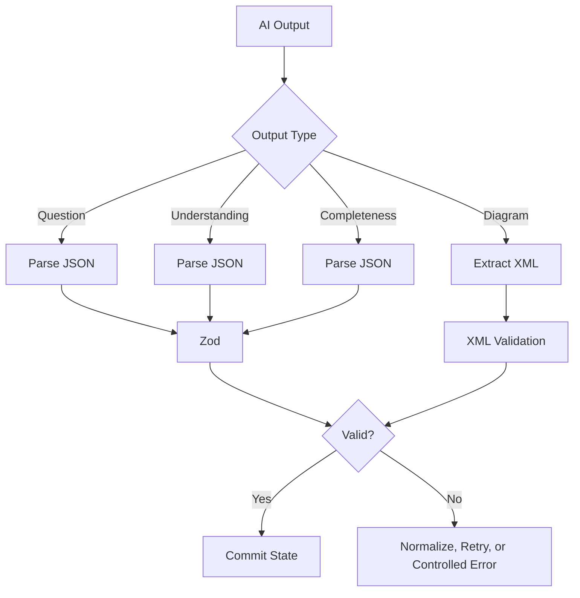

# Mujarrad System Design — Detailed Implementation Plan

## Document Purpose

This document is the current implementation reference for the Mujarrad System Design workflow.

It replaces older, repetitive versions of the plan and reflects the work completed through Tasks 1–8, including:

- LangGraph.js orchestration
- text, voice, and file input
- AI clarification and human-in-the-loop questioning
- structured system understanding
- completeness/readiness analysis
- Draw.io diagram generation
- manual and AI diagram refinement
- resumable workflow navigation
- deterministic final artifact generation
- multi-format token-efficiency comparison
- artifact inspection and downloads
- unified assistant UI

The implementation must remain isolated from unrelated Mujarrad frontend behavior.

---

# 1. Product Overview

Mujarrad System Design is Layer 1 of a larger three-layer architecture.

```text
Layer 1: System Design
Layer 2: Abstract Logic
Layer 3: Code Machine
```

Current implementation status:

```text
Layer 1: Implemented
Layer 2: Future
Layer 3: Future
```

Correct dependency order:

```text
Layer 1 approved artifacts
→ Layer 2 Abstract Logic
→ Layer 3 Code Machine
```

Layer 2 must not start before approved Layer 1 artifacts exist.

---

# 2. Final Layer 1 Workflow

The implemented user-facing workflow is:

```text
Input
→ Clarify
→ Diagram
→ Final Artifacts
```

The internal implementation tasks remain:

```text
Task 1: Foundation
Task 2: Input Pipeline
Task 3: Shared Runtime
Task 4: Clarification
Task 5: Initial Diagram Generation
Task 6: Diagram Refinement and Approval
Task 7: Final Artifact Generation
Task 8: Artifact Inspection and Download
```

Visible-step mapping:

```text
Input
→ Tasks 1–3 foundations and Task 2 interaction

Clarify
→ Task 4

Diagram
→ Task 5 before diagram generation
→ Task 6 after a diagram exists

Final Artifacts
→ Task 7 generation
→ Task 8 inspection and download
```

The workflow intentionally merges related tasks into four clear user-facing steps.

---

# 3. Core Architecture Rule

LangGraph.js controls the Layer 1 workflow.

Correct architecture:

```text
Frontend UI
→ Next.js API route
→ invokeLayer1Graph()
→ LangGraph StateGraph
→ graph node/tool
→ AI provider or deterministic utility
→ updated graph state
→ Zustand mirror
→ UI
```

Incorrect architecture:

```text
UI
→ direct AI call
```

The browser must not directly access AI provider keys.

The UI sends events and renders graph state.

The graph owns workflow decisions.

---

# 4. Long-Term Product Architecture


```mermaid
flowchart TD
    U[User System Idea] --> L1[Layer 1: System Design]

    L1 --> G[LangGraph Layer 1 Graph]

    G --> I[Input Processing]
    I --> C[Clarification]
    C --> U1[Structured Understanding]
    U1 --> R[Readiness Check]
    R --> D[Draw.io Generation]
    D --> DR[Diagram Review and Refinement]
    DR --> A[Diagram Approval]
    A --> F[Deterministic Final Artifacts]

    F --> MD[Markdown]
    F --> XML[Draw.io XML]
    F --> SVG[SVG]
    F --> PNG[PNG]
    F --> SF[Structured Layer 2 Formats]
    F --> REP[Token Efficiency Report]

    MD --> L2[Layer 2: Abstract Logic]
    XML --> L2
    SVG --> L2
    PNG --> L2
    SF --> L2

    L2 --> L3[Layer 3: Code Machine]
```

---

# 5. Non-Breaking Rule

The new feature must not break existing Mujarrad areas:

```text
Authentication
Chat
Docs
Spaces
Nodes
Graph
Whiteboard
Markdown rendering
Shell components
Navigation
Existing backend services
Shared UI behavior
```

Implementation rules:

```text
Keep new work inside src/features/system-design where possible.
Use compatibility wrappers instead of destructive rewrites.
Do not modify unrelated components.
Do not rename existing frontend environment variables.
Do not expose provider keys to the browser.
Do not create disconnected UI-only workflow state.
Do not bypass LangGraph.
```

---

# 6. Route and Authentication

Main route:

```text
/system-builder
```

Product title:

```text
System Design
```

Main route file:

```text
app/system-builder/page.tsx
```

Authentication gate:

```text
src/features/system-design/components/SystemBuilderAuthGate.tsx
```

Behavior:

```text
No valid frontend auth session
→ redirect to /login

Valid auth session
→ open /system-builder
```

Compatibility wrapper:

```text
src/components/system-builder/SystemBuilder.tsx
```

The wrapper points the existing System Builder entry to the new System Design feature shell.

---

# 7. Technology Stack

Approved implementation tools:

```text
Next.js 14
React 18
TypeScript
LangGraph.js
Zod
Zustand
Draw.io / diagrams.net embed
@xenova/transformers
JSZip
@toon-format/toon
yaml
Jest
Native browser APIs
```

Responsibilities:

```text
LangGraph.js
→ workflow orchestration

Zod
→ event, state, AI output, and artifact validation

Zustand
→ frontend mirror of graph state

Draw.io
→ editable diagram workspace

@xenova/transformers
→ local browser Whisper transcription

MediaRecorder
→ voice capture

JSZip
→ full artifact bundle download

@toon-format/toon
→ TOON structured artifact output

yaml
→ YAML artifact generation

Jest
→ utility and runtime tests
```

---

# 8. AI Provider Architecture

AI calls remain server-side behind:

```text
src/features/system-design/tools/aiProviderTool.ts
```

Supported provider selection:

```env
SYSTEM_BUILDER_AI_PROVIDER=openrouter
OPENROUTER_API_KEY=

or

SYSTEM_BUILDER_AI_PROVIDER=groq
GROQ_API_KEY=
```

Optional model override:

```env
SYSTEM_BUILDER_MODEL=
```

Provider rules:

```text
Provider selection is server-side.
Provider keys are never NEXT_PUBLIC_ variables.
The AI provider is swappable.
UI components never call OpenRouter or Groq directly.
```

---

# 9. Environment Rules

Local secrets:

```text
.env.local
```

Committed template:

```text
.env.example
```

Existing Mujarrad variables must remain intact:

```env
NEXT_PUBLIC_API_URL=
NEXT_PUBLIC_AGENT_SERVICE_URL=
```

System Design variables:

```env
SYSTEM_BUILDER_AI_PROVIDER=openrouter
OPENROUTER_API_KEY=
GROQ_API_KEY=
SYSTEM_BUILDER_MODEL=
SYSTEM_DESIGN_ORCHESTRATOR=langgraph
NEXT_PUBLIC_SYSTEM_BUILDER_MODE=api
NEXT_PUBLIC_ENABLE_LAYER_2=false
NEXT_PUBLIC_ENABLE_LAYER_3=false
```

Optional legacy transcription configuration may remain:

```env
OPENAI_API_KEY=
SYSTEM_BUILDER_TRANSCRIPTION_MODEL=whisper-1
```

The active voice path does not require a paid transcription API.

---

# 10. Final UI Structure

The page contains:

```text
System Design header
→ Layer navigation
→ Layer 1 step navigation
→ selected Layer 1 workspace
```

Visible Layer 1 steps:

```text
Input
Clarify
Diagram
Final Artifacts
```

Step type:

```ts
export type Layer1StepId =
  | 'input'
  | 'clarification'
  | 'diagram'
  | 'final_artifacts';
```

Step order:

```ts
[
  'input',
  'clarification',
  'diagram',
  'final_artifacts',
]
```

The backend can still use internal stages such as:

```text
input
input_processing
clarification
understanding
diagram
final_docs
export
```

The visible UI remains intentionally simpler.

---

# 11. Unified Assistant Architecture

The interaction model was redesigned into one unified assistant.

Assistant visibility:

```text
Input
→ visible

Clarify
→ visible

Diagram before initial diagram exists
→ hidden

Diagram after diagram exists
→ visible

Final Artifacts
→ hidden
```

Controller switching:

```text
activeStep = input
→ Task1InputAssistant

activeStep = clarification
→ Task4ClarificationAssistant

activeStep = diagram and drawioXml exists
→ Task6DiagramAssistant

activeStep = final_artifacts
→ no assistant
```

Main component:

```text
src/features/system-design/components/Layer1AssistantPanel.tsx
```

Architecture:

```text
Unified Assistant UI
→ existing API route
→ existing LangGraph event
→ existing graph node
→ updated graph state
→ Zustand mirror
```

The assistant is not a direct AI client.

---

# 12. Unified Assistant UI Principles

The assistant should look and behave like a normal chat.

Inside the chat:

```text
User messages
AI messages
Contextual in-message action buttons
One composer
Upload icon where relevant
Voice icon where relevant
Send icon
Scrollable conversation
```

Avoid:

```text
Large metric panels inside chat
Separate workflow forms
Duplicate buttons outside the conversation
Static "Start Clarification" controls
Large unexplained empty areas
Duplicate old Task 6 refinement panels
```

The assistant height is intentionally bounded.

Long conversations scroll internally.

---

# 13. Input Step

The Input step has two areas.

Main workspace:

```text
Input instructions
Input status
Source summary
Processed status
Chunk count
Current input preview
```

Unified assistant:

```text
System description composer
Text input
.txt upload
Voice recording
Local transcription
Send/process action
Input size information
Character count
Estimated token count
Status
```

Components:

```text
src/features/system-design/components/Layer1InputPanel.tsx
src/features/system-design/components/Task1InputAssistant.tsx
```

The old large standalone input form was removed.

All input interaction now lives in the assistant.

---

# 14. Supported Input Sources

Implemented sources:

```ts
export type SystemDesignInputSourceType =
  | 'typed_text'
  | 'pasted_text'
  | 'voice_transcript'
  | 'file_text';
```

Supported user actions:

```text
Type text
Paste text
Upload .txt
Record voice
```

All sources enter the same Layer 1 input-processing path.

---

# 15. Input Processing Rule

Raw input never directly enters clarification or diagram generation.

Required flow:

```text
RawInputPayload
→ normalization
→ size estimation
→ optional chunking
→ processed context
→ LangGraph clarification
```

Rule:

```text
No clarification from unprocessed raw input.
No diagram generation from raw input alone.
```

---

# 16. Input Processing Pipeline


```mermaid
flowchart TD
    A[Raw Input] --> B[Input Processing Tool]
    B --> C[Normalize]
    C --> D[Estimate Size]
    D --> E{Needs Chunking?}
    E -->|No| F[Single Chunk]
    E -->|Yes| G[Ordered Chunks]
    G --> H[Deterministic Compression]
    F --> I[ProcessedInputContext]
    H --> I
    I --> J[Clarification]
```

Main files:

```text
src/features/system-design/types/input.types.ts
src/features/system-design/schemas/input.schema.ts
src/features/system-design/tools/inputProcessingTool.ts
src/features/system-design/nodes/processInputNode.ts
src/features/system-design/utils/inputNormalization.ts
src/features/system-design/utils/textChunking.ts
src/features/system-design/utils/contextCompression.ts
src/features/system-design/utils/id.ts
```

Configuration:

```ts
inputLimits: {
  maxDirectCharacters: 12000,
  maxChunkCharacters: 6000,
  chunkOverlapCharacters: 500,
}
```

---

# 17. Core Input Types

```ts
export interface RawInputPayload {
  id: string;
  sourceType: SystemDesignInputSourceType;
  rawText: string;
  createdAt: string;
  metadata?: {
    fileName?: string;
    audioDurationSeconds?: number;
    language?: string;
  };
}
```

```ts
export interface ProcessedInputContext {
  id: string;
  sourceInputIds: string[];
  normalizedText: string;
  chunks: TextChunk[];
  compressedSummary: string;
  inputSize: InputSize;
  processingWarnings: InputProcessingWarning[];
  createdAt: string;
}
```

```ts
export interface TextChunk {
  id: string;
  index: number;
  text: string;
  summary?: string;
  characterStart: number;
  characterEnd: number;
}
```

---

# 18. Voice Input

Voice input uses local open-source browser transcription.

Flow:

```text
Microphone button
→ MediaRecorder
→ Audio Blob
→ transcribeAudioLocally()
→ local Whisper
→ transcript
→ composer
→ submit_input
```

Main utility:

```text
src/features/system-design/utils/localWhisperTranscription.ts
```

Dependency:

```text
@xenova/transformers
```

Behavior:

```text
Whisper model loads in browser.
Loaded transcriber is reused.
First use may take longer because model files must download/cache.
No paid transcription key is required.
Transcript enters the same Layer 1 processing pipeline.
```

The legacy route may remain:

```text
app/api/system-builder/transcribe/route.ts
```

The current active input assistant does not depend on it.

---

# 19. File Input

Supported:

```text
.txt
text/plain
```

Behavior:

```text
Upload icon
→ browser reads file
→ text appears in composer
→ sourceType becomes file_text
→ user sends/processes
→ same LangGraph input path
```

Unsupported files return a controlled error.

---

# 20. LangGraph Event Model

Main events include:

```text
start_run
submit_input
submit_answer
generate_question
skip_to_diagram
generate_diagram
refine_diagram
sync_diagram_xml
undo_diagram_revision
reset_diagram_revision
approve_diagram
generate_final_docs
complete_step
sync_state
reset_run
```

Main architecture:

```text
UI action
→ graph event
→ dispatch node
→ appropriate graph node
→ updated graph state
```

---

# 21. Main Runtime Endpoints

```text
POST /api/system-builder/layer1

POST /api/system-builder/layer1/answer

POST /api/system-builder/layer1/generate-diagram

POST /api/system-builder/layer1/refine-diagram
```

Current endpoint responsibilities:

```text
/layer1
→ general Layer 1 events

/layer1/answer
→ submit_answer

/layer1/generate-diagram
→ initial Task 5 generation

/layer1/refine-diagram
→ Task 6 AI refinement
```

Final artifact generation is orchestrated through the same graph/runtime flow.

---

# 22. Graph State Source of Truth

The graph state is authoritative.

The frontend Zustand store mirrors it.

Main state areas:

```text
run metadata
active step
completed steps
available steps
raw inputs
processed input
questions
Q&A history
system understanding
completeness
Task 4 AI usage
Task 6 AI usage
diagram generation context
Draw.io XML
diagram images
diagram summary
diagram revisions
diagram approval
final artifacts
errors
next action
```

Main files:

```text
src/features/system-design/graphs/layer1Graph.ts
src/features/system-design/graphs/layer1GraphState.ts
src/features/system-design/stores/useLayer1Store.ts
src/features/system-design/types/layer1.types.ts
src/features/system-design/types/graph.types.ts
```

---

# 23. Current State Persistence Rule

The active System Builder workflow is expected to start fresh after reload/relogin.

Persistence is intentionally disabled for the current final workflow behavior.

Navigation between steps during the active run preserves graph/store state.

This means:

```text
Manual step navigation during the run
→ state preserved

Page reload or new login session
→ fresh System Builder run
```

Do not reintroduce stale cross-session workflow restoration without an explicit product decision.

---

# 24. Clarification Principle

Task 4 is a constructive AI conversation, not a static questionnaire.

Every new question should use:

```text
Processed input
Current understanding
Previous questions
Previous answers
Completeness gaps
Weak areas
Missing critical items
```

Rules:

```text
Ask one question at a time.
Do not automatically generate the next question after an answer.
Process the answer first.
Let the user explicitly request another question.
Allow the user to continue to Diagram at any time.
Allow the user to return later and continue asking questions.
```

---

# 25. Human-in-the-Loop Clarification

Correct flow:

```text
User submits system description
→ input processed
→ Clarify opens

Assistant:
[Ask me a question]
[Go to Diagram]

User clicks Ask me a question
→ generate_question
→ exactly one AI question

User answers
→ submit_answer
→ update understanding
→ check completeness
→ stop

Assistant:
[Ask another question]
[Go to Diagram]
```

The next question is never generated automatically.

This gives the user explicit control over the depth of clarification.

---

# 26. Clarification Chat Behavior

The initial user system description is shown as a normal user chat bubble.

Questions are shown as assistant messages.

Answers are rendered from:

```text
qaHistory
```

not from a duplicated `question.answer` field.

Correct conversation order:

```text
User initial input

AI question 1

User answer 1

AI status/action response
[Ask another question]
[Go to Diagram]

AI question 2

User answer 2
```

Main component:

```text
src/features/system-design/components/Task4ClarificationAssistant.tsx
```

---

# 27. Resumable Clarification

Clarification remains available after continuing to Diagram.

Correct behavior:

```text
Clarify
→ ask questions
→ answer questions
→ Go to Diagram

Later:
Diagram
→ Clarify

Result:
Previous conversation remains.
Previous answers remain.
Current understanding remains.
Completeness remains.
Ask another question remains available.
Go to Diagram remains available.
```

Going to Diagram means:

```text
continue forward now
```

It does not mean:

```text
permanently close clarification
```

---

# 28. Task 4 Graph Flow

Answer flow:

```text
submit_answer
→ update_understanding
→ check_completeness
→ decide_next_action
→ END
```

Next question flow:

```text
generate_question
→ generateQuestionNode
→ wait for user
```

This separation is intentional.

The graph does not automatically call `generate_question` after an answer.

---

# 29. Main Task 4 AI Areas

Task 4 uses AI for:

```text
Question generation
Understanding update
Completeness evaluation
```

AI usage is tracked separately for Task 4.

Main files:

```text
src/features/system-design/nodes/generateQuestionNode.ts
src/features/system-design/nodes/updateUnderstandingNode.ts
src/features/system-design/nodes/checkCompletenessNode.ts

src/features/system-design/prompts/constructiveQuestionPrompt.ts
src/features/system-design/prompts/understandingUpdatePrompt.ts
src/features/system-design/prompts/completenessPrompt.ts
```

---

# 30. System Understanding

The structured understanding includes areas such as:

```text
Summary
Goal
Primary users
Secondary users
Roles
Permissions
Workflows
Alternative workflows
Inputs
Outputs
Entities
Business rules
Decision logic
Validation rules
Edge cases
Error cases
Integrations
Notifications
Reporting
Security
Open questions
Assumptions
Confidence
```

The understanding is cumulative.

Every accepted answer can improve it.

---

# 31. Completeness Model

Implemented shape:

```ts
export interface CompletenessReport {
  overallScore: number;
  readyForDiagram: boolean;
  readyForSpec?: boolean;
  categories: CompletenessCategoryStatus[];
  missingCriticalItems: string[];
  weakItems: string[];
  suggestedNextQuestionCategory?: QuestionCategory;
}
```

Task 4 completeness focuses on:

```text
diagram readiness
```

not:

```text
final documentation readiness
```

The user may still continue asking questions after readiness is reached.

---

# 32. Task 4 to Task 5 Handoff

Task 4 prepares:

```text
diagramGenerationContext
```

This is the required Task 5 input.

It contains:

```text
Original input
Processed input
Cumulative structured understanding
Cumulative understanding text
Answered questions
Unanswered questions
Completeness
Task 5 instructions
Future persistence draft
```

Task 5 must not generate from raw input alone.

---

# 33. Handoff Rule

Correct:

```text
Processed input
+ Q&A
+ understanding
+ completeness
→ diagramGenerationContext
→ Task 5
```

Incorrect:

```text
Raw user prompt
→ Task 5
```

---

# 34. Visible Clarification Workspace

The main Clarify area remains separate from the assistant.

Main workspace can show:

```text
Readiness
Completeness
Structured understanding
Task 4 AI usage
Q&A history
```

Chat owns:

```text
Conversation
Question generation actions
Answers
Go to Diagram action
```

This separation keeps the chat conversational while preserving detailed system-design state.

---

# 35. Task 4 Completion Status

Implemented:

```text
Real LangGraph StateGraph
Server-side AI providers
Constructive cumulative questions
One question at a time
Human answer pause/resume
Understanding update
Completeness evaluation
Explicit next-question action
Skip/continue to Diagram
Resumable clarification after Diagram
Q&A history
AI usage tracking
Task 5 handoff
```

Status:

```text
Completed
Runtime-tested
Build passes
```


# 36. Diagram Step Overview

The visible Diagram step combines:

```text
Task 5
→ initial diagram generation

Task 6
→ refinement, manual editing, revision history, approval
```

User-facing behavior:

```text
No diagram exists
→ Task 5 generation UI
→ assistant hidden

Diagram exists
→ Draw.io editor
→ Task 6 assistant visible
→ controls below assistant
→ revision history below controls
```

---

# 37. Task 5 — Initial Diagram Generation

Task 5 receives:

```text
diagramGenerationContext
```

It generates:

```text
Draw.io XML
Diagram summary
Initial revision
```

Flow:

```text
Clarification context prepared
→ user opens Diagram
→ Generate Diagram
→ generate_diagram event
→ LangGraph Task 5 node
→ AI generates Draw.io XML
→ XML validation
→ graph state update
→ Draw.io editor
```

Main endpoint:

```text
POST /api/system-builder/layer1/generate-diagram
```

Main files:

```text
src/features/system-design/components/Layer1DiagramStep.tsx
src/features/system-design/components/Layer1DiagramReview.tsx
src/features/system-design/nodes/generateDiagramNode.ts
src/features/system-design/prompts/diagramGenerationPrompt.ts
src/features/system-design/tools/xmlValidationTool.ts
src/features/system-design/utils/drawioXml.ts
```

---

# 38. Task 5 Generation Rule

Task 5 must use:

```text
processed input
structured understanding
Q&A history
completeness
diagramGenerationContext
```

It must not use:

```text
raw text alone
```

The generated diagram should represent the cumulative system design, not only the first prompt.

---

# 39. Draw.io XML Validation

AI-generated XML must be validated before use.

Validation responsibilities:

```text
Extract XML from AI output
Remove wrappers or markdown fences
Sanitize invalid output
Validate required Draw.io structure
Repair when safe
Reject when unsafe
Return controlled error
```

The app must never blindly load arbitrary AI text into Draw.io.

---

# 40. Draw.io Editor

Low-level component:

```text
src/components/system-builder/DrawioEmbed.tsx
```

Supported behavior:

```text
Load XML
Manual editing
XML synchronization
Programmatic XML export
Programmatic SVG export
Programmatic PNG export
```

Handle:

```ts
exportDiagram(format)
```

Supported formats:

```text
xml
svg
png
```

---

# 41. Diagram Workspace Structure

The old mixed diagram side panel was removed.

Current layout:

```text
Main area:
Draw.io editor

Right column:
Unified Task 6 chat
↓
Diagram Controls
↓
Revision History
```

The main editor no longer includes a second Task 6 panel.

---

# 42. Diagram Review Component

Main component:

```text
src/features/system-design/components/Layer1DiagramReview.tsx
```

Current responsibility:

```text
Render Draw.io
Sync live XML
Register final diagram capture
Reload editor when revision changes
```

It does not render:

```text
Task 6 AI prompt
Diagram controls
Revision history
```

Those belong to the unified assistant column.

---

# 43. Manual XML Synchronization

When the user edits Draw.io manually:

```text
Draw.io onXmlChange
→ sync_diagram_xml event
→ API
→ LangGraph
→ current drawioXml updated
→ Zustand mirror
```

This keeps manual edits in the same graph state used by AI refinement and final approval.

---

# 44. Task 6 — AI Diagram Refinement

Task 6 is the second major AI area.

Flow:

```text
User enters refinement instruction
→ refine_diagram event
→ /api/system-builder/layer1/refine-diagram
→ LangGraph
→ refineDiagramNode
→ current XML + instruction + context
→ AI
→ XML validation
→ new revision
→ graph state update
→ Draw.io reloads
```

The frontend never calls the AI provider directly.

---

# 45. Task 6 Input Context

AI refinement uses:

```text
Current Draw.io XML
User refinement instruction
Diagram generation context
System understanding
Q&A history
Revision history
```

It must not regenerate a completely unrelated diagram from the original prompt.

---

# 46. Task 6 Unified Chat

Main component:

```text
src/features/system-design/components/Task6DiagramAssistant.tsx
```

The assistant owns:

```text
Refinement instructions
Apply AI change
Task 6 AI usage
Refinement conversation/history
```

The old duplicate refinement textarea was removed.

---

# 47. Diagram Controls

Main component:

```text
src/features/system-design/components/Layer1DiagramRefinement.tsx
```

Controls:

```text
Undo
Reset
Accept Diagram
```

The control panel appears under the Task 6 chat.

It does not contain:

```text
AI prompt textarea
Apply AI Change
AI usage panel
```

---

# 48. Revision History

Main component:

```text
src/features/system-design/components/DiagramRevisionHistory.tsx
```

Position:

```text
Task 6 chat
→ Diagram Controls
→ Revision History
```

Revision state:

```text
graphState.diagramRevisions
```

Each AI refinement creates a new revision.

Manual XML synchronization updates current state.

---

# 49. Known Undo Limitation

The current Task 6 undo history is not a full cursor-based revision system.

Repeated undo can potentially oscillate between revisions.

This is a known limitation.

Future improvement:

```text
Revision list
+ active revision cursor
+ deterministic backward/forward movement
```

---

# 50. Diagram Navigation Behavior

Manual navigation must always render the new UI.

Correct behavior:

```text
Input
→ new Input UI

Clarify
→ new clarification chat

Diagram with no diagram
→ Task 5 generation UI

Diagram with existing diagram
→ Draw.io
→ Task 6 chat
→ controls
→ revision history

Final Artifacts
→ artifact explorer
```

No legacy Task 6 side UI should reappear when manually returning to Diagram.

---

# 51. Diagram Assistant Revisit Rule

If a diagram exists:

```text
activeStep = diagram
+ drawioXml exists
→ show new Task 6 assistant
```

The UI no longer depends on:

```text
diagramApproved = false
```

for rendering the new diagram assistant.

This prevents old or inconsistent UI when revisiting the Diagram step.

---

# 52. Final Diagram Capture Bridge

The controls live below the chat, while Draw.io lives in the main workspace.

A lightweight capture bridge connects them.

Main utility:

```text
src/features/system-design/utils/finalDiagramCaptureBridge.ts
```

Flow:

```text
Layer1DiagramReview
→ registers capture function

Layer1DiagramRefinement
→ calls registered capture function
```

The capture function exports:

```text
Current live XML
Current SVG
Current PNG
```

This preserves the working editor capture path after moving controls out of the editor component.

---

# 53. Final Approval Flow

Correct approval sequence:

```text
Accept Diagram
→ capture current live XML
→ export SVG
→ export PNG
→ approve_diagram event
→ graph stores approved diagram
→ Task 7 runs automatically
→ Final Artifacts step opens
```

Approval payload:

```ts
{
  type: 'approve_diagram',
  xml: captured.xml,
  diagramImages: captured.diagramImages,
}
```

The graph receives the latest live editor state.

---

# 54. Draw.io Export Bug Fixed

A previous runtime issue caused:

```text
SVG export timed out
```

Cause:

```text
Draw.io export responses for SVG/PNG also contained XML.
The handler processed the XML branch first.
The SVG/PNG promise never resolved.
```

Fix:

```text
Check SVG/PNG export response before XML response.
```

After the fix:

```text
XML capture works
SVG capture works
PNG capture works
Task 7 handoff works
```

Runtime-tested successfully.

---

# 55. Task 5 Completion Status

Implemented:

```text
diagramGenerationContext input
generate_diagram event
AI Draw.io generation
XML validation
Diagram summary
Draw.io loading
Manual editing
XML synchronization
Initial revision
```

Status:

```text
Completed
Runtime-tested
Build passes
```

---

# 56. Task 6 Completion Status

Implemented:

```text
Unified refinement assistant
refine_diagram event
Current XML refinement
AI usage tracking
Revision history
Undo
Reset
Manual editing
Final XML capture
SVG capture
PNG capture
Approval
```

Status:

```text
Completed
Runtime-tested
Build passes
```

---

# 57. Task 7 — Final Artifact Generation

Task 7 starts automatically after diagram approval.

Task 7 is deterministic.

It does not call AI.

Flow:

```text
approve_diagram
→ approved live XML/SVG/PNG
→ generate final artifact bundle
→ stage becomes export
→ visible step remains Final Artifacts
```

Task 7 and Task 8 share one visible step.

---

# 58. Task 7 Design Rule

Final artifact generation should not depend on another AI response.

It should deterministically serialize approved Layer 1 state.

Inputs include:

```text
Processed input
Q&A history
System understanding
Completeness
Approved Draw.io XML
SVG
PNG
Diagram summary
Revision information
```

---

# 59. Canonical Artifact

Task 7 first builds one canonical semantic artifact.

Main type:

```text
Layer1CanonicalArtifact
```

It contains:

```text
Version
Run ID
Generation timestamp
System summary
System goal
Structured understanding
Completeness
Answered questions
Unanswered questions
Diagram summary
Traceability information
```

Raw Draw.io XML is excluded from semantic structured-format token comparison.

This keeps comparisons fair.

---

# 60. Generated Text Formats

Task 7 generates:

```text
Markdown
Pretty JSON
Compact JSON
TOON
YAML
Plain text
```

Type:

```ts
export type Layer1TextArtifactFormat =
  | 'toon'
  | 'compact_json'
  | 'json'
  | 'yaml'
  | 'markdown'
  | 'plain_text';
```

Primary human-facing design artifacts remain:

```text
Markdown
Draw.io XML
SVG
PNG
```

Structured formats are also exposed because they support future Layer 2 handoff and token-efficiency evaluation.

---

# 61. Structured Format Comparison

Token ranking compares semantically equivalent structured formats only:

```text
TOON
Compact JSON
Pretty JSON
YAML
```

Excluded from structured ranking:

```text
Markdown
Plain text
Draw.io XML
SVG
PNG
```

Reason:

```text
Markdown and plain text have different presentation goals.
Diagram formats are not semantically equivalent serialization formats.
```

---

# 62. Token Estimation

Current estimate:

```text
estimatedTokens = ceil(characterCount / 4)
```

This is explicitly labeled:

```text
estimated
```

not:

```text
exact tokenizer-specific count
```

Final Layer 2 token counts will depend on the actual model/tokenizer used later.

---

# 63. Token Efficiency Report

The report stores:

```text
Format
Character count
UTF-8 bytes
Estimated tokens
Relative savings
Rank
Lowest-token format
Recommended Layer 2 format
Estimation formula
Notes
```

Important rule:

```text
Do not assume TOON always wins.
Real generated data determines ranking.
```

---

# 64. Task 7 Utilities

Main files:

```text
src/features/system-design/utils/finalArtifactBuilder.ts
src/features/system-design/utils/finalArtifactFormatters.ts
src/features/system-design/utils/tokenEfficiency.ts
src/features/system-design/utils/layer1ArtifactBundle.ts
src/features/system-design/nodes/generateFinalDocsNode.ts
```

Dependencies:

```text
@toon-format/toon
yaml
```

---

# 65. Layer 1 Artifact Bundle

Current bundle includes:

```text
Canonical artifact
Markdown spec
Pretty JSON
Compact JSON
TOON
YAML
Plain text
Draw.io XML
SVG
PNG
Diagram summary
Token efficiency report
Artifact manifest
Approval timestamp
```

Conceptually:

```ts
export interface Layer1ArtifactBundle {
  canonical: Layer1CanonicalArtifact;
  markdownSpec: string;
  jsonSpec: string;
  compactJsonSpec: string;
  toonSpec: string;
  yamlSpec: string;
  plainTextSpec: string;
  drawioXml: string;
  diagramImages: {
    svg: ...;
    png: ...;
  };
  diagramSummary: string;
  tokenEfficiencyReport: Layer1TokenEfficiencyReport;
  manifest: ...;
  approvedAt: string;
}
```

---

# 66. Task 7 Completion Behavior

After Task 7 succeeds:

```text
stage = export
activeStep = final_artifacts
markdownApproved = true
approvedLayer1Artifacts = bundle
nextAction = complete
```

The visible user step does not change between Task 7 and Task 8.

---

# 67. Task 8 — Artifact Inspection and Download

Task 8 is the Final Artifacts UI.

Main component:

```text
src/features/system-design/components/FinalArtifactsStep.tsx
```

Capabilities:

```text
Artifact browser
Text preview
SVG preview
PNG preview
Metadata
Token metrics
Copy text
Individual download
Full ZIP download
Token report
```

---

# 68. Artifact Explorer

Main utility:

```text
src/features/system-design/utils/finalArtifactExplorer.ts
```

Current explorer exposes:

```text
Markdown
Pretty JSON
Compact JSON
TOON
YAML
Plain Text
Draw.io XML
SVG Diagram
PNG Diagram
Artifact Manifest
Token Report
```

Token metadata is attached to:

```text
Pretty JSON
Compact JSON
TOON
YAML
```

---

# 69. Artifact Download Utility

Main utility:

```text
src/features/system-design/utils/artifactDownload.ts
```

Supports:

```text
Individual text download
Individual SVG download
Individual PNG download
Full ZIP bundle
```

Dependency:

```text
jszip
```

---

# 70. ZIP Bundle Structure

```text
mujarrad-layer1/
├── README.json
├── specifications/
│   ├── final-system-spec.md
│   ├── final-system-spec.json
│   ├── final-system-spec.compact.json
│   ├── final-system-spec.toon
│   ├── final-system-spec.yaml
│   └── final-system-spec.txt
├── diagram/
│   ├── final-system-diagram.drawio
│   ├── final-system-diagram.svg
│   └── final-system-diagram.png
└── reports/
    ├── artifact-manifest.json
    └── layer2-token-efficiency-report.json
```

---

# 71. Final Artifacts Token Report UI

Main component:

```text
src/features/system-design/components/FinalArtifactTokenReport.tsx
```

Displays:

```text
Rank
Format
Estimated tokens
Relative saving
Recommended format
Lowest-token format
Estimation formula
Tokenizer warning
```

The UI makes it clear that:

```text
exact token counts depend on the future Layer 2 tokenizer
```

---

# 72. Final Artifacts Preview

Supported previews:

```text
Text
SVG
PNG
```

The user can:

```text
Select artifact
Inspect content
Copy text
Download current artifact
Download entire ZIP
Review token efficiency
```

---

# 73. Layer 2 Handoff

A future Layer 2 handoff action is represented in the UI.

Current state:

```text
Prepare Layer 2 Handoff
→ intentionally disabled
```

Layer 2 is not implemented yet.

Future Layer 2 should consume the approved Layer 1 bundle.

---

# 74. Task 7 Completion Status

Implemented:

```text
Canonical artifact
Markdown generation
Pretty JSON
Compact JSON
TOON
YAML
Plain text
Diagram artifacts
Manifest
Token report
Automatic generation after approval
Final Artifacts transition
```

Status:

```text
Completed
Build passes
Runtime flow tested
```

---

# 75. Task 8 Completion Status

Implemented:

```text
Artifact explorer
Preview
Copy
Individual download
ZIP download
Token report
Structured format comparison
Diagram image preview
```

Status:

```text
Completed
Runtime-tested
Build passes
```

---

# 76. Final End-to-End Workflow


```mermaid
flowchart TD
    A[Open System Design] --> B[Input Assistant]

    B --> B1[Type]
    B --> B2[Upload .txt]
    B --> B3[Voice]

    B1 --> C[submit_input]
    B2 --> C
    B3 --> C

    C --> D[Process Input]
    D --> E[Clarify]

    E --> F{User Choice}
    F -->|Ask Question| G[generate_question]
    G --> H[AI Question]
    H --> I[User Answer]
    I --> J[submit_answer]
    J --> K[Update Understanding]
    K --> L[Check Completeness]
    L --> E

    F -->|Go to Diagram| M[Prepare diagramGenerationContext]

    M --> N[Generate Diagram]
    N --> O[Validate Draw.io XML]
    O --> P[Draw.io Editor]

    P --> Q{Refine?}
    Q -->|Manual| P
    Q -->|AI| R[refine_diagram]
    R --> P

    P --> S[Accept Diagram]
    S --> T[Capture XML]
    T --> U[Capture SVG]
    U --> V[Capture PNG]

    V --> W[Deterministic Task 7]
    W --> X[Final Artifact Bundle]
    X --> Y[Task 8 Explorer and Downloads]
```

---

# 77. Manual Navigation Rules

Completed and available steps remain clickable.

Navigation should preserve the active run.

Examples:

```text
Input
→ Clarify
→ Diagram
→ Clarify
→ Diagram
```

Expected:

```text
Input state preserved
Clarification conversation preserved
Answers preserved
Understanding preserved
Completeness preserved
Diagram preserved
Revisions preserved
```

The UI for each step must always use its current canonical component.

No legacy UI should reappear.

---

# 78. Clarify Revisit Behavior

Returning to Clarify must show:

```text
Original system input
Previous AI questions
Previous user answers
Latest understanding status
Ask another question
Go to Diagram
```

The user can continue the clarification loop from the last state.

---

# 79. Diagram Revisit Behavior

Returning to Diagram with an existing diagram must show:

```text
Main:
Draw.io editor

Right:
Task 6 assistant
Diagram Controls
Revision History
```

No old refinement side panel should appear.

---

# 80. Final Artifact Revisit Behavior

Final Artifacts should continue to show:

```text
Artifact browser
Preview
Token report
Downloads
```

The unified assistant is hidden there.

---

# 81. Main Layer 1 Component Map

```text
SystemDesignShell
├── SystemDesignHeader
├── LayerNavigation
└── Layer1Shell
    ├── Layer1StepNavigation
    ├── Main Step Workspace
    └── Layer1AssistantPanel when applicable
```

Assistant controllers:

```text
Task1InputAssistant
Task4ClarificationAssistant
Task6DiagramAssistant
```

---

# 82. Current Main Component Files

```text
src/features/system-design/components/
├── SystemBuilderAuthGate.tsx
├── SystemDesignShell.tsx
├── SystemDesignHeader.tsx
├── LayerNavigation.tsx
├── Layer1Shell.tsx
├── Layer1StepNavigation.tsx
├── Layer1AssistantPanel.tsx
├── Task1InputAssistant.tsx
├── Task4ClarificationAssistant.tsx
├── Task6DiagramAssistant.tsx
├── Layer1InputPanel.tsx
├── Layer1QuestionLoop.tsx
├── Layer1ReadinessHeader.tsx
├── Layer1UnderstandingPanel.tsx
├── Layer1CompletenessPanel.tsx
├── Task4AiUsagePanel.tsx
├── Task6AiUsagePanel.tsx
├── QuestionHistory.tsx
├── Layer1DiagramStep.tsx
├── Layer1DiagramReview.tsx
├── Layer1DiagramRefinement.tsx
├── DiagramRevisionHistory.tsx
├── FinalArtifactsStep.tsx
└── FinalArtifactTokenReport.tsx
```

---

# 83. Current API Files

```text
app/api/system-builder/layer1/route.ts
app/api/system-builder/layer1/answer/route.ts
app/api/system-builder/layer1/generate-diagram/route.ts
app/api/system-builder/layer1/refine-diagram/route.ts
app/api/system-builder/transcribe/route.ts
```

The transcription route is legacy/optional for the current active voice path.

---

# 84. Current Graph and Node Files

```text
src/features/system-design/graphs/
├── layer1Graph.ts
├── layer1GraphState.ts
├── layer1GraphEdges.ts
└── layer1GraphRunner.ts
```

```text
src/features/system-design/nodes/
├── processInputNode.ts
├── generateQuestionNode.ts
├── updateUnderstandingNode.ts
├── checkCompletenessNode.ts
├── generateDiagramNode.ts
├── refineDiagramNode.ts
└── generateFinalDocsNode.ts
```

---

# 85. Current Tool and Utility Areas

Tools:

```text
aiProviderTool.ts
inputProcessingTool.ts
xmlValidationTool.ts
```

Main utilities:

```text
inputNormalization.ts
textChunking.ts
contextCompression.ts
localWhisperTranscription.ts
diagramGenerationContext.ts
drawioXml.ts
finalDiagramCaptureBridge.ts
finalArtifactBuilder.ts
finalArtifactFormatters.ts
tokenEfficiency.ts
layer1ArtifactBundle.ts
finalArtifactExplorer.ts
artifactDownload.ts
```

---

# 86. Zod Validation Rules

Validation is required for:

```text
Raw input
Processed input
Graph events
Graph state
Constructive questions
Understanding updates
Completeness reports
Diagram generation responses
Diagram refinement responses
Draw.io XML
Final artifacts
```

AI output must never be committed directly to graph state without validation or normalization.

---

# 87. AI Validation Flow


```mermaid
flowchart TD
    A[AI Output] --> B{Output Type}

    B -->|Question| C[Parse JSON]
    B -->|Understanding| D[Parse JSON]
    B -->|Completeness| E[Parse JSON]
    B -->|Diagram| F[Extract XML]

    C --> G[Zod]
    D --> G
    E --> G
    F --> H[XML Validation]

    G --> I{Valid?}
    H --> I

    I -->|Yes| J[Commit State]
    I -->|No| K[Normalize, Retry, or Controlled Error]
```

---

# 88. Traceability

Internal state preserves:

```text
Input source
Raw input ID
Processed context
Chunks
Questions
Question reasons
Question traceability
Answers
Understanding evolution
Completeness
Diagram revisions
Final artifacts
AI usage
```

Traceability supports future Layer 2 reasoning.

---

# 89. Future Layer 2 Input

Layer 2 must start from the approved Layer 1 bundle.

Expected inputs include:

```text
Canonical semantic artifact
Markdown
Structured efficient representation
Draw.io XML
SVG/PNG diagram
Token efficiency information
```

Future Layer 2 can choose the most appropriate representation for its actual model/tokenizer.

---

# 90. Future Layer 3 Input

Layer 3 must depend on future Layer 2 output.

Expected conceptual input:

```text
Abstract logic graph
Validated rules
Implementation constraints
Code generation plan
```

Layer 3 must not consume raw Layer 1 input directly.


# 91. Implementation Task Status

All eight Layer 1 implementation tasks are now completed.

```text
Task 1: Completed
Task 2: Completed
Task 3: Completed
Task 4: Completed
Task 5: Completed
Task 6: Completed
Task 7: Completed
Task 8: Completed
```

---

# 92. Task 1 — Foundation

## Goal

Create the isolated System Design feature foundation.

## Completed

```text
LangGraph dependencies
Feature folder structure
/system-builder route
Compatibility wrapper
System Design shell
Layer navigation
Layer 1 shell
Layer 2 placeholder
Layer 3 placeholder
System Design config
Environment template
```

## Main Files

```text
app/system-builder/page.tsx
src/components/system-builder/SystemBuilder.tsx
src/features/system-design/components/SystemDesignShell.tsx
src/features/system-design/components/SystemDesignHeader.tsx
src/features/system-design/components/LayerNavigation.tsx
src/features/system-design/components/Layer1Shell.tsx
src/features/system-design/config/systemDesignConfig.ts
.env.example
```

## Status

```text
Completed
Build verified
```

---

# 93. Task 2 — Input Pipeline

## Goal

Implement safe multi-source input before any AI reasoning.

## Completed

```text
Typed text
Pasted text
.txt upload
MediaRecorder
Local Whisper
Normalization
Size estimation
Chunking
Compression placeholder
ProcessedInputContext
Input schemas
Input processing tool
Input node
```

## Main Files

```text
src/features/system-design/components/Task1InputAssistant.tsx
src/features/system-design/components/Layer1InputPanel.tsx
src/features/system-design/types/input.types.ts
src/features/system-design/schemas/input.schema.ts
src/features/system-design/tools/inputProcessingTool.ts
src/features/system-design/nodes/processInputNode.ts
src/features/system-design/utils/localWhisperTranscription.ts
src/features/system-design/utils/inputNormalization.ts
src/features/system-design/utils/textChunking.ts
src/features/system-design/utils/contextCompression.ts
```

## Status

```text
Completed
Runtime-tested
Build verified
```

---

# 94. Task 3 — Shared Runtime

## Goal

Create the shared server/runtime contract for all later tasks.

## Completed

```text
Typed graph state
Graph event types
Graph result types
Initial state
Step availability
Step completion
Server graph runner
Graph invocation entry point
API route
Request schemas
Zustand mirror
UI/store synchronization
```

## Main Files

```text
src/features/system-design/graphs/layer1Graph.ts
src/features/system-design/graphs/layer1GraphRunner.ts
src/features/system-design/graphs/layer1GraphState.ts
src/features/system-design/types/graph.types.ts
src/features/system-design/types/layer1.types.ts
src/features/system-design/schemas/graph.schema.ts
src/features/system-design/schemas/layer1.schema.ts
src/features/system-design/stores/useLayer1Store.ts
app/api/system-builder/layer1/route.ts
```

## Status

```text
Completed
Build verified
```

---

# 95. Task 4 — Clarification

## Goal

Implement the first major AI area.

## Completed

```text
Real LangGraph StateGraph
generate_question
submit_answer
skip_to_diagram
Question generation
Human-in-the-loop pause
Understanding update
Completeness
Explicit next-question control
Q&A history
Resumable clarification
Task 5 handoff
Task 4 AI usage
Unified chat UI
```

## Main Files

```text
src/features/system-design/components/Task4ClarificationAssistant.tsx
src/features/system-design/nodes/generateQuestionNode.ts
src/features/system-design/nodes/updateUnderstandingNode.ts
src/features/system-design/nodes/checkCompletenessNode.ts
src/features/system-design/prompts/constructiveQuestionPrompt.ts
src/features/system-design/prompts/understandingUpdatePrompt.ts
src/features/system-design/prompts/completenessPrompt.ts
src/features/system-design/utils/diagramGenerationContext.ts
app/api/system-builder/layer1/answer/route.ts
```

## Status

```text
Completed
Runtime-tested
Build verified
```

---

# 96. Task 5 — Initial Diagram Generation

## Goal

Generate editable Draw.io XML from cumulative Layer 1 context.

## Completed

```text
generate_diagram event
Task 5 graph path
AI generation
XML extraction
XML validation
Diagram summary
Initial revision
Draw.io loading
Manual editing
XML synchronization
```

## Main Files

```text
src/features/system-design/components/Layer1DiagramStep.tsx
src/features/system-design/components/Layer1DiagramReview.tsx
src/features/system-design/nodes/generateDiagramNode.ts
src/features/system-design/prompts/diagramGenerationPrompt.ts
src/features/system-design/tools/xmlValidationTool.ts
src/features/system-design/utils/drawioXml.ts
app/api/system-builder/layer1/generate-diagram/route.ts
```

## Status

```text
Completed
Runtime-tested
Build verified
```

---

# 97. Task 6 — Diagram Refinement and Approval

## Goal

Support the second major AI area and final diagram approval.

## Completed

```text
Unified Task 6 chat
refine_diagram event
AI refinement
Current XML context
Revision creation
Task 6 AI usage
Manual edits
Undo
Reset
Revision history
Live final XML capture
SVG export
PNG export
Approval
```

## Main Files

```text
src/features/system-design/components/Task6DiagramAssistant.tsx
src/features/system-design/components/Layer1DiagramRefinement.tsx
src/features/system-design/components/DiagramRevisionHistory.tsx
src/features/system-design/utils/finalDiagramCaptureBridge.ts
src/features/system-design/nodes/refineDiagramNode.ts
src/features/system-design/prompts/diagramRefinementPrompt.ts
app/api/system-builder/layer1/refine-diagram/route.ts
```

## Status

```text
Completed
Runtime-tested
Build verified
```

---

# 98. Task 7 — Final Artifact Generation

## Goal

Create the final approved Layer 1 bundle deterministically.

## Completed

```text
Canonical artifact
Markdown
Pretty JSON
Compact JSON
TOON
YAML
Plain text
Draw.io XML
SVG
PNG
Manifest
Token report
Automatic generation after approval
```

## Main Files

```text
src/features/system-design/nodes/generateFinalDocsNode.ts
src/features/system-design/utils/finalArtifactBuilder.ts
src/features/system-design/utils/finalArtifactFormatters.ts
src/features/system-design/utils/tokenEfficiency.ts
src/features/system-design/utils/layer1ArtifactBundle.ts
```

## Status

```text
Completed
Build verified
```

---

# 99. Task 8 — Artifact Explorer and Downloads

## Goal

Provide final artifact inspection and download.

## Completed

```text
Artifact browser
Text preview
SVG preview
PNG preview
Copy
Individual downloads
ZIP download
Token report UI
Format ranking
Layer 2 handoff placeholder
```

## Main Files

```text
src/features/system-design/components/FinalArtifactsStep.tsx
src/features/system-design/components/FinalArtifactTokenReport.tsx
src/features/system-design/utils/finalArtifactExplorer.ts
src/features/system-design/utils/artifactDownload.ts
```

## Status

```text
Completed
Runtime-tested
Build verified
```

---

# 100. Current Acceptance Criteria

## Input

```text
Text input works: Done
Paste input works: Done
.txt upload works: Done
Voice recording works: Done
Local Whisper transcription works: Done
Normalization works: Done
Chunking works: Done
ProcessedInputContext exists: Done
```

## Clarification

```text
One AI question at a time: Done
No automatic next question: Done
Human-in-the-loop control: Done
Answers stored in qaHistory: Done
Answers render as user messages: Done
Understanding updates: Done
Completeness updates: Done
Ask another question works: Done
Go to Diagram works: Done
Return and continue clarification works: Done
```

## Diagram

```text
Task 5 uses diagramGenerationContext: Done
Draw.io XML generated: Done
XML validated: Done
Manual editing works: Done
XML sync works: Done
AI refinement works: Done
Revision history exists: Done
Undo works: Done
Reset works: Done
Live XML capture works: Done
SVG capture works: Done
PNG capture works: Done
Approval works: Done
```

## Final Artifacts

```text
Automatic Task 7 generation: Done
Markdown generated: Done
Structured formats generated: Done
Draw.io XML included: Done
SVG included: Done
PNG included: Done
Token comparison generated: Done
Artifact explorer works: Done
Individual downloads work: Done
ZIP download works: Done
```

## Navigation

```text
Input revisitable: Done
Clarify revisitable: Done
Clarification resumable: Done
Diagram revisitable: Done
New Diagram UI preserved on revisit: Done
Final Artifacts accessible after approval: Done
Legacy Task 6 side UI removed: Done
```

---

# 101. Contribution Rules

All contributors must follow these rules.

```text
1. Do not break unrelated Mujarrad frontend behavior.

2. Keep System Design code inside src/features/system-design where possible.

3. Do not expose AI keys to the browser.

4. Keep AI provider calls server-side.

5. LangGraph controls workflow decisions.

6. Zustand mirrors graph state; it is not a separate orchestration engine.

7. Do not create direct UI-to-AI calls.

8. Do not create disconnected task-specific state models.

9. Do not reintroduce a static clarification questionnaire.

10. Ask one constructive question at a time.

11. Do not automatically generate the next question after an answer.

12. Allow clarification to be resumed after visiting Diagram.

13. Task 5 must use diagramGenerationContext.

14. Task 5 must not use raw input alone.

15. Validate AI outputs before committing them to state.

16. Validate Draw.io XML before loading or exporting it.

17. AI refinement must use the current XML.

18. Final approval must capture the live editor state.

19. Task 7 remains deterministic.

20. Keep primary design outputs as Markdown, XML, and diagram images.

21. Structured formats may support Layer 2 preparation and efficiency comparison.

22. Do not commit .env.local.

23. Do not run npm audit fix --force as part of feature work.

24. Do not add dependencies without a real implementation need.

25. Run build before review.

26. Preserve existing routes and environment variables.

27. Do not reintroduce legacy System Builder UI after manual navigation.
```

---

# 102. Testing Checklist

Before review:

```bash
npm run build
```

Where relevant:

```bash
npm run lint
npm run test
```

Existing unrelated warnings may remain.

Examples already present in the repository:

```text
img optimization warnings
unrelated React hook dependency warnings
outdated browserslist data
anonymous SVG default export warnings
```

These are not System Design failures unless introduced by this feature.

---

# 103. Runtime Test Checklist

## Input

```text
Open /system-builder
Confirm Input assistant
Type text
Upload .txt
Record voice
Confirm transcript
Send/process input
Confirm Clarify opens
```

## Clarification

```text
Confirm original input appears as user message
Click Ask me a question
Confirm one AI question
Answer
Confirm user answer bubble
Confirm no automatic next question
Click Ask another question
Answer again
Click Go to Diagram
Return to Clarify
Confirm previous conversation
Ask another question
```

## Diagram

```text
Open Diagram before generation
Confirm assistant hidden
Generate diagram
Confirm Draw.io
Confirm Task 6 assistant
Refine with AI
Confirm revision
Test Undo
Test Reset
Return to Clarify
Return to Diagram
Confirm new UI only
```

## Approval

```text
Accept Diagram
Confirm live XML capture
Confirm SVG capture
Confirm PNG capture
Confirm Final Artifacts opens
```

## Final Artifacts

```text
Inspect Markdown
Inspect structured formats
Inspect SVG
Inspect PNG
Review token report
Download one artifact
Download ZIP
```

---

# 104. Git Hygiene

Before committing:

```bash
git status --short
```

Do not commit:

```text
.env
.env.local
local secrets
temporary inspection files
temporary ZIPs
generated branch-inspection folders
```

Avoid:

```bash
npm audit fix --force
```

unless dependency remediation is a separate approved task.

---

# 105. Definition of Done

Layer 1 is complete when all of the following are true:

```text
/system-builder is available behind authentication.

Input accepts text, .txt, and voice.

Voice uses local open-source Whisper.

Input is normalized and processed before AI reasoning.

LangGraph controls the Layer 1 workflow.

Clarification asks one constructive question at a time.

The user controls when another question is asked.

The user can move to Diagram without permanently closing Clarify.

Returning to Clarify restores the conversation and allows more questions.

Structured understanding is cumulative.

Completeness is calculated for diagram readiness.

Task 4 creates diagramGenerationContext.

Task 5 generates Draw.io XML from cumulative context.

Generated XML is validated.

The diagram can be manually edited.

Manual edits synchronize into graph state.

Task 6 can refine the current XML through AI.

Revisions are tracked.

The current live diagram can be captured as XML, SVG, and PNG.

The user can approve the diagram.

Task 7 deterministically generates final artifacts.

Task 8 lets the user inspect and download them.

The full artifact ZIP works.

Token-efficiency comparison is available.

Layer 2 remains future work.

Existing Mujarrad frontend behavior remains stable.

Build passes.
```

---

# 106. Current Final Architecture Summary

```text
INPUT

Unified Assistant
→ text
→ .txt
→ voice
→ local Whisper
→ submit_input

LANGGRAPH

Input processing
→ Clarification
→ Question generation
→ Human answer
→ Understanding update
→ Completeness
→ User chooses next question or Diagram

DIAGRAM

diagramGenerationContext
→ Initial Draw.io generation
→ XML validation
→ Draw.io editor
→ Manual edits
→ AI refinement
→ Revisions
→ Approval

FINALIZATION

Live XML capture
→ SVG capture
→ PNG capture
→ Deterministic canonical artifact
→ Markdown
→ JSON variants
→ TOON
→ YAML
→ Plain text
→ Manifest
→ Token report

FINAL ARTIFACTS

Preview
→ compare
→ copy
→ individual download
→ ZIP download

FUTURE

Approved Layer 1 bundle
→ Layer 2 Abstract Logic
→ Layer 3 Code Machine
```

---

# 107. Final Summary

Mujarrad System Design is no longer only a Draw.io page.

It is a complete LangGraph-controlled Layer 1 workflow that can:

```text
Collect system ideas through text, file, or voice.

Process input safely.

Ask cumulative constructive AI questions.

Keep the user in control of the human-in-the-loop process.

Build structured system understanding.

Measure diagram readiness.

Allow clarification to resume after moving forward.

Generate Draw.io diagrams from cumulative context.

Support manual editing.

Refine current diagrams through AI.

Track revisions.

Capture final XML, SVG, and PNG.

Generate deterministic multi-format Layer 1 artifacts.

Compare structured formats for estimated token efficiency.

Provide artifact inspection and downloads.

Prepare the approved Layer 1 output for future Layer 2.
```

The central architectural rule remains:

```text
UI
→ API
→ LangGraph
→ Nodes and Tools
→ Validated State
→ Zustand Mirror
→ UI
```

All future work should extend this architecture rather than creating parallel workflow logic.