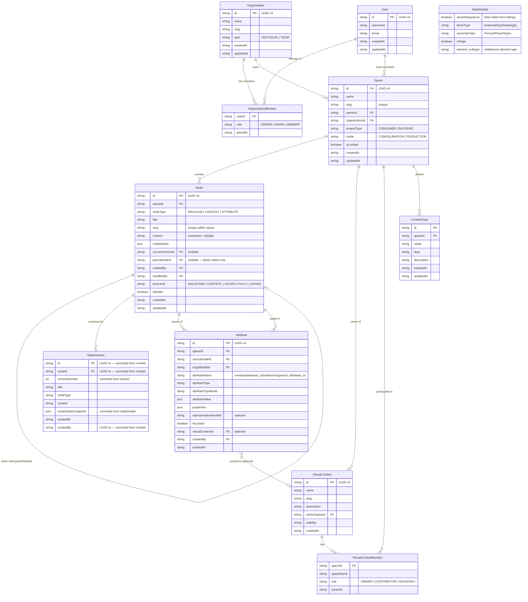

# Entity Relationship Diagram

**Filename:** `docs/uml/01-entity-relationship.md`
**Diagram type:** erDiagram
**Scope:** Full data model — Organization, User, Space, Node subtypes, Attribute edges, VirtualContext, NodeVersion, ContextType.

## Notes

- **Node subtypes** are discriminated by `nodeType`. CONTEXT nodes with a non-null `slug` have a canonical layer view at `/spaces/{spaceSlug}/context/{slug}`. REGULAR nodes navigate to `/spaces/{spaceSlug}/node/{id}`. Block nodes are REGULAR nodes with `parentNodeId` set and `nodeDetails.showInSpaceList = false`.
- **Attribute** represents directed edges (relationships) between Nodes and is not the same as `NodeType.ATTRIBUTE`. `NodeType.ATTRIBUTE` is a node subtype; `Attribute` is a separate entity representing named, typed edges.
- **NodeVersion** fields `id`, `nodeId`, `versionNumber`, `nodeDetailsSnapshot`, and `createdBy` are corrected per ADR F-14 — the backend-dtos.ts types at lines 195–205 contain incorrect types that must be fixed.
- **AttributeKey enum** corrected values per ADR F-16: `contains`, `depends_on`, `references`, `parent_of`, `relates_to`. Phantom values `triggers`, `next`, `calls` do not exist in the backend.
