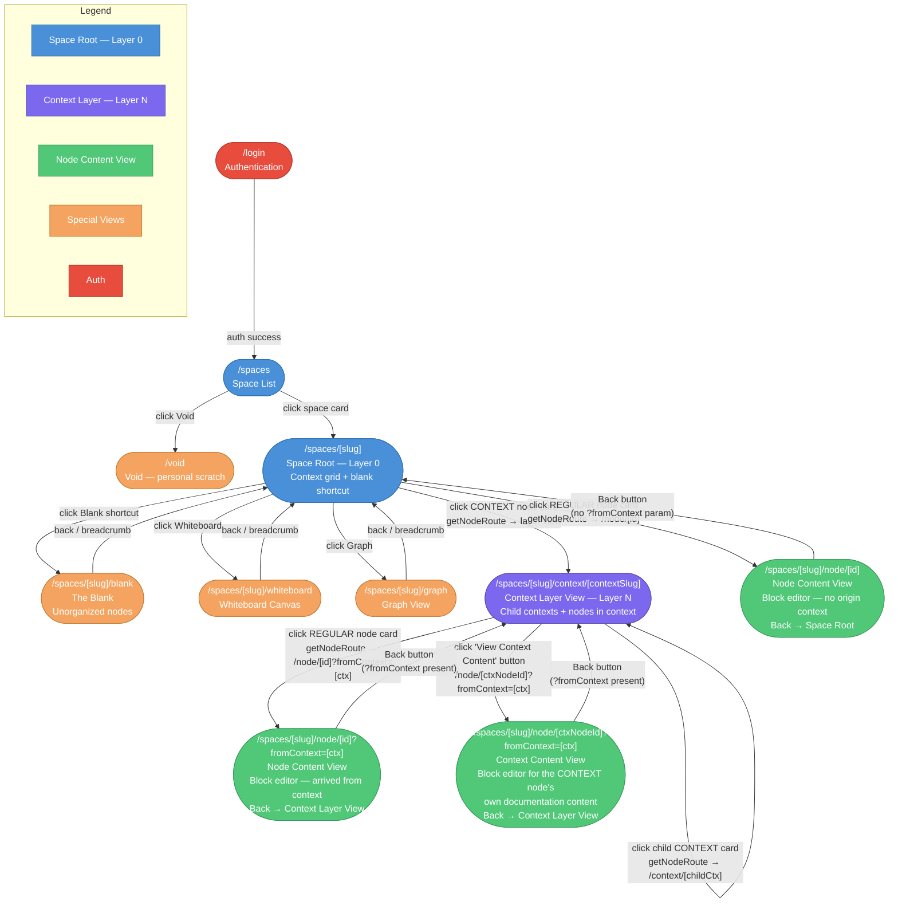

# Navigation Flow

**Filename:** `docs/uml/02-navigation-flow.md`
**Diagram type:** flowchart TD
**Scope:** Complete user navigation paths from login through all views, including both views for CONTEXT nodes and `?fromContext` back-path.

## Routing Rules

| Source | Trigger | Destination | URL Pattern |
|---|---|---|---|
| Anywhere | Auth success | Space List | `/spaces` |
| Space List | Click space card | Space Root | `/spaces/[slug]` |
| Space Root | Click CONTEXT node | Context Layer View | `/spaces/[slug]/context/[contextSlug]` |
| Space Root | Click REGULAR node | Node Content (no ctx) | `/spaces/[slug]/node/[id]` |
| Context Layer | Click REGULAR node | Node Content (with ctx) | `/spaces/[slug]/node/[id]?fromContext=[ctx]` |
| Context Layer | Click child CONTEXT | Child Context Layer | `/spaces/[slug]/context/[childCtxSlug]` |
| Context Layer | "View Context Content" | Context Content View | `/spaces/[slug]/node/[ctxNodeId]?fromContext=[ctx]` |
| Node Content (no ctx) | Back button | Space Root | `/spaces/[slug]` |
| Node Content (from ctx) | Back button | Context Layer | `/spaces/[slug]/context/[ctx]` |
| Context Content | Back button | Context Layer | `/spaces/[slug]/context/[ctx]` |

## `getNodeRoute` Routing Function (canonical — ADR-02)

All navigation to a node must use `getNodeRoute(spaceSlug, node, { fromContext? })` from `src/lib/routing.ts`:
- If `node.nodeType === NodeType.CONTEXT` and `node.slug` is set → returns layer view URL.
- Otherwise → returns `/spaces/${spaceSlug}/node/${node.id}` with optional `?fromContext` appended.
