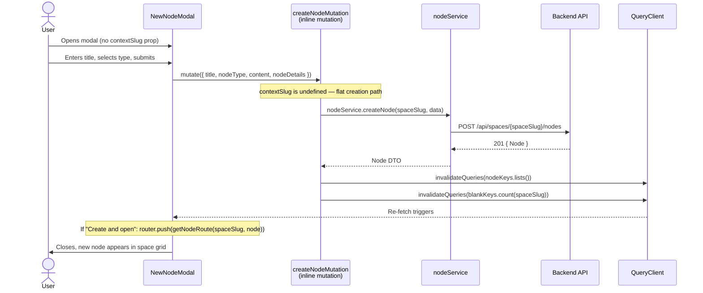
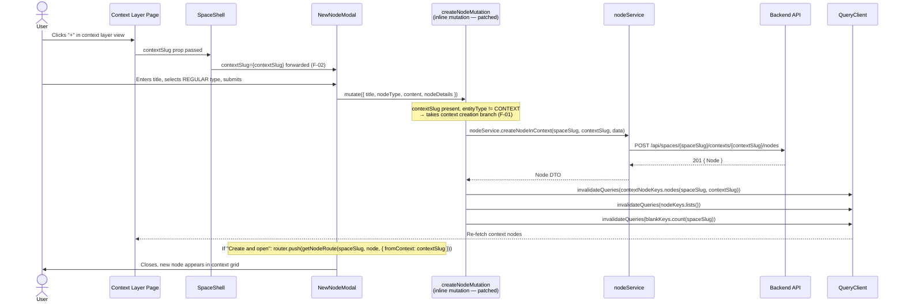
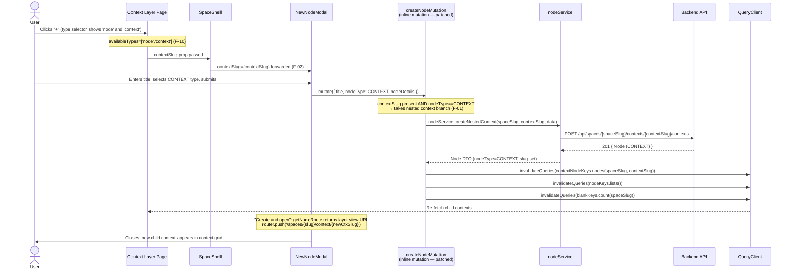
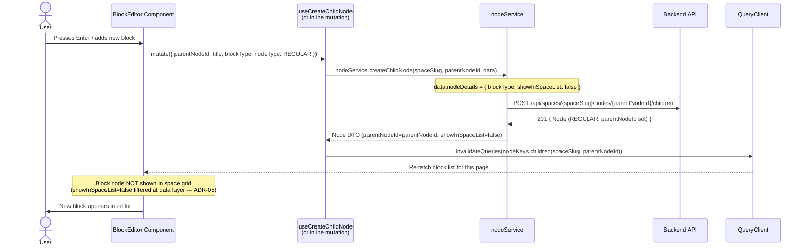

# API Sequence Diagram — Node Creation Flow

**Filename:** `docs/uml/03-node-creation-sequence.md`
**Diagram type:** sequenceDiagram
**Scope:** All four node creation scenarios — space-level, context-level, nested context, and block child — showing the full call chain from UI through service to backend and back to cache invalidation.

---

## Scenario A: Space-Level Node Creation (Flat / No Context)



---

## Scenario B: Context-Level Node Creation (Node inside a Context)



---

## Scenario C: Nested Context Creation (Context inside a Context)



---

## Scenario D: Block Child Node Creation (Block inside a Page Node)



---

## Creation Decision Tree (NewNodeModal — Post Fix F-01)

```mermaid
flowchart TD
    START([User submits NewNodeModal])
    CHECK_CTX{contextSlug\npresent?}
    CHECK_TYPE{entityType\n== 'context'?}
    NESTED[createNestedContext\nPOST /contexts/{ctx}/contexts]
    IN_CTX[createNodeInContext\nPOST /contexts/{ctx}/nodes]
    FLAT[createNode\nPOST /nodes\n@deprecated — lands in Blank]
    INVAL_CTX[Invalidate:\ncontextNodeKeys.nodes\nnodeKeys.lists\nblankKeys.count]
    INVAL_FLAT[Invalidate:\nnodeKeys.lists\nblankKeys.count]
    ROUTE[getNodeRoute\nfor Create-and-open]

    START --> CHECK_CTX
    CHECK_CTX -->|Yes| CHECK_TYPE
    CHECK_CTX -->|No| FLAT
    CHECK_TYPE -->|Yes CONTEXT| NESTED
    CHECK_TYPE -->|No REGULAR| IN_CTX
    NESTED --> INVAL_CTX
    IN_CTX --> INVAL_CTX
    FLAT --> INVAL_FLAT
    INVAL_CTX --> ROUTE
    INVAL_FLAT --> ROUTE
```
