# Component Architecture

**Filename:** `docs/uml/04-component-architecture.md`
**Diagram type:** flowchart TD
**Scope:** Page components, SpaceShell layout wrapper, NewNodeModal, NodeGrid, BlockEditor, and their data flow relationships via React Query hooks and Zustand stores.

```mermaid
flowchart TD
    subgraph PAGES["Next.js App Router Pages"]
        P_SPACES["app/spaces/page.tsx\nSpace List"]
        P_SPACE["app/spaces/[slug]/page.tsx\nSpace Root — Layer 0"]
        P_CTX["app/spaces/[slug]/context/[contextSlug]/page.tsx\nContext Layer View"]
        P_NODE["app/spaces/[slug]/node/[id]/page.tsx\nNode Content View"]
        P_BLANK["app/spaces/[slug]/blank/page.tsx\nThe Blank"]
        P_WB["app/spaces/[slug]/whiteboard/page.tsx\nWhiteboard"]
        P_GRAPH["app/spaces/[slug]/graph/page.tsx\nGraph View"]
        P_VOID["app/void/page.tsx\nVoid"]
    end

    subgraph SHELL["Shell — Layout Wrapper"]
        SPACESHELL["SpaceShell\nsrc/shell/components/SpaceShell.tsx\n---\nProps: title, spaceSlug, breadcrumbPath,\nsidebarItems, contextMenuNode,\ncontextSlug, newNodeModalAvailableTypes\n---\nManages: Header, Sidebar, ContextMenu,\nNewNodeModal trigger, DeleteSpaceModal,\nRenameModal"]
        HEADER["Header\nsrc/shell/components/Header.tsx\n+ button → NewNodeModal"]
        SIDEBAR["Sidebar\nsrc/shell/components/Sidebar.tsx\nTree navigation"]
        CTXMENU["ContextMenu\nsrc/shell/components/ContextMenu.tsx\nRight-click node actions"]
    end

    subgraph MODALS["Modals"]
        NNM["NewNodeModal\nsrc/shell/components/NewNodeModal.tsx\n---\nProps: isOpen, onClose, spaceSlug,\ndefaultType, availableTypes,\ncontextSlug (F-01)\n---\nBranches: flat / in-context / nested-ctx\nCalls: nodeService or spaceService"]
        DUPMOD["DuplicateNodeModal\nsrc/components/nodes/DuplicateNodeModal.tsx"]
        TPLMOD["NodeTemplateModal\nsrc/components/templates/NodeTemplateModal.tsx"]
        RENMOD["RenameModal\nsrc/shell/components/RenameModal.tsx"]
        DELMOD["DeleteSpaceModal\nsrc/shell/components/DeleteSpaceModal.tsx"]
    end

    subgraph CONTENT["Content Components"]
        NODEGRID["NodeGrid\nsrc/shell/components/NodeGrid.tsx\nCard grid rendering\nPasses: nodes[], onContextMenu"]
        NODECARD["NodeCard\nsrc/shell/components/NodeCard.tsx\nSingle node card\nRoutes via getNodeRoute"]
        BLOCKED["BlockEditor\nsrc/components/blocks/BlockEditor.tsx\nBlock-level content editing\nReads: useChildNodes\nWrites: useCreateChildNode,\nuseUpdateNode, useReorderChildren"]
        BREADCRUMB["Breadcrumb\nsrc/shell/components/Breadcrumb.tsx\nPath display + navigation"]
    end

    subgraph HOOKS["React Query Hooks"]
        H_NODES["useNodes\nsrc/hooks/api/useNodes.ts\nnodeKeys factory\nuseSpaceNodes, useNode,\nuseCreateNode, useUpdateNode,\nuseDeleteNode"]
        H_CTX["useContextNodes\nsrc/hooks/api/useContextNodes.ts\ncontextNodeKeys factory\nuseContextNodes, useChildContexts,\nuseCreateNodeInContext,\nuseCreateNestedContext,\nuseRemoveFromContext"]
        H_BLANK["useBlankNodes\nsrc/hooks/api/useBlankNodes.ts\nblankKeys factory\nuseBlankNodes, useBlankCount,\nuseAssignFromBlank"]
        H_SPACES["useSpaces\nsrc/hooks/api/useSpaces.ts\nspaceKeys factory\nuseSpaces, useSpaceBySlug"]
        H_ATTRS["useAttributes\nsrc/hooks/api/useAttributes.ts\nuseNodeAttributes, useIncomingAttributes,\nuseCreateAttribute, useDeleteAttribute"]
        H_VOID["useVoidNodes\nsrc/hooks/api/useVoidNodes.ts\nvoidKeys factory"]
    end

    subgraph STORES["Zustand Stores"]
        ST_NAV["navigationStore\nsrc/stores/navigationStore.ts\nscope, spaceId, spaceSlug,\ncontextSlug — navigation metadata\nNOT a back-nav target source (ADR-01)"]
        ST_NOTIF["notificationStore\nsrc/stores/notificationStore.ts\nToast notifications"]
        ST_ETYPE["entityType.store.ts\nUser-defined semantic types\nfor node labeling"]
    end

    subgraph SERVICES["API Services (src/services/api/)"]
        SVC_NODE["node.service.ts"]
        SVC_ATTR["attribute.service.ts"]
        SVC_SPACE["space.service.ts"]
        SVC_VOID["void.service.ts"]
    end

    subgraph ROUTING["Routing Utilities"]
        ROUTE_FN["getNodeRoute\nsrc/lib/routing.ts (NEW — F-03)\ngetNodeRoute(spaceSlug, node, options?)\nSingle canonical URL builder"]
    end

    %% Page → Shell wiring
    P_SPACE --> SPACESHELL
    P_CTX --> SPACESHELL
    P_BLANK --> SPACESHELL
    P_NODE --> BREADCRUMB
    P_NODE --> BLOCKED

    %% Shell internal
    SPACESHELL --> HEADER
    SPACESHELL --> SIDEBAR
    SPACESHELL --> CTXMENU
    SPACESHELL --> NNM
    SPACESHELL --> RENMOD
    SPACESHELL --> DELMOD
    HEADER -->|"+ click"| NNM

    %% Shell → Content
    P_SPACE --> NODEGRID
    P_CTX --> NODEGRID
    NODEGRID --> NODECARD
    NODECARD --> ROUTE_FN

    %% Modal wiring
    NNM --> DUPMOD
    NNM --> TPLMOD
    NNM --> ROUTE_FN

    %% Hooks wiring
    P_SPACE --> H_NODES
    P_SPACE --> H_SPACES
    P_CTX --> H_CTX
    P_CTX --> H_NODES
    P_NODE --> H_NODES
    P_NODE --> H_ATTRS
    P_BLANK --> H_BLANK
    P_GRAPH --> H_ATTRS
    P_VOID --> H_VOID
    BLOCKED --> H_NODES
    NNM --> H_NODES
    NNM --> H_CTX
    NNM --> H_BLANK

    %% Store wiring
    NNM --> ST_NAV
    NNM --> ST_NOTIF
    SPACESHELL --> ST_NAV
    SPACESHELL --> ST_NOTIF

    %% Hook → Service
    H_NODES --> SVC_NODE
    H_CTX --> SVC_NODE
    H_BLANK --> SVC_NODE
    H_SPACES --> SVC_SPACE
    H_ATTRS --> SVC_ATTR
    H_VOID --> SVC_VOID

    classDef page fill:#4A90D9,color:#fff,stroke:#2C6FAC
    classDef shell fill:#7B68EE,color:#fff,stroke:#5A4DB3
    classDef modal fill:#E67E22,color:#fff,stroke:#CA6F1E
    classDef content fill:#27AE60,color:#fff,stroke:#1E8449
    classDef hook fill:#2ECC71,color:#fff,stroke:#239B56
    classDef store fill:#E74C3C,color:#fff,stroke:#B03A2E
    classDef service fill:#95A5A6,color:#fff,stroke:#717D7E
    classDef routing fill:#F1C40F,color:#333,stroke:#D4AC0D

    class P_SPACES,P_SPACE,P_CTX,P_NODE,P_BLANK,P_WB,P_GRAPH,P_VOID page
    class SPACESHELL,HEADER,SIDEBAR,CTXMENU shell
    class NNM,DUPMOD,TPLMOD,RENMOD,DELMOD modal
    class NODEGRID,NODECARD,BLOCKED,BREADCRUMB content
    class H_NODES,H_CTX,H_BLANK,H_SPACES,H_ATTRS,H_VOID hook
    class ST_NAV,ST_NOTIF,ST_ETYPE store
    class SVC_NODE,SVC_ATTR,SVC_SPACE,SVC_VOID service
    class ROUTE_FN routing
```

## Key Data Flow Rules

| Component | Reads from | Writes to |
|---|---|---|
| `SpaceShell` | `navigationStore` (scope), `notificationStore` | `navigationStore` (navigate*) |
| `NewNodeModal` | `navigationStore` (scope → resolvedAvailableTypes), `entityType.store` | `nodeKeys`, `contextNodeKeys`, `blankKeys` via invalidation |
| `BlockEditor` | `useChildNodes` (not currently — efficiency bug per ADR) | `useCreateChildNode`, `useUpdateNode`, `useReorderChildren` |
| `NodeCard` | node prop | `getNodeRoute` → `router.push` |
| Node detail page | `useSearchParams().get('fromContext')` | back nav target (ADR-01) |

## ADR-01 Note: URL is the sole source of truth

`navigationStore` holds the current scope and space metadata for UI state (header label, modal type filtering). It does NOT own the back-navigation target — that is `?fromContext` in the URL, read by `useSearchParams()` in the node detail page.
