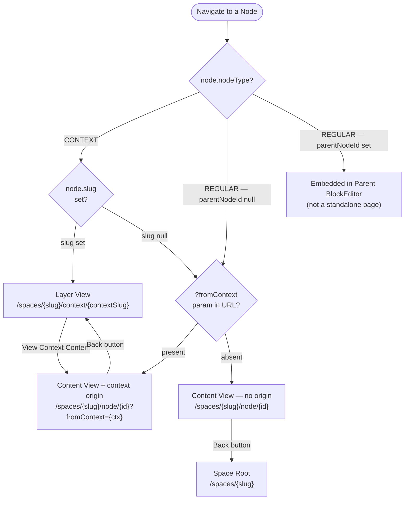

# View State Machine

**Filename:** `docs/uml/05-view-state-machine.md`
**Diagram type:** stateDiagram-v2
**Scope:** State machine for a CONTEXT node (two views — layer and content) and a REGULAR node (single content view). Includes transition triggers and guards.

---

## CONTEXT Node State Machine

```mermaid
stateDiagram-v2
    [*] --> Unresolved : URL contains node reference

    state "Unresolved" as Unresolved {
        note right of Unresolved
            System checks node.nodeType
            and node.slug to determine
            initial destination
        end note
    }

    state "Layer View" as LayerView {
        note right of LayerView
            URL: /spaces/{spaceSlug}/context/{contextSlug}
            Component: app/spaces/[slug]/context/[contextSlug]/page.tsx
            Shows: child contexts + nodes assigned to this context
            Header: "+" opens NewNodeModal(contextSlug, availableTypes=['node','context'])
            Contains: "View Context Content" button (F-09)
        end note

        [*] --> LayerView_Loading : page mount
        LayerView_Loading --> LayerView_Ready : data fetched\n(useContextNodes, useChildContexts)
        LayerView_Ready --> LayerView_Loading : user triggers refetch
    }

    state "Content View" as ContentView {
        note right of ContentView
            URL: /spaces/{spaceSlug}/node/{ctxNodeId}?fromContext={contextSlug}
            Component: app/spaces/[slug]/node/[id]/page.tsx
            Shows: Block editor for the CONTEXT node's own documentation
            Back button: reads ?fromContext → navigates to Layer View
            Breadcrumb: Spaces > Space > Context (clickable) > Node Title
        end note

        [*] --> ContentView_Loading : page mount
        ContentView_Loading --> ContentView_Ready : data fetched\n(useNode, useNodeAttributes)
        ContentView_Ready --> ContentView_Loading : save / update triggers refetch
    }

    Unresolved --> LayerView : [node.nodeType == CONTEXT\nAND node.slug is set]\ngetNodeRoute → /context/{slug}

    LayerView --> ContentView : User clicks\n"View Context Content" button\n→ router.push(/node/{ctxNodeId}?fromContext={ctx})

    ContentView --> LayerView : User clicks Back button\n[?fromContext param present]\n→ router.push(/context/{fromContext})

    ContentView --> [*] : User navigates away\n(browser back / link)
    LayerView --> [*] : User navigates away\n(browser back / link)
```

---

## REGULAR Node State Machine

```mermaid
stateDiagram-v2
    [*] --> Unresolved_R : URL contains node reference

    state "Unresolved" as Unresolved_R {
        note right of Unresolved_R
            System checks node.nodeType.
            REGULAR nodes have ONE view — the content view.
            canRenderAsPage = (nodeType === 'REGULAR')
        end note
    }

    state "Content View (no origin context)" as RegularNoCtx {
        note right of RegularNoCtx
            URL: /spaces/{spaceSlug}/node/{id}
            (no ?fromContext param)
            Back button → Space Root /spaces/{spaceSlug}
            Breadcrumb: Spaces > Space > Node Title
        end note

        [*] --> Rdy_NoCtx : page mount
        Rdy_NoCtx --> Rdy_NoCtx : content edit / save
    }

    state "Content View (from context)" as RegularFromCtx {
        note right of RegularFromCtx
            URL: /spaces/{spaceSlug}/node/{id}?fromContext={ctx}
            Back button reads ?fromContext → Context Layer View
            Breadcrumb: Spaces > Space > Context (clickable) > Node Title
        end note

        [*] --> Rdy_FromCtx : page mount
        Rdy_FromCtx --> Rdy_FromCtx : content edit / save
    }

    Unresolved_R --> RegularNoCtx : [node.nodeType == REGULAR\nAND no ?fromContext in URL]

    Unresolved_R --> RegularFromCtx : [node.nodeType == REGULAR\nAND ?fromContext present in URL]

    RegularNoCtx --> [*] : Back button\n→ /spaces/{spaceSlug}

    RegularFromCtx --> [*] : Back button\n→ /spaces/{spaceSlug}/context/{fromContext}
```

---

## Block Node (REGULAR with parentNodeId set)

```mermaid
stateDiagram-v2
    [*] --> BlockNode : parentNodeId is set\nshowInSpaceList = false

    state "Embedded Block" as BlockNode {
        note right of BlockNode
            Block nodes do NOT have their own page URL.
            They are rendered inline inside their parent node's BlockEditor.
            They are filtered out of all node list views (ADR-05).
            They are created via POST /nodes/{parentNodeId}/children.
        end note
    }

    BlockNode --> [*] : Parent node navigated away
```

---

## Node View Resolution Summary



## Transition Guards Reference

| From | To | Guard (condition) |
|---|---|---|
| Anywhere → CONTEXT node | Layer View | `node.nodeType === NodeType.CONTEXT && node.slug != null` |
| Layer View | Content View | User explicitly clicks "View Context Content" button |
| Content View | Layer View | Back button clicked AND `?fromContext` param present |
| Content View | Space Root | Back button clicked AND `?fromContext` param absent |
| REGULAR node | Content View (from ctx) | `?fromContext` param present in URL at page load |
| REGULAR node | Content View (no ctx) | `?fromContext` param absent from URL |
