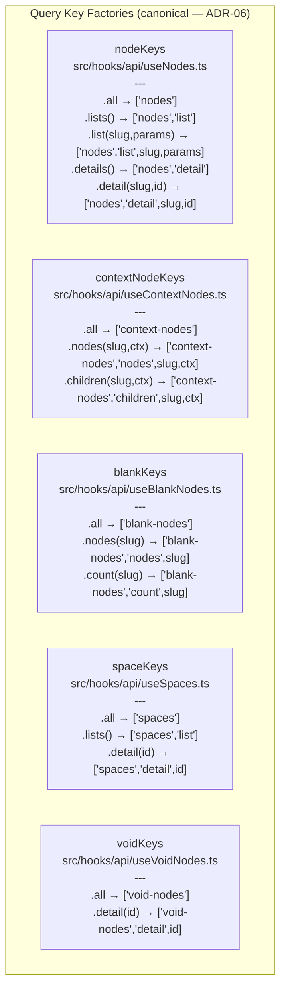
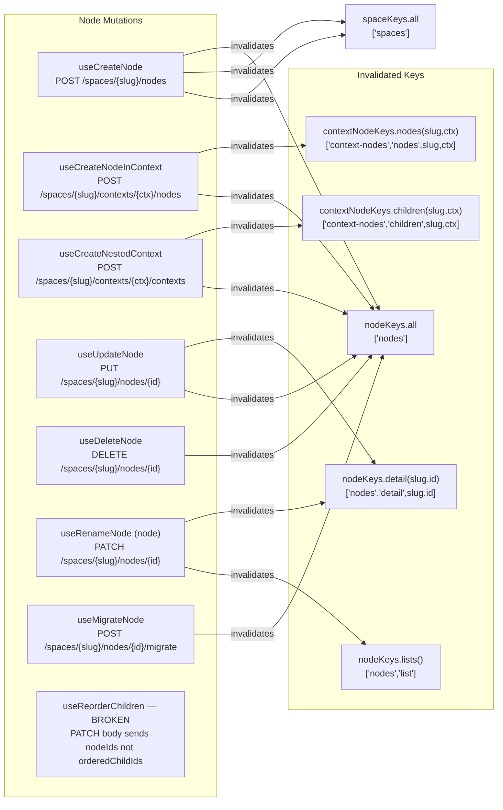
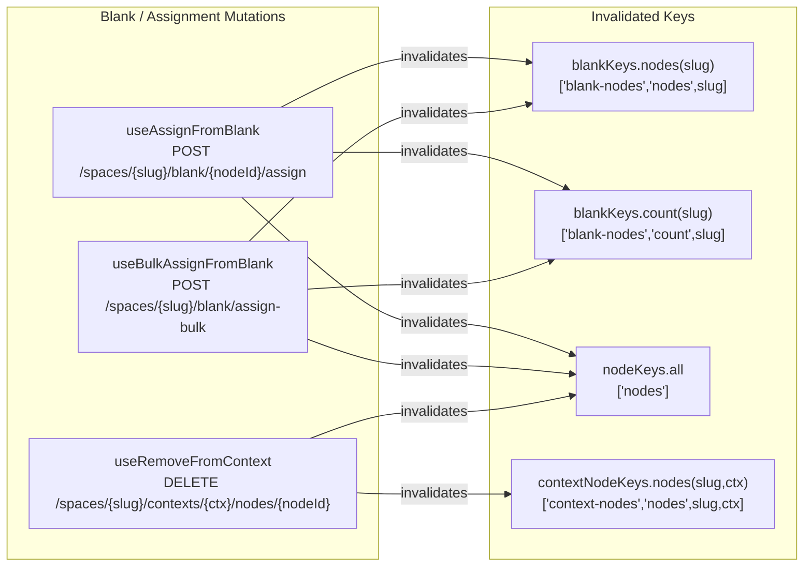
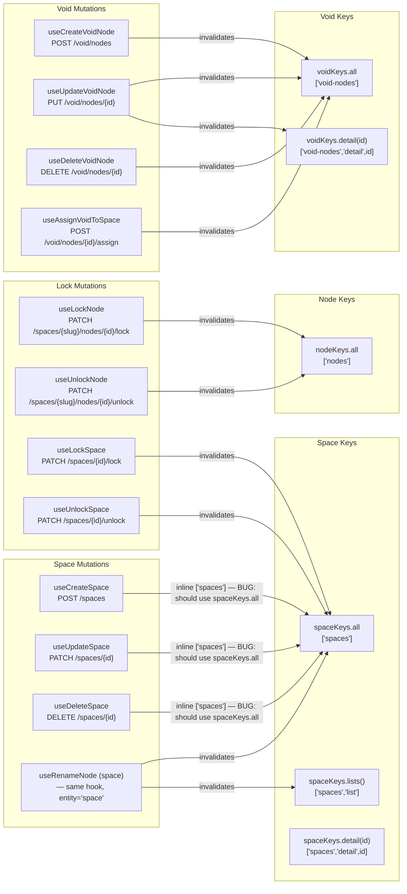
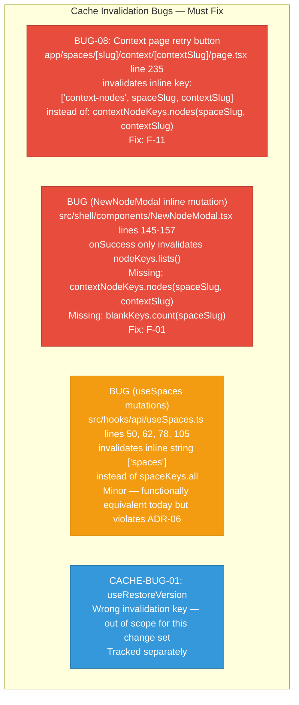

# Cache Invalidation Flow

**Filename:** `docs/uml/06-cache-invalidation.md`
**Diagram type:** flowchart LR
**Scope:** Complete mutation-to-cache-invalidation mapping. Shows which query keys each mutation invalidates after success, derived from live hook implementations. Bug annotations mark incorrect patterns (per ADR-06 / BUG-08).

---

## Query Key Factories Reference

---

## Node Mutations — Invalidation Map

---

## Blank and Context Assignment Mutations

---

## Space, Lock, and Void Mutations

---

## Known Bugs in Cache Invalidation (per ADR-06)

---

## Complete Mutation-to-Key Matrix

| Mutation Hook | Endpoint | Invalidates |
|---|---|---|
| `useCreateNode` | `POST /spaces/{slug}/nodes` | `nodeKeys.all`, `spaceKeys.all` |
| `useCreateNodeInContext` | `POST /spaces/{slug}/contexts/{ctx}/nodes` | `contextNodeKeys.nodes(slug,ctx)`, `nodeKeys.all` |
| `useCreateNestedContext` | `POST /spaces/{slug}/contexts/{ctx}/contexts` | `contextNodeKeys.children(slug,ctx)`, `nodeKeys.all` |
| `useUpdateNode` | `PUT /spaces/{slug}/nodes/{id}` | `nodeKeys.detail(slug,id)`, `nodeKeys.all` |
| `useDeleteNode` | `DELETE /spaces/{slug}/nodes/{id}` | `nodeKeys.all` |
| `useRenameNode` (node) | `PATCH ...` | `nodeKeys.detail(slug,id)`, `nodeKeys.lists()` |
| `useRenameNode` (space) | `PATCH ...` | `spaceKeys.all`, `spaceKeys.lists()` |
| `useMigrateNode` | `POST /spaces/{slug}/nodes/{id}/migrate` | `nodeKeys.all` |
| `useAssignFromBlank` | `POST /spaces/{slug}/blank/{id}/assign` | `blankKeys.nodes(slug)`, `blankKeys.count(slug)`, `nodeKeys.all` |
| `useBulkAssignFromBlank` | `POST /spaces/{slug}/blank/assign-bulk` | `blankKeys.nodes(slug)`, `blankKeys.count(slug)`, `nodeKeys.all` |
| `useRemoveFromContext` | `DELETE /spaces/{slug}/contexts/{ctx}/nodes/{id}` | `contextNodeKeys.nodes(slug,ctx)`, `nodeKeys.all` |
| `useLockNode` | `PATCH .../lock` | `nodeKeys.all` |
| `useUnlockNode` | `PATCH .../unlock` | `nodeKeys.all` |
| `useLockSpace` | `PATCH /spaces/{id}/lock` | `spaceKeys.all` |
| `useUnlockSpace` | `PATCH /spaces/{id}/unlock` | `spaceKeys.all` |
| `useCreateVoidNode` | `POST /void/nodes` | `voidKeys.all` |
| `useUpdateVoidNode` | `PUT /void/nodes/{id}` | `voidKeys.all`, `voidKeys.detail(id)` |
| `useDeleteVoidNode` | `DELETE /void/nodes/{id}` | `voidKeys.all` |
| `useAssignVoidToSpace` | `POST /void/nodes/{id}/assign` | `voidKeys.all` |
| `NewNodeModal inline mutation` (pre-fix) | `POST /spaces/{slug}/nodes` | `nodeKeys.lists()` only — **MISSING** `contextNodeKeys`, `blankKeys.count` |
| Context page retry button (pre-fix) | N/A — just a re-fetch trigger | inline `['context-nodes', slug, ctx]` — **WRONG KEY** |
