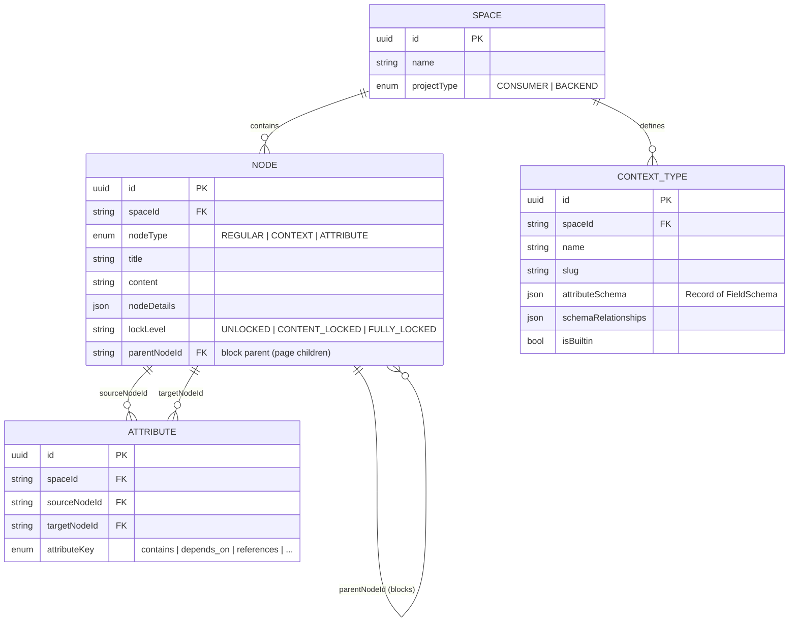
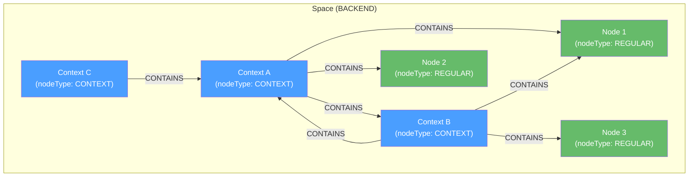
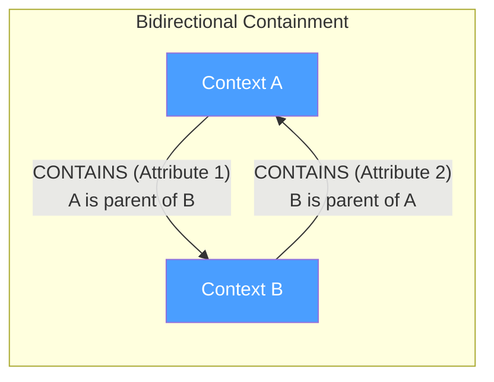
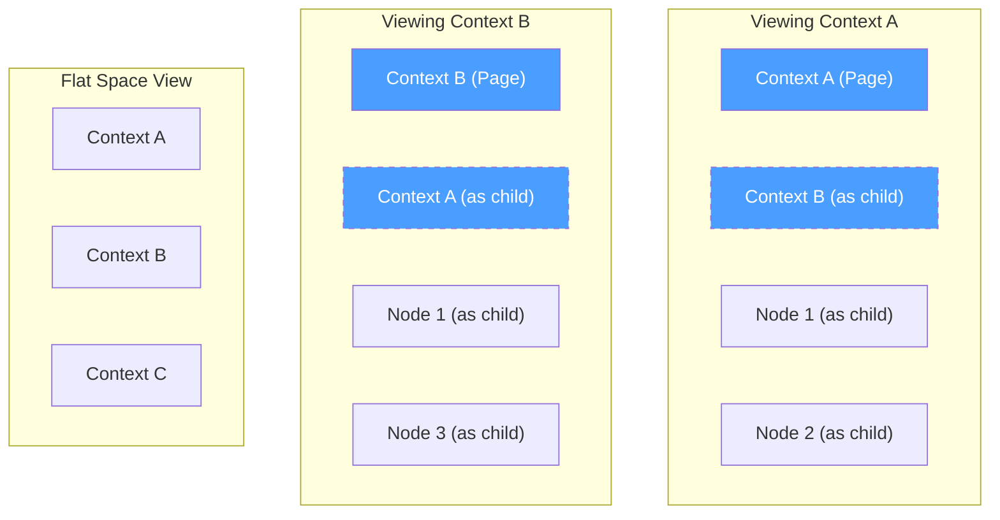
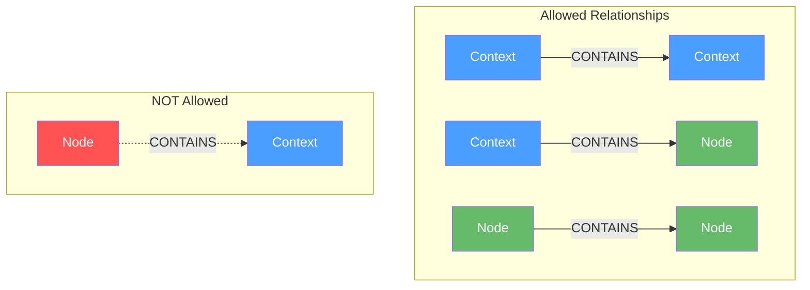
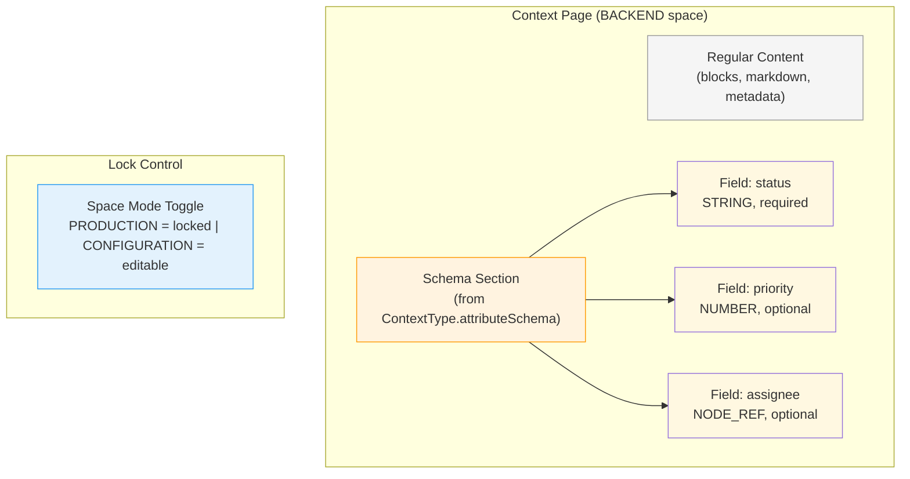
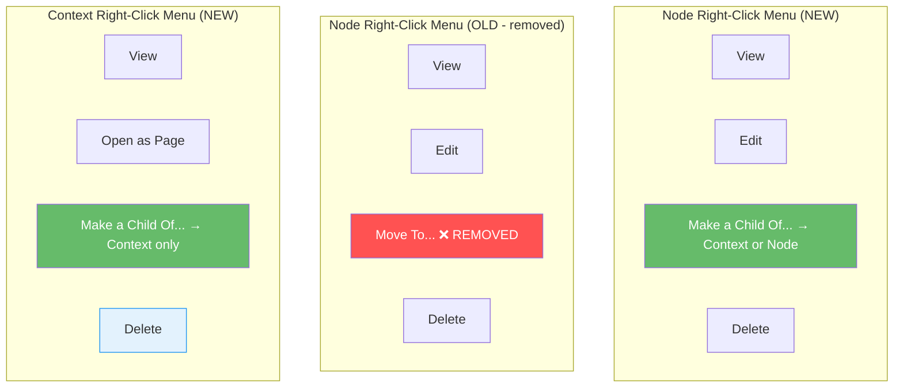

## Context

Mujarrad's data model treats everything as nodes (`nodeType: REGULAR | CONTEXT | ATTRIBUTE`). Contexts are nodes that act as logical containers for other nodes via `CONTAINS` attributes. Currently, containment is single-parent and tree-shaped. This change introduces multi-parent containment (superposition) and bidirectional context relationships, alongside schema visibility in context pages for backend-type spaces.

## Goals / Non-Goals

- Goals:
  - Allow nodes to belong to multiple contexts and multiple parent nodes simultaneously
  - Allow contexts to contain other contexts, including bidirectional containment (A contains B, B contains A)
  - Display `ContextType.attributeSchema` as visual field items on context pages in BACKEND spaces
  - Schema locking via space mode (PRODUCTION locks schemas, CONFIGURATION unlocks)
  - Replace "Move To" with "Make a Child Of" in context menus

- Non-Goals:
  - Changing the backend database schema (use existing `Attribute` relationship model)
  - Creating new node types or entity tables
  - Implementing schema validation/enforcement on child nodes (future work)
  - Full graph cycle detection — circular containment between contexts is intentional

## Entity Relationship Model

### Node Types (all in one `nodes` table)

### Containment Relationships (Superposition)

**Key observations from the diagram above:**
- Node 1 is contained by both Context A and Context B (multi-parent)
- Context A contains Context B, AND Context B contains Context A (bidirectional)
- Context C contains Context A (one-directional)
- All relationships use the existing `Attribute` entity with `attributeKey: 'contains'`

### Bidirectional Context Containment (Superposition Detail)

This creates **two separate `Attribute` rows** in the database:
1. `{ sourceNodeId: A, targetNodeId: B, attributeKey: 'contains' }`
2. `{ sourceNodeId: B, targetNodeId: A, attributeKey: 'contains' }`

Each is an independent relationship. There is no hierarchy tree — it's a directed graph.

### What the User Sees

- Context B appears in the flat space view AND inside Context A's view
- Context A appears in the flat space view AND inside Context B's view
- Node 1 appears inside both Context A and Context B views

### Containment Rules Summary

| Parent | Child | Allowed | Multiple Parents | Bidirectional |
|--------|-------|---------|-----------------|---------------|
| Context | Context | Yes | Yes | Yes |
| Context | Node | Yes | Yes | N/A |
| Node | Node | Yes | Yes | N/A |
| Node | Context | **No** | - | - |

### Schema View (BACKEND spaces only)

### Context Menu Changes

## Decisions

- **Use existing `Attribute` with `CONTAINS` key for all containment**: No new relationship types needed. Multi-parent is simply multiple `CONTAINS` attributes pointing to the same target from different sources. Bidirectional is two `CONTAINS` attributes with swapped source/target.
- **No backend cycle prevention**: Circular containment between contexts is intentional (superposition). The backend does not prevent cycles. The frontend MUST handle cycles gracefully in rendering (track visited IDs, show "already in view" indicator).
- **Schema from `ContextType.attributeSchema`**: No new backend entities. The frontend renders the existing JSONB field as visual items. Context nodes link to ContextType via `context_type_id` FK.
- **Schema locking via space mode**: No per-entity lock boolean. Space mode PRODUCTION = schemas locked (CONTEXT nodes CONTENT_LOCKED, blocks FULLY_LOCKED). CONFIGURATION = editable. Toggle via `PATCH /api/spaces/{id}` with mode field.
- **"Make a Child Of" replaces "Move To"**: Semantically, this is adding a relationship, not relocating. The old node stays in all its current parents and gains a new one.
- **Duplicate CONTAINS prevention**: Backend returns 409 if the same source→target CONTAINS already exists. Frontend should handle this gracefully (e.g., show "already a child of this context").
- **Remove from Context**: `DELETE /api/spaces/{slug}/contexts/{ctx}/nodes/{nodeId}` removes the CONTAINS relationship. Backend auto-assigns to Context-Less (Blank) if last context. Frontend shows "Remove from [Context]" in node context menu when viewed within a context.

## Risks / Trade-offs

- **Infinite rendering loops**: Bidirectional context containment could cause infinite recursion when rendering nested views. Mitigation: track visited context IDs during rendering and stop recursion when a cycle is detected.
- **Performance with many parents**: A node appearing in many contexts means multiple queries or a more complex query to find all parents. Mitigation: the existing `Attribute` query model already supports this; UI just needs to handle multiple results.
- **UX confusion**: Users might not expect Context B to appear inside Context A and vice versa. Mitigation: visual indicators (badges, icons) showing that a context/node exists in multiple places.
- **"Make a Child Of" discoverability**: Users accustomed to "Move To" need to understand the semantic change. Mitigation: tooltip explaining the difference.

## Resolved Questions

- **Visual multi-parent indicator**: Yes — nodes/contexts with multiple parents show a badge indicating parent count. Covered in task 5.4.
- **Removing a child relationship**: "Remove from [Context Name]" action in context menu. Calls `DELETE /api/spaces/{slug}/contexts/{ctx}/nodes/{nodeId}`. Does not delete the node.
- **Flat space view deduplication**: The flat space context list always shows each context exactly once, regardless of how many parent contexts it has. No duplication in the flat view.
