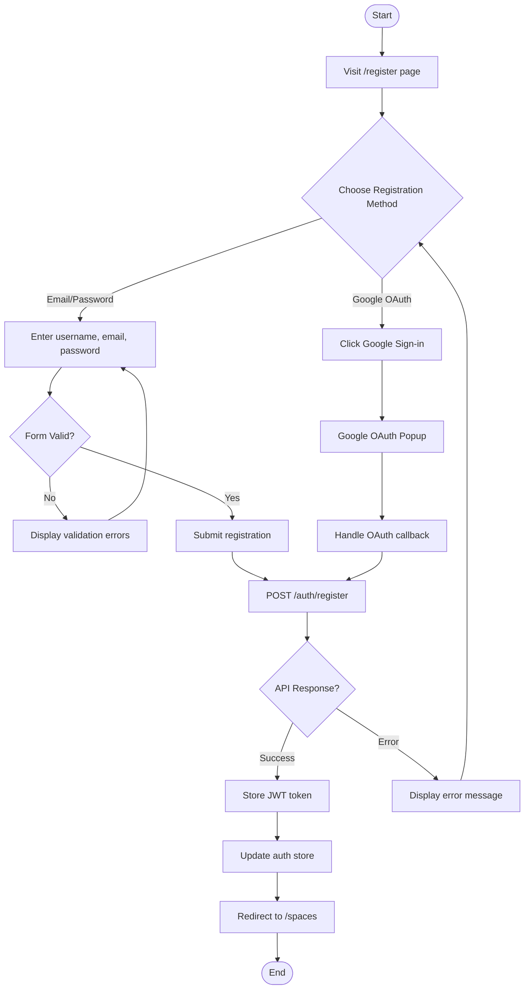
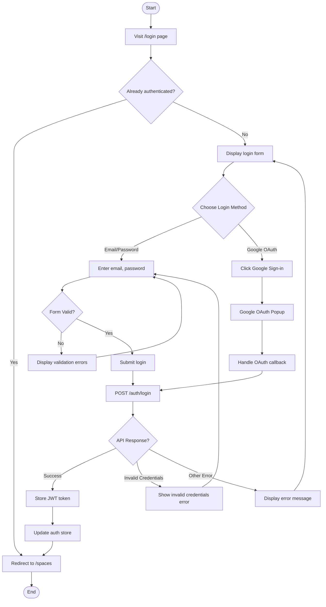
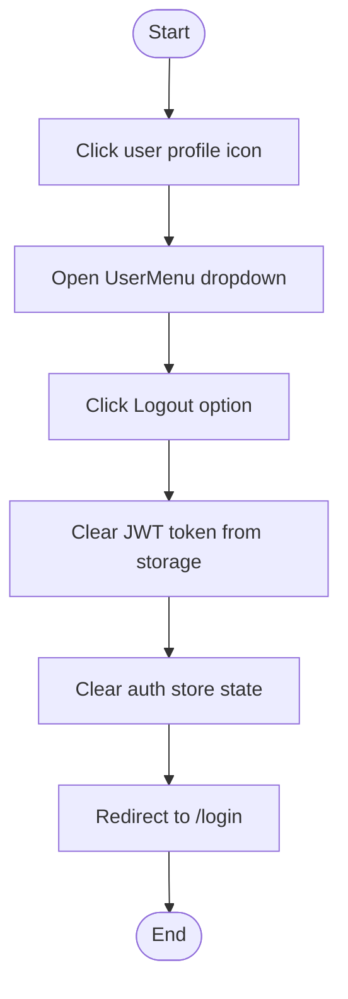
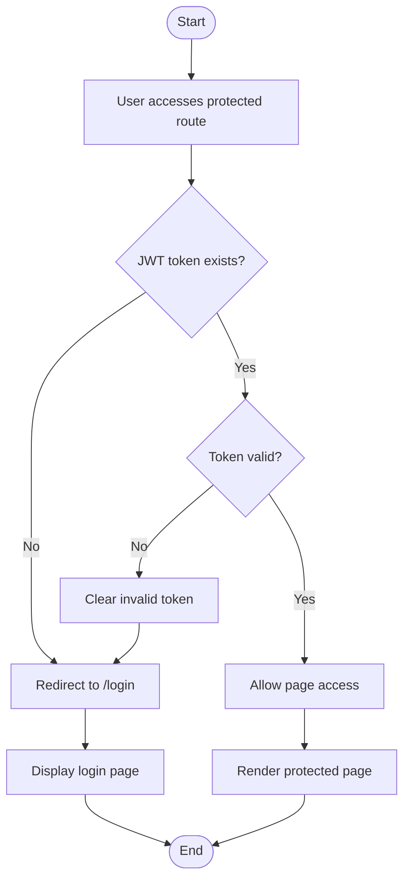
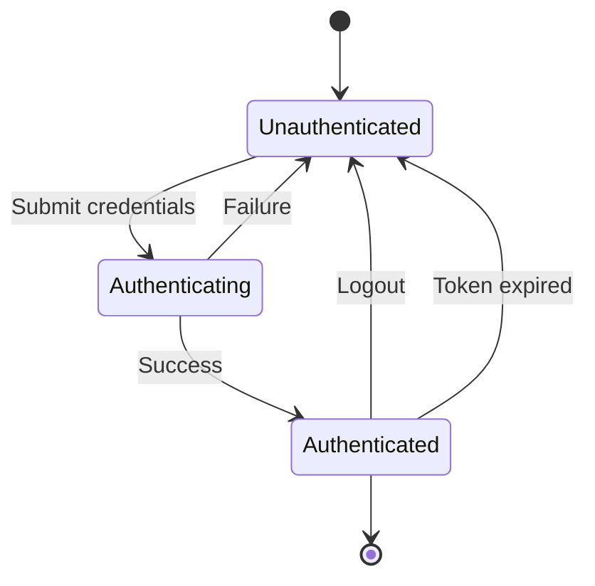

# Authentication Journey - Activity Diagrams

## 1.1 User Registration Flow

```mermaid
flowchart TD
    Start([Start]) --> VisitRegister[Visit /register page]
    VisitRegister --> ChooseMethod{Choose Registration Method}

    ChooseMethod -->|Email/Password| EnterDetails[Enter username, email, password]
    ChooseMethod -->|Google OAuth| GoogleAuth[Click Google Sign-in]

    EnterDetails --> ValidateForm{Form Valid?}
    ValidateForm -->|No| ShowErrors[Display validation errors]
    ShowErrors --> EnterDetails

    ValidateForm -->|Yes| SubmitForm[Submit registration]
    SubmitForm --> APICall[POST /auth/register]

    GoogleAuth --> GooglePopup[Google OAuth Popup]
    GooglePopup --> GoogleCallback[Handle OAuth callback]
    GoogleCallback --> APICall

    APICall --> CheckResponse{API Response?}
    CheckResponse -->|Success| StoreToken[Store JWT token]
    CheckResponse -->|Error| ShowAPIError[Display error message]
    ShowAPIError --> ChooseMethod

    StoreToken --> SetAuthState[Update auth store]
    SetAuthState --> RedirectSpaces[Redirect to /spaces]
    RedirectSpaces --> End([End])
```

## 1.2 User Login Flow

```mermaid
flowchart TD
    Start([Start]) --> VisitLogin[Visit /login page]
    VisitLogin --> CheckAuth{Already authenticated?}

    CheckAuth -->|Yes| RedirectSpaces[Redirect to /spaces]
    CheckAuth -->|No| ShowForm[Display login form]

    ShowForm --> ChooseMethod{Choose Login Method}

    ChooseMethod -->|Email/Password| EnterCredentials[Enter email, password]
    ChooseMethod -->|Google OAuth| GoogleAuth[Click Google Sign-in]

    EnterCredentials --> ValidateForm{Form Valid?}
    ValidateForm -->|No| ShowErrors[Display validation errors]
    ShowErrors --> EnterCredentials

    ValidateForm -->|Yes| SubmitLogin[Submit login]
    SubmitLogin --> APILogin[POST /auth/login]

    GoogleAuth --> GooglePopup[Google OAuth Popup]
    GooglePopup --> GoogleCallback[Handle OAuth callback]
    GoogleCallback --> APILogin

    APILogin --> CheckResponse{API Response?}
    CheckResponse -->|Success| StoreToken[Store JWT token]
    CheckResponse -->|Invalid Credentials| ShowCredError[Show invalid credentials error]
    CheckResponse -->|Other Error| ShowAPIError[Display error message]

    ShowCredError --> EnterCredentials
    ShowAPIError --> ShowForm

    StoreToken --> SetAuthState[Update auth store]
    SetAuthState --> RedirectSpaces
    RedirectSpaces --> End([End])
```

## 1.3 Logout Flow

```mermaid
flowchart TD
    Start([Start]) --> ClickProfile[Click user profile icon]
    ClickProfile --> OpenMenu[Open UserMenu dropdown]
    OpenMenu --> ClickLogout[Click Logout option]
    ClickLogout --> ClearToken[Clear JWT token from storage]
    ClearToken --> ClearAuthState[Clear auth store state]
    ClearAuthState --> RedirectLogin[Redirect to /login]
    RedirectLogin --> End([End])
```

## 1.4 Protected Route Check

```mermaid
flowchart TD
    Start([Start]) --> AccessRoute[User accesses protected route]
    AccessRoute --> CheckToken{JWT token exists?}

    CheckToken -->|No| RedirectLogin[Redirect to /login]
    CheckToken -->|Yes| ValidateToken{Token valid?}

    ValidateToken -->|No| ClearToken[Clear invalid token]
    ClearToken --> RedirectLogin

    ValidateToken -->|Yes| AllowAccess[Allow page access]

    RedirectLogin --> ShowLogin[Display login page]
    ShowLogin --> End([End])

    AllowAccess --> RenderPage[Render protected page]
    RenderPage --> End
```

## State Transitions

```mermaid
stateDiagram-v2
    [*] --> Unauthenticated

    Unauthenticated --> Authenticating: Submit credentials
    Authenticating --> Authenticated: Success
    Authenticating --> Unauthenticated: Failure

    Authenticated --> Unauthenticated: Logout
    Authenticated --> Unauthenticated: Token expired

    Authenticated --> [*]
```
