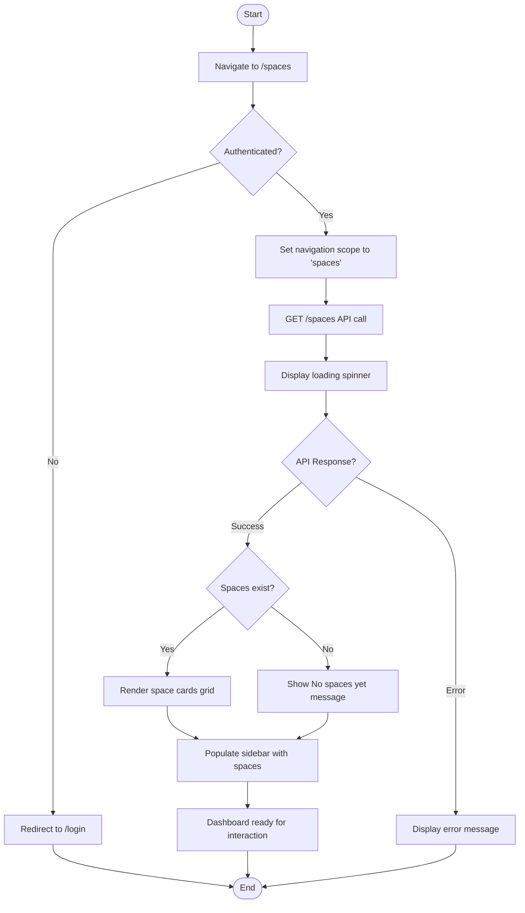
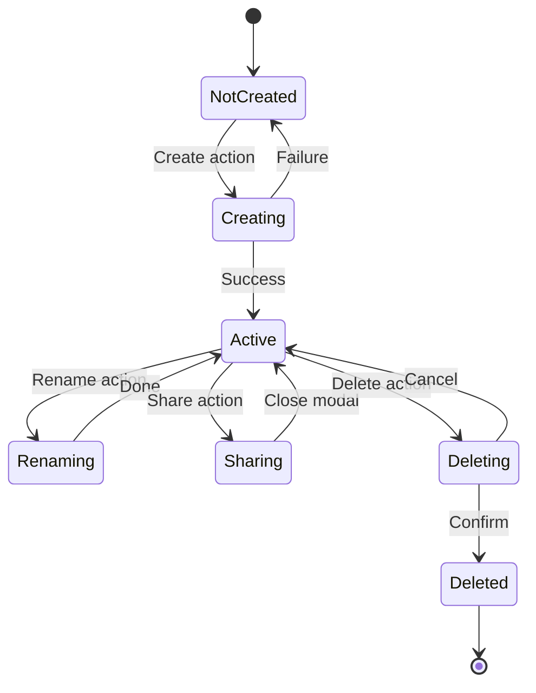

# Space Management Journey - Activity Diagrams

## 2.1 View Spaces Dashboard



## 2.2 Create Space via Modal

```mermaid
flowchart TD
    Start([Start]) --> TriggerCreate{Trigger source?}

    TriggerCreate -->|Header Add Button| OpenAddMenu[Open AddMenuDropdown]
    TriggerCreate -->|Context action| DirectOpen[Direct modal open]

    OpenAddMenu --> ClickCreateSpace["Click Create Space"]
    ClickCreateSpace --> DirectOpen

    DirectOpen --> OpenModal[Open NewNodeModal]
    OpenModal --> SetDefaults[Set defaultType='space', availableTypes=['space']]

    SetDefaults --> ShowForm["Display space creation form"]
    ShowForm --> EnterTitle[User enters space title]

    EnterTitle --> ClickCreate{User action?}
    ClickCreate -->|Click Create| ValidateTitle{Title valid?}
    ClickCreate -->|Press Enter| ValidateTitle
    ClickCreate -->|Click Close| CloseModal[Close modal]
    ClickCreate -->|Click Expand| ExpandAction[Create and navigate]

    ValidateTitle -->|Empty| UseDefault["Use Untitled as name"]
    ValidateTitle -->|Valid| UseEntered[Use entered title]

    UseDefault --> CreateSpace
    UseEntered --> CreateSpace[POST /spaces API call]

    CreateSpace --> ShowSpinner[Show loading spinner]
    ShowSpinner --> CheckResponse{API Response?}

    CheckResponse -->|Success| InvalidateQuery[Invalidate spaces query]
    CheckResponse -->|Error| ShowError[Display error message]

    InvalidateQuery --> CloseModal
    CloseModal --> NavigateNew[Navigate to /spaces/{slug}]

    ExpandAction --> CreateSpace

    NavigateNew --> End([End])
    ShowError --> ShowForm
```

## 2.3 Quick Create Space from Sidebar

```mermaid
flowchart TD
    Start([Start]) --> HoverItem[Hover over space item in sidebar]
    HoverItem --> ShowAddButton[Show + button on hover]

    ShowAddButton --> ClickAdd{User clicks +?}
    ClickAdd -->|No| MouseLeave[Mouse leaves item]
    ClickAdd -->|Yes| CheckLevel{At spaces level?}

    MouseLeave --> HideAddButton[Hide + button]
    HideAddButton --> End([End])

    CheckLevel -->|Yes| QuickCreate[Call onQuickCreateSpace]
    CheckLevel -->|No| AddChild[Call onAddChild for node]

    QuickCreate --> CreateAPI["POST /spaces with name=Untitled"]
    CreateAPI --> ShowLoading[Show loading state]

    ShowLoading --> CheckResponse{API Response?}
    CheckResponse -->|Success| RefreshList[Refresh spaces list]
    CheckResponse -->|Error| LogError[Log error to console]

    RefreshList --> NavigateNew[Navigate to /spaces/{slug}]
    NavigateNew --> End

    AddChild --> End
    LogError --> End
```

## 2.4 Rename Space Flow

```mermaid
flowchart TD
    Start([Start]) --> RightClick[Right-click on space card]
    RightClick --> ShowContextMenu[Display ContextMenu]

    ShowContextMenu --> ClickRename[Click 'Rename' option]
    ClickRename --> CloseCtxMenu[Close context menu]

    CloseCtxMenu --> FindSpace[Find space by card ID]
    FindSpace --> SetRenameState[Set spaceToRename state]

    SetRenameState --> OpenModal[Open RenameModal]
    OpenModal --> PopulateName[Pre-populate with current name]

    PopulateName --> EditName[User edits name]
    EditName --> UserAction{User action?}

    UserAction -->|Press Enter| ValidateName{Name valid?}
    UserAction -->|Click Rename| ValidateName
    UserAction -->|Press Escape| CancelRename[Close modal, no changes]
    UserAction -->|Click Cancel| CancelRename

    ValidateName -->|Empty| ShowError["Show Name cannot be empty"]
    ValidateName -->|Same as current| CloseNoChange[Close modal, no API call]
    ValidateName -->|Valid new name| CallAPI[PUT /spaces/{id}]

    ShowError --> EditName

    CallAPI --> ShowLoading[Show loading state]
    ShowLoading --> CheckResponse{API Response?}

    CheckResponse -->|Success| RefreshList[Refresh spaces list]
    CheckResponse -->|Error| ShowAPIError[Show error message]

    RefreshList --> CloseModal[Close modal]
    ShowAPIError --> EditName

    CloseModal --> End([End])
    CloseNoChange --> End
    CancelRename --> End
```

## 2.5 Delete Space Flow

```mermaid
flowchart TD
    Start([Start]) --> RightClick[Right-click on space card]
    RightClick --> ShowContextMenu[Display ContextMenu]

    ShowContextMenu --> ClickDelete[Click 'Delete' option]
    ClickDelete --> CloseCtxMenu2[Close context menu]

    CloseCtxMenu2 --> ShowConfirm[Show delete confirmation dialog]
    ShowConfirm --> UserChoice{User choice?}

    UserChoice -->|Cancel| CloseDialog[Close dialog]
    UserChoice -->|Confirm Delete| CallAPI[DELETE /spaces/{id}]

    CallAPI --> ShowLoading[Show loading state]
    ShowLoading --> CheckResponse{API Response?}

    CheckResponse -->|Success| RefreshList[Refresh spaces list]
    CheckResponse -->|Error| ShowError[Show error message]

    RefreshList --> CloseDialog
    ShowError --> CloseDialog

    CloseDialog --> End([End])
```

## 2.6 Navigate into Space

```mermaid
flowchart TD
    Start([Start]) --> ClickCard[Click on space card]
    ClickCard --> GetSlug[Get space slug from card]

    GetSlug --> Navigate[router.push /spaces/{slug}]
    Navigate --> LoadPage[Load SpaceDetailPage]

    LoadPage --> SetScope[Set navigation scope to 'space']
    SetScope --> FetchSpace[GET space data by slug]

    FetchSpace --> CheckResponse{API Response?}
    CheckResponse -->|Success| FetchNodes[GET nodes for space]
    CheckResponse -->|Error| Show404["Show Space not found"]

    FetchNodes --> RenderContent[Render nodes as cards]
    RenderContent --> UpdateSidebar[Update sidebar with nodes]

    UpdateSidebar --> UpdateBreadcrumb["Update breadcrumb: Spaces / Space Name"]
    UpdateBreadcrumb --> Ready[Page ready]

    Ready --> End([End])
    Show404 --> End
```

## State Diagram - Space Lifecycle


