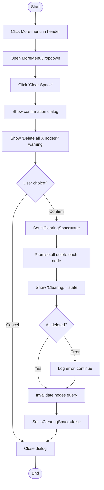
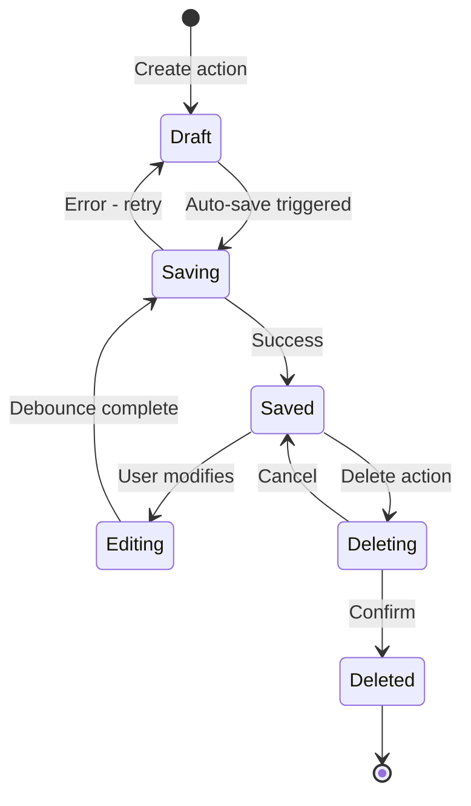

# Node/Content Management Journey - Activity Diagrams

## 3.1 View Nodes in Space

```mermaid
flowchart TD
    Start([Start]) --> EnterSpace[Enter space detail page]
    EnterSpace --> FetchNodes[GET /spaces/{slug}/nodes]

    FetchNodes --> ShowLoading[Display loading spinner]
    ShowLoading --> CheckResponse{API Response?}

    CheckResponse -->|Success| FilterNodes[Filter out block nodes]
    CheckResponse -->|Error| ShowError[Display error state]

    FilterNodes --> CheckEmpty{Nodes exist?}
    CheckEmpty -->|Yes| RenderCards[Render node cards grid]
    CheckEmpty -->|No| ShowEmptyState[Show 'No nodes' message]

    RenderCards --> PopulateSidebar[Populate sidebar tree]
    ShowEmptyState --> PopulateSidebar

    PopulateSidebar --> Ready[Page ready for interaction]
    Ready --> End([End])
    ShowError --> End
```

## 3.2 Create New Node via Modal

```mermaid
flowchart TD
    Start([Start]) --> TriggerCreate{Trigger source?}

    TriggerCreate -->|"Header Add - Node"| SetNodeType["Set modalDefaultType=node"]
    TriggerCreate -->|"Header Add - Context"| SetContextType["Set modalDefaultType=context"]

    SetNodeType --> OpenModal[Open NewNodeModal]
    SetContextType --> OpenModal

    OpenModal --> ShowForm[Display node/context creation form]
    ShowForm --> ShowTypeDropdown[Show type dropdown: Node/Context]

    ShowTypeDropdown --> EnterTitle[User enters title]
    EnterTitle --> FirstKeyPress{First character typed?}

    FirstKeyPress -->|Yes| AutoCreate[Auto-create node via API]
    FirstKeyPress -->|Continue typing| UpdateTitle[Update title via API]

    AutoCreate --> CreateAPI[POST /spaces/{slug}/nodes]
    CreateAPI --> SetCreatedId[Store created node ID]

    SetCreatedId --> ShowEditor[Show BlockEditor]
    UpdateTitle --> UpdateAPI[PUT /spaces/{slug}/nodes/{id}]

    ShowEditor --> EditContent[User edits content]
    EditContent --> UserAction{User action?}

    UserAction -->|Click Close| SaveAndClose[Save content, close modal]
    UserAction -->|Click Expand| SaveAndNavigate[Save content, navigate to full page]
    UserAction -->|Continue editing| EditContent

    SaveAndClose --> InvalidateQuery[Invalidate nodes query]
    SaveAndNavigate --> InvalidateQuery

    InvalidateQuery --> End([End])
```

## 3.3 Create Context Flow

```mermaid
flowchart TD
    Start([Start]) --> ClickAdd[Click Add button in header]
    ClickAdd --> OpenAddMenu[Open AddMenuDropdown]

    OpenAddMenu --> ClickContext[Click 'Create Context']
    ClickContext --> SetContextDefault[Set defaultType='context']

    SetContextDefault --> OpenModal[Open NewNodeModal]
    OpenModal --> ShowContextIcon[Show Context icon in type selector]

    ShowContextIcon --> EnterTitle[User enters context title]
    EnterTitle --> TypeFirst{First character?}

    TypeFirst -->|Yes| CreateContext[POST /nodes with nodeType=CONTEXT]
    CreateContext --> StoreId[Store context ID]

    StoreId --> ShowEditor[Show BlockEditor for content]
    ShowEditor --> EditContent[User adds content blocks]

    EditContent --> FinishAction{Finish action?}
    FinishAction -->|Close| CloseModal[Close modal, refresh list]
    FinishAction -->|Expand| NavigateFull[Navigate to /spaces/{slug}/node/{id}]

    CloseModal --> End([End])
    NavigateFull --> End
```

## 3.4 Navigate to Node Editor

```mermaid
flowchart TD
    Start([Start]) --> ClickCard[Click on node card]
    ClickCard --> GetNodeId[Get node ID from card]

    GetNodeId --> Navigate[router.push /spaces/{slug}/node/{id}]
    Navigate --> LoadPage[Load NodeDetailPage]

    LoadPage --> SetScope[Set navigation scope to 'node']
    SetScope --> FetchNode[GET /spaces/{slug}/nodes/{id}]

    FetchNode --> CheckResponse{API Response?}
    CheckResponse -->|Success| RenderEditor[Render node editor page]
    CheckResponse -->|Error| Show404[Show 'Node not found']

    RenderEditor --> ShowTitle[Display title input]
    ShowTitle --> ShowBlocks[Display BlockEditor with content]

    ShowBlocks --> UpdateBreadcrumb["Update breadcrumb: Spaces / Space / Node"]
    UpdateBreadcrumb --> HighlightSidebar[Highlight node in sidebar]

    HighlightSidebar --> Ready[Editor ready]
    Ready --> End([End])
    Show404 --> End
```

## 3.5 Edit Node Title

```mermaid
flowchart TD
    Start([Start]) --> FocusTitle[Focus on title input]
    FocusTitle --> EditTitle[User types new title]

    EditTitle --> Debounce[Debounce input 500ms]
    Debounce --> CheckChange{Title changed?}

    CheckChange -->|No| WaitMore[Continue waiting for input]
    CheckChange -->|Yes| UpdateAPI[PUT /spaces/{slug}/nodes/{id}]

    WaitMore --> EditTitle

    UpdateAPI --> CheckResponse{API Response?}
    CheckResponse -->|Success| UpdateLocal[Update local state]
    CheckResponse -->|Error| ShowError[Show error toast]

    UpdateLocal --> UpdateSidebar[Update sidebar item title]
    UpdateSidebar --> UpdateBreadcrumb[Update breadcrumb]

    UpdateBreadcrumb --> End([End])
    ShowError --> End
```

## 3.6 Delete Node Flow

```mermaid
flowchart TD
    Start([Start]) --> RightClick[Right-click on node card]
    RightClick --> ShowContextMenu[Display ContextMenu]

    ShowContextMenu --> ClickDelete[Click 'Delete' option]
    ClickDelete --> CloseContextMenu[Close context menu]

    CloseContextMenu --> ShowDialog[Open DeleteNodeDialog]
    ShowDialog --> DisplayWarning[Show deletion warning]

    DisplayWarning --> UserChoice{User choice?}
    UserChoice -->|Cancel| CloseDialog[Close dialog]
    UserChoice -->|Confirm| CallAPI[DELETE /spaces/{slug}/nodes/{id}]

    CallAPI --> ShowLoading[Show loading state]
    ShowLoading --> CheckResponse{API Response?}

    CheckResponse -->|Success| InvalidateQuery[Invalidate nodes query]
    CheckResponse -->|Error| ShowError[Show error message]

    InvalidateQuery --> RefreshList[Refresh node list]
    RefreshList --> CloseDialog

    CloseDialog --> End([End])
    ShowError --> CloseDialog
```

## 3.7 Clear All Nodes in Space



## State Diagram - Node Lifecycle


