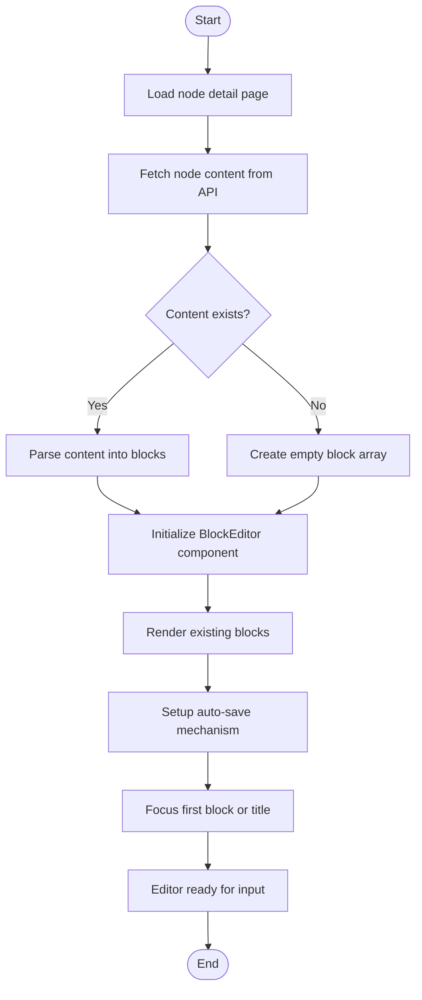
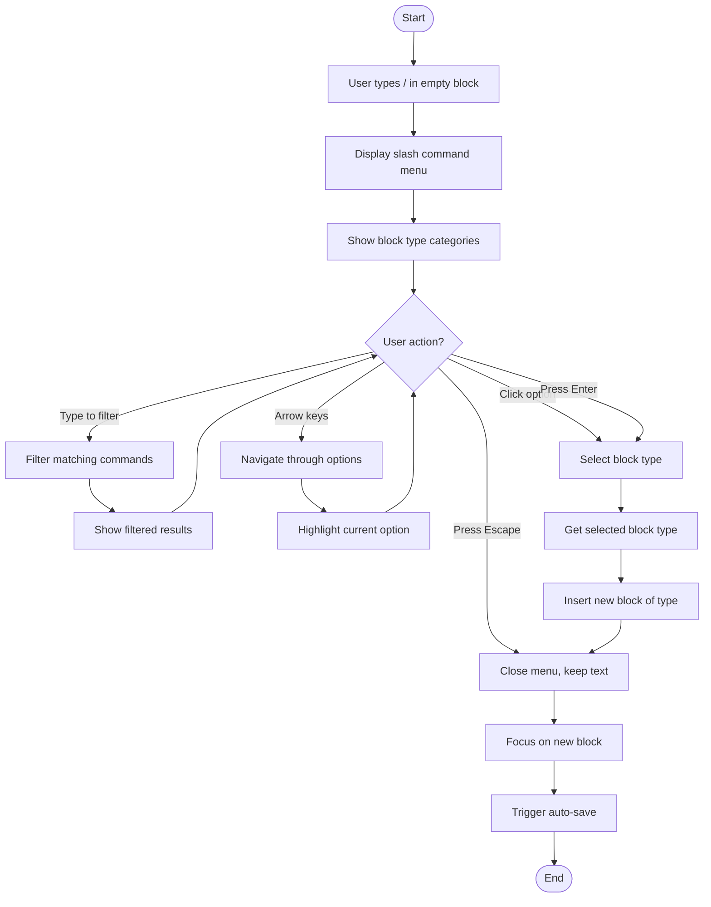
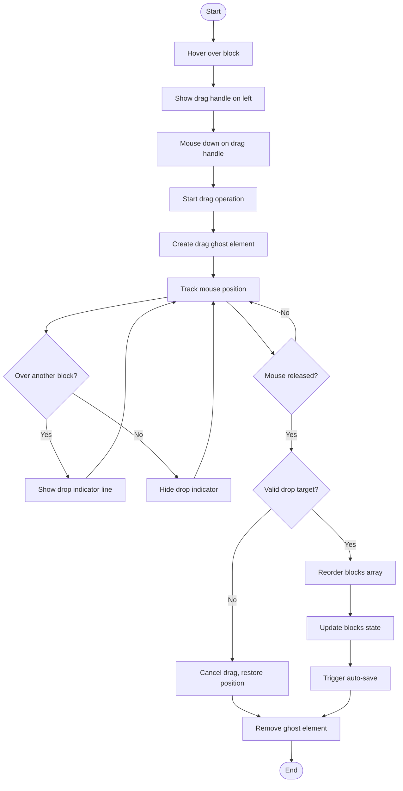
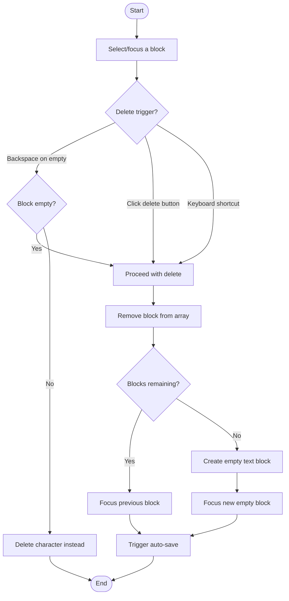
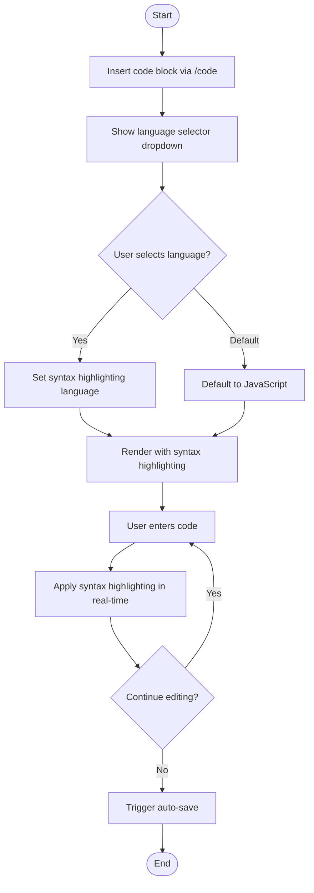
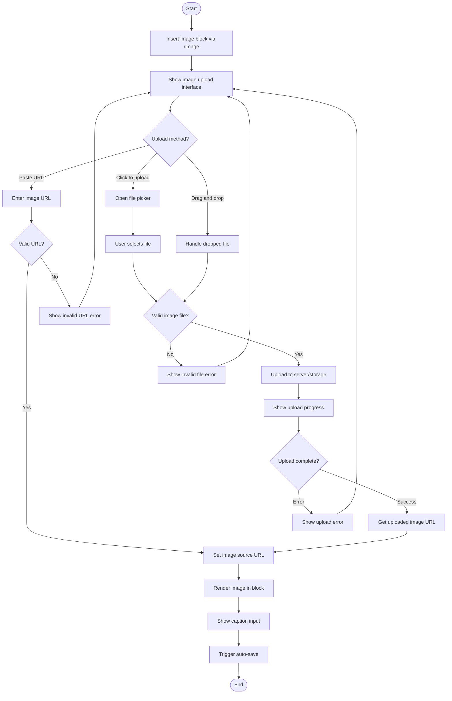
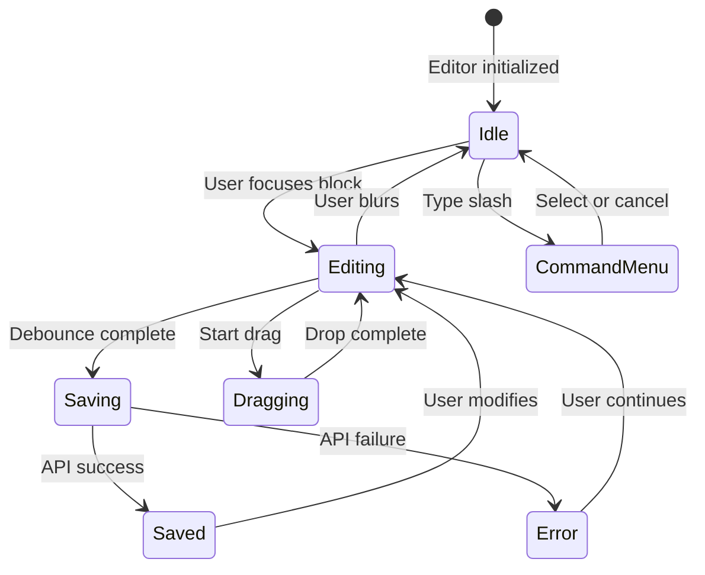

# Content Editing Journey - Activity Diagrams

## 4.1 Open Block Editor



## 4.2 Add Block via Slash Commands



## 4.3 Available Block Types

```mermaid
flowchart TD
    SlashMenu[Slash Command Menu]

    SlashMenu --> TextBlocks["Text and Structure"]
    TextBlocks --> Text[Text - Plain paragraph]
    TextBlocks --> H1[Heading 1 - Large title]
    TextBlocks --> H2[Heading 2 - Medium subtitle]
    TextBlocks --> H3[Heading 3 - Small heading]
    TextBlocks --> Divider[Divider - Horizontal line]

    SlashMenu --> ListBlocks[Lists]
    ListBlocks --> Bullet[Bullet List - Unordered]
    ListBlocks --> Numbered[Numbered List - Ordered]
    ListBlocks --> Todo[To-do List - Checkboxes]

    SlashMenu --> ContentBlocks[Rich Content]
    ContentBlocks --> Quote[Quote - Block quotation]
    ContentBlocks --> Code[Code - Syntax highlighted]
    ContentBlocks --> Callout[Callout - Highlighted box]
    ContentBlocks --> Image[Image - Upload/embed]

    SlashMenu --> AdvancedBlocks[Advanced]
    AdvancedBlocks --> Math[Math - LaTeX equations]
    AdvancedBlocks --> Mermaid[Mermaid - Diagrams]
```



## 4.4 Edit Block Content

```mermaid
flowchart TD
    Start([Start]) --> FocusBlock[Focus on a block]
    FocusBlock --> StartTyping[User starts typing]

    StartTyping --> UpdateLocal[Update local block state]
    UpdateLocal --> CheckDebounce{Debounce timer active?}

    CheckDebounce -->|Yes| ResetTimer[Reset debounce timer]
    CheckDebounce -->|No| StartTimer[Start debounce timer 1000ms]

    ResetTimer --> ContinueTyping[Continue typing]
    StartTimer --> ContinueTyping
    ContinueTyping --> StartTyping

    StartTimer --> WaitDebounce[Wait for debounce]
    WaitDebounce --> TimerComplete{Timer complete?}

    TimerComplete -->|User still typing| ResetTimer
    TimerComplete -->|User stopped| TriggerSave[Trigger auto-save]

    TriggerSave --> SerializeBlocks[Serialize all blocks to content]
    SerializeBlocks --> CallAPI[PUT /spaces/{slug}/nodes/{id}]

    CallAPI --> CheckResponse{API Response?}
    CheckResponse -->|Success| ShowSaved["Show Auto-saved status"]
    CheckResponse -->|Error| ShowError[Show save error]

    ShowSaved --> End([End])
    ShowError --> RetryLater[Queue retry]
    RetryLater --> End
```

## 4.5 Reorder Blocks via Drag & Drop



## 4.6 Delete Block



## 4.7 Code Block with Syntax Highlighting



## 4.8 Image Block Upload



## State Diagram - Block Editor


