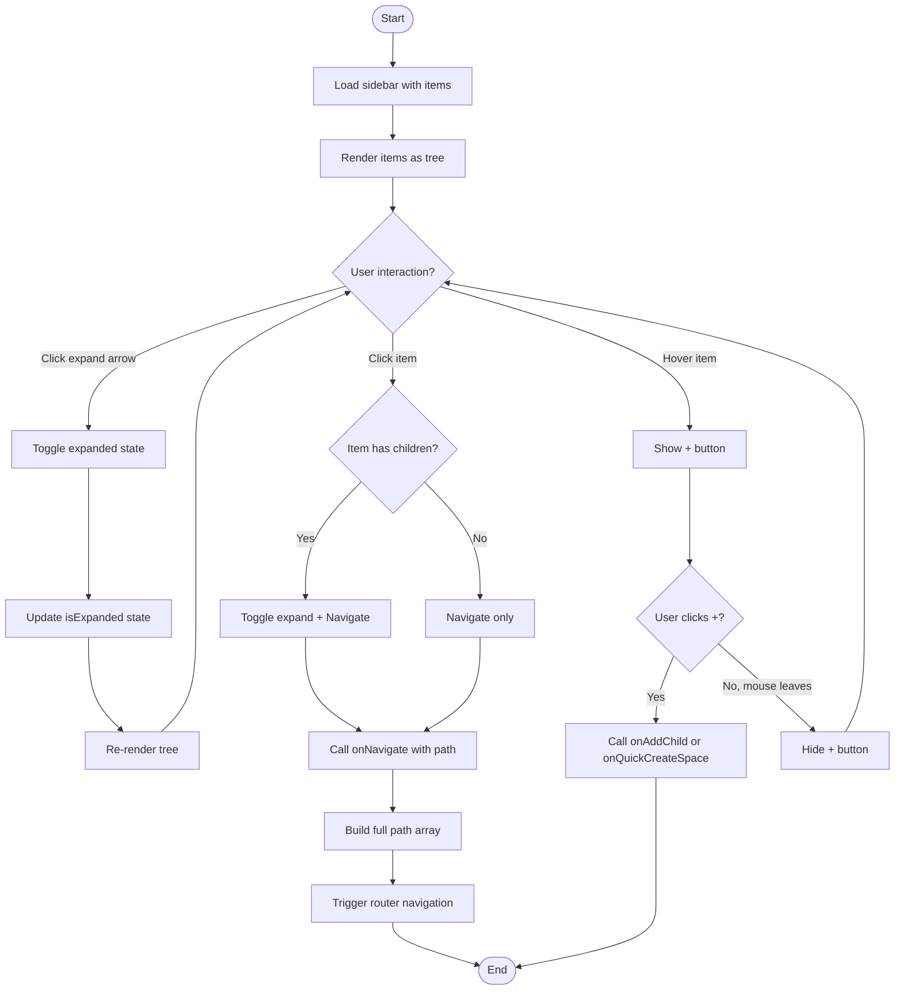
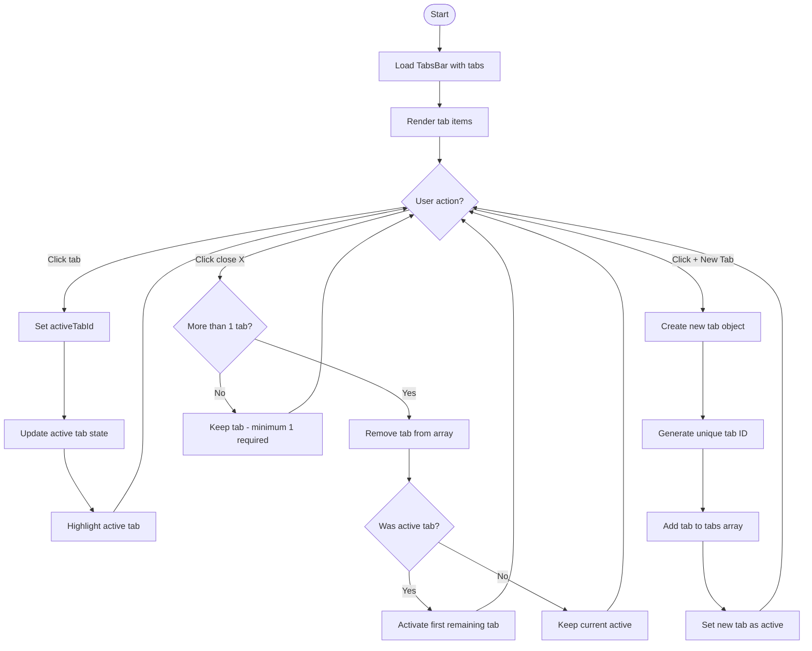
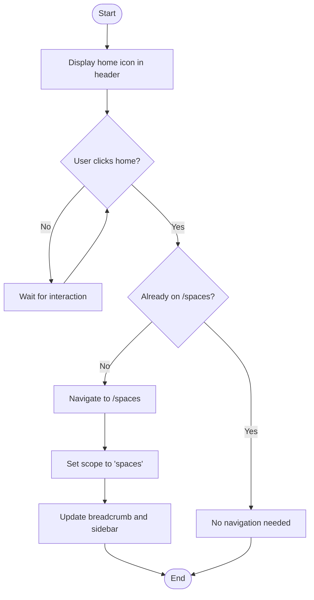
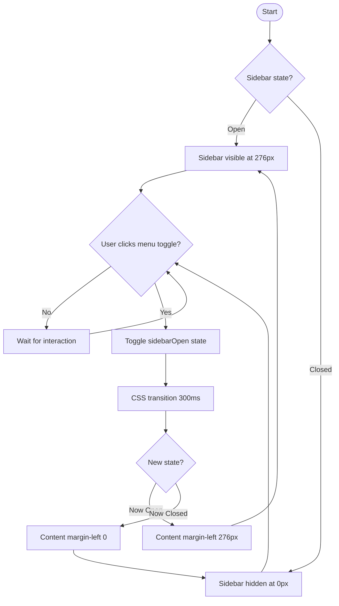
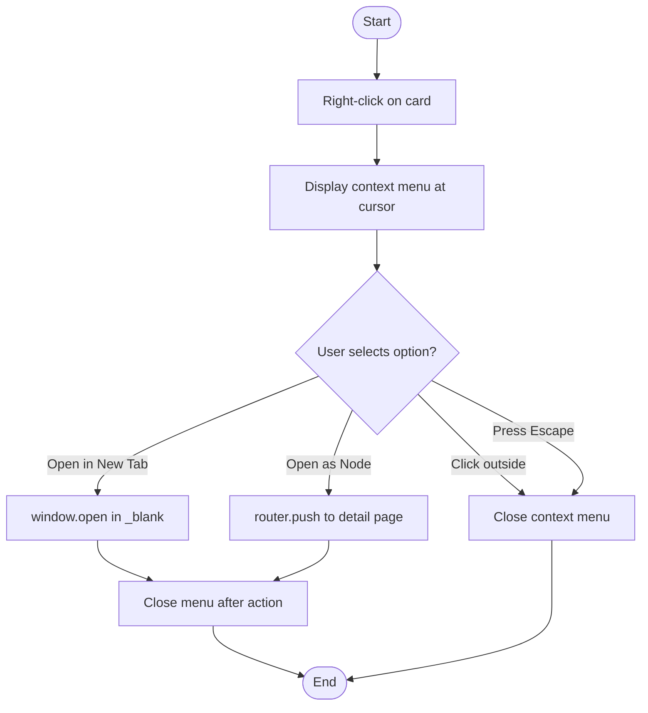
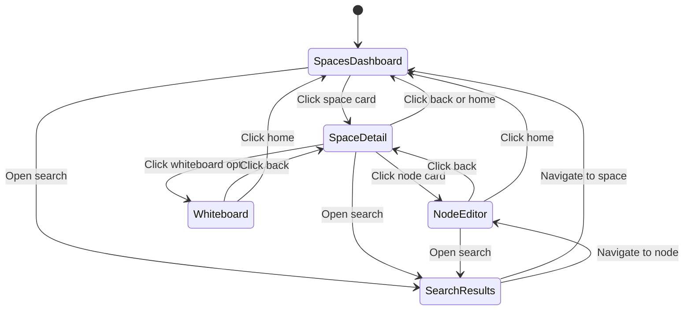
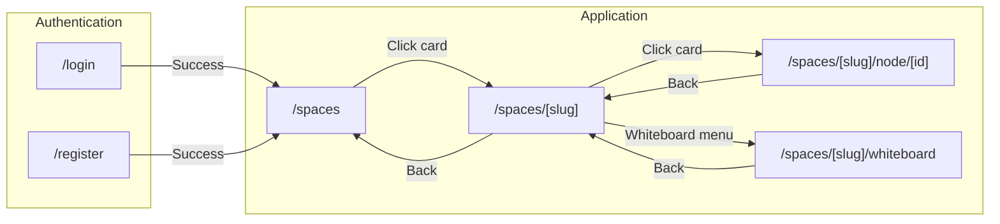

# Navigation Journey - Activity Diagrams

## 5.1 Breadcrumb Navigation

```mermaid
flowchart TD
    Start([Start]) --> LoadPage[Load any page]
    LoadPage --> DeterminePath[Determine current path]

    DeterminePath --> BuildBreadcrumb{Page type?}

    BuildBreadcrumb -->|Spaces| SpacesCrumb["Breadcrumb: Spaces"]
    BuildBreadcrumb -->|Space Detail| SpaceCrumb["Breadcrumb: Spaces / Space Name"]
    BuildBreadcrumb -->|Node Editor| NodeCrumb["Breadcrumb: Spaces / Space / Node"]
    BuildBreadcrumb -->|Whiteboard| WhiteboardCrumb["Breadcrumb: Spaces / Space / Whiteboard"]

    SpacesCrumb --> RenderCrumb[Render breadcrumb component]
    SpaceCrumb --> RenderCrumb
    NodeCrumb --> RenderCrumb
    WhiteboardCrumb --> RenderCrumb

    RenderCrumb --> UserClick{User clicks segment?}
    UserClick -->|Spaces| NavigateSpaces[Navigate to /spaces]
    UserClick -->|Space Name| NavigateSpace[Navigate to /spaces/{slug}]
    UserClick -->|Current| NoAction[No navigation - current page]

    NavigateSpaces --> End([End])
    NavigateSpace --> End
    NoAction --> End
```

## 5.2 Sidebar Tree Navigation



## 5.3 Tab Management



## 5.4 Back Button Navigation

```mermaid
flowchart TD
    Start([Start]) --> CheckPage{Current page?}

    CheckPage -->|Spaces Dashboard| HideBack[Hide back button]
    CheckPage -->|Space Detail| ShowBack[Show back button]
    CheckPage -->|Node Editor| ShowBack
    CheckPage -->|Whiteboard| ShowBack

    HideBack --> End([End])

    ShowBack --> UserClick{User clicks back?}
    UserClick -->|No| WaitClick[Wait for click]
    WaitClick --> UserClick

    UserClick -->|Yes| DetermineTarget{Determine target}

    DetermineTarget -->|From Space Detail| GoSpaces[Navigate to /spaces]
    DetermineTarget -->|From Node Editor| GoSpace[Navigate to /spaces/{slug}]
    DetermineTarget -->|From Whiteboard| GoSpace

    GoSpaces --> UpdateBreadcrumb[Update breadcrumb]
    GoSpace --> UpdateBreadcrumb

    UpdateBreadcrumb --> UpdateSidebar[Update sidebar highlight]
    UpdateSidebar --> End
```

## 5.5 Home Button Navigation



## 5.6 Sidebar Toggle



## 5.7 Context Menu Navigation



## Navigation State Machine



## URL Routing Diagram


