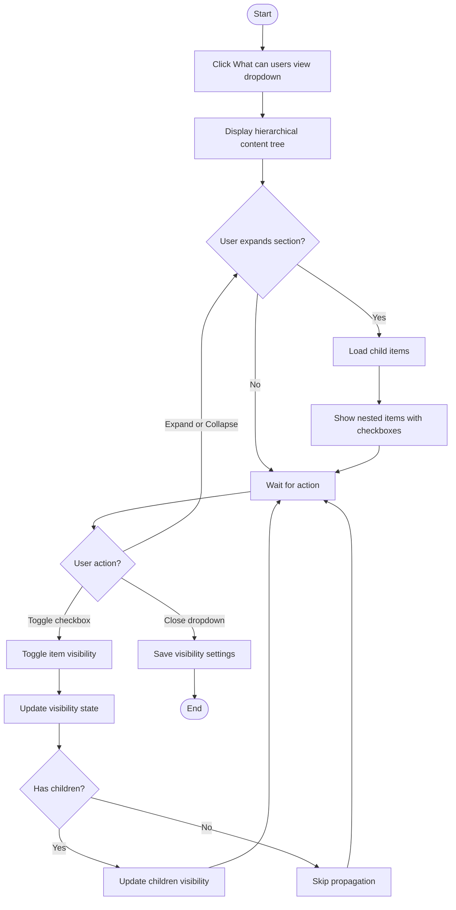
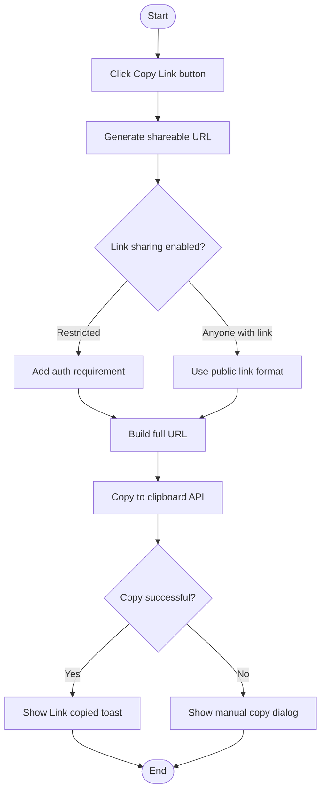
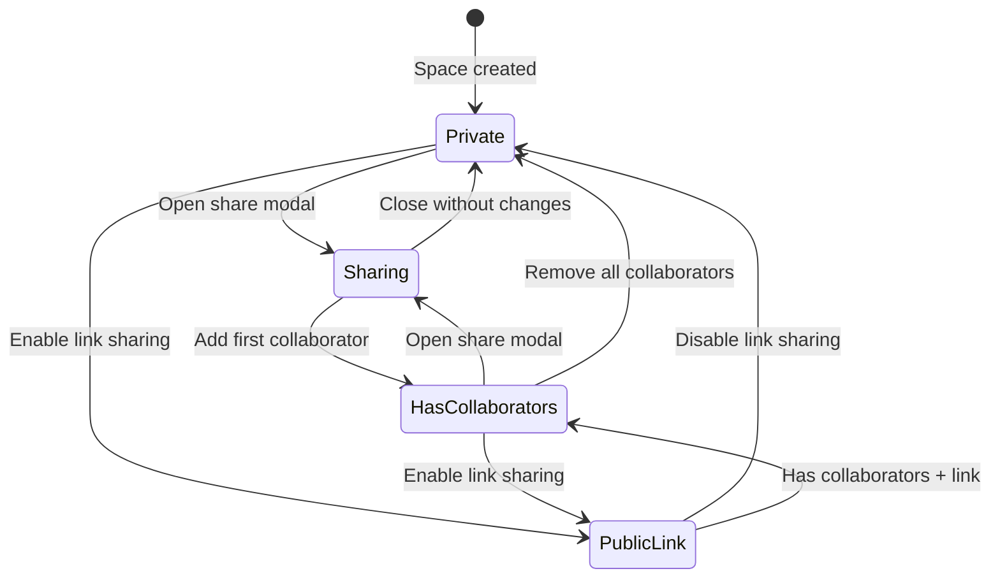
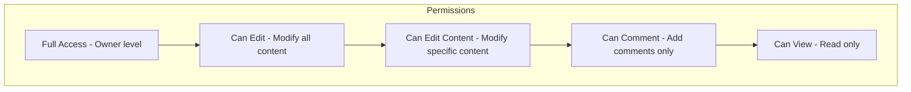

# Collaboration Journey - Activity Diagrams

## 6.1 Open Share Modal

```mermaid
flowchart TD
    Start([Start]) --> TriggerShare{Share trigger?}

    TriggerShare -->|"More menu - Share"| FromMoreMenu[Click Share in MoreMenuDropdown]
    TriggerShare -->|"Context menu - Share"| FromContextMenu[Click Share in ContextMenu]
    TriggerShare -->|Keyboard shortcut| FromKeyboard[Press share shortcut]

    FromMoreMenu --> SetCardId[Set selectedCardId]
    FromContextMenu --> SetCardId
    FromKeyboard --> SetCardId

    SetCardId --> OpenModal[Set showShareModal=true]
    OpenModal --> LoadModal[Render ShareModal component]

    LoadModal --> FetchCollaborators[GET /spaces/{id}/collaborators]
    FetchCollaborators --> ShowLoading[Show loading state]

    ShowLoading --> CheckResponse{API Response?}
    CheckResponse -->|Success| PopulateList[Populate invited people list]
    CheckResponse -->|Error| ShowError[Show error state]

    PopulateList --> ShowUI[Display share UI]
    ShowUI --> Ready[Modal ready for interaction]

    Ready --> End([End])
    ShowError --> Ready
```

## 6.2 Invite Collaborators by Email

```mermaid
flowchart TD
    Start([Start]) --> FocusInput[Focus email input field]
    FocusInput --> EnterEmails[User enters email addresses]

    EnterEmails --> ParseEmails[Parse comma-separated emails]
    ParseEmails --> ValidateEmails{All emails valid?}

    ValidateEmails -->|No| ShowValidationError[Highlight invalid emails]
    ValidateEmails -->|Yes| SelectPermission[User selects permission level]

    ShowValidationError --> EnterEmails

    SelectPermission --> PermissionOptions{Permission selected?}
    PermissionOptions -->|Can View| SetViewPermission["Set role=viewer"]
    PermissionOptions -->|Can Edit| SetEditPermission["Set role=editor"]
    PermissionOptions -->|Can Comment| SetCommentPermission["Set role=commenter"]

    SetViewPermission --> ClickInvite[User clicks Invite button]
    SetEditPermission --> ClickInvite
    SetCommentPermission --> ClickInvite

    ClickInvite --> ForEachEmail[For each email address]
    ForEachEmail --> CallAPI[POST /spaces/{id}/collaborators]

    CallAPI --> ShowProgress[Show sending state]
    ShowProgress --> CheckResponse{API Response?}

    CheckResponse -->|Success| AddToList[Add to invited people list]
    CheckResponse -->|Error| ShowInviteError[Show error for that email]

    AddToList --> MoreEmails{More emails?}
    ShowInviteError --> MoreEmails

    MoreEmails -->|Yes| ForEachEmail
    MoreEmails -->|No| ClearInput[Clear email input]

    ClearInput --> RefreshList[Refresh collaborators list]
    RefreshList --> End([End])
```

## 6.3 Set Permission Levels

```mermaid
flowchart TD
    Start([Start]) --> ViewCollaborator[View collaborator in list]
    ViewCollaborator --> ClickPermission[Click permission dropdown]

    ClickPermission --> ShowOptions[Show permission options]
    ShowOptions --> Options{Select option?}

    Options -->|Can View| SelectView[Select viewer role]
    Options -->|Can Edit| SelectEdit[Select editor role]
    Options -->|Can Comment| SelectComment[Select commenter role]
    Options -->|Can Edit Content| SelectEditContent[Select content editor]
    Options -->|Full Access| SelectFullAccess[Select full access]

    SelectView --> UpdatePermission[Update permission state]
    SelectEdit --> UpdatePermission
    SelectComment --> UpdatePermission
    SelectEditContent --> UpdatePermission
    SelectFullAccess --> UpdatePermission

    UpdatePermission --> CallAPI[PUT /spaces/{id}/collaborators/{userId}]
    CallAPI --> CheckResponse{API Response?}

    CheckResponse -->|Success| UpdateUI[Update UI to reflect change]
    CheckResponse -->|Error| RevertUI[Revert to previous permission]

    UpdateUI --> End([End])
    RevertUI --> ShowError[Show error message]
    ShowError --> End
```

## 6.4 Manage Content Visibility



## 6.5 Remove Collaborator

```mermaid
flowchart TD
    Start([Start]) --> FindCollaborator[Find collaborator in list]
    FindCollaborator --> ClickRemove["Click remove X button"]

    ClickRemove --> ShowConfirm{Show confirmation?}
    ShowConfirm -->|Yes| DisplayConfirm[Display confirmation dialog]
    ShowConfirm -->|No - Direct| CallAPI[DELETE /spaces/{id}/collaborators/{userId}]

    DisplayConfirm --> UserChoice{User confirms?}
    UserChoice -->|Cancel| CloseConfirm[Close confirmation]
    UserChoice -->|Confirm| CallAPI

    CloseConfirm --> End([End])

    CallAPI --> ShowLoading[Show removing state]
    ShowLoading --> CheckResponse{API Response?}

    CheckResponse -->|Success| RemoveFromList[Remove from UI list]
    CheckResponse -->|Error| ShowError[Show error message]

    RemoveFromList --> End
    ShowError --> End
```

## 6.6 Copy Share Link



## 6.7 Toggle Link Sharing Mode

```mermaid
flowchart TD
    Start([Start]) --> ViewLinkSection[View link sharing section]
    ViewLinkSection --> ClickToggle[Click sharing mode toggle]

    ClickToggle --> CurrentMode{Current mode?}

    CurrentMode -->|Restricted| SwitchToPublic["Switch to Anyone with link"]
    CurrentMode -->|Anyone with link| SwitchToRestricted["Switch to Restricted"]

    SwitchToPublic --> ShowPermissionSelect[Show link permission dropdown]
    ShowPermissionSelect --> SelectLinkPermission[User selects permission]

    SelectLinkPermission --> SaveSettings[Save link sharing settings]
    SwitchToRestricted --> DisablePublic[Disable public link access]
    DisablePublic --> SaveSettings

    SaveSettings --> CallAPI[PUT /spaces/{id}/sharing-settings]
    CallAPI --> CheckResponse{API Response?}

    CheckResponse -->|Success| UpdateUI[Update toggle UI]
    CheckResponse -->|Error| RevertToggle[Revert to previous state]

    UpdateUI --> End([End])
    RevertToggle --> ShowError[Show error message]
    ShowError --> End
```

## Collaboration State Machine



## Permission Hierarchy


