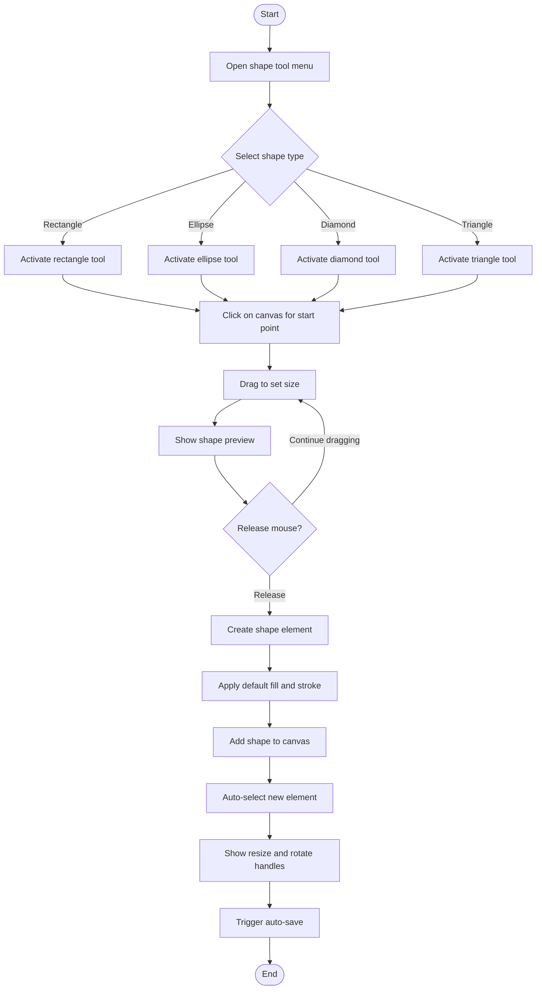
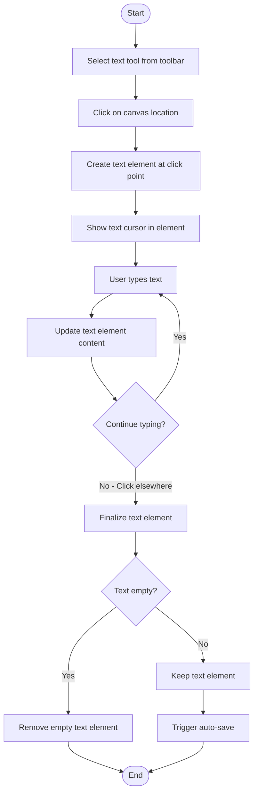
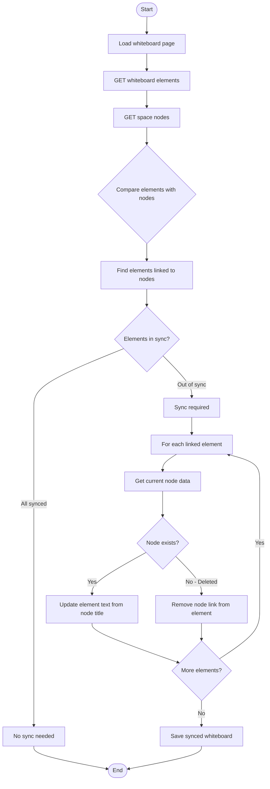
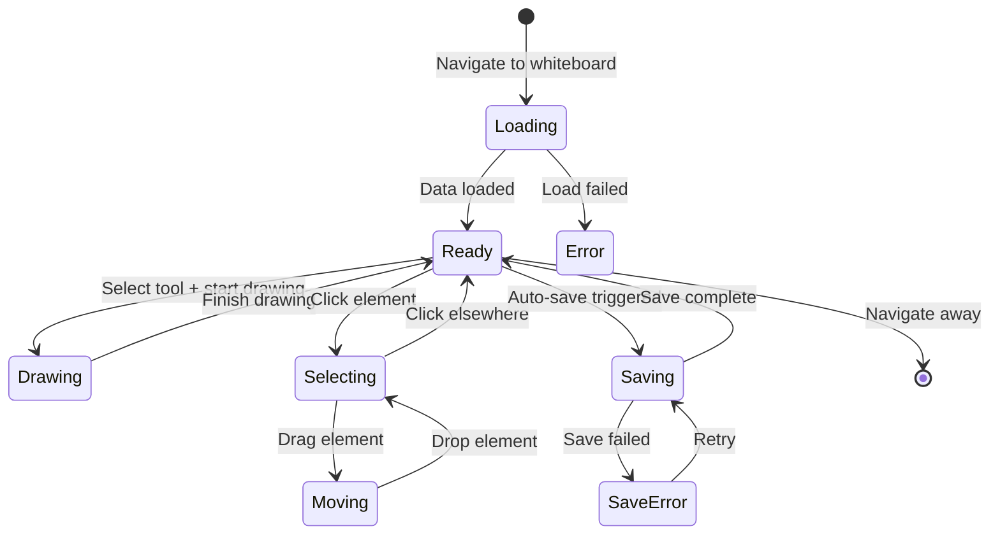
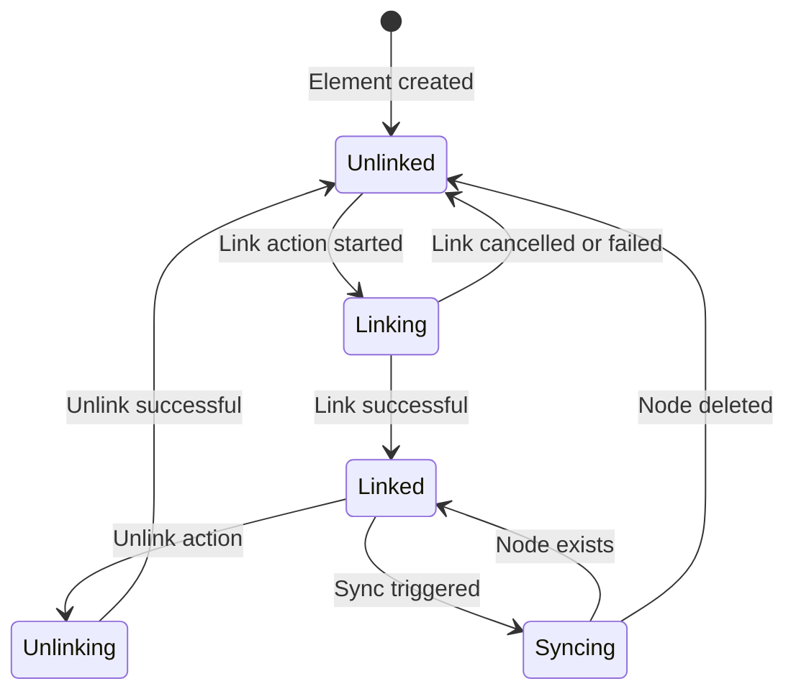

# Whiteboard Journey - Activity Diagrams

## 7.1 Access Whiteboard Canvas

```mermaid
flowchart TD
    Start([Start]) --> TriggerAccess{Access method?}

    TriggerAccess -->|"More menu - Whiteboard"| FromMoreMenu[Click Whiteboard option]
    TriggerAccess -->|Direct URL| DirectURL[Navigate to /spaces/{slug}/whiteboard]

    FromMoreMenu --> Navigate[router.push to whiteboard URL]
    DirectURL --> LoadPage[Load WhiteboardPage component]
    Navigate --> LoadPage

    LoadPage --> SetScope[Set navigation scope to 'whiteboard']
    SetScope --> FetchData[GET /spaces/{slug}/whiteboard]

    FetchData --> ShowLoading[Show loading spinner]
    ShowLoading --> CheckResponse{API Response?}

    CheckResponse -->|Success with data| LoadExcalidraw[Initialize Excalidraw with data]
    CheckResponse -->|Success empty| LoadEmpty[Initialize empty Excalidraw canvas]
    CheckResponse -->|Error| ShowError[Show error state]

    LoadExcalidraw --> RenderCanvas[Render Excalidraw canvas]
    LoadEmpty --> RenderCanvas

    RenderCanvas --> SetupAutoSave[Setup auto-save on changes]
    SetupAutoSave --> Ready[Canvas ready for drawing]

    Ready --> End([End])
    ShowError --> End
```

## 7.2 Draw on Whiteboard

```mermaid
flowchart TD
    Start([Start]) --> SelectTool{Select drawing tool}

    SelectTool -->|"Pen or Pencil"| SelectPen[Activate freehand tool]
    SelectTool -->|Line| SelectLine[Activate line tool]
    SelectTool -->|Arrow| SelectArrow[Activate arrow tool]

    SelectPen --> StartDrawing["Mouse or touch down on canvas"]
    SelectLine --> StartDrawing
    SelectArrow --> StartDrawing

    StartDrawing --> TrackMovement["Track mouse or touch movement"]
    TrackMovement --> RenderPreview[Render drawing preview]

    RenderPreview --> ContinueDrawing{Continue drawing?}
    ContinueDrawing -->|Yes| TrackMovement
    ContinueDrawing -->|No - Release| FinalizeElement[Finalize drawn element]

    FinalizeElement --> AddToElements[Add to elements array]
    AddToElements --> TriggerAutoSave[Trigger auto-save debounce]

    TriggerAutoSave --> SaveToAPI[PUT /spaces/{slug}/whiteboard]
    SaveToAPI --> CheckResponse{Save successful?}

    CheckResponse -->|Yes| UpdateSaved[Update last saved time]
    CheckResponse -->|No| QueueRetry[Queue retry save]

    UpdateSaved --> End([End])
    QueueRetry --> End
```

## 7.3 Add Shapes



## 7.4 Add Text Elements



## 7.5 Link Whiteboard Element to Node

```mermaid
flowchart TD
    Start([Start]) --> SelectElement[Select element on canvas]
    SelectElement --> RightClick[Right-click for context menu]

    RightClick --> ShowContextMenu[Display whiteboard context menu]
    ShowContextMenu --> SelectOption{Select option?}

    SelectOption -->|Show in Space List| PromoteToNode[Promote element to node]
    SelectOption -->|Link to existing| ShowNodePicker[Show node selection UI]

    PromoteToNode --> CreateNode[POST /spaces/{slug}/nodes]
    CreateNode --> GetNodeId[Get created node ID]
    GetNodeId --> LinkElement[Link element to node]

    ShowNodePicker --> SelectNode[User selects target node]
    SelectNode --> LinkElement

    LinkElement --> CallLinkAPI[POST /spaces/{slug}/whiteboard/link]
    CallLinkAPI --> UpdateElement[Update element with nodeId]

    UpdateElement --> AddIndicator[Show link indicator on element]
    AddIndicator --> TriggerSave[Save whiteboard state]

    TriggerSave --> End([End])
```

## 7.6 Sync Whiteboard with Node Hierarchy



## 7.7 Whiteboard Context Menu Actions

```mermaid
flowchart TD
    Start([Start]) --> RightClickElement[Right-click on whiteboard element]
    RightClickElement --> CheckLinked{Element linked to node?}

    CheckLinked -->|Yes| ShowLinkedMenu[Show linked element menu]
    CheckLinked -->|No| ShowUnlinkedMenu[Show unlinked element menu]

    ShowLinkedMenu --> LinkedOptions{Select option?}
    LinkedOptions -->|View in Hierarchy| NavigateToNode[Navigate to linked node]
    LinkedOptions -->|Unlink from Node| UnlinkAction[Remove node association]
    LinkedOptions -->|Edit in Node| OpenNodeEditor[Open node in editor]

    ShowUnlinkedMenu --> UnlinkedOptions{Select option?}
    UnlinkedOptions -->|Show in Space List| CreateAndLink[Create node + link element]
    UnlinkedOptions -->|Link to Node| ShowPicker[Show node picker]

    NavigateToNode --> GetNodeId[Get linked node ID]
    GetNodeId --> RouterPush[Navigate to /spaces/{slug}/node/{id}]

    UnlinkAction --> RemoveLink[DELETE /whiteboard/element/{id}/link]
    RemoveLink --> UpdateUI[Remove link indicator]

    CreateAndLink --> CreateNode[Create new node from element]
    CreateNode --> LinkToElement[Link node to element]

    ShowPicker --> SelectNode[User selects node]
    SelectNode --> LinkToElement

    LinkToElement --> SaveWhiteboard[Save whiteboard state]

    RouterPush --> End([End])
    UpdateUI --> End
    SaveWhiteboard --> End
```

## 7.8 Auto-save Whiteboard

```mermaid
flowchart TD
    Start([Start]) --> UserModifies[User modifies canvas]
    UserModifies --> UpdateLocalState[Update local Excalidraw state]

    UpdateLocalState --> CheckDebounce{Debounce timer active?}
    CheckDebounce -->|Yes| ResetTimer[Reset timer to 2000ms]
    CheckDebounce -->|No| StartTimer[Start debounce timer]

    ResetTimer --> WaitForChanges[Wait for more changes]
    StartTimer --> WaitForChanges

    WaitForChanges --> MoreChanges{More changes before timeout?}
    MoreChanges -->|Yes| UserModifies
    MoreChanges -->|No - Timer complete| PrepareData[Prepare save data]

    PrepareData --> SerializeElements[Serialize Excalidraw elements]
    SerializeElements --> SerializeAppState[Serialize app state]

    SerializeAppState --> CallAPI[PUT /spaces/{slug}/whiteboard]
    CallAPI --> ShowSaving["Show Saving indicator"]

    ShowSaving --> CheckResponse{API Response?}
    CheckResponse -->|Success| ShowSaved["Show Saved indicator"]
    CheckResponse -->|Error| ShowError[Show save error]

    ShowSaved --> HideIndicator[Hide indicator after 2s]
    ShowError --> QueueRetry[Queue retry in 5s]

    HideIndicator --> End([End])
    QueueRetry --> End
```

## Whiteboard State Machine



## Element Link State


