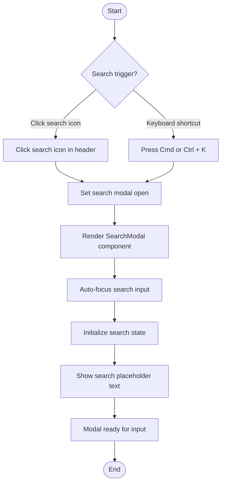
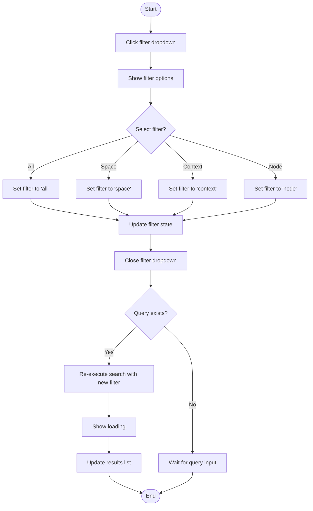
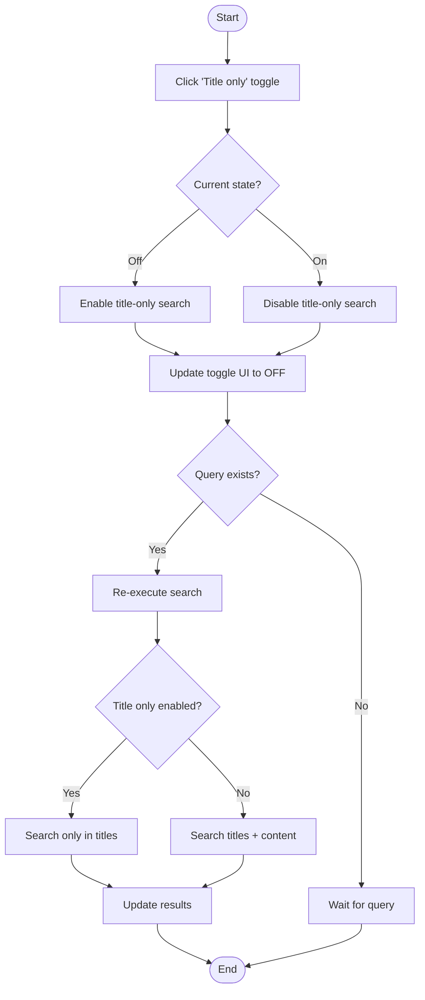
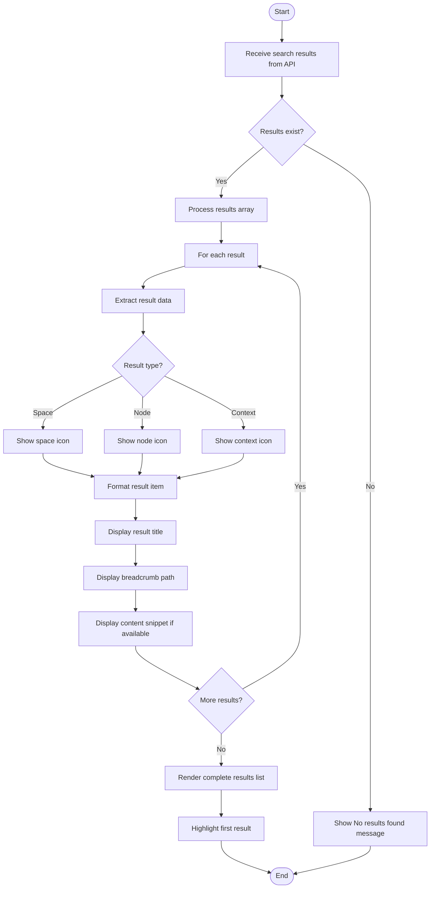
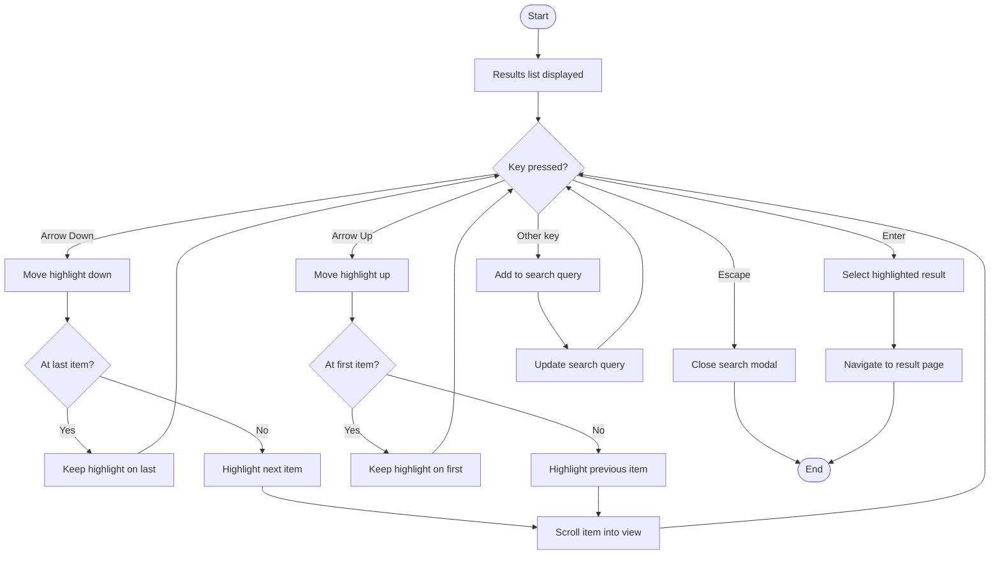
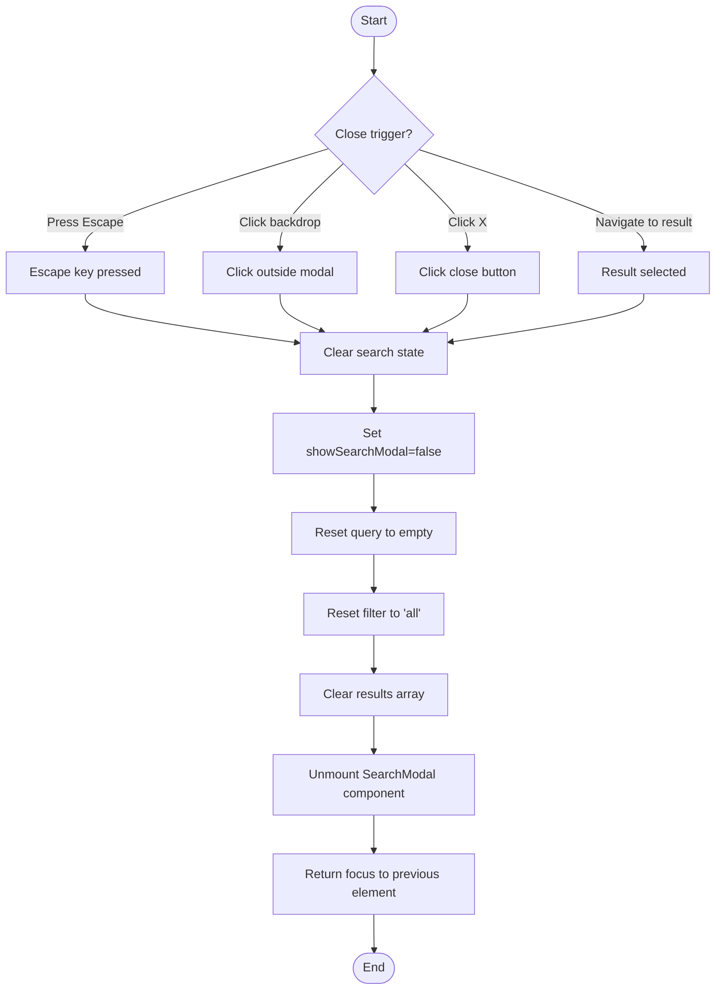
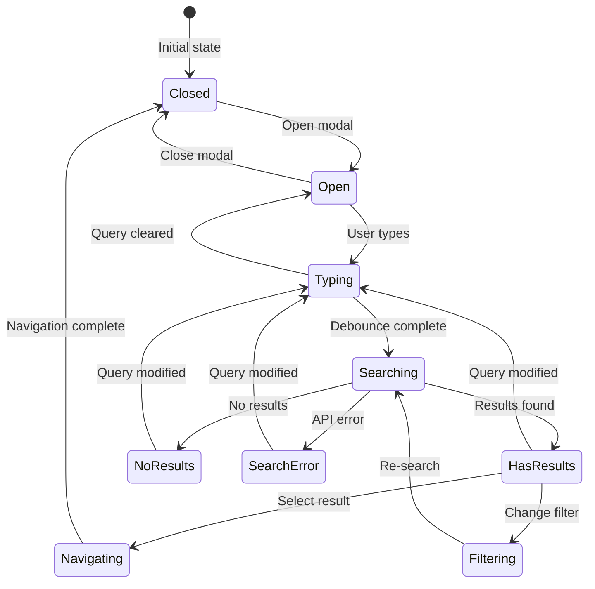
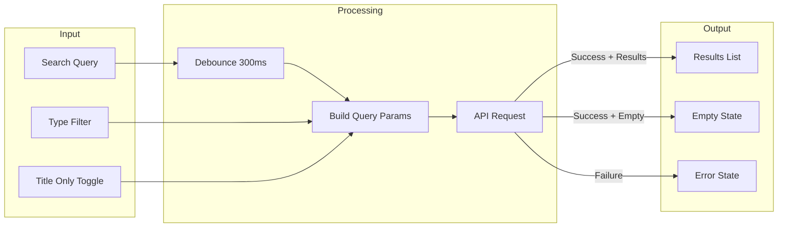

# Search Journey - Activity Diagrams

## 8.1 Open Search Modal



## 8.2 Enter Search Query

```mermaid
flowchart TD
    Start([Start]) --> FocusInput[Focus on search input]
    FocusInput --> TypeQuery[User types search query]

    TypeQuery --> UpdateInput[Update input value]
    UpdateInput --> CheckLength{Query length >= 2?}

    CheckLength -->|No| WaitMore[Wait for more characters]
    CheckLength -->|Yes| StartDebounce[Start debounce timer 300ms]

    WaitMore --> TypeQuery

    StartDebounce --> WaitDebounce{Timer complete?}
    WaitDebounce -->|User still typing| ResetDebounce[Reset timer]
    WaitDebounce -->|Timer complete| ExecuteSearch[Execute search]

    ResetDebounce --> StartDebounce

    ExecuteSearch --> GetFilters[Get current filter settings]
    GetFilters --> BuildQuery[Build search query params]

    BuildQuery --> CallAPI[GET /search?q={query}&type={filter}]
    CallAPI --> ShowLoading[Show loading indicator]

    ShowLoading --> CheckResponse{API Response?}
    CheckResponse -->|Success| ProcessResults[Process search results]
    CheckResponse -->|Error| ShowError[Show error message]
    CheckResponse -->|Empty| ShowNoResults["Show No results found"]

    ProcessResults --> RenderResults[Render results list]
    RenderResults --> End([End])
    ShowError --> End
    ShowNoResults --> End
```

## 8.3 Filter Search by Type



## 8.4 Toggle Title-Only Search



## 8.5 View Search Results



## 8.6 Keyboard Navigation in Results



## 8.7 Navigate to Search Result

```mermaid
flowchart TD
    Start([Start]) --> SelectResult{Selection method?}

    SelectResult -->|Click result| ClickAction[Mouse click on result]
    SelectResult -->|Press Enter| EnterAction[Enter on highlighted result]

    ClickAction --> GetResultData[Get result data]
    EnterAction --> GetResultData

    GetResultData --> DetermineType{Result type?}

    DetermineType -->|Space| BuildSpaceURL[Build /spaces/{slug} URL]
    DetermineType -->|Node| BuildNodeURL[Build /spaces/{slug}/node/{id} URL]
    DetermineType -->|Context| BuildContextURL[Build /spaces/{slug}/node/{id} URL]

    BuildSpaceURL --> CloseModal[Close search modal]
    BuildNodeURL --> CloseModal
    BuildContextURL --> CloseModal

    CloseModal --> Navigate[router.push to URL]
    Navigate --> LoadPage[Load target page]

    LoadPage --> UpdateBreadcrumb[Update breadcrumb navigation]
    UpdateBreadcrumb --> HighlightSidebar[Highlight item in sidebar]

    HighlightSidebar --> End([End])
```

## 8.8 Close Search Modal



## Search State Machine



## Search Query Flow


