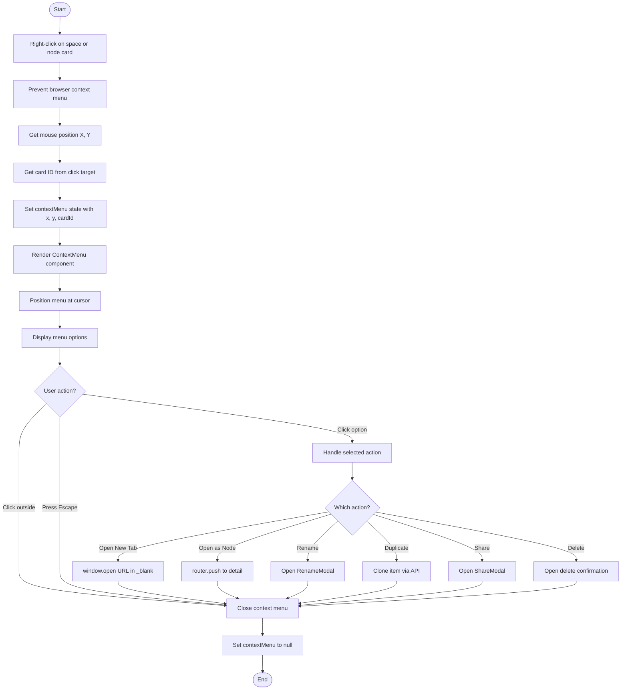
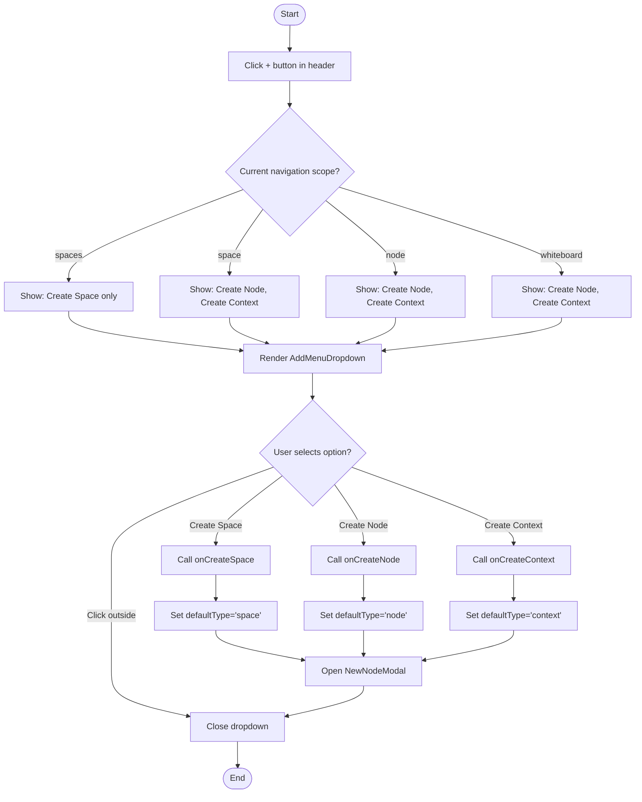
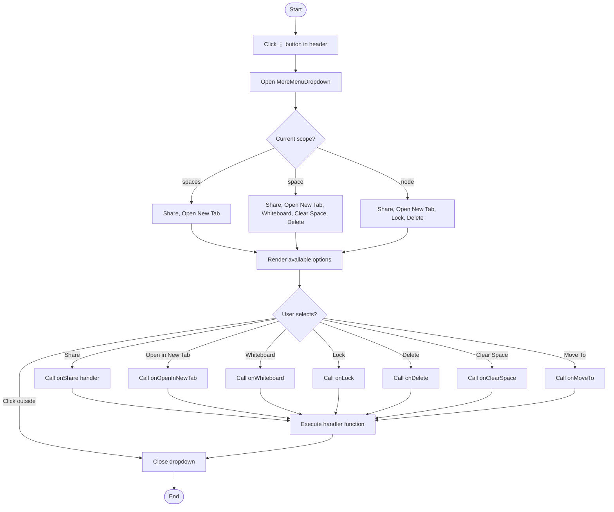
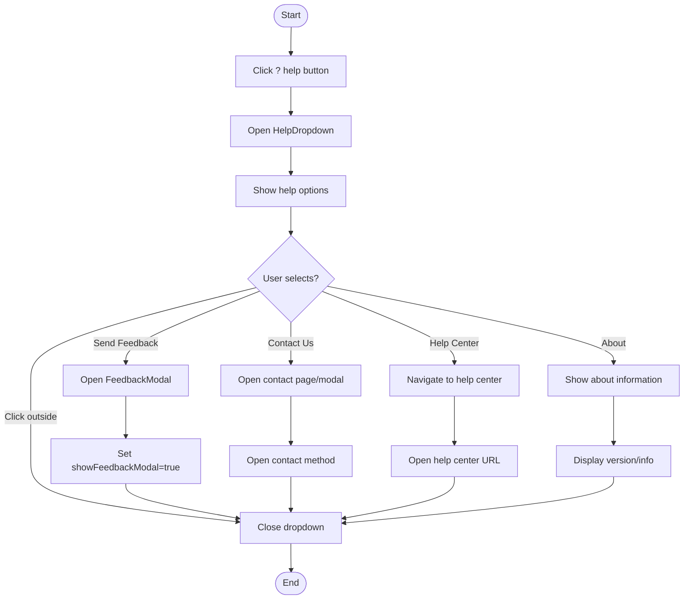
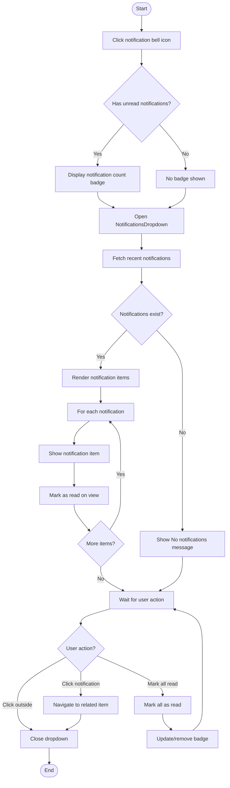
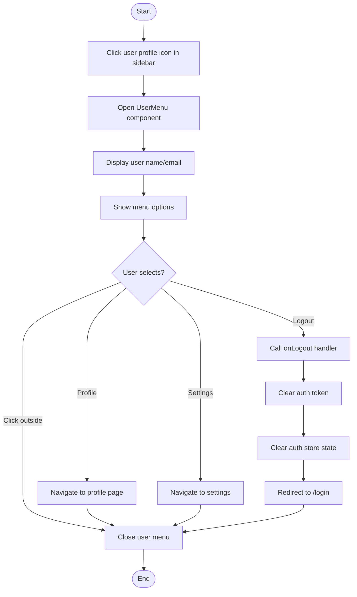
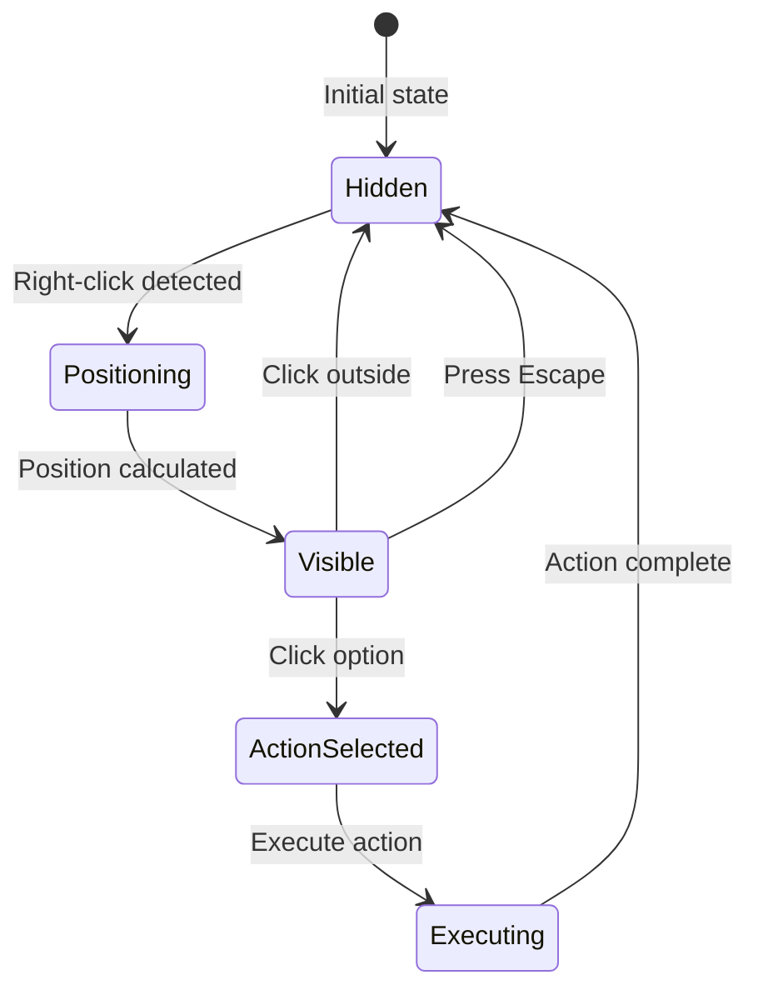
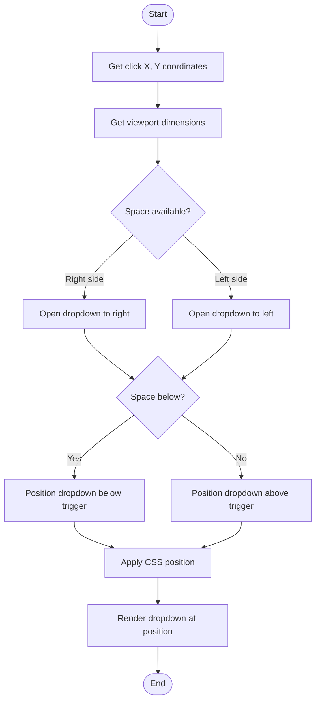

# Context Menus & Quick Actions Journey - Activity Diagrams

## 9.1 Card Context Menu Flow



## 9.2 Add Menu Dropdown Flow



## 9.3 More Menu Dropdown Flow



## 9.4 Help Dropdown Flow



## 9.5 Notifications Dropdown Flow



## 9.6 User Menu Flow



## 9.7 Whiteboard Context Menu Flow

```mermaid
flowchart TD
    Start([Start]) --> RightClickElement[Right-click on whiteboard element]
    RightClickElement --> CheckElement{Element selected?}

    CheckElement -->|No element| ShowCanvasMenu[Show canvas context menu]
    CheckElement -->|Element selected| CheckLinked{Element linked to node?}

    ShowCanvasMenu --> CanvasOptions[Paste, Select All, etc.]
    CanvasOptions --> End([End])

    CheckLinked -->|Yes - Linked| ShowLinkedMenu[Show linked element menu]
    CheckLinked -->|No - Unlinked| ShowUnlinkedMenu[Show unlinked element menu]

    ShowLinkedMenu --> LinkedOptions{Select option?}
    LinkedOptions -->|View in Hierarchy| GetNodeId[Get linked node ID]
    LinkedOptions -->|Unlink from Node| UnlinkElement[Remove node link]

    GetNodeId --> NavigateToNode[Navigate to /spaces/{slug}/node/{id}]
    UnlinkElement --> UpdateElement[Update element state]
    UpdateElement --> SaveWhiteboard[Save whiteboard]

    ShowUnlinkedMenu --> UnlinkedOptions{Select option?}
    UnlinkedOptions -->|Show in Space List| PromoteToNode[Create node from element]
    UnlinkedOptions -->|Link to existing| ShowNodePicker[Show node picker dialog]

    PromoteToNode --> CreateNode[POST /nodes]
    CreateNode --> LinkElement[Link element to new node]
    LinkElement --> SaveWhiteboard

    ShowNodePicker --> SelectNode[User selects node]
    SelectNode --> LinkElement

    NavigateToNode --> End
    SaveWhiteboard --> End
```

## Context Menu State Machine



## Dropdown Positioning Logic


