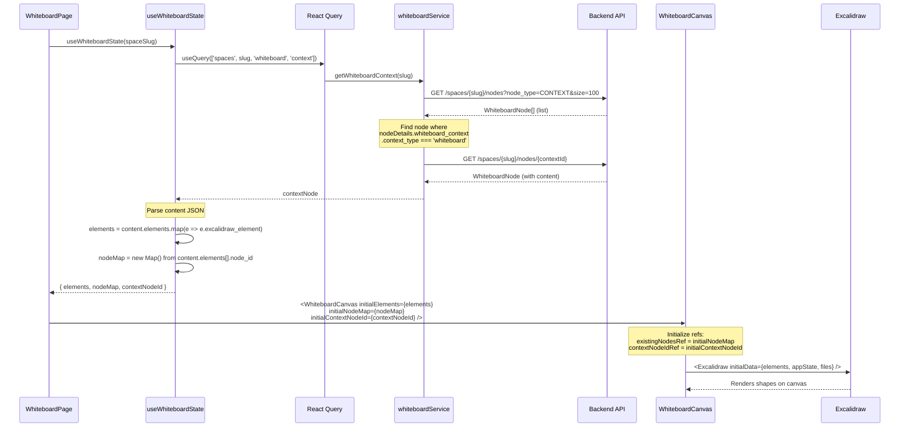
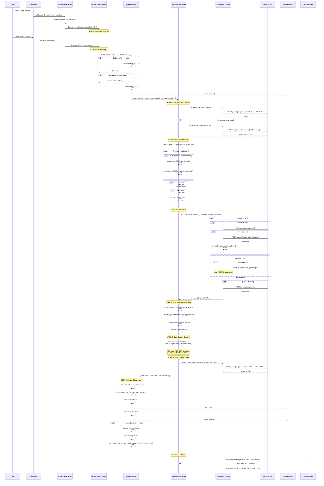

# Whiteboard Save/Load Algorithm — Full Documentation

This document describes the complete whiteboard persistence algorithm as currently implemented, its architectural problems, and serves as a reference for refactoring.

---

## 1. Architecture Overview

```
┌─────────────────────────────────────────────────────────────────────────────┐
│                              BROWSER                                        │
│                                                                             │
│  ┌──────────────────────────────────────────────────────────────────────┐   │
│  │  WhiteboardPage (app/spaces/[slug]/whiteboard/page.tsx)              │   │
│  │                                                                      │   │
│  │  ┌──────────────────────┐    ┌─────────────────────────────────┐    │   │
│  │  │  useWhiteboardState  │    │  useWhiteboardStore (Zustand)   │    │   │
│  │  │  (React Query)       │    │  - isSaving                     │    │   │
│  │  │  - elements[]        │    │  - lastSaved                    │    │   │
│  │  │  - nodeMap           │    │  - error                        │    │   │
│  │  │  - contextNodeId     │    └──────────┬──────────────────────┘    │   │
│  │  └──────────┬───────────┘               │                           │   │
│  │             │ props                     │ re-renders parent          │   │
│  │             ▼                           │                           │   │
│  │  ┌──────────────────────────────────────┴──────────────────────┐    │   │
│  │  │  WhiteboardCanvas (src/components/whiteboard/)              │    │   │
│  │  │                                                             │    │   │
│  │  │  REFS (mutable state, survives re-renders):                 │    │   │
│  │  │  ┌─────────────────────────────────────────────────────┐    │    │   │
│  │  │  │ existingNodesRef  Map<excalidrawId, backendNodeId>  │    │    │   │
│  │  │  │ contextNodeIdRef  string | null                     │    │    │   │
│  │  │  │ isSavingRef       boolean                           │    │    │   │
│  │  │  │ hasSavedRef       boolean                           │    │    │   │
│  │  │  │ pendingSaveRef    boolean                           │    │    │   │
│  │  │  │ lastElementsRef   ExcalidrawElement[]               │    │    │   │
│  │  │  │ lastAppStateRef   AppState                          │    │    │   │
│  │  │  │ lastFilesRef      Record<string, BinaryFileData>    │    │    │   │
│  │  │  └─────────────────────────────────────────────────────┘    │    │   │
│  │  │                                                             │    │   │
│  │  │  ┌──────────────┐   5s debounce   ┌──────────────────┐     │    │   │
│  │  │  │  Excalidraw   │───onChange──────▶│  performSave()   │     │    │   │
│  │  │  │  (canvas)     │                 │  (useCallback)   │     │    │   │
│  │  │  └──────────────┘                 └────────┬─────────┘     │    │   │
│  │  └────────────────────────────────────────────│────────────────┘    │   │
│  └───────────────────────────────────────────────│─────────────────────┘   │
│                                                  │                          │
│  ┌───────────────────────────────────────────────▼─────────────────────┐   │
│  │  useSaveWhiteboard (src/hooks/api/useWhiteboardMutations.ts)        │   │
│  │  - Categorize elements (create/update/delete)                       │   │
│  │  - Batch API calls                                                  │   │
│  │  - Build context content                                            │   │
│  │  - Return { nodeMap, contextNodeId }                                │   │
│  └───────────────────────────────────────────────┬─────────────────────┘   │
│                                                  │                          │
│  ┌───────────────────────────────────────────────▼─────────────────────┐   │
│  │  whiteboardService (src/services/api/whiteboard.service.ts)         │   │
│  │  - getWhiteboardContext()     GET  /spaces/{slug}/nodes?type=CONTEXT│   │
│  │  - createWhiteboardContext()  POST /spaces/{slug}/nodes             │   │
│  │  - updateWhiteboardContext()  PUT  /spaces/{slug}/nodes/{id}        │   │
│  │  - batchSaveShapeNodes()      POST/PUT/DELETE per node              │   │
│  │  - createShapeNode()          POST /spaces/{slug}/nodes             │   │
│  │  - updateShapeNode()          PUT  /spaces/{slug}/nodes/{id}        │   │
│  │  - deleteWhiteboardNode()     DELETE /spaces/{slug}/nodes/{id}      │   │
│  └───────────────────────────────────────────────┬─────────────────────┘   │
└──────────────────────────────────────────────────│──────────────────────────┘
                                                   │ HTTP
                                                   ▼
┌──────────────────────────────────────────────────────────────────────────────┐
│  BACKEND (Spring Boot on Render)                                             │
│                                                                              │
│  REST API: /api/spaces/{slug}/nodes                                          │
│  Database: PostgreSQL                                                        │
│                                                                              │
│  Node entity:                                                                │
│  ┌────────────────────────────────────────────────────────────────────────┐  │
│  │ id: UUID                                                               │  │
│  │ title: String                                                          │  │
│  │ content: Text (stores JSON for context nodes)                          │  │
│  │ nodeType: REGULAR | CONTEXT                                            │  │
│  │ nodeDetails: JSONB { whiteboard_context?, showInSpaceList? }           │  │
│  └────────────────────────────────────────────────────────────────────────┘  │
└──────────────────────────────────────────────────────────────────────────────┘
```

---

## 2. Data Model

```
┌─────────────────────────────────────────────────────────────────┐
│ BACKEND STORAGE                                                  │
│                                                                  │
│  ┌─────────────────────────────────────────────────────────┐    │
│  │ CONTEXT NODE (1 per space)                               │    │
│  │ nodeType: "CONTEXT"                                      │    │
│  │ nodeDetails: { whiteboard_context: { context_type:       │    │
│  │               "whiteboard" } }                           │    │
│  │ content: JSON string ─────────────────────┐              │    │
│  └───────────────────────────────────────────│──────────────┘    │
│                                              │                    │
│                                              ▼                    │
│  ┌───────────────────────────────────────────────────────────┐   │
│  │ CONTEXT CONTENT (JSON in content field)                    │   │
│  │                                                            │   │
│  │ {                                                          │   │
│  │   elements: [                                              │   │
│  │     { node_id: "uuid-1", excalidraw_element: {...} },     │   │
│  │     { node_id: "uuid-1", excalidraw_element: {...} },  ◄──bound text  │
│  │     { node_id: "uuid-2", excalidraw_element: {...} },     │   │
│  │     { node_id: "",       excalidraw_element: {...} },  ◄──connector   │
│  │   ],                                                      │   │
│  │   app_state: { zoom, scrollX, scrollY, bgColor },        │   │
│  │   files: { "fileId": { mimeType, data } }                │   │
│  │ }                                                          │   │
│  └───────────────────────────────────────────────────────────┘   │
│                                                                   │
│  ┌───────────────────┐  ┌───────────────────┐                   │
│  │ SHAPE NODE uuid-1 │  │ SHAPE NODE uuid-2 │  ... per shape    │
│  │ nodeType: REGULAR  │  │ nodeType: REGULAR  │                   │
│  │ title: "Rectangle" │  │ title: "My Text"   │                   │
│  │ content: ""        │  │ content: "My Text"  │                   │
│  │ showInSpaceList: F │  │ showInSpaceList: F │                   │
│  └───────────────────┘  └───────────────────┘                   │
└─────────────────────────────────────────────────────────────────┘

FRONTEND STATE (in-memory):

  existingNodesRef = Map {
    "excalidraw-id-abc" → "uuid-1",   // shape → backend node
    "excalidraw-id-def" → "uuid-2",
  }

  contextNodeIdRef = "uuid-context-1"
```

**Key insight**: The system stores data redundantly:
- Each shape has its own REGULAR node (for hierarchy/sidebar features)
- ALL element geometry is stored as JSON inside the single CONTEXT node
- The `existingNodesRef` Map is the bridge between the two

---

## 3. Load Flow (Page Refresh)



---

## 4. Save Flow — Complete Sequence



---

## 5. State Management & Re-render Problem

This diagram shows how parent re-renders interact with the save flow:

```
TIMELINE ──────────────────────────────────────────────────────────────────▶

                    SAVE COMPLETES          PARENT RE-RENDERS       QUERY REFETCH
                         │                        │                       │
existingNodesRef:        │                        │                       │
                         │                        │                       │
  {A:id1, B:id2}  ◄─────┘                        │                       │
  (correct)                                       │                       │
                                                  │                       │
  {A:id1}          ◄──────────────────────────────┘                       │
  (STALE! B lost)    useEffect fires with                                 │
                     stale query nodeMap                                   │
                                                                          │
  {A:id1, B:id2}   ◄─────────────────────────────────────────────────────┘
  (correct again)    useEffect fires with
                     fresh query nodeMap


THE FIX: hasSavedRef = true after first save → useEffect becomes no-op:

  {A:id1, B:id2}  ◄── save result (hasSavedRef = true)
  {A:id1, B:id2}      useEffect skipped (hasSavedRef is true)
  {A:id1, B:id2}      useEffect skipped (hasSavedRef is true)
```

### Re-render triggers that cause stale overwrites:

```
┌─────────────────────────────────────────────────────────────────────┐
│ PARENT RE-RENDER TRIGGERS                                            │
│                                                                      │
│  1. setSaving(true)  ──┐                                            │
│  2. setSaving(false) ──┤── Zustand store subscriptions              │
│  3. markSaved()      ──┘   in WhiteboardPage                        │
│                                                                      │
│  4. Query invalidation → refetch → new query data                   │
│                                                                      │
│  Each re-render creates a NEW Map in useWhiteboardState:            │
│  const nodeMap = new Map();  // ← new reference every time          │
│                                                                      │
│  React sees new reference → useEffect dependency "changed"          │
│  → existingNodesRef.current = staleMap                              │
└─────────────────────────────────────────────────────────────────────┘
```

---

## 6. Concurrent Save & Debounce Timing

```
SCENARIO: Save takes longer than debounce period (5s)

Time ───────────────────────────────────────────────────────────────────▶

User:     [create A]              [create B]
              │                       │
onChange:     │ elements=[A]          │ elements=[A,B]
              │                       │
Debounce:     ├───── 5s ─────┐       ├───── 5s ─────┐
              │               │       │               │
                              ▼                       ▼
performSave:          ┌─────────────────────┐  ┌─────────────┐
                      │  SAVE [A]           │  │ SKIPPED!    │
                      │  isSavingRef=true   │  │ isSaving=T  │
                      │                     │  │ pending=T   │
                      │  3+ API calls...    │  └─────────────┘
                      │  (~6-10 seconds     │
                      │   on Render free)   │
                      └─────────┬───────────┘
                                │
                                ▼
                      isSavingRef = false
                      pendingSaveRef? YES → retry!
                                │
                                ▼
                      ┌─────────────────────┐
                      │  RETRY SAVE [A,B]   │  ◄── uses lastElementsRef
                      │  (100ms delay)      │      which has ALL elements
                      └─────────────────────┘


WITHOUT THE FIX (previous behavior):

performSave:          ┌─────────────────────┐  ┌─────────────┐
                      │  SAVE [A]           │  │ SKIPPED!    │
                      │                     │  │ return;     │
                      └─────────────────────┘  └─────────────┘
                                                      │
                                                      ▼
                                               B IS LOST FOREVER
                                               (no retry, no re-trigger)
```

---

## 7. The Save Mutation — Internal Flow

```
┌─────────────────────────────────────────────────────────────────────────┐
│  useSaveWhiteboard.mutationFn                                           │
│                                                                          │
│  INPUT:                                                                  │
│  ┌────────────────────────────────────────────────────┐                 │
│  │ elements: ExcalidrawElement[]     (ALL on canvas)  │                 │
│  │ existingNodes: Map<elemId, nodeId> (current known) │                 │
│  │ contextNodeId: string | null                       │                 │
│  │ appState: { zoom, scroll, bgColor }               │                 │
│  │ files: { fileId: binaryData }                      │                 │
│  └────────────────────────────────────────────────────┘                 │
│                                                                          │
│  ┌──────────────────────────────────────────────────┐                   │
│  │ STEP 1: CONTEXT NODE                             │                   │
│  │                                                   │                   │
│  │ getWhiteboardContext(slug)                        │                   │
│  │   → If exists: use its ID (ignore passed ID)     │                   │
│  │   → If not & has shapes: create new one          │                   │
│  │   → If not & no shapes: return empty             │                   │
│  └──────────────────────────────────────────────────┘                   │
│                         │                                                │
│                         ▼                                                │
│  ┌──────────────────────────────────────────────────┐                   │
│  │ STEP 2: CATEGORIZE                               │                   │
│  │                                                   │                   │
│  │ validShapes = elements                            │                   │
│  │   .filter(shapes only, via categorizeElements)    │                   │
│  │   .filter(NOT bound text: !(type=text && has      │                   │
│  │          containerId))                            │                   │
│  │                                                   │                   │
│  │ For each validShape:                              │                   │
│  │   title = element.text || boundText.text          │                   │
│  │          || generateTitle(element, index)         │                   │
│  │                                                   │                   │
│  │   ┌──────────────────┐  ┌───────────────────┐    │                   │
│  │   │ IN existingNodes │  │ NOT IN existing   │    │                   │
│  │   │ → toUpdate[]     │  │ → toCreate[]      │    │                   │
│  │   │ {id,title,content}│  │ {title,content,   │    │                   │
│  │   │                   │  │  elementId}       │    │                   │
│  │   └──────────────────┘  └───────────────────┘    │                   │
│  │                                                   │                   │
│  │ For each existingNodes entry:                     │                   │
│  │   if elementId NOT in validShapes → toDelete[]    │                   │
│  └──────────────────────────────────────────────────┘                   │
│                         │                                                │
│                         ▼                                                │
│  ┌──────────────────────────────────────────────────┐                   │
│  │ STEP 3: BATCH SAVE (batchSaveShapeNodes)         │                   │
│  │                                                   │                   │
│  │ Promise.all(toUpdate.map(PUT each node))          │                   │
│  │   └─ on 404: POST new node → recreatedMap        │                   │
│  │                                                   │                   │
│  │ Promise.all(toDelete.map(DELETE each node))       │                   │
│  │   └─ on 404: ignore                              │                   │
│  │                                                   │                   │
│  │ Promise.all(toCreate.map(POST each node))         │                   │
│  │                                                   │                   │
│  │ OUTPUT: { created: Node[], recreatedMap: Map }    │                   │
│  └──────────────────────────────────────────────────┘                   │
│                         │                                                │
│                         ▼                                                │
│  ┌──────────────────────────────────────────────────┐                   │
│  │ STEP 4: BUILD UPDATED NODE MAP                    │                   │
│  │                                                   │                   │
│  │ updatedMap = new Map(existingNodes)               │                   │
│  │                                                   │                   │
│  │ created.forEach((node, i) => {                    │                   │
│  │   updatedMap.set(toCreate[i].elementId, node.id)  │  ◄─ index-based  │
│  │ })                                                │     (relies on   │
│  │                                                   │      Promise.all │
│  │ for [elemId, nodeId] of updatedMap:               │      ordering)   │
│  │   if recreatedMap.has(nodeId):                    │                   │
│  │     updatedMap.set(elemId, newNode.id)            │                   │
│  │                                                   │                   │
│  │ toDelete.forEach(nodeId => {                      │                   │
│  │   find & remove from updatedMap                   │                   │
│  │ })                                                │                   │
│  └──────────────────────────────────────────────────┘                   │
│                         │                                                │
│                         ▼                                                │
│  ┌──────────────────────────────────────────────────┐                   │
│  │ STEP 5: BUILD CONTEXT CONTENT                     │                   │
│  │                                                   │                   │
│  │ elementEntries = []                               │                   │
│  │ validShapes.forEach(element => {                  │                   │
│  │   nodeId = updatedMap.get(element.id)             │                   │
│  │   if (nodeId) {            ◄─── GATE: no nodeId  │                   │
│  │     push { node_id, excalidraw_element }    = excluded from context  │
│  │     if has boundText: push that too               │                   │
│  │   }                                               │                   │
│  │ })                                                │                   │
│  │                                                   │                   │
│  │ connectors.forEach(c => push { node_id: "", c })  │                   │
│  └──────────────────────────────────────────────────┘                   │
│                         │                                                │
│                         ▼                                                │
│  ┌──────────────────────────────────────────────────┐                   │
│  │ STEP 6: SAVE CONTEXT                             │                   │
│  │                                                   │                   │
│  │ PUT /spaces/{slug}/nodes/{contextId}              │                   │
│  │ body: { content: JSON.stringify({                 │                   │
│  │   elements: [...elementEntries, ...connectors],   │                   │
│  │   app_state, files                                │                   │
│  │ })}                                               │                   │
│  │                                                   │                   │
│  │ ON FAILURE: rollback — delete all created &       │                   │
│  │             recreated nodes to prevent orphans    │                   │
│  └──────────────────────────────────────────────────┘                   │
│                         │                                                │
│                         ▼                                                │
│  OUTPUT: { nodeMap: updatedMap, contextNodeId }                          │
└─────────────────────────────────────────────────────────────────────────┘
```

---

## 8. API Call Count Per Save

```
MINIMUM (first save, 1 shape):
  1. GET  /nodes?node_type=CONTEXT          (check context)
  2. POST /nodes                            (create context)
  3. POST /nodes                            (create shape node)
  4. PUT  /nodes/{contextId}                (save context content)
  = 4 API calls

TYPICAL (subsequent save, 3 shapes, 1 new):
  1. GET  /nodes?node_type=CONTEXT          (check context)
  2. GET  /nodes/{contextId}                (fetch full context)
  3. PUT  /nodes/{id1}                      (update shape 1)
  4. PUT  /nodes/{id2}                      (update shape 2)
  5. POST /nodes                            (create shape 3)
  6. PUT  /nodes/{contextId}                (save context content)
  = 6 API calls

WORST CASE (N shapes, all recreated due to 404):
  1. GET  /nodes?node_type=CONTEXT
  2. GET  /nodes/{contextId}
  3. N × PUT (all fail with 404)
  4. N × POST (recreate each)
  5. PUT  /nodes/{contextId}
  = 2N + 3 API calls
```

---

## 9. Architectural Problems (Why Refactor Is Needed)

### Problem 1: Dual Storage with Weak Consistency

```
┌───────────────────────────────────────────────────────────────┐
│ SHAPE NODES (REGULAR type)     vs     CONTEXT NODE (content)  │
│                                                                │
│ - Created per shape            - Stores ALL element data      │
│ - Has title/content            - Is the source of truth       │
│ - Used for hierarchy/sidebar   - Used for rendering           │
│ - Can be orphaned              - Overwrites completely        │
│                                                                │
│ PROBLEM: These can go out of sync:                            │
│ - Shape node exists but not in context → orphaned             │
│ - Element in context but shape node deleted → load works,     │
│   but next save creates duplicate                             │
│ - Shape node 404 → recreated with new ID, old one might      │
│   reappear if backend eventually persists it                  │
└───────────────────────────────────────────────────────────────┘
```

### Problem 2: Client-Side State as Source of Truth

```
  existingNodesRef ──── is the ONLY bridge between excalidraw IDs
                        and backend node IDs

  IF THIS REF IS WRONG:
    ├── Elements misclassified (new vs update)
    ├── Duplicate nodes created on backend
    ├── Elements excluded from context (no nodeId → dropped)
    └── Orphaned nodes accumulate on backend

  WHAT CAN CORRUPT IT:
    ├── useEffect overwrite (fixed with hasSavedRef, but fragile)
    ├── Failed save leaves partial state
    ├── Tab left open → backend cleans up → ref has stale IDs
    └── Multiple browser tabs → each has different ref state
```

### Problem 3: Non-Atomic Multi-Step Save

```
  The save is NOT atomic. Steps 3-6 can partially succeed:

  STEP 3: Create/update nodes ── ✓ succeeds (nodes exist on backend)
  STEP 6: Save context         ── ✗ FAILS (network error)

  RESULT:
  - Nodes exist on backend with no context referencing them
  - Rollback attempts to delete, but can also fail
  - On next save, elements classified as "new" → duplicates created

  STEP 3: Update node A  ── ✓
  STEP 3: Update node B  ── ✗ 404 → recreated as B'
  STEP 6: Save context   ── ✓ (saves with B' ID)

  RESULT:
  - Old node B is orphaned on backend
  - If B was also recreated in a previous cycle, multiple orphans accumulate
```

### Problem 4: Debounce + Concurrency = Complexity Explosion

```
┌─────────────────────────────────────────────────────────────────┐
│ STATE MACHINE (current):                                         │
│                                                                  │
│                    onChange                                       │
│  ┌──────┐ ──────────────────▶ ┌──────────┐                     │
│  │ IDLE │                      │ DEBOUNCING│◄──┐ onChange        │
│  └──────┘ ◄── save done       └─────┬────┘   │ (resets timer)  │
│       ▲                              │ 5s     │                  │
│       │                              ▼        │                  │
│       │                        ┌──────────┐                      │
│       │                        │  SAVING  │                      │
│       │                        └─────┬────┘                      │
│       │                              │                           │
│       │                              ▼                           │
│       │    ┌──────────────────────────────────┐                  │
│       │    │ pendingSaveRef? → setTimeout →   │                  │
│       │    │ SAVING again                     │                  │
│       │    └──────────────────┬───────────────┘                  │
│       │                       │ no pending                       │
│       └───────────────────────┘                                  │
│                                                                  │
│ PROBLEMS:                                                        │
│ - No queue: only latest state saved (good for elements,          │
│   but means intermediate states are lost)                        │
│ - No max retry: if saves keep failing, retry loop forever        │
│ - setTimeout(100ms) is arbitrary: could race with React          │
│   re-renders                                                     │
│ - No backoff: if server is slow, hammers it with retries         │
└─────────────────────────────────────────────────────────────────┘
```

### Problem 5: Context Node Lookup on Every Save

```
  EVERY save cycle:
    1. GET /nodes?node_type=CONTEXT (fetch ALL context nodes)
    2. Filter to find whiteboard context
    3. GET /nodes/{id} (fetch full content for comparison)

  This is REDUNDANT after first save because:
    - contextNodeIdRef already has the ID
    - The content is about to be overwritten anyway
    - Only needed on FIRST save to avoid duplicates

  COST: 2 extra API calls × every 5-second save = high latency
```

### Problem 6: Shape Nodes Serve No Rendering Purpose

```
  Shape nodes (REGULAR type) are created but:
    - NOT used for rendering (Excalidraw reads from context JSON)
    - NOT used for loading (nodeMap rebuilt from context content)
    - Only used for:
      1. "Show in Space List" feature (promoting to sidebar)
      2. Hierarchy/bidirectional sync

  BUT they require:
    - 1 API call per shape per save cycle (update or create)
    - Orphan cleanup when they 404
    - recreatedMap logic for ID stability
    - Rollback logic on context save failure

  QUESTION: Should shape nodes be created lazily
  (only when user promotes to space list)?
```

### Problem 7: Full Context Overwrite on Every Save

```
  The context node stores ALL elements. Every save:
    - Serializes ALL elements to JSON
    - Uploads the ENTIRE content (can be large with many shapes)
    - No diffing, no partial updates

  With 50 shapes:
    - Each shape element is ~500-2000 bytes of JSON
    - Context content = 25-100 KB per save
    - Every 5 seconds on any change

  On slow connections:
    - Upload takes > 5 seconds
    - Triggers concurrent save skip → retry → more uploads
```

---

## 10. Data Flow Diagram — What Talks to What

```
┌──────────────────────────────────────────────────────────────────────────┐
│                                                                           │
│  ┌─────────────┐         ┌─────────────────┐        ┌────────────────┐  │
│  │  Excalidraw  │────────▶│ WhiteboardCanvas │───────▶│ performSave    │  │
│  │  (onChange)  │ elements│ (handleChange)   │debounce│ (useCallback)  │  │
│  └─────────────┘         └────────┬─────────┘        └───────┬────────┘  │
│                                   │                           │           │
│                                   │ stores in                 │ reads     │
│                                   ▼                           ▼           │
│                           ┌───────────────┐          ┌────────────────┐  │
│                           │ lastElementsRef│          │existingNodesRef│  │
│                           │ lastAppStateRef│          │contextNodeIdRef│  │
│                           │ lastFilesRef   │          └───────┬────────┘  │
│                           └───────────────┘                   │           │
│                                                               │ passes    │
│         ┌────────────────────────────────────────────────────┘           │
│         │                                                                 │
│         ▼                                                                 │
│  ┌──────────────────┐        ┌─────────────────────┐                     │
│  │ useSaveWhiteboard │───────▶│ whiteboardService   │                     │
│  │ (mutationFn)      │  calls │ (API calls)         │                     │
│  └────────┬──────────┘        └──────────┬──────────┘                     │
│           │                               │                               │
│           │ returns                       │ HTTP                           │
│           ▼                               ▼                               │
│  ┌──────────────────┐           ┌──────────────┐                         │
│  │ { nodeMap,        │           │   Backend    │                         │
│  │   contextNodeId } │           │   (Render)   │                         │
│  └────────┬──────────┘           └──────────────┘                         │
│           │                                                               │
│           │ updates refs                                                  │
│           ▼                                                               │
│  ┌────────────────────┐       ┌────────────────────────┐                 │
│  │ existingNodesRef =  │       │ onSuccess:             │                 │
│  │   result.nodeMap    │       │ invalidateQueries()    │                 │
│  │ contextNodeIdRef =  │       │ → parent re-renders   │                 │
│  │   result.contextId  │       │ → useEffect may fire  │                 │
│  │ hasSavedRef = true  │       │ → (blocked by guard)  │                 │
│  └────────────────────┘       └────────────────────────┘                 │
│                                                                           │
└──────────────────────────────────────────────────────────────────────────┘
```

---

## 11. Issues Found & Fixed

### Issue 1: 404 Infinite Loop (Fixed — `76d2320`)

`existingNodes` map held stale IDs → every save PUT returned 404 → retry next cycle.
Fix: On 404 during update, create new node + track in `recreatedMap`.

### Issue 2: Broken Index-Based Matching (Fixed — `0e9f337`)

First fix used array index to match recreated nodes to elements. Broke due to Promise.all
ordering assumptions and incorrect loop iteration.
Fix: Changed to `Map<oldNodeId, WhiteboardNode>` for direct lookup.

### Issue 3: Stale Ref Overwrite + Skipped Saves (Fixed — `44e9859`)

Two bugs combined:
- `useEffect` overwrote `existingNodesRef` with stale query data on every parent re-render
- Concurrent save guard discarded elements permanently with no retry

Fix: `hasSavedRef` guard on useEffect + `pendingSaveRef` retry mechanism.

---

## 12. Commits

| Hash | Description |
|------|-------------|
| `76d2320` | fix: handle 404 errors in whiteboard save (broken recreated logic) |
| `0e9f337` | fix: correct whiteboard save logic for recreated nodes (Map-based fix) |
| `44e9859` | fix: prevent whiteboard save data loss from stale ref overwrite and skipped saves |

---

## 13. Refactor Recommendations

The current algorithm is fragile because:
1. Too many API calls per save (minimum 4, typical 6+)
2. Non-atomic saves lead to orphaned nodes and inconsistency
3. Client-side ref is the sole source of truth for ID mapping
4. Shape nodes add complexity with minimal rendering value
5. Full context overwrite scales poorly
6. Debounce + concurrency guard is an ad-hoc state machine

A refactor should consider:
- **Single-source persistence**: Store only the context node (drop per-shape nodes, or create them lazily)
- **Atomic saves**: Single PUT with all data (context already does this — remove the shape node overhead)
- **Server-side ID stability**: Let the backend generate/manage the element→node mapping
- **Optimistic updates**: Update UI immediately, sync in background with conflict resolution
- **Delta-based saves**: Only send changed elements instead of full content
- **Proper queue**: Replace debounce+flag with a save queue that ensures no state is lost
